# Chapter 7 Memory Management Internals – Essentials

本章将帮助我们深入了解 Linux 操作系统如何执行内存管理。这包括探讨虚拟内存（VM）划分，深入研究进程的用户模式和内核段，并介绍内核如何管理物理内存的基本原理。我们将会理解进程和系统的内存映射：包括虚拟和物理内存映射。

这些背景知识将极大地帮助我们正确且高效地管理动态内核内存（特别是使用可加载内核模块（LKM）框架编写内核或驱动代码时）。接下来的两章将实际侧重于动态内存管理这一方面。作为一个重要的附加收益，掌握这些知识后，我们会发现自己在调试用户空间和内核空间代码时变得更加熟练。（调试代码的重要性不容低估，调试不仅是一门科学和艺术，也是一项实际能力。）

在本章中，我们将涵盖以下内容：

- 理解虚拟内存划分（VM split）
- 检查进程虚拟地址空间（VAS）
- 研究内核段
- 随机化内存布局 – [K]ASLR
- 物理内存

## 理解虚拟内存划分

在本章中，我们将广泛了解 Linux 内核如何通过两种方式管理内存：

1. 基于虚拟内存的方法，即内存是虚拟化的（通常情况）。
2. 了解内核实际如何组织物理内存（RAM 页）。

首先，我们从虚拟内存视角开始，然后在本章后面讨论物理内存的组织。

正如我们在上一章在“理解进程虚拟地址空间（VAS）的基础知识” 部分中所看到的那样，进程的虚拟地址空间（VAS）的一个关键特性是它是完全自包含的，就像一个沙盒，它无法看到沙盒之外的内容。在 Chapter 6 的 [图6.2](#process-vas) 中，我们看到进程的 VAS 范围从虚拟地址 0 到所谓的高地址。那么这个高地址的实际值是多少呢？显然，这是 VAS 的最高范围，因此取决于用于寻址的位数：

- 在运行于 32 位处理器上的 Linux 操作系统（或编译为 32 位）的情况下，最高的虚拟地址是 2³² = 4 GB。
- 在运行于 64 位处理器上的 Linux 操作系统（或编译为 64 位）的情况下，最高的虚拟地址是 2⁶⁴ = 16 EB。（EB 是 exabyte 的缩写，相当于 16 x 10¹⁸）

为简化问题，且为了让数字更加易于管理，我们暂时重点关注 32 位地址空间（我们当然也会讨论 64 位寻址）。根据我们的讨论，在一个 32 位系统中，进程的 VAS 范围是从 0 到 4 GB，这一区域由空闲空间（未使用的区域，称为稀疏区域或洞）和常见的有效内存区域（通常称为段或映射）组成，如代码段、数据段、库和栈。

### 深入探究——Helloworld C程序

对于经典的 Hello, world C 程序，让我们看看其中唯一有意义的那一行：

```c
printf("Hello, world.\n");
```

进程调用了 `printf()` 函数，但如果 `printf`（以及所有其他库 API）的代码和数据并不在进程的 VAS 中，那我们又如何访问它呢？（进程无法看到沙盒外的内容）为了使 `printf()`（实际上是整个 glibc 库）的代码和数据能够被访问，它们必须被映射到进程的虚拟地址空间（VAS）中。这确实是事实，它们被映射在进程的库段或映射中（正如我们在 Chapter 6 中的 [图6.1](#figure6-1) 所看到的）。这是如何实现的呢？

实际上，**在应用程序启动时，作为 C 运行时环境设置的一部分，有一个小型的可执行与可链接格式（ELF）二进制文件，称为加载器（`ld.so` 或 `ld-linux.so`），它嵌入在我们的 a.out 可执行文件中。加载器在程序开始时被调用，它检测到所有需要的共享库，并通过打开库文件并发出 `mmap()` 系统调用，将这些库的代码段（text）和数据段映射到进程的 VAS 中。因此，一旦库的代码和数据被映射到进程的 VAS 中，进程就可以访问它们，从而可以成功调用 `printf()` API**（这里我们略去了内存映射和链接的复杂细节）。

进一步验证这一点，可以使用 `ldd()` 脚本（以下输出来自 x86_64 系统）查看情况是否确实如此：

```bash
gcc helloworld.c -o helloworld

./helloworld
# Hello, world

ldd ./helloworld
#        linux-vdso.so.1 (0x00007ffc7f57c000)
#        libc.so.6 => /lib/x86_64-linux-gnu/libc.so.6 (0x00007f8c23515000)
#        /lib64/ld-linux-x86-64.so.2 (0x00007f8c23b08000)
```

需要注意的几点：

- 每个 Linux 进程自动且默认地至少链接到两个对象：**glibc 共享库**和**程序加载器**（不需要显式的链接器选项）。
- 加载器程序的名称因架构而异。在我们的 x86_64 系统中，它是 `ld-linux-x86-64.so.2`。
- 在前面的 `ldd` 输出中，右侧括号内的地址是映射位置的虚拟地址。例如，在上面的输出中，glibc 被映射到我们进程的用户虚拟地址空间（UVA），地址为 `0x00007f8c23515000`。请注意，这个地址是运行时依赖的（由于地址空间布局随机化（ASLR）机制，地址也会变化）。
- 出于安全原因（以及在非 x86 架构上），使用 `objdump()` 工具来查看这些详细信息会更好。

#### 深入了解 printf() API 及其背后

`printf()` API 最终会调用 `write()` 系统调用，该调用会将字符串 "Hello, world" 写入标准输出（默认是终端窗口或控制台设备）。

我们也明白，由于 `write()` 是一个系统调用，这意味着当前运行该代码的进程（进程上下文）现在必须切换到内核模式，并运行 `write()` 的内核代码（单体内核架构）。确实如此。但是请稍等：`write()` 的内核代码位于内核虚拟地址空间（VAS）中（参考 Chapter 6 中的 [图6.1](#figure6-1) ）。问题是，如果内核 VAS 位于沙盒之外，那么我们如何调用它呢？

虽然可以通过将内核放置在一个单独的 4 GB VAS 中来实现，但这种方法会导致非常缓慢的上下文切换，因此实际上并不会这样做。

实际的工程设计是：用户和内核的 VAS 都位于同一个“盒子”中：即可用的地址空间。具体是如何实现的呢？通过以某种 `用户:内核` 比率（u:k）来划分可用的地址空间，这被称为 VM 划分（虚拟内存划分，u:k 的比率通常以GB、TB甚至PB为单位）。

下图代表了一个 32 位 Linux 进程的 2:2 VM 划分（以GB为单位）；即整个 4 GB 的进程 VAS 被划分为 2 GB 的用户空间和 2 GB 的内核空间。这通常是运行 Linux 操作系统的 ARM-32 系统的典型 VM 划分方式：

<a id="figure7-1"></a>

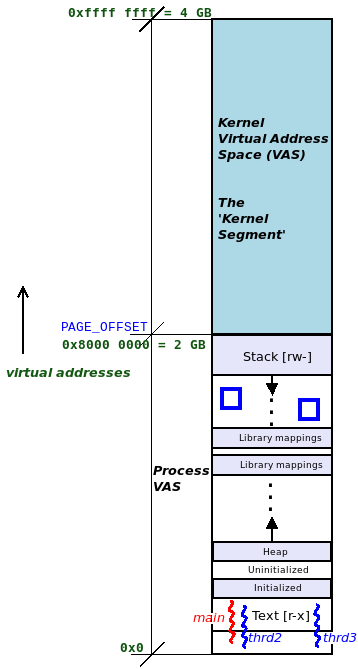

<center>[图 7.1]</center>

因此，现在内核 VAS 位于同一地址空间内。**当用户模式的进程或线程发出系统调用时，会发生上下文切换，将执行切换到进程的 2 GB 内核 VAS 中（同时更新各种 CPU 寄存器，包括栈指针）。发出系统调用的线程在进程上下文中以特权的内核模式运行内核代码，并处理内核空间的数据。当系统调用完成后，执行再次进行上下文切换，返回到非特权的用户模式，并在前 2 GB 的用户 VAS 内运行用户模式代码。**

内核 VAS（也称为内核段）开始的确切虚拟地址通常通过内核中的 `PAGE_OFFSET` 宏表示。

这个关于 VM 划分的位置和大小的决策是在何处做出的呢？在 32 位 Linux 上，这是一种内核构建时的可配置选项。它是在内核构建过程中作为 `make [ARCH=xxx] menuconfig` 过程的一部分来完成的。

IA-32 处理器（Intel x86-32）的默认 VM 划分是 3:1（GB）。有趣的是，运行在 IA-32 上的（古老的）Windows 3.x 操作系统也采用了相同的 VM 划分，这表明这些概念基本上是操作系统无关的。

### 64 位 Linux 系统上的虚拟内存划分

首先需要注意的是，在 64 位系统上，并非所有 64 位都用于寻址。在 x86_64 处理器上的标准或典型的 Linux 操作系统配置中（通常是 4 KB 页大小），**实际使用 48 位（最低有效位，LSB）进行寻址**。为什么不使用完整的 64 位？因为那实在太多了，目前没有任何计算机接近拥有 2⁶⁴ = 18,446,744,073,709,551,616 字节，即 16 EB（相当于 16,384 PB）的内存。

#### 虚拟地址与地址转换

在深入探讨这些细节之前，理解一些关键点非常重要。

考虑一个 C 程序中的典型代码片段：

```c
int i = 5;
printf("address of i is 0x%x\n", &i);
```

`printf()` 输出的地址是一个虚拟地址，而不是物理地址。我们区分两种虚拟地址：

- 如果在用户空间进程中运行此代码，那么变量 `i` 的地址是一个用户虚拟地址（UVA）。
- 如果在内核或内核模块中运行此代码（当然，此时应使用 `printk()` API），那么变量 `i` 的地址是一个内核虚拟地址（KVA）。

虚拟地址并不是绝对值（从 0 开始的偏移量），它实际上是一个位掩码：

- **在 32 位 Linux 操作系统上，32 个可用位被划分为所谓的页全局目录（PGD）值、页表（PT）值和偏移量**。
- 这些值成为内存管理单元（MMU，现代微处理器中的硬件单元）用于地址转换的索引。MMU 通过访问当前进程上下文的内核页表来执行地址转换。

如果 48 位寻址是 x86_64 处理器的典型情况，那么 64 位虚拟地址中的位是如何分布的？未使用的 16 位高位（MSB）会发生什么？下图回答了这个问题：它展示了 x86_64 Linux 系统上虚拟地址的分解：

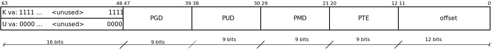

<center>[图 7.2]</center>

- 本质上，**使用 48 位寻址时，我们使用第 0 到 47 位（最低 48 位），并忽略最高的 16 位，将其视为符号扩展。**
- **内核 VAS：最高的 16 位始终设置为 1。**
- **用户 VAS：最高的 16 位始终设置为 0。**

了解这一点后，仅通过查看一个（完整的 64 位）虚拟地址，我们就可以判断它是 KVA 还是 UVA：

- 在 64 位 Linux 系统上，KVA 的格式总是 0xffff ....。
- UVA 的格式总是 0x0000 ....。

虚拟地址实际上是位掩码，而不是绝对地址。内存管理是一个复杂的领域，工作由多个部分共享：操作系统负责创建和操作每个进程的分页表，工具链（编译器）生成虚拟地址，而处理器的 MMU 实际执行运行时地址转换，将给定的（用户或内核）虚拟地址转换为物理（RAM）地址。

回到64 位处理器上的 VAS，64 位系统上的可用 VAS 达到了惊人的 2⁶⁴ = 16 EB（16 x 10¹⁸ 字节）。据说，当 AMD 工程师最初将 Linux 内核移植到 x86_64（或 AMD64）64 位处理器时，他们必须决定如何在这个巨大的 VAS 中布置进程和内核段。这个决策大致保持不变，即使在今天的 x86_64 Linux 操作系统上也是如此。以下是 64 位 VAS 的划分（假设使用 48 位寻址和 4 KB 页大小）：

- 典型的下半部分，使用 128 TB：用户 VAS，虚拟地址范围从 `0x0000 0000 0000 0000` 到 `0x0000 7fff ffff ffff`。
- 典型的上半部分，使用 128 TB：内核 VAS，虚拟地址范围从 `0xffff 8000 0000 0000` 到 `0xffff ffff ffff ffff`。

<a id="figure7-3"></a>

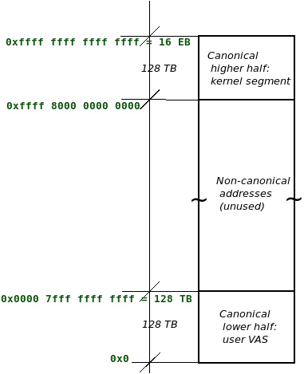

<center>[图 7.3]</center>

在上图中，介于中间的未使用区域（空洞或稀疏区域）也被称为非规范地址区域。有趣的是，在 48 位寻址方案下，VAS 的大部分未被使用，这就是为什么我们称 VAS 为稀疏的。

下图显示了几种不同 CPU 架构的常见用户：内核 VM 划分比率（假设 MMU 页大小为 4 KB）：

<a id="figure7-4"></a>

| **架构 (Arch)**                           | **N 级 (N-Level)**                   | **地址位数 (Addr Bits)**              | **虚拟内存分割 (VM "Split")**                      | **用户空间起始地址 (Start vaddr)**     | **用户空间结束地址 (End vaddr)**                         | **内核空间起始地址 (Start vaddr)**                       | **内核空间结束地址 (End vaddr)**                         |
| ----------------------------------------- | ------------------------------------ | ------------------------------------- | -------------------------------------------------- | -------------------------------------- | -------------------------------------------------------- | -------------------------------------------------------- | -------------------------------------------------------- |
| IA-32                                     | 2                                    | 32                                    | 3 GB : 1 GB                                        | 0x0                                    | 0xbfff ffff                                              | 0xc000 0000                                              | 0xffff ffff                                              |
| ARM                                       | 2                                    | 32                                    | 2 GB : 2 GB                                        | 0x0                                    | 0x7fff ffff                                              | 0x8000 0000                                              | 0xffff ffff                                              |
| <span style="color:red">**x86_64**</span> | <span style="color:red">**4**</span> | <span style="color:red">**48**</span> | <span style="color:red">**128 TB : 128 TB**</span> | <span style="color:red">**0x0**</span> | <span style="color:red">**0x0000 7fff ffff ffff**</span> | <span style="color:red">**0xffff 8000 0000 0000**</span> | <span style="color:red">**0xffff ffff ffff ffff**</span> |
| x86_64                                    | 5                                    | 57                                    | 64 PB : 64 PB                                      | 0x0                                    | 0x000f ffff ffff ffff                                    | 0xfff0 0000 0000 0000                                    | 0xffff ffff ffff ffff                                    |
| Aarch64                                   | 3                                    | 40                                    | 512 GB : 512 GB                                    | 0x0                                    | 0x0000 007f ffff ffff                                    | 0xffff ffff 8000 0000                                    | 0xffff ffff ffff ffff                                    |
| Aarch64                                   | 4                                    | 49                                    | 256 TB : 256 TB                                    | 0x0                                    | 0x0000 ffff ffff ffff                                    | 0xffff 0000 0000 0000                                    | 0xffff ffff ffff ffff                                    |

<center>[图 7.4]</center>

*注：对于x86_64架构，5级页面（N-Level）从Linux 4.14版开始支持。标准页大小为 4 KB。（原图有误，这是勘误后重新绘制的表格）

- 对于运行在 x86_64（或 AMD64）架构上的 Linux，常见的 VM 划分是用户：内核 = 128 TB：128 TB。
- 注意表中的数值，尤其是第六和第八列中的终止虚拟地址（End vaddr）是每个 64 位单一数量而非两个数值。
- 对于 x86_64 行，列6（End vaddr） 的值是单个数值 `0x0000 7fff ffff ffff`，而不是两个数值。

在 x86_64 下，有两种显示的 VM 划分：

1. **128 TB：128 TB（4 级分页）**，是当今 Linux x86_64 系统上典型的 VM 划分（嵌入式笔记本、PC、工作站和服务器）。它将物理地址空间限制为 64 TB（RAM）。
2. 64 PB：64 PB，目前仍然是纯理论上的；它从 Linux 4.14 开始支持所谓的 5 级分页，分配的 VAS 达到 56 位寻址，总计 128 PB 的 VAS 和 4 PB 的物理地址空间。

内核虚拟地址空间（VAS），也称为内核段，究竟包含了什么？所有的内核代码、数据结构（包括任务结构、列表、内核模式栈、分页表等）、设备驱动、内核模块等等都在其中。

### 进程虚拟地址空间 (VAS)——完整视图

再次参考[图 7.1](#figure7-1)，它展示了一个 32 位进程的实际虚拟地址空间 (VAS) 布局。当然，关键是，**系统中所有正在运行的进程都有自己独特的用户模式 VAS，但共享相同的内核段**。与 [图 7.1](#figure7-1) 所展示的 2:2 (GB) 虚拟内存 (VM) 划分相比，以下图显示了典型的 IA-32 系统的实际情况，其采用 3:1 (GB) 的 VM 划分：

<a id="figure7-5"></a>

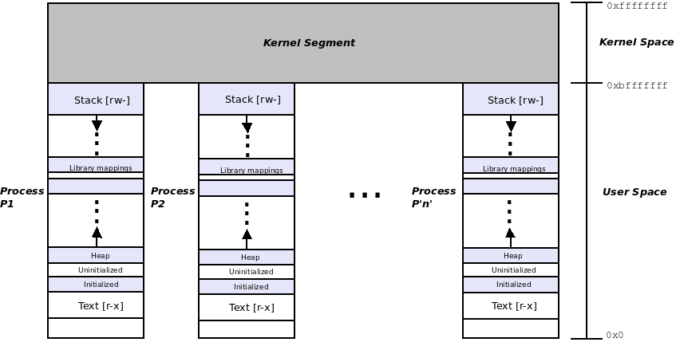

<center>[图 7.5]</center>

在上述图中可以看到，地址空间反映了 3:1 (GB) 的 VM 划分。用户地址空间从 `0x0000 0000` 扩展到 `0xbfff ffff`（`0xc000 0000` 是 3 GB 的标志；这是 `PAGE_OFFSET` 宏的设置值），而内核 VAS 则从 `0xc000 0000`（3 GB）扩展到 `0xffff ffff`（4 GB）。

需要注意几点：

- 对于上图中显示的示例，`PAGE_OFFSET` 的值为 `0xc000 0000`。
- 我们在此展示的图和数字并非适用于所有架构的绝对标准；它们往往非常依赖于具体的架构，许多高度定制的 Linux 系统可能会对其进行更改。
- 上图详细描述了 32 位 Linux 操作系统上的虚拟内存布局。在 64 位 Linux 上，概念保持不变，只是数字发生了显著变化。如前几节所述，x86_64 (使用 48 位寻址) 的 Linux 系统上，虚拟内存划分为 `用户 : 内核 = 128 TB : 128 TB`。

## 检查进程的虚拟地址空间 (VAS)

我们已经介绍了每个进程虚拟地址空间 (VAS) 的布局，即由哪些段或映射组成。我们了解到，进程的 VAS 包含多个映射或段，其中包括代码段 (text)、数据段、库映射 (library mappings)，以及至少一个栈 (stack)。

能够深入内核并查看各种运行时的值，是开发者、用户、质量保证人员 (QA)、系统管理员 (sysadmin)、DevOps 等非常重要的技能。Linux 内核为我们提供了一个惊人的接口来实现这一点，那就是 `/proc` 文件系统 (procfs)。

该文件系统在 Linux 上始终存在（至少应该如此），并挂载在 `/proc` 目录下。procfs 系统有两个主要的职责：

1. 提供一组统一的（伪或虚拟）文件和目录，让我们能够深入查看内核和硬件的内部细节。
2. 提供一组统一的仅可由 root 用户写入的文件，允许系统管理员修改关键的内核参数。这些文件位于 `/proc/sys/` 目录下，被称为 `sysctl`，它们是 Linux 内核的调优旋钮。

熟悉 `/proc` 文件系统确实是非常必要的。例如，简单地执行 `cat /proc/PID/status`（其中 PID 是某个进程或线程的唯一标识符）可以获取到该进程或线程的任务结构中大量有用的细节信息。

### 详细检查用户虚拟地址空间 (VAS)

我们从检查任意进程的用户 VAS 开始，通过 procfs 文件系统，尤其是 `/proc/PID/maps` 伪文件，可以查看到用户 VAS 的详细映射。接下来，我们学习如何使用这个接口来查看进程的用户空间内存映射。我们将介绍两种方法：

1. 直接通过 procfs 接口的 `/proc/PID/maps` 伪文件查看
2. 使用一些有用的前端工具（使输出更易于理解）

#### 直接使用 procfs 查看进程内存映射

查看任意进程的内部详细信息通常需要 root 权限，而查看我们自己拥有的进程（包括调用进程本身）的详细信息则不需要权限。因此，作为一个简单的例子，我们可以通过在 PID 位置使用 `self` 关键字来查看调用进程的 VAS。以下截图展示了这一点（在 x86_64 Ubuntu 18.04 LTS 系统上）：

<a id="figure7-6"></a>

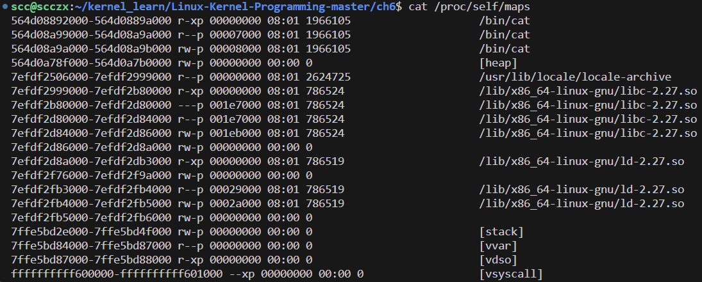

<center>[图 7.6]</center>

在上述截图中，我们可以看到 `cat` 进程的用户 VAS，这是该进程的用户 VAS 的完整内存映射。同时，请注意上述 procfs 输出是按照（用户）虚拟地址 (UVA) 递增排序的。

##### 解释 `/proc/PID/maps` 输出

为了理解上图的输出，我们需要逐行阅读。每一行代表一个段或映射，这些段或映射组成了所讨论进程的用户模式 VAS（在上面的示例中是 `cat` 进程）。每一行包含以下字段。为了便于理解，我们将展示输出中的单行内容，并标注字段，接下来在说明中进行引用：

```plaintext
  start_uva - end_uva   	mode，mapping	start-off   	mj:mn   inode#    image-name
564d08892000-564d0889a000 		r-xp 		 00000000 		 08:01 	1966105     /bin/cat
```

这里，整行表示一个段，更准确地说，是进程（用户）VAS 内的一个映射。`uva` 是用户虚拟地址 (User Virtual Address)。每个段的 `start_uva` 和 `end_uva` 显示在前两个字段（或列）中。因此，可以很容易地计算出映射（段）的长度（`end_uva - start_uva` 字节）。在上述行中，`start_uva` 是 `0x564d08892000`，`end_uva` 是 `0x564d0889a000`（映射的长度为 32 KB）；但这个段是什么呢？

第三个字段 `r-xp` 实际上包含了两部分信息：

- 前三个字母表示段的模式（权限），使用通常的 `rwx` 表示法。
- 下一个字母表示映射是私有 (`p`) 还是共享 (`s`) 的。内部设置是通过 `mmap()` 系统调用的第四个参数 `flags` 设置的；实际上，是 **`mmap()` 系统调用在内部负责创建每个段或映射**。

所以，对于上述示例段，第三个字段的值是 `r-xp`，这表明它是一个代码段（text segment），并且是一个私有映射。

第四个字段 `start-off`（在此为 `0`）是从文件开头到映射到进程 VAS 的内容的起始偏移量。显然，这个值只对文件映射有效。我们可以通过查看倒数第二个（第六个）字段，判断当前段是否是文件映射。对于非文件映射的情况（称为匿名映射），这个字段始终是 `0`（例如表示堆或栈的映射）。在上述示例行中，这是一个文件映射（对应 `/bin/cat`），偏移量为 0 字节（映射的长度为 32 KB）。

第五个字段（`08:01`）的形式为 `mj:mn`，其中 `mj` 是设备文件的主设备号，`mn` 是次设备号。和第四个字段一样，它仅对文件映射有效，否则显示为 `00:00`；在我们的示例行中，这是一个文件映射（对应 `/bin/cat`），其主设备号为 `8`，次设备号为 `1`。

第六个字段（`1966105`）表示被映射到进程 VAS 的图像文件的 inode 号。inode 是虚拟文件系统 (VFS) 的关键数据结构，保存了文件对象的所有元数据，除了文件名（文件名在目录文件中）。同样，这个值仅对文件映射有效，其他情况则显示为 `0`。这是快速判断映射是文件映射还是匿名映射的方法。在我们的示例映射中，显然这是一个文件映射（对应 `/bin/cat`），inode 号为 `1966105`。我们可以通过以下命令确认：

```bash
ls -i /bin/cat
```

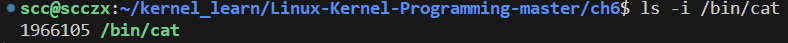

<center>[图 7.7]</center>

第七个也是最后一个字段表示被映射到用户 VAS 的文件路径名。在这里，因为我们查看的是 `cat` 进程的内存映射，所以路径名（对于文件映射的段）当然是 `/bin/cat`。如果映射表示一个文件，文件的 inode 号（第六个字段）为正；否则，如果是纯内存或没有后备存储的匿名映射，inode 号显示为 `0`，此字段为空。

显然，上述所有地址都是虚拟地址，而不是物理地址。此外，这些地址仅属于用户空间，因此它们被称为 UVA（用户虚拟地址），并且总是通过该进程的唯一分页表访问和转换。此外，上述截图是在 64 位 (x86_64) Linux 客户端上截取的，因此我们看到的是 64 位虚拟地址。

我们已经解释了如何解读特定的段或映射，但似乎还有一些奇怪的映射，如 `vvar`、`vdso` 和 `vsyscall` 映射。让我们看看它们的含义。

##### vsyscall 页

在 [图 7.6](#figure7-6) 的输出中，我们注意到了一些不寻常的内容：最后一行显示了一个名为 `vsyscall` 的映射项，它映射了一个内核页（我们可以通过观察其起始和结束虚拟地址的最高 16 位被设置来判断）。这个 vsyscall 页是一个用于优化系统调用的旧机制，目的是减少切换到内核模式的次数，从而提高性能。

具体来说，vsyscall 页通过避免进入内核模式来加速一部分不需要完全进入内核执行的系统调用。目前在 x86 架构上，这种优化适用于 `gettimeofday()`、`time()` 和 `getcpu()` 等系统调用。类似的优化还有 `vvar` 和 `vdso`（也称为 vDSO）映射，它们是这一机制的稍微现代化的变体。

#### 查看进程内存映射的前端工具

除了通过 `/proc/PID/maps` 的直接方式（上一节我们已经学会如何解释），还有一些包装工具可以帮助我们更轻松地解释用户模式的 VAS（虚拟地址空间）。这些工具包括额外的 `/proc/PID/smaps` 伪文件、`pmap()` 和 `smem()` 工具，以及 `procmap`。

内核通过 `/proc/PID/smaps` 伪文件为每个段或映射提供详细信息。我们运行 `cat /proc/self/smaps` 来查看，可以看到对于每个段（映射）系统提供了大量的详细信息，`proc()` 手册页对这些字段提供了解释。

对于 `pmap()` 和 `smem()` 工具的使用细节，我们需要参考它们的手册页。例如，`pmap()` 的手册页介绍了更详细的 `-X` 和 `-XX` 选项：

- `-X`：显示比 `-x` 选项更多的详细信息。警告：输出格式会根据 `/proc/PID/smaps` 的内容发生变化。
- `-XX`：显示内核提供的所有信息。

至于 `smem()` 工具，它实际上并不显示进程的 VAS；它更关注的是解答一个常见问题：哪个进程占用了最多的物理内存。它使用驻留集大小 (RSS)、比例集大小 (PSS) 和唯一集大小 (USS) 等指标来提供更清晰的内存占用情况。

##### procmap 进程 VAS 可视化工具

作者编写的 `procmap` 工具其托管在 GitHub 上，我们可以通过以下链接获取：https://github.com/kaiwan/procmap （可以通过 `git clone` 获取）。下面是其 `README.md` 文件中的一段说明，帮助解释它的用途：

>  `procmap` 是一个用于可视化 Linux 进程完整内存映射的控制台/命令行工具，实际上，它可以可视化内核和用户模式虚拟地址空间 (VAS) 的内存映射。

> 它以垂直排列的格式输出一个简单的可视化，将给定进程的完整内存映射按虚拟地址降序排列显示（见下方截图）。脚本能够自动识别并显示内核和用户空间映射，并计算并显示可能存在的稀疏内存区域。每个段或映射的大小根据相对比例进行缩放，并使用颜色编码以增强可读性。

> 在 64 位系统上，它还会显示所谓的非规范稀疏区域或“洞”（通常在 x86_64 上接近 16,384 PB）。

现在让我们使用 `procmap` 工具查看该进程的 VAS。如何调用它？非常简单，请看下面（由于空间有限，没有展示所有信息、注意事项等；请自己尝试）：

```bash
git clone https://github.com/kaiwan/procmap

cd procmap
./procmap
# Options:
#  --only-user : show ONLY the user mode mappings or segments
#  --only-kernel : show ONLY the kernel-space mappings or segments
#  [default is to show BOTH]
#  --export-maps=filename
#  write all map information gleaned to the file you specify in CSV
#  --export-kernel=filename
#  write kernel information gleaned to the file you specify in CSV
#  --verbose : verbose mode (try it! see below for details)
#  --debug : run in debug mode
#  --version|--ver : display version info.
# See the config file as well.
```

请注意，这个 `procmap` 工具与 BSD Unix 提供的同名工具不同。此外，它依赖于 `bc()` 和 `smem()` 工具；请确保它们已安装（在我自己的使用过程中出现了 smem 使用的是 python2 语法，但是我的默认 python 是 python3，为了保证程序可正常执行，我的做法是将 smem 的语法从 py2 改成了 py3）。

当我们运行 `procmap` 工具并指定 `--pid=<PID>` 时，它会显示给定进程的内核和用户空间 VAS。在接下来的内容中，我们会看到 `procmap` 工具输出的部分用户 VAS 截图。完整输出可能非常长，具体取决于进程的情况。

我们会发现，它尝试提供一个基本的进程内存映射可视化：内核和用户空间 VAS 都以垂直排列的格式呈现（这里仅展示部分截图）：

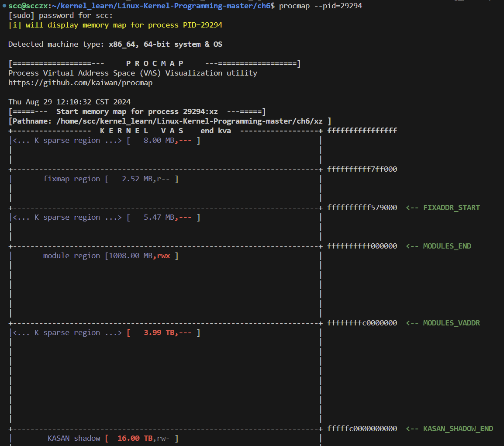

<center>[图 7.8]</center>

从上面的截图中，我们需要注意到一些要点：

- `procmap`（Bash 脚本）自动检测我们运行在 x86_64 64 位系统上。
- 内核 VAS 的输出会首先显示，这是因为我们按虚拟地址降序排列输出。
- VAS 的最顶部（在 KERNEL VAS 标题之后）对应的是一个内核虚拟地址 (KVA)，其值为 `0xffff ffff ffff ffff`（因为我们在 64 位系统上）。

接着看 `procmap` 输出的下一部分，我们来看进程的用户 VAS 上端的截断视图：

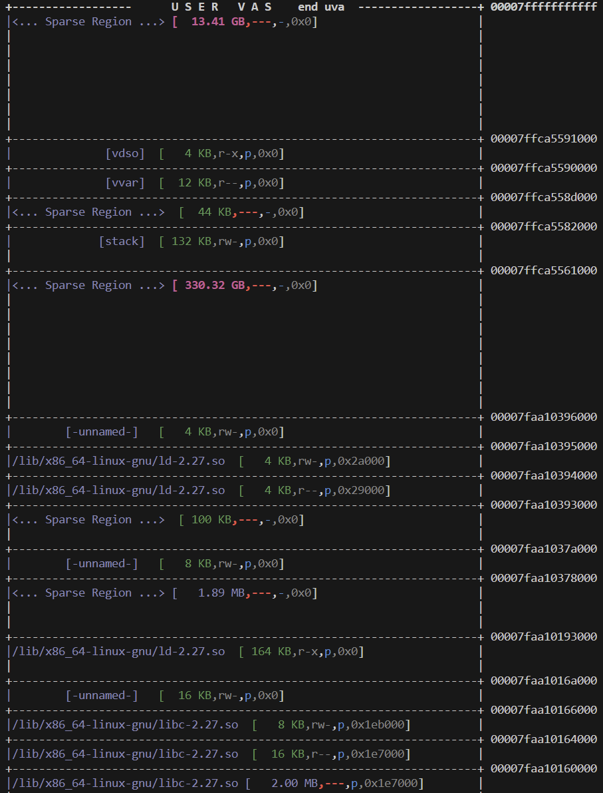

<center>[图 7.9]</center>

上图显示了 `procmap` 工具输出的部分截图，展示了用户空间的虚拟地址空间 (VAS)。在图中最顶端，我们可以看到用户虚拟地址 (UVA) 的高端位置。

在我们的 x86_64 系统上（这是与系统架构相关的），UVA 的最高端地址是 `0x0000 7fff ffff ffff`，而起始地址自然是 `0x0000 0000 0000 0000`。`procmap` 是如何确定这些精确的地址值的呢？过程相当复杂：对于内核空间的内存信息，它使用一个加载的内核模块 (LKM) 来查询内核，并根据系统架构生成配置文件；而用户空间的详细信息直接来自于 `/proc/PID/maps` 的 procfs 伪文件。

以下截图展示了用户模式 VAS 的低端部分，一直到最低的 UVA，即 `0x0000 0000 0000 0000`：

<a id="figure7-10"></a>

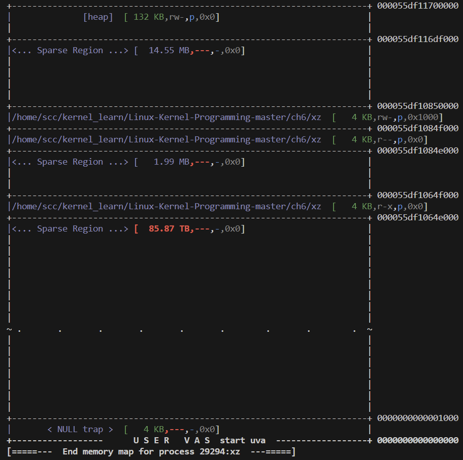

<center>[图 7.10]</center>

最底部的映射是一页大小，正如预期，这是空陷阱页（其范围从 `UVA 0x0000 0000 0000 1000` 到 `0x0000 0000 0000 0000`；我们将在后面的“空陷阱页”部分详细解释其用途）。

`procmap` 工具在启用其配置文件中的某些选项后，会计算并显示一些统计数据，包括内核和用户模式 VAS 的大小、被稀疏区域（即未使用的空间）占用的用户空间内存量（在 64 位系统上，这通常是大部分空间，如前例所示），并以绝对数值和百分比形式呈现。此外，`procmap` 还报告了系统的物理 RAM 总量，并结合 `ps()` 和 `smem()` 工具提供的特定进程的内存使用情况。

在 64 位系统上（参见 [图 7.3](#figure7-3)），我们会发现进程 VAS 中的稀疏内存区域几乎占据了整个可用地址空间（接近 100%）。例如，128 TB 可用地址空间中，通常有 127.99[...] TB 是稀疏的。这意味着 99.99[...]% 的内存空间实际上是空的。这就是 64 位系统上巨大 VAS 的现实：只有极少部分被实际使用。在 x86_64 架构上，这 128 TB 的 VAS 中，仅有一小部分被应用进程实际占用。具体的稀疏和使用比例会根据应用进程的大小而有所不同。

能够直观地看到进程的 VAS 对于深层次的调试和问题分析非常有帮助。

此外，如果启用了相关选项，输出的最后部分还会显示目标进程的虚拟内存区域 (VMA) 数量。

### 理解 VMA 的基础知识

在 `/proc/PID/maps` 的输出中，每一行实际上是从内核的元数据结构 VMA（虚拟内存区域）中得出的。这个过程相当简单：**内核使用 VMA 数据结构来抽象我们所说的段或映射。因此，对于用户 VAS 中的每个段，操作系统都会维护一个 VMA 对象。**请注意，**只有用户空间的段或映射是由 VMA 元数据结构管理的，内核自身的段没有 VMA。**

那么，一个进程会有多少个 VMA？这与其用户 VAS 中的映射（段）的数量相等。在我们的进程示例中，它有 19 个段或映射，这意味着内核内存中为这个进程维护了 19 个 VMA 元数据对象，代表了 19 个用户空间的段或映射。

从编程的角度来看，内核通过 VMA 链来维护这些 VMA。这条链以 `current->mm->mmap` 为根节点，为了提高效率，实际实现时使用了红黑树数据结构。之所以将这个指针命名为 `mmap`，是因为**每次执行 `mmap()` 系统调用（即进行内存映射操作）时，内核都会在 调用进程（发起 `mmap()` 系统调用的进程）的虚拟地址空间 (VAS) 中创建一个新的映射（或“段”），并为其生成一个相应的 VMA 对象来代表该映射。**

VMA 元数据结构就像一把伞，覆盖了映射，并包含了内核执行各种内存管理所需的信息，如处理页面错误（非常常见）、在 I/O 期间将文件内容缓存到内核页面缓存中等。

以下是内核 VMA 数据结构的部分成员：

```c
// include/linux/mm_types.h
struct vm_area_struct {
 /* The first cache line has the info for VMA tree walking. */
 unsigned long vm_start; /* 我们在 vm_mm 中的起始地址。*/
 unsigned long vm_end; /* 我们的结束地址后的第一个字节 */
 /* 每个任务的 VMA 链表，按地址排序 */
 struct vm_area_struct *vm_next, *vm_prev;
 struct rb_node vm_rb;
 [...]
 struct mm_struct *vm_mm; /* 所属的地址空间。 */
 pgprot_t vm_page_prot; /* 该 VMA 的访问权限。 */
 unsigned long vm_flags; /* 标志位，见 mm.h。 */
 [...]
 /* 函数指针用于处理该结构体。 */
 const struct vm_operations_struct *vm_ops;
 /* 关于我们的后备存储的信息：*/
 unsigned long vm_pgoff; /* 在 vm_file 中的偏移量，以 PAGE_SIZE 为单位 */
 struct file * vm_file; /* 我们映射的文件（可能为 NULL）。 */
 [...]
} __randomize_layout
```

现在应该更清楚地理解，当执行 `cat /proc/PID/maps` 时，背后到底发生了什么。**当用户在用户空间中运行 `cat /proc/self/maps` 时，`cat` 进程会发起一个 `read()` 系统调用，这会使 `cat` 进程切换到内核模式，并在内核权限下执行 `read()` 系统调用的代码。内核的虚拟文件系统 (VFS) 会将控制权转交给与 procfs 对应的回调处理函数。这个回调函数会遍历当前进程（在这里是 `cat` 进程）的每一个 VMA 元数据结构，将相关的映射信息传递回用户空间。`cat` 进程接收到这些数据后，通过标准输出显示出来，从而让我们看到了进程的所有段或映射，也就是进程的用户模式虚拟地址空间 (VAS) 的内存映射。**

## 检查内核段

如 [图 7.5](#figure7-5) 所示，理解**所有进程都有各自唯一的用户虚拟地址空间 (VAS)，但共享内核空间**（即我们称为内核段或内核 VAS 的区域）是非常重要的。让我们从检查内核段的一些常见（与架构无关）的区域开始。

内核段的内存布局非常依赖于架构 (CPU) 的类型。然而，所有架构之间也存在一些共性。下面的基本图示代表了用户 VAS 和内核段（以水平排列的格式），如在一个具有 3:1 VM 分割的 x86_32 系统上所示：

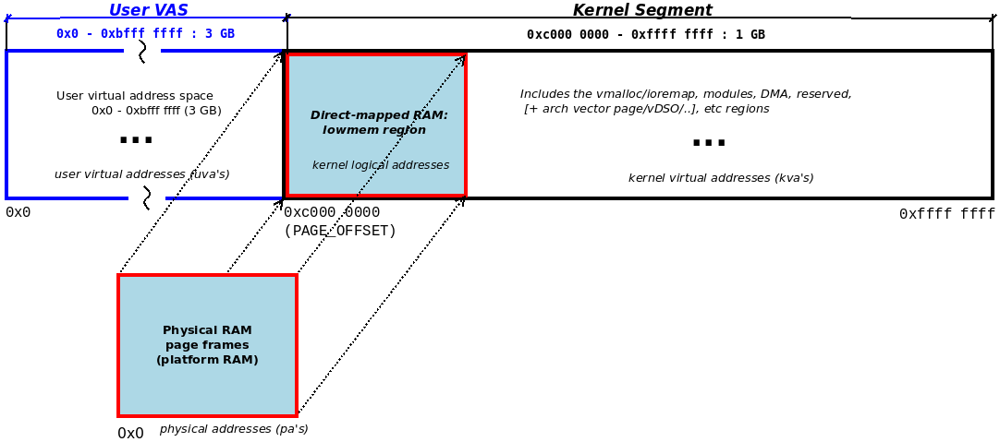

<center>[图 7.11]</center>

让我们逐一分析每个区域：

- **用户模式 VAS**：这是用户 VAS，我们在前一章以及本章的早些部分已经详细介绍过。在这个例子中，它占据了 3 GB 的 VAS（UVA 范围从 0x0 到 0xbfff ffff）。

- **右边的部分都属于内核 VAS，即内核段**：在这个例子中，它占据了 1 GB 的 VAS（KVA 范围从 0xc000 0000 到 0xffff ffff）。现在让我们来检查它的各个部分。

- **低内存区域 (lowmem region)**：这是**平台 (系统) RAM 直接映射到内核的区域**。（我们将在 “直接映射的 RAM 和地址转换” 部分更详细地介绍这个关键主题）稍微提前一点，现在先理解，在内核段中映射平台 RAM 的基础位置由内核宏 `PAGE_OFFSET` 指定。该宏的精确值非常依赖于架构；我们将把这个讨论留到后面。暂时请相信，在 IA-32 系统中，采用 3:1 (GB) VM 分割时，`PAGE_OFFSET` 的值为 `0xc000 0000`。

- **低内存区域的长度或大小等于系统中 RAM 的总量**（至少是内核可见的 RAM 数量；例如，启用 kdump 功能时，操作系统会在启动时预留一部分 RAM）。该区域的虚拟地址被称为内核逻辑地址，因为它们与相应的物理地址存在固定的偏移关系。核心内核和设备驱动程序可以通过各种 API 从该区域分配物理连续的内存（这些 API 我们将在接下来的两章中详细介绍）。内核的静态文本（代码）、数据和 BSS（未初始化数据）内存也都位于这个低内存区域中。

- **内核 vmalloc 区域**：这是完全虚拟的内核 VAS 区域。核心内核和/或设备驱动程序代码可以使用 `vmalloc()`（及其相关函数）API 从该区域分配虚拟连续内存。同样，我们将在 Chapter 8 和 Chapter 9 中详细介绍。这也是所谓的 `ioremap` 空间。

- **内核模块空间**：这是为加载的内核模块（LKMs）的静态文本和数据预留的内核 VAS 区域。当我们执行 `insmod()` 时，底层的内核代码会通过 `[f]init_module()` 系统调用从该区域（通常通过 `vmalloc()` API）分配内存，并将内核模块的（静态）代码和数据加载到这里。

上述图示有意保持简化和略显模糊，因为精确的内核虚拟内存布局非常依赖于架构。我们将暂时避免绘制更详细的图示。为了使讨论更加实用而不只是理论化，我们将在即将到来的部分展示一个内核模块，该模块可以查询并打印内核段布局的相关信息。之后，我们会根据实际架构的内核段各区域的实际值，再展示一个详细的内核段图示。

### 32 位系统上的高内存

关于前面简要讨论的内核低内存区域，有一个有趣的现象。在一个 32 位系统中，假设采用 3:1 (GB) 的 VM 分割（正如上图所示），如果系统拥有 512 MB 的 RAM，那么这 512 MB 的 RAM 将从 `PAGE_OFFSET`（3 GB 或 KVA 0xc000 0000）开始直接映射到内核。这一点非常清楚。

但是请思考一下：如果系统有更多的 RAM，比如 2 GB，会发生什么呢？显然，我们无法将整个 RAM 都直接映射到低内存区域，因为在这个例子中，整个可用的内核 VAS 只有 1 GB，而 RAM 却有 2 GB！因此，在 32 位的 Linux 操作系统中，允许一定数量的内存（在 IA-32 上通常为 768 MB）被直接映射到低内存区域，剩余的 RAM 则被间接映射到另一个称为 `ZONE_HIGHMEM` 的内存区域（我们将其视为相对于低内存区域的高内存区域或区，关于内存区域的更多内容将在后续的“区域”部分讨论）。

更准确地说，由于内核无法一次性直接映射所有物理内存，它会设置一个（虚拟）区域，在这个区域内可以对 RAM 设置和使用临时虚拟映射，这就是所谓的高内存区域。

不过，现在这些问题在 64 位的 Linux 系统上（尤其是随着 32 位系统的使用越来越少）已经完全消失了。想想看：在 64 位的 Linux 系统上，内核段的大小在 x86_64 上高达 128 TB，目前没有任何系统拥有接近这么多的 RAM。因此，所有平台的 RAM 确实可以很容易地直接映射到内核段中，也就不再需要 `ZONE_HIGHMEM`（或等效区域）了。

需要明确说明的是，**RAM映射到低内存区域的数据应该是以下的这些，即使内核段的空间很大，也不应该把用户程序的数据直接映射到内核的低地址区域**：

- **内核代码和数据**：包含内核的静态代码段、数据段和 BSS 段，这些是内核核心功能的基础，占用低内存区域的一部分。
- **内核栈**：每个内核线程或进程的内核栈都位于低内存区域中，用于在内核模式下运行时存储函数调用和局部变量。
- **内核数据结构**：如进程控制块（PCB）、页表、文件描述符表、调度队列等，这些数据结构是内核管理系统资源所需的核心元素。
- **页缓存和缓冲区缓存**：用于提高文件系统和 I/O 操作效率的缓存数据结构，这些缓存也驻留在低内存区域中。
- **设备驱动程序的内存**：直接与硬件交互的设备驱动程序代码和数据会占用低内存区域，便于高效访问。
- **物理内存的直接映射部分**：内核可以直接访问的物理 RAM 部分，这些内存区域通常用于需要物理连续内存的场景，如 DMA 操作。

### 编写一个内核模块来显示内核段的信息

内核段由多个区域组成，一些区域是所有架构（与架构无关）共有的，包括低内存区域（其中包含未压缩的内核镜像：代码、数据、BSS 等）、内核模块区域、vmalloc/ioremap 区域等。

这些区域在内核段中的具体位置，以及哪些区域可能存在，都是非常依赖于具体的架构（CPU）的。为了帮助理解和确定任何给定系统中这些区域的具体位置，我们可以开发一个内核模块，查询并打印有关内核段的各种详细信息。

#### 描述内核段布局的宏和变量

为了编写一个显示相关内核段信息的内核模块，我们需要了解如何查询内核的这些细节。在本节中，我们将简要描述一些关键的宏和变量，它们表示 x86 架构内核段的内存布局（按 KVA 递减顺序排列）：

- **固定映射区域 (Fix Map Region)**：这是一些编译时的特殊或保留的虚拟地址范围；它们用于启动时将需要的内核元素固定映射到内核段中，例如初始内核页表的设置、早期的 `ioremap` 和 `vmalloc` 区域等。

  | 宏或变量        | 解释                                                   |
  | --------------- | ------------------------------------------------------ |
  | `FIXADDR_START` | 内核固定映射区域的起始 KVA，跨度为 `FIXADDR_SIZE` 字节 |

- **内核模块区域 (Kernel Modules Region)**：内核模块的静态代码和数据会分配到内核段的一个特定区域中。这个区域的位置在 x86 架构上通常位于内核段的较高位置。

  | 宏或变量        | 解释                                                         |
  | --------------- | ------------------------------------------------------------ |
  | `MODULES_VADDR` | 内核模块区域的起始 KVA                                       |
  | `MODULES_END`   | 内核模块区域的结束 KVA；大小为 `MODULES_END - MODULES_VADDR` |

- **KASAN（Kernel Address SANitizer）**：现代内核（x86_64 从 4.0 开始）引入了 KASAN 机制，用于检测和报告内存问题。它基于用户空间的 ASAN（Address SANitizer）代码库，通过编译时的插装检测内存问题，如释放后使用 (UAF) 和越界访问 (OOB)。它仅在 64 位 Linux 上有效，并需要一个非常大的阴影内存区域（大小约为内核 VAS 的八分之一）。

  | 宏或变量             | 解释                                                         |
  | -------------------- | ------------------------------------------------------------ |
  | `KASAN_SHADOW_START` | KASAN 区域的起始 KVA                                         |
  | `KASAN_SHADOW_END`   | KASAN 区域的结束 KVA；大小为 `KASAN_SHADOW_END - KASAN_SHADOW_START` |

- **vmalloc 区域**：该区域用于 `vmalloc()` 及相关 API 的内存分配；我们将在接下来的两章详细讨论各种内存分配 API。

  | 宏或变量        | 解释                                                         |
  | --------------- | ------------------------------------------------------------ |
  | `VMALLOC_START` | vmalloc 区域的起始 KVA                                       |
  | `VMALLOC_END`   | vmalloc 区域的结束 KVA；大小为 `VMALLOC_END - VMALLOC_START` |

- **低内存区域 (Lowmem Region)**：这是内核段中直接映射 RAM 的区域，采用 1:1 的物理页面帧对内核页面的映射。这里是 Linux 内核通常映射和管理所有 RAM 的地方，并且常被设置为 `ZONE_NORMAL`。

  | 宏或变量      | 解释                                           |
  | ------------- | ---------------------------------------------- |
  | `PAGE_OFFSET` | 低内存区域的起始 KVA；也常表示内核段的起始地址 |
  | `high_memory` | 低内存区域的结束 KVA，代表直接映射内存的上限   |

- **内核静态镜像 (Kernel Image)**：内核的代码、初始化和数据区域是私有符号，不对内核模块开放，因此我们不尝试打印它们。

  | 宏或变量                     | 解释                                         |
  | ---------------------------- | -------------------------------------------- |
  | `_text`, `_etext`            | 内核文本（代码）区域的起始和结束 KVA         |
  | `__init_begin`, `__init_end` | 内核初始化部分的起始和结束 KVA               |
  | `_sdata`, `_edata`           | 内核静态数据区域的起始和结束 KVA             |
  | `__bss_start`, `__bss_stop`  | 内核 BSS（未初始化数据）区域的起始和结束 KVA |

- **用户 VAS**：最后是进程的用户 VAS，它位于内核段的下方，大小为 `TASK_SIZE` 字节。

  | 宏或变量    | 解释                    |
  | ----------- | ----------------------- |
  | `TASK_SIZE` | 用户 VAS 的大小（字节） |

以上，我们已经看到了几个描述内核 VAS 的宏和变量。接下来我们会看到这个内核模块的代码，其中 init 方法会调用两个重要的函数：

- `show_kernelseg_info()`：打印相关的内核段详细信息。
- `show_userspace_info()`：打印相关的用户 VAS 详细信息（这是可选的，通过内核参数决定）。

接下来，我们将开始描述内核段函数及其输出。我们还会介绍如何通过 Makefile 设置，将代码链接生成内核模块对象 `show_kernel_seg.ko`。

#### 尝试运行代码 – 查看内核段的详细信息

为便于理解，本节仅展示代码的相关部分。还记得前面提到的 `procmap` 工具吗？它包含一个内核组件，一个 LKM（可加载内核模块），与本次示例类似，旨在将内核层信息传递到用户空间。由于它更复杂，我们在此不详细分析它的代码；以下展示的示例内核模块 `show_kernel_seg` 的代码已经足够说明问题。

```c
// ch7/show_kernel_seg/kernel_seg.c
[...]

// 用于显示内核段内存布局信息的函数
static void show_kernelseg_info(void)
{
    // 打印内核内存布局信息的标题，按地址递减排序
    pr_info("\nSome Kernel Details [by decreasing address]\n"
            "+-------------------------------------------------------------+\n");

#ifdef CONFIG_ARM
    // 检查是否为 ARM 架构的配置。本部分代码特定于 ARM-32 系统。

    /* 在 ARM 上，VECTORS_BASE 的定义仅在 4.11 或更新版本的内核中可用 */
#if LINUX_VERSION_CODE > KERNEL_VERSION(4, 11, 0)
    // 打印向量表的起始和结束地址，以及它的大小（以 KB 为单位）
    // VECTORS_BASE 表示向量表的基地址，这是 ARM 上处理中断和异常的关键结构，
    // 它通过将控制重定向到适当的处理程序来处理异常和中断。
    pr_info("|vector table: %px - %px | [%4ld KB]\n",
            SHOW_DELTA_K(VECTORS_BASE, VECTORS_BASE + PAGE_SIZE));
#endif
#endif
}
```

上面的代码段显示了 ARM 向量表的范围。当然，这段代码是有条件的，仅在 ARM-32 上输出，因此使用了 `#ifdef CONFIG_ARM` 预处理指令。（另外，使用 `%px` 格式打印，确保代码具有良好的可移植性。）

代码中使用的 `SHOW_DELTA_*()` 宏定义在 `convenient.h` 头文件中，这些辅助函数用于显示传入的低值和高值，计算它们之间的差值，并以易于理解的格式显示：

```c
// convenient.h
[...]

/* SHOW_DELTA_*(low, hi) :
 * 该宏用于显示低值（low）、高值（hi）以及它们之间的差值（hi - low），
 * 并根据需要以字节（bytes）、KB、MB 或 GB 为单位显示差值。
 */

// 显示低值、 高值以及以字节为单位的差值
#define SHOW_DELTA_b(low, hi) (low), (hi), ((hi) - (low))

// 显示低值、 高值以及以 KB（千字节）为单位的差值，通过右移 10 位实现
#define SHOW_DELTA_K(low, hi) (low), (hi), (((hi) - (low)) >> 10)

// 显示低值、 高值以及以 MB（兆字节）为单位的差值，通过右移 20 位实现
#define SHOW_DELTA_M(low, hi) (low), (hi), (((hi) - (low)) >> 20)

// 显示低值、 高值以及以 GB（吉字节）为单位的差值，通过右移 30 位实现
#define SHOW_DELTA_G(low, hi) (low), (hi), (((hi) - (low)) >> 30)

// 显示低值、 高值以及以 MB 和 GB 为单位的差值，通过分别右移 20 和 30 位实现
#define SHOW_DELTA_MG(low, hi) (low), (hi), (((hi) - (low)) >> 20), (((hi) - (low)) >> 30)
```

接下来的代码展示了如何使用 `printk` 函数描述以下区域的范围：

- 内核模块区域
- （可选）KASAN 区域
- vmalloc 区域
- 低内存区域及可能存在的高内存区域

关于内核模块区域，如以下代码详细注释中所述，我们尝试按照递减 KVA 的顺序进行显示：

```c
// ch7/show_kernel_seg/kernel_seg.c
[...]

/* 内核模块区域
 * 在典型的 64 位系统中，模块区域位于内核段的较高位置，
 * 但在许多 32 位系统（特别是 ARM-32）中，情况正好相反；
 * 因此，根据架构的不同，我们调整了显示顺序，以确保按地址从高到低的顺序显示。 */
#if (BITS_PER_LONG == 64)  // 仅在 64 位系统上打印内核模块区域信息
    pr_info("|module region: %px - %px | [%4ld MB]\n",
            SHOW_DELTA_M(MODULES_VADDR, MODULES_END));  // 显示模块区域的起始和结束地址以及大小（以 MB 为单位）
#endif

#ifdef CONFIG_KASAN // KASAN 区域：Kernel Address SANitizer
    pr_info("|KASAN shadow: %px - %px | [%2ld GB]\n",
            SHOW_DELTA_G(KASAN_SHADOW_START, KASAN_SHADOW_END));  // 显示 KASAN 阴影内存区域的范围及大小（以 GB 为单位）
#endif

/* vmalloc 区域 */
    pr_info("|vmalloc region: %px - %px | [%4ld MB = %2ld GB]\n",
            SHOW_DELTA_MG(VMALLOC_START, VMALLOC_END));  // 显示 vmalloc 区域的起始和结束地址，以及以 MB 和 GB 为单位的大小

/* lowmem 区域 */
    pr_info("|lowmem region: %px - %px | [%4ld MB = %2ld GB]\n",
            SHOW_DELTA_MG((unsigned long)PAGE_OFFSET, (unsigned long)high_memory));  // 显示低内存区域的范围及大小（以 MB 和 GB 为单位）

/* （可能存在的）高内存区域；可能出现在某些 32 位系统上 */
#ifdef CONFIG_HIGHMEM
    pr_info("|HIGHMEM region: %px - %px | [%4ld MB]\n",
            SHOW_DELTA_M(PKMAP_BASE, (PKMAP_BASE) + (LAST_PKMAP * PAGE_SIZE)));  // 显示高内存区域的范围及大小（以 MB 为单位）
#endif
[...]

#if (BITS_PER_LONG == 32)  // 模块区域的打印顺序在 32 位系统上与 64 位系统不同
    pr_info("|module region: %px - %px | [%4ld MB]\n",
            SHOW_DELTA_M(MODULES_VADDR, MODULES_END));  // 显示模块区域的起始和结束地址以及大小（以 MB 为单位）
#endif

    pr_info(ELLPS);  // 打印占位符，表示输出已被截断
}
```

以下截图展示了内核日志的输出：


<center>[图 7.12]</center>

#### 使用 procmap 查看内核 VAS

在上图中详细展示的内存映射布局与我们之前提到的 `procmap` 工具提供的视图完全一致。正如前面所说的，现在我们将展示运行 `procmap` 时内核 VAS 的截图（之前我们展示了用户 VAS 的截图）。

为了与当前讨论保持一致，我们将展示 `procmap` 在系统上提供内核 VAS 的“可视”视图（我们可以指定 `--only-kernel` 开关来仅显示内核 VAS；但这里并未这样做）。由于 `procmap` 必须运行在某个进程上，我们任意选择了 systemd 进程（PID 1），并使用了 `--verbose` 选项。

如果构建 `procmap` 项目中的内核模块失败要怎么办？作者在项目的 README.md 文件中提到了这一点：[https://github.com/kaiwan/procmap/blob/master/README.md#procmap](https://github.com/kaiwan/procmap/blob/master/README.md#procmap)：

> “[...] 
> 	要在目标系统上构建内核模块，我们需要设置内核开发环境；这基本上需要安装编译器、make 工具以及——关键在此——当前运行的内核版本的‘内核头文件’包。
> [...]”

现在，让我们运行 `procmap` 来显示内核 VAS 详细信息：

```c
procmap --pid=1 --verbose
```


<center>[图 7.13]</center>

由于我们对 `procmap` 指定了 `--verbose` 选项，我们可以看到详细的进度信息，以及各种感兴趣的内核变量/宏及其当前值。

接下来，我们查看目标输出：

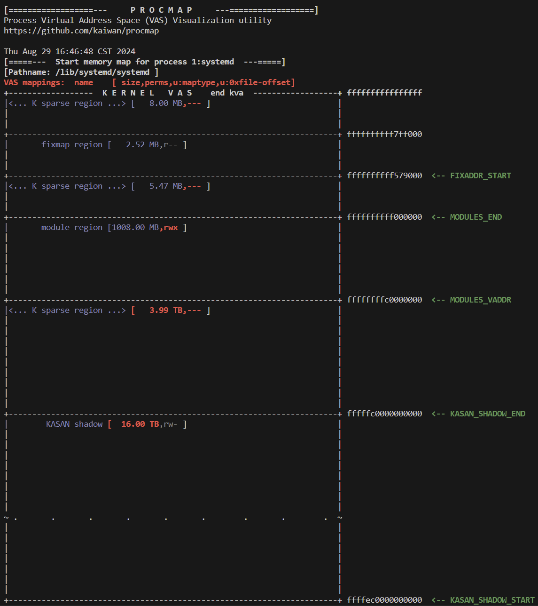

<center>[图 7.14]</center>

整个内核 VAS ，从 `end_kva`（值为 `0xffff ffff ffff ffff`）到内核的起始位置 `start_kva`（`0xffff 8000 0000 0000` 是内核模块区域）都显示出来了。注意（绿色标记的）某些关键地址右侧的标签，表示它们的含义。在 64 位系统上，用户 VAS 顶部与内核段起始之间有一个巨大的“非规范”稀疏区域。在 x86_64 上，这个稀疏区域占据了 VAS 的绝大部分：16383.75 PB（总共 16384 PB）。

#### 尝试查看用户段

现在，让我们回到 `ch7/show_kernel_seg` LKM 演示程序。我们为该内核模块提供了一个名为 `show_uservas` 的参数（默认为 `0`）；当设置为 `1` 时，还会显示一些关于进程上下文用户空间的详细信息。以下是模块参数的定义：

```c
// 定义一个整型变量 show_uservas，用于控制是否显示用户空间 VAS 的详细信息。
// 默认值为 0，即不显示；如果设置为 1，则显示相关信息。
static int show_uservas;

// 定义一个模块参数 show_uservas，并将其绑定到上述定义的变量。
// 参数类型为 int（整型），权限设置为 0660（只有拥有者和所属组有读写权限）。
module_param(show_uservas, int, 0660);

// 描述模块参数的用途，为 show_uservas 添加说明。
// 描述内容为：是否显示用户空间 VAS 的详细信息；0 表示不显示（默认），1 表示显示。
MODULE_PARM_DESC(show_uservas,
"Show some user space VAS details; 0 = no (default), 1 = show");
```

现在再次运行 `show_kernel_seg` 内核模块，这次请求它同时显示用户空间的详细信息（通过上述参数）。下面的截图显示了完整的输出：

```bash
cd ~/kernel_learn/Linux-Kernel-Programming-master/ch7/show_kernel_seg/

make 

sudo dmesg -C

sudo insmod show_kernel_seg.ko show_uservas=1

dmesg
```

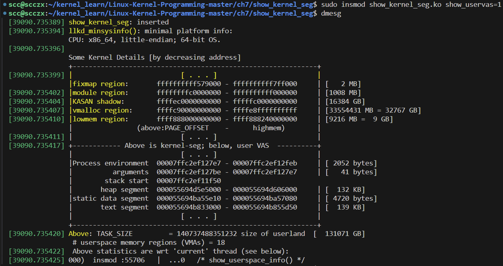

<center>[图 7.15]</center>

我们现在可以一次性看到进程的完整内存映射：包括 “上半部分”（规范的）内核空间和 “下半部分”（规范的）用户空间（`procmap` 项目可以更好地展示并且提供更多细节）。

我们需要仔细研究在我们的 x86_64 或其他设备或虚拟机上的输出，仔细查看代码。我们打印的用户空间详细信息，例如段的起始和结束地址，是通过解引用 `current` 变量中的 `mm_struct` 结构（任务结构中的 `mm` 成员）来完成的。请记住，`mm` 是进程用户映射的抽象。以下是执行此操作的代码片段：

```c
// ch7/show_kernel_seg/kernel_seg.c
[ ... ]
static void show_userspace_info(void)
{
    pr_info(
        "+------------ Above is kernel-seg; below, user VAS ----------+\n"
        ELLPS
        "|Process environment %px - %px | [ %4zd bytes]\n"
        "| arguments %px - %px | [ %4zd bytes]\n"
        "| stack start %px\n"
        [...],
        SHOW_DELTA_b(current->mm->env_start, current->mm->env_end),
        SHOW_DELTA_b(current->mm->arg_start, current->mm->arg_end),
        current->mm->start_stack,
        [...]
```

还记得用户 VAS 开头的所谓空陷阱页吗？再次查看 `procmap` 的输出:见 [图 7.10](#figure7-10)，展示了空陷阱页。

##### 空陷阱页

在之前的图（[图 7.10](#figure7-10)）中，我们应该注意到用户空间最开始的位置有一个特殊的单独页面，被称为“**空陷阱页**”。那么，这个空陷阱页到底是什么，有什么作用呢？

简单来说，**空陷阱页是虚拟内存中的第一个页面（虚拟页 0），它在硬件的内存管理单元（MMU）和页表项（PTE）层面上被设置为无权限**。也就是说，这个页面没有读、写、执行等任何访问权限。因此，无论是试图读取、写入还是执行这块内存的操作，都会导致内存管理单元检测到不允许的访问行为，从而触发一个故障或异常。这时，处理器会立即跳转到操作系统的故障处理程序中，这个程序负责处理这样的非法访问。

故障处理程序会执行一个重要的任务：识别并终止试图访问这个没有权限的内存区域的进程。这是如何实现的呢？实际上，故障处理程序是运行在进程上下文中的，也就是说，它是由当前正在运行的进程触发的。在这个过程中，`current` 变量代表的就是那个试图访问非法内存的进程或线程。处理程序会向这个进程发送一个名为 `SIGSEGV`（段错误）的信号。这个信号会立即终止故障进程，通常表现为我们常见的“段错误”（segmentation fault）或“崩溃”现象。

**空陷阱页的存在就是为了捕捉那些试图访问 NULL 指针的错误。当程序错误地访问了虚拟页 0 时，操作系统通过这个机制迅速识别并阻止了这个潜在的危险行为，有效地保护了系统的稳定性和安全性。**

#### 查看内核文档中的内存布局

回到内核段来看，由于 64 位虚拟地址空间（VAS）比 32 位要大得多，因此内核段的大小也远超 32 位系统。如我们之前所见，在 x86_64 架构上，内核段通常为 128 TB。再次查看之前显示的虚拟内存分割表（[图 7.4](#figure7-4)，64 位 Linux 系统上的虚拟内存分割）；其中第四列显示了不同架构的虚拟内存分割情况。我们会看到，对于 64 位的 Intel/AMD 和 AArch64（ARM64）架构，这些数值比它们的 32 位版本大得多。

| 架构    | 内核源代码中对应的文档位置        |
| ------- | --------------------------------- |
| ARM-32  | `Documentation/arm/memory.txt`    |
| AArch64 | `Documentation/arm64/memory.txt`  |
| x86_64  | `Documentation/x86/x86_64/mm.txt` |

## 随机化内存布局 – KASLR

在信息安全领域，恶意用户如果预先知道进程虚拟地址空间（VAS）中各种函数或全局变量的确切位置（虚拟地址），结合 proc 文件系统（procfs）和各种强大工具，就可能策划攻击，最终破坏目标系统（Pwn！）。因此，为了提高安全性，为了让攻击者无法（或至少难以）依赖 “已知” 的虚拟地址，用户空间和内核空间均支持 ASLR（地址空间布局随机化）和 KASLR（内核地址空间布局随机化）技术（通常发音为 Ass-ler / Kass-ler）。

这里的关键词是**随机化**：**启用此功能时，它会更改进程（和内核）内存布局的位置，通过将内存部分从一个给定的基地址偏移一个随机的（页面对齐的）数量来实现位置的绝对数值变化。**那么，具体有哪些“内存部分”会被随机化呢？**对于用户空间映射，共享库的起始地址（它们的加载地址）、基于 mmap() 的分配（记住，任何超过 128 KB 的 malloc() 函数（/calloc/realloc）都成为基于 mmap 的分配，而不是在堆上分配）、堆栈的起始地址、堆以及 vDSO 页面；所有这些都可以在进程运行（启动）时随机化。**

因此，攻击者无法依赖 glibc 函数（如 system()）在任意给定进程中的某个特定固定用户虚拟地址（UVA）上进行映射；不仅如此，这个位置在每次进程运行时都会有所不同。在 ASLR 出现之前，以及在不支持或关闭 ASLR 的系统上，可以提前确定给定架构和软件版本的符号位置（procfs 和 objdump、readelf、nm 等工具的结合使这一过程变得非常容易）。

需要意识到的是，[K]ASLR 仅仅是一种统计保护。实际上，通常用于随机化的位并不多，因此熵值不是很好。这意味着即便在 64 位系统上，页面大小的偏移也并不多，这可能导致实现效果不够理想。

### 用户模式的地址空间布局随机化 (ASLR)

通常，当提到 ASLR 时，指的就是用户模式下的 ASLR。启用 ASLR 意味着每个进程的用户空间映射都具备这种保护机制，用户模式进程的绝对内存映射每次运行时都会有所不同。

ASLR 在 Linux 上已经支持了很长时间（自 2005 年的内核版本 2.6.12 起）。内核在 `/proc` 文件系统中有一个可调的伪文件，供查询和设置 ASLR 的状态（需要 root 权限）。文件路径如下：`/proc/sys/kernel/randomize_va_space`。

该文件可以有三个可能的值，这三个值及其含义如下表所示：

| 可调值 | `/proc/sys/kernel/randomize_va_space` 中的值解释             |
| ------ | ------------------------------------------------------------ |
| 0      | 用户模式 ASLR 关闭；也可以通过在启动时传递内核参数 `norandmaps` 来关闭。 |
| 1      | 用户模式 ASLR 开启：基于 `mmap()` 的分配、堆栈和 vDSO 页面被随机化，还意味着共享库加载位置和共享内存段也会被随机化。 |
| 2      | 用户模式 ASLR 开启：包括上述所有（值为 1）以及堆的位置也会被随机化（自 2.6.25 版本起）；这是操作系统的默认值。 |

用户模式的 ASLR 可以在启动时通过传递 `norandmaps` 参数给内核（通过引导加载程序）来关闭。

### 内核地址空间布局随机化 (KASLR)

与用户模式下的 ASLR 类似，从内核版本 3.14 开始，甚至内核的虚拟地址空间（VAS）也可以通过启用 KASLR（内核地址空间布局随机化）来进行一定程度的随机化。在这种情况下，内核段内的内核和模块代码的基地址将通过一个以页面对齐的随机偏移量从内存的基地址进行随机化。这种随机化会在当前会话中保持有效，直到设备断电或重启。

内核中存在多个配置变量，允许平台开发者启用或禁用这些随机化选项。以 x86 架构为例，以下内容直接引用自 `Documentation/x86/x86_64/mm.txt`：

> “请注意，如果启用了 `CONFIG_RANDOMIZE_MEMORY`，则所有物理内存的直接映射、`vmalloc`/`ioremap` 空间和虚拟内存映射都会被随机化。它们的顺序保持不变，但它们的基地址将在启动时被偏移。”

KASLR 可以在启动时通过传递参数给内核（通过引导加载程序）来控制：

- 通过传递 `nokaslr` 参数明确关闭
- 通过传递 `kaslr` 参数明确开启

那么，我们当前 Linux 系统上的设置是什么？我们可以更改它吗？当然可以（前提是拥有 root 权限）。

### **使用脚本查询/设置 KASLR 状态**

我们提供了一个简单的 Bash 脚本，位于 `<book-source>/ch7/ASLR_check.sh`，用于检查用户模式 ASLR 和 KASLR 的状态，并以彩色输出其状态信息。它还允许我们更改 ASLR 的值。

现在让我们在我们的 x86_64 Ubuntu 18.04 客户机上运行这个脚本，展示其输出的截图：

```bash
cd ~/kernel_learn/Linux-Kernel-Programming-master/ch7/

sudo ./ASLR_check.sh
```

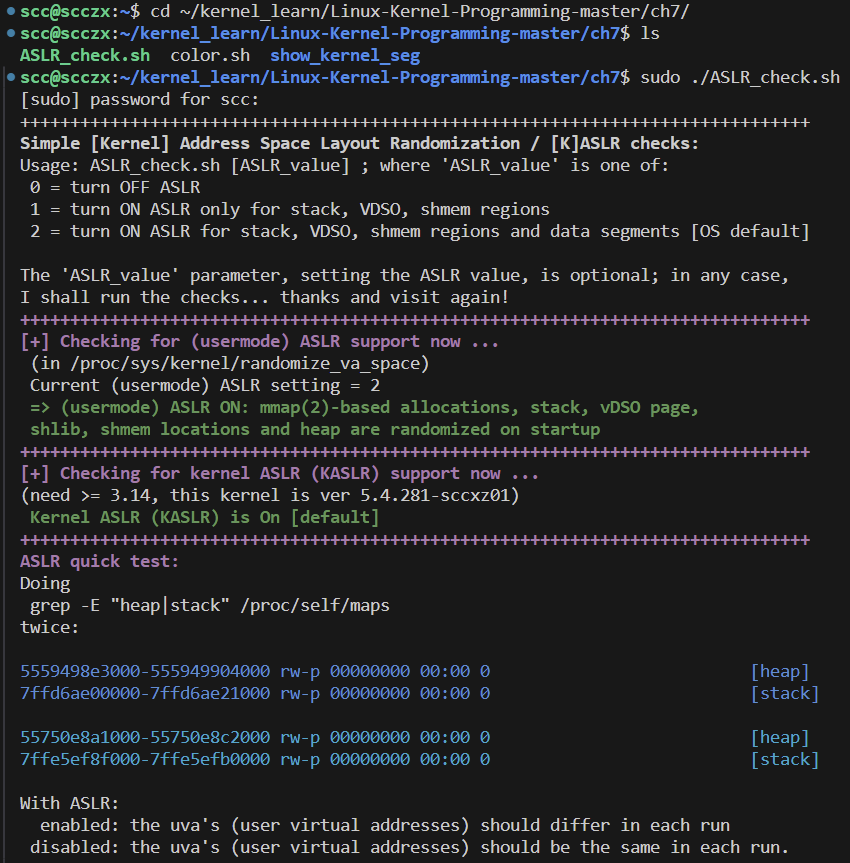

<center>[图 7.16]</center>

脚本运行后显示（至少在这台机器上）用户模式 ASLR 和 KASLR 都已开启。不仅如此，我们还编写了一个小的“测试”程序来验证 ASLR 是否生效。这个程序非常简单：它会运行以下命令两次：

```bash
grep -E "heap|stack" /proc/self/maps
```

通过参考前一节中的内容 “解释 `/proc/PID/maps` 输出”，我们可以看到在上图中，每次运行堆和栈段的 UVA（用户虚拟地址）都不同，从而证明 ASLR 功能确实有效！例如，看看堆的起始 UVA：第一次运行时是 `0x5559 498e 3000`，第二次运行时是 `0x5575 0e8a 1000`。

接下来，我们进行一次示例运行，向脚本传递参数 `0`，从而关闭 ASLR；以下截图显示了预期的输出：

```bash
sudo ./ASLR_check.sh 0
```

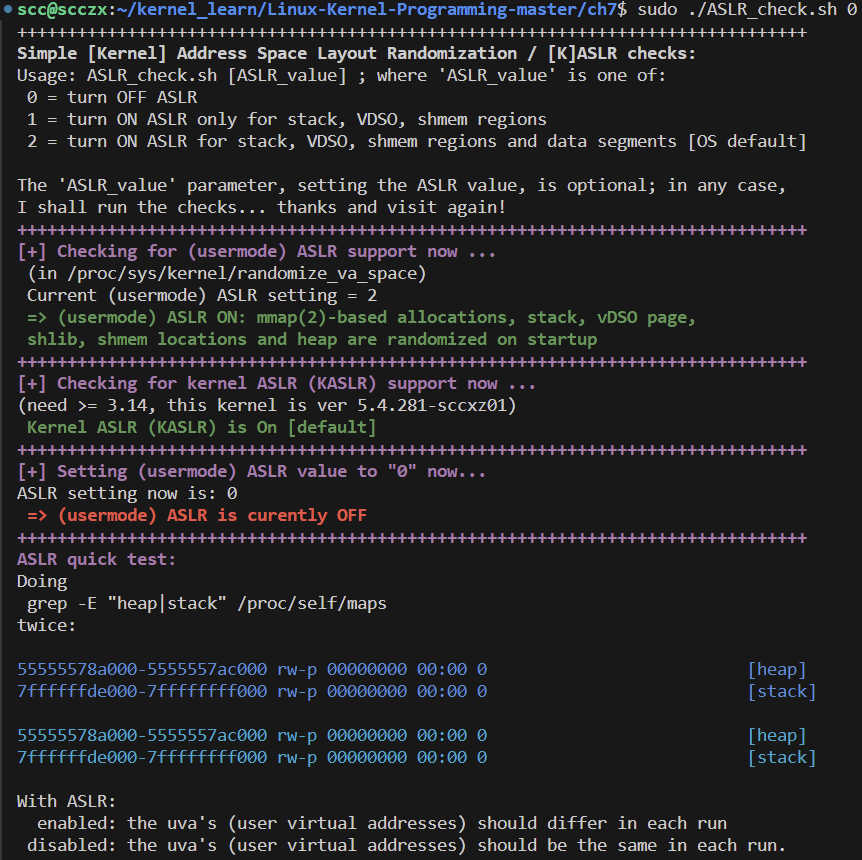

<center>[图 7.17]</center>

这一次，我们可以看到 ASLR 默认是开启的，但我们将其关闭了。这一点在截图中已用粗体和红色字体清楚标出。（记得再次将其开启）同时，正如预期的那样，关闭后，堆和栈的 UVA 在两次测试运行中保持不变，这是不安全的。

ASLR 和 KASLR 都能抵御某些类型的攻击向量，比如典型的 `return-to-libc` 和 `Return-Oriented Programming (ROP)` 攻击。然而，不幸的是，白帽和黑帽的安全对抗本质上是一场 “猫捉老鼠” 的游戏，高级漏洞利用技术仍然能够很好地击败 [K]ASLR 及类似的方法（Pwn！）。

## 物理内存

现在我们已经详细研究了用户和内核 VAS 的虚拟内存视图，我们继续讨论 Linux 操作系统上的物理内存。

### **物理 RAM 的组织**

**Linux 内核在启动时会将物理 RAM 组织成一个树状的层次结构，包括节点（nodes）、区域（zones）和页帧（page frames）（页帧指的是物理内存页）**（参见以下两图）。**节点被进一步划分为多个区域，每个区域由若干页帧组成。节点代表物理上的一块 RAM 区域，这块区域会与一个或多个处理器（CPU）核心相关联。**

**在硬件层面上，微处理器通过互连网络连接到 RAM 控制器芯片；因此，任何 CPU 都可以通过这些控制器访问任何 RAM。当线程在某个 CPU 核心上分配（内核）内存时，如果能访问物理上距离该核心最近的 RAM，将会显著提升性能。这种思想被支持 NUMA 模型（非统一内存访问模型）的硬件和操作系统所利用。**

#### 节点（Nodes）

节点是用于表示系统主板上物理 RAM 模块及其相关控制芯片的数据结构。这里讨论的是通过软件元数据抽象出来的实际硬件。每个节点总是与系统主板上的一个物理插槽（或多个处理器核心）关联。

存在两种内存访问层次结构：

1. **非统一内存访问（NUMA）系统**：在这种系统中，内核分配请求发生在哪个核心上是重要的（内存被非均匀对待），可以带来性能提升。
2. **统一内存访问（UMA）系统**：在这种系统中，内核分配请求发生在哪个核心上无关紧要（内存被均匀对待）。

**真正的 NUMA 系统是指那些硬件上具有多核（两个或多个 CPU 核心，支持对称多处理 SMP）且有两个或更多物理 RAM “库”的系统，每个 RAM 库都与一个或多个 CPU 关联。换句话说，NUMA 系统总是有两个或更多的节点，而 UMA 系统则只有一个节点**（供参考，表示节点的数据结构称为 `pg_data_t`，定义在 `include/linux/mmzone.h:pg_data_t`）。

为什么需要这样复杂的结构呢？答案当然是为了**性能优化**，**NUMA 系统（通常是相对昂贵的服务器级机器）及其运行的操作系统（通常是 Linux/Unix/Windows）设计成使得当某个 CPU 核心上的进程或线程想要执行内核内存分配时，能够通过从最靠近该核心的节点中分配所需内存（RAM）来确保高性能（这也是 NUMA 名称的由来）。**UMA 系统（例如典型的嵌入式系统、智能手机、笔记本电脑和台式机）则没有这种性能上的优势，也不需要这种机制。

如今的企业级服务器系统可以拥有数百个处理器和数 TB，甚至几 PB 的 RAM，这些系统几乎总是采用 NUMA 架构。

然而，**Linux 的设计方式使得，即便是普通的 UMA 系统，内核也会将其视为 NUMA 系统（其实是伪 NUMA 系统）。这些系统只有一个节点，因此可以快速判断系统是 NUMA 还是 UMA：如果有两个或更多节点，那么它是真正的 NUMA 系统；只有一个节点时，它就是“伪 NUMA”或伪 NUMA 系统。**如何检查呢？可以使用 `numactl()` 工具（例如运行 `numactl --hardware`）。当然，还有其他方法（比如直接通过 `/proc` 文件系统）。

简而言之，**在 NUMA 系统中，一个或多个 CPU 核心会与一个物理 RAM "库"（硬件模块）关联。因此，NUMA 系统总是对称多处理（SMP）系统**。

为了让讨论更具实际意义，我们来简要看一下实际服务器系统的微架构，例如运行 AMD Epyc/Ryzen/Threadripper（以及较早的 Bulldozer）CPU 的系统，其架构如下：

- 主板上有两个物理插槽（P#0 和 P#1），总共 32 个 CPU 核心（在操作系统中可见）。每个插槽包含 8x2 个 CPU 核心（实际上是 8 个物理核心，每个核心都启用了超线程；操作系统将这些超线程核心也视为可用核心）。
- 总共 32 GB RAM，被分成四个 8 GB 的物理库。

因此，当 Linux 内存管理代码在启动时检测到这种拓扑结构后，会设置四个节点来表示这些 RAM 库。（处理器的各种缓存（L1/L2/L3 等）可以参考：https://coolshell.cn/articles/20793.html）

以下概念图大致显示了一些运行 Linux 操作系统的 AMD 服务器系统上的四个树状层次结构，每个节点对应一个。图中概念性地展示了系统中每个物理 RAM 库与不同 CPU 核心相连接的节点/区域/页帧情况：

<a id="figure7-18"></a>

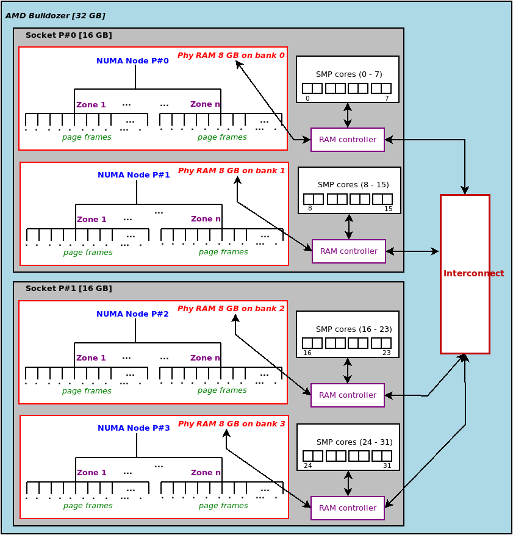

<center>[图 7.18]</center>

这里要强调的关键点是：为了提升性能（参见上图），假设一个线程在 CPU #18 或更高编号的核心上执行某些内核或驱动程序代码时，请求内核分配一些 RAM。内核的内存管理层（MM 层）理解 NUMA 的原理，会优先从 NUMA 节点 #2 中的任意区域的空闲 RAM 页帧中满足请求（即来自 Phy RAM 库 #2），因为它“最靠近”发出请求的处理器核心。如果在 NUMA 节点 #2 的所有区域内都没有可用的空闲页帧，内核还具备一个智能的回退机制，它可能会跨越互连网络，从另一个节点：区域中请求 RAM 页帧。

#### 区域（Zones）

在 Linux 中，区域（Zones）可以被视为处理硬件特性差异的一种方式。这种处理机制在 x86 架构上尤其多见，因为 Linux 正是在这里“成长起来”的。当然，这也涉及一些软件上的挑战（比如在大多已成为遗留系统的 32 位 i386 架构上，ZONE_HIGHMEM 的存在）。

**一个区域由页帧组成，也就是物理内存页**。更技术性地说，每个节点内的区域都会被分配一个页帧号（PFN）范围：

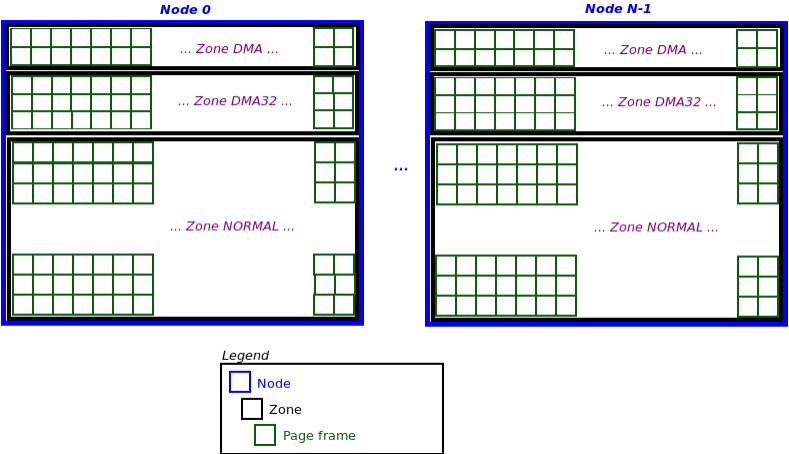

<center>[图 7.19]</center>

在上图中，我们可以看到一个通用（示例）的 Linux 系统，其中有 N 个节点（编号从 0 到 N-1），每个节点包含三个区域，每个区域由物理内存页（页帧）组成。每个节点的区域数量（及名称）在系统启动时由内核动态确定。我们可以通过查看 procfs 来检查 Linux 系统中的层次结构。在下面的代码中，我们查看了一个拥有 16 GB RAM 的原生 Linux x86_64 系统：

```bash
cat /proc/buddyinfo
# Node 0, zone DMA			3 		2 		4 		3 		3 		1 		0 		0 		1 		1 		3
# Node 0, zone DMA32 	31306 	10918 	 1373 	  942 	  505 	  196 	   48 	   16 		4 		0 		0
# Node 0, zone Normal 	49135 	 7455 	 1917 	  535 	  237 	   89 	   19		3 		0 		0 		0

```

最左边的列显示系统中只有一个节点，即节点 0。这表明我们实际上是在一个 UMA 系统上，尽管 Linux 操作系统会将其视为（伪/虚拟）NUMA 系统。这个单一的节点 0 被分为三个区域，分别是 **DMA**、**DMA32** 和 **Normal**，每个区域都由页帧组成。先忽略右侧的数字，我们将在下一章解释其含义。

在 Linux 内核中，**DMA**、**DMA32** 和 **Normal** 是三种内存区域，分别满足不同的硬件需求：

1. **DMA 区域**：用于旧设备，限制在 16MB 以下的物理内存。主要用于那些只能访问低地址内存的设备。

2. **DMA32 区域**：限制在 4GB 以下的物理内存，用于只能访问 32 位地址空间的设备。

3. **Normal 区域**：用于系统和用户进程的常规内存分配，适用于 4GB 以上的内存（在 64 位系统上）。

另一个观察 Linux 如何在 UMA 系统上“伪造” NUMA 节点的方法是查看内核日志。在一个拥有 16 GB RAM 的原生 x86_64 系统上运行以下命令。为了提高可读性，用省略号替换了显示时间戳和主机名的前几列：

```bash
journalctl -b -k --no-pager | grep -A7 "NUMA"
<...>: No NUMA configuration found
<...>: Faking a node at [mem 0x0000000000000000-0x00000004427fffff]
<...>: NODE_DATA(0) allocated [mem 0x4427d5000-0x4427fffff]
<...>: Zone ranges:
<...>: DMA [mem 0x0000000000001000-0x0000000000ffffff]
<...>: DMA32 [mem 0x0000000001000000-0x00000000ffffffff]
<...>: Normal [mem 0x0000000100000000-0x00000004427fffff]
<...>: Device empty
```

从中我们可以清楚地看到，由于系统被检测为非 NUMA（即 UMA），内核伪造了一个节点。该节点的范围是系统上的全部 RAM（在此为 `0x0-0x00000004427fffff`，确实是 16 GB）。我们还可以看到，在这个特定系统上，内核实例化了三个区域：DMA、DMA32 和 Normal 用来组织可用的物理内存页帧。这与我们之前看到的 `/proc/buddyinfo` 输出是一致的。表示 Linux 中区域的数据结构定义在 `include/linux/mmzone.h:struct zone` 中。

### 直接映射的 RAM 和地址转换

在启动时，Linux 内核会将所有（可用的）系统 RAM（即平台 RAM）直接映射到内核段。因此，我们有以下映射规则：

- 物理页帧 0 映射到内核虚拟页 0。
- 物理页帧 1 映射到内核虚拟页 1。
- 物理页帧 2 映射到内核虚拟页 2，依此类推。

因此，我们称这种映射为 1:1 映射、直接映射、身份映射的 RAM 或线性地址。关键点在于，所有这些内核虚拟页都与其物理对应页有一个固定的偏移（正如前面提到的，这些内核地址称为内核逻辑地址）。这个固定的偏移量是 `PAGE_OFFSET` 值（此处为 `0xc000 0000`）。

在一个 32 位系统上，假设虚拟内存（VM）以 3:1 GB 划分，物理地址 `0x0000 0000` 对应内核逻辑地址 `0xc000 0000`（即 `PAGE_OFFSET`）。如前所述，术语 **“内核逻辑地址” 是指与其物理地址有固定偏移的内核地址。因此，直接映射的 RAM 映射到内核逻辑地址，这种直接映射内存的区域通常被称为内核段中的低内存（lowmem）区域。**

在下图中，在之前的图上我们稍作修改，实际展示了 RAM 的前三个物理页帧如何映射到内核段低内存区域的前三个内核虚拟页：

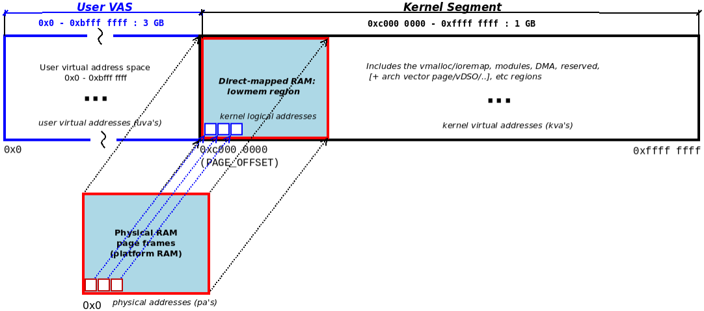


<center>[图 7.20]</center>

例如，上图显示了一个 32 位系统中平台 RAM 到内核段的直接映射，这里虚拟内存以 3:1 GB 划分。物理 RAM 地址 `0x0000 0000` 在内核中的映射点是 `PAGE_OFFSET` 内核宏（在上图中，它是内核逻辑地址 `0xc000 0000`）。注意图中还在左侧显示了用户虚拟地址空间（VAS），范围从 `0x0000 0000` 到 `PAGE_OFFSET-1`（大小为 `TASK_SIZE` 字节）。我们已经在之前的“检查内核段”部分讨论了内核段的其他部分细节。

理解物理页与虚拟页的这种映射可能会让我们得出以下逻辑结论：

- 给定一个内核虚拟地址（KVA），要计算对应的物理地址（PA）：即执行 KVA 到 PA 的转换，只需执行以下操作：

  ```plaintext
  pa = kva - PAGE_OFFSET
  ```

- 相反，给定一个物理地址（PA），要计算对应的内核虚拟地址（KVA）：即执行 PA 到 KVA 的转换，只需执行以下操作：

  ```plaintext
  kva = pa + PAGE_OFFSET
  ```

再次参考上图。RAM 到内核段的直接映射（从 `PAGE_OFFSET` 开始）确实支持了这一结论。因此，这种结论是正确的。但是，请注意：**这些地址转换计算只对直接映射或线性地址有效，即仅对内核低内存区域中的 KVA（技术上称为内核逻辑地址）有效。对于所有用户虚拟地址（UVA）和低内存区域之外的任何内核虚拟地址（包括模块地址、`vmalloc`/`ioremap`（内存映射 I/O）地址、KASAN 地址、（可能的）高内存区域地址、DMA 内存区域等），这些计算无效。**

内核确实提供了用于执行这些地址转换的 API。当然，它们的实现是与架构相关的。以下是这些 API：

| 内核 API                                           | 功能描述                                     |
| -------------------------------------------------- | -------------------------------------------- |
| `phys_addr_t virt_to_phys(volatile void *address)` | 将给定的虚拟地址转换为其物理地址（返回值）。 |
| `void *phys_to_virt(phys_addr_t address)`          | 将给定的物理地址转换为虚拟地址（返回值）。   |

在 x86 架构的 `virt_to_phys()` API 上方，有一条评论明确建议驱动程序作者不要使用这个 API（及其类似的 API）。为了清晰和完整，我们在此处重现了内核源代码中的评论：

```c
// arch/x86/include/asm/io.h
/**
 * virt_to_phys - 映射虚拟地址到物理地址
 * @address: 需要重新映射的地址
 *
 * 返回的物理地址是给定内存地址的物理（CPU）映射。只能对直接映射的地址或通过 `kmalloc` 分配的地址使用此函数。
 *
 * 此函数不用于 DMA 传输的总线映射。在几乎所有可以想象的情况下，设备驱动程序都不应该使用此函数。
 */
static inline phys_addr_t virt_to_phys(volatile void *address)
```

另一个关键点是：通过将所有物理 RAM 映射到内核段中，不要误以为内核在为自己保留 RAM。事实上，它并没有这样做；它只是映射了所有可用的 RAM，从而使其可供任何需要的实体（如核心内核代码、内核线程、设备驱动程序或用户空间应用程序）进行分配。这是操作系统的职责的一部分；毕竟，它是系统资源管理器。当然，在启动时，某部分 RAM 会被占用（分配）：如静态内核代码、数据、内核页表等，但这个部分相当小。例如，1 GB RAM 客户机虚拟机上，内核代码、数据和 BSS 段总共占用大约 25 MB 的 RAM。所有的内核内存总计大约 100 MB，而用户空间的内存使用量在 550 MB 左右。通常情况下，用户空间才是内存的主要消耗者。

回到正题：我们知道内核页表在启动过程早期就已经设置好了。因此，当应用程序启动时，内核已经将所有 RAM 映射并可供分配。因此，我们可以理解，**尽管内核将页帧直接映射到其虚拟地址空间（VAS），用户模式进程则只能通过操作系统在每个进程创建时（`fork()`）设置的分页表间接地映射页帧。此外，通过强大的 `mmap()` 系统调用进行的内存映射，可以为用户虚拟地址空间提供“直接映射”文件或匿名页的假象。**

## 总结

在本章中，我们探讨了内核内存管理的这个大话题，首先，我们从一个关键部分：虚拟内存（VM）的划分及其在运行 Linux 操作系统的各种架构上的实现方式作为切入点。接着，我们深入研究了这种划分的两个区域：首先是用户空间（进程的虚拟地址空间 VAS），然后是内核虚拟地址空间（或内核段）。在这一部分，我们介绍了许多细节以及如何检查这些区域的工具/实用程序（特别是 `procmap` ）。

我们构建了一个示例内核模块，可以生成内核和调用进程的完整内存映射，还简要讨论了用户和内核内存布局随机化技术（[K]ASLR）。最后，我们浏览了 Linux 中 RAM 的物理组织结构。