# Chapter3 Building the 5.x Linux Kernel from Source - Part 2

在这一章中，我们将继续构建内核的探索，包括构建内核的其余四个步骤：首先，我们构建内核（步骤4）。然后，我们将看到如何正确安装作为构建的一部分生成的内核模块（步骤5）。接下来，我们运行一个简单的命令来设置GRUB引导加载程序并生成initramfs（或initrd）映像（步骤6）。还讨论了使用initramfs映像的动机以及如何使用它。然后介绍了配置GRUB引导加载程序（用于x86）的一些细节（步骤7）。

- 步骤4-构建内核映像和模块
- 步骤5-安装内核模块
- 步骤6-生成initramfs映像和引导加载程序设置了解initramfs框架
- 步骤7-定制GRUB引导加载程序
- 查看新内核的配置

## 步骤4 -构建内核映像和模块

从最终用户的角度执行构建实际上非常简单。在最简单的形式中，只需确保我们位于已配置的内核源代码树的根目录中并输入 `make` 即可，这样内核映像和任何内核模块（在嵌入式系统上，可能还有设备树Blob（DTB）二进制文件）将被构建。

当然，我们可以传递各种 Makefile 目标来创建。在命令行上发出的一个快速的 `make help` 命令揭示了相当多的信息。实际上，我们在前面使用了它来查看所有可能的配置目标。在这里，我们使用它来查看默认情况下使用 `all` 目标构建的内容：

```bash
# 上面的环境变量设置是一次性的
cd ${LLKD_KSRC}

make help
# all             - Build all targets marked with [*]
# * vmlinux         - Build the bare kernel
# * modules         - Build all modules
# * bzImage      - Compressed kernel image (arch/x86/boot/bzImage)

make all
```

执行 `make all` 会得到所有标记为 [*] 的目标，我们看看这三个目标都是干什么的：

- **vmlinux**：实际上是未压缩内核映像的名称
- **modules**：表示所有标记为m（表示模块）的内核配置选项将在内核源代码树中构建为内核模块（.ko文件）
- **bzImage** ：是与体系结构相关的。在 x86[-64] 系统上，这是压缩内核映像的名称，引导加载程序将实际加载到 RAM 中的就是这个文件，并在内存中解压后启动；实际上，它就是**内核映像文件**。

一个常见问题：如果 **`bzImage` 是我们用来启动和初始化系统的实际内核**，那么 `vmlinux`  是干什么的？请注意，**`vmlinux` 是未压缩的内核映像**。它可以很大（甚至非常大，在调试构建期间生成的内核符号的情况下）。虽然我们从来没有通过vmlinux进行启动，但它仍然很重要。**为了内核调试的目的**，请保留它。

注：在 `kbuild` 系统中，只要运行 `make` 命令就等同于 `make all` 。

构建内核确实是一项非常消耗内存和 CPU 资源的工作。现代的 `make` 工具非常强大，并且支持多进程。我们可以请求它生成多个进程来并行处理构建中不同的（无关的）部分，从而提高吞吐量并缩短构建时间。相关的选项是 `-j 'n'`，其中 `n` 是并行生成和运行任务的上限。

```bash
n = num-CPU-cores * factor;
# 其中，factor 为 2（对于具有数百个CPU核心的高端系统，该因子为1.5）
# 我们需要这些核心内部“线程化”或使用同步多线程（Simultaneous Multi-Threading，SMT）——Intel称之为超线程（Hyper-Threading）
```

然后我们开始构建内核，在这个过程中内核构建完全有可能发出警告，尽管在这种情况下不是致命的，对于出现的问题，我们可以及时去处理：

```bash
time make -j4
```

我这里提示的问题如下：

```bash
BTF: .tmp_vmlinux.btf: pahole (pahole) is not available
Failed to generate BTF for vmlinux
Try to disable CONFIG_DEBUG_INFO_BTF
Makefile:1116: recipe for target 'vmlinux' failed
make: *** [vmlinux] Error 1
```

根据提示：生成 BTF（BPF Type Format）信息时失败，具体原因是 `pahole` 工具不可用，无法生成 BTF 文件。从网上搜索相关问题后发现，需要 `pahole` 工具，该工具是 `dwarves` 软件包的一部分：

```bash
sudo apt-get install dwarves

#  ······
# Setup is 17820 bytes (padded to 17920 bytes).
# System is 9993 kB
# CRC 97df7d31
# Kernel: arch/x86/boot/bzImage is ready  (#3)
```

内核映像（这里称为 `bzImage`）和 `vmlinux` 文件已经通过将生成的各种对象文件拼接在一起成功构建。但是构建还没有完成，kbuild系统现在继续完成构建所有内核模块。当末尾出现构建时间则表示构建完成。

如果在对错误信息提示做出相应的更改之后，仍然无法编译，那我们应该使用 `make mrproper` 命令重新开始执行。

这里简单的对几个清理操作命令进行说明：

1. **`make clean`**

- 作用：删除大部分生成的文件，但保留配置文件（如 `.config`）。

- 删除的内容：
  - 编译生成的目标文件（`.o` 文件）。
  - 内核模块（`.ko` 文件）。
  - 其他构建过程中生成的中间文件。

- 用途：用于在保持配置文件的前提下清理构建环境，适合在进行小范围的代码修改后重新构建内核时使用。


2. **`make mrproper`**

- 作用：删除所有生成的文件，包括配置文件（如 `.config`）和备份文件。

- 删除的内容：
  - 所有编译生成的文件（包括 `.o`、`.ko` 等）。
  - 配置文件（`.config`）。
  - 备份文件（如 `.config.old`）。
  - 构建日志和生成的版本文件。

- 用途：用于深度清理构建环境，适合在进行大规模代码修改或在全新配置下重新构建内核时使用。


3. **`make distclean`**

   - 作用：在 `make mrproper` 的基础上进行更彻底的清理。

   - 删除的内容：
     - 所有 `mrproper` 删除的内容。
     - 额外删除编辑器生成的备份文件和补丁文件。

   - 用途：通常用于清理源代码目录，恢复到一个更加“干净”的状态，尤其是在准备发布源代码或打包时使用。


4. **`make clobber`**

   - 作用：在某些内核版本中，用于清理更大范围的文件，包括一些在构建过程中产生的下载文件。

   - 删除的内容：
     - 与 `mrproper` 类似，但可能会删除更多内容（如下载的工具链等）。

   - 用途：主要用于彻底清理环境，使其恢复到初始状态。


5. **`make dirclean`**

   - 作用：删除在构建过程中生成的所有目录和相关文件。

   - 用途：较少使用，主要用于确保所有构建过程中生成的目录都被清理。


在内核源树的根目录中，我们有以下内容：

- 未压缩的内核镜像文件，vmlinux（仅用于调试）
- 符号地址映射文件，System.map
- 压缩的可启动内核镜像文件，bzImage

```bash
ls -lh vmlinux System.map

file ./vmlinux
```

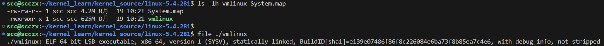

`vmlinux` 文件相当庞大。这是因为它包含了所有的内核符号以及额外的调试信息（`vmlinux` 和 `System.map` 文件在内核调试时会用到，建议保留它们）。`file` 实用程序可以让我们看到这个镜像文件的更多细节。启动加载程序加载并启动的实际内核镜像文件始终位于 `arch/<arch>/boot/` 这个通用位置；因此，对于 x86 架构，路径如下：`arch/x86/boot/`。

```bash
# X86_64 文件夹是符号链接到 X86 文件夹的
ls -l arch/x86/boot/bzImage

file arch/x86/boot/bzImage
```


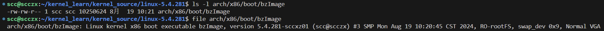

内核文档详细说明了在内核构建过程中通过设置各种环境变量可以进行的多种调整和切换。这些文档可以在内核源码树中的 `Documentation/kbuild/kbuild.rst` 文件中找到。在接下来的内容中，我们将使用 `INSTALL_MOD_PATH`、`ARCH` 和 `CROSS_COMPILE` 环境变量。

目前，我们的内核映像和模块已经构建完成了。


## 步骤5 -安装内核模块

在上一步中，所有标记为 `m` 的内核配置选项现在实际上都已经构建好了。但这还不够：它们现在必须安装到系统上的已知位置。

### 在内核源代码中定位内核模块

使用 `find` 在内核源文件夹中查找内核模块：

```bash
# 列出所有内核模块的具体位置
find . -name "*.ko"

# 内核模块数量
find . -name "*.ko" | wc -l
```

在上一章修改内核配置的过程中，我们对其中一些进行了修改，这意味着我们正在将该特定功能配置构建为内核模块，我们可以看到一下功能：

- VirtualBox support，n -> m；
- Userspace I/O (UIO) drivers，n -> m；
- 具有通用 `IRQ` 处理的 UIO 平台驱动程序，n -> m；
- MS-DOS文件系统支持，n -> m。

由于这些功能已被要求构建为模块，因此它们不会在 `vmLinux` 或 `bzImage` 内核映像文件中编码。它们将作为独立的内核模块存在。我们在内核源代码树中查找上述特性的内核模块：

```bash
# 从当前目录开始递归查找所有 .ko 文件，过滤出路径或名称中包含 vbox、msdos 或 uio 的文件
# 输出这些文件的路径和大小，并按照指定的格式进行格式化显示，路径占40个字符宽度，文件大小占9个字符宽度。
find . -name "*.ko" -ls | egrep -i "vbox|msdos|uio" | awk '{printf "%-40s %9d\n", $11, $7}'
```

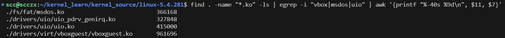

二进制内核模块确实已经在内核源代码树中生成了。但仅此还不够，这些模块需要被安装到根文件系统中的一个已知位置，以便在系统启动时可以找到它们并将其加载到内核内存中。这就是为什么我们需要安装内核模块的原因。这个“根文件系统中的已知位置”是 `/lib/modules/$(uname -r)/`，其中 `$(uname -r)` 会返回内核的版本号。

### 安装内核模块

执行内核模块安装很简单;（在构建步骤之后）只需调用 `modules_install` 去 Makefile 目标：

```bash
sudo make modules_install
```

请注意，我们使用 `sudo` 来以 root（超级用户）身份执行安装操作。这是必须的，因为默认的安装位置（在 `/lib/modules/` 目录下）只有 root 用户可以写入。一旦内核模块准备好并被复制过去（在前面的输出块中显示为 `INSTALL` 的工作），kbuild 系统会运行一个名为 `depmod` 的工具。它的主要任务是解析内核模块之间的依赖关系，并将这些依赖关系（如果存在）编码到一些元文件中。

```bash
uname -r

ls /lib/modules/
```

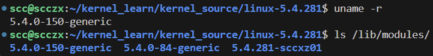

在前面的代码中，我们可以看到，对于每个可以引导系统的（Linux）内核，`/lib/modules/` 下都有一个文件夹，其名称就是预期的内核版本号。让我们查看我们感兴趣的文件夹——即我们新内核（5.4.281-sccxz01）的文件夹。在这个文件夹中，位于 `kernel/` 子目录下的各个目录中，就存放着刚刚安装的内核模块。

我们可以查看其 kernel 下的内容，以及查看之前我们提到的内核模块：

```bash
ls /lib/modules/5.4.281-sccxz01/kernel/

find /lib/modules/5.4.281-sccxz01/kernel/ -name "*.ko" | egrep "vboxguest|msdos|uio"
```

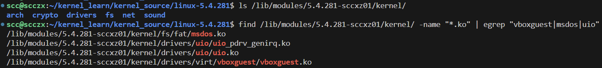

最后一个关键点：在内核构建过程中，我们可以将内核模块安装到我们指定的位置，而不是默认的 `/lib/modules/<kernel-ver>` 位置。通过设置环境变量 `INSTALL_MOD_PATH` 为所需位置来实现这一点；例如，可以这样做：

```bash
export STG_MYKMODS=../staging/rootfs/my_kernel_modules
make INSTALL_MOD_PATH=${STG_MYKMODS} modules_install
```

这样，我们所有的内核模块都会安装到 `${STG_MYKMODS}/` 文件夹中。需要注意的是，如果 `INSTALL_MOD_PATH` 指向一个不需要 root 权限即可写入的位置，可能不需要使用 `sudo`。

接下来的步骤是生成所谓的 initramfs（或 initrd）镜像并设置引导加载程序。我们还需要清楚了解这个 initramfs 镜像到底是什么，以及使用它的动机。

## 步骤6 -生成initramfs映像和引导加载程序设置

对于典型的x86桌面或服务器内核构建过程，此步骤在内部分为两个不同的部分：

- 生成 initramfs（以前称为 initrd）镜像
- 为新内核镜像设置（GRUB）引导加载程序

在这里的内核构建过程中，这两个任务被封装成一个步骤的原因是，在 x86 架构上，便捷脚本会同时执行这两个任务，使其看起来像是一个单一的步骤。

现在，让我们继续生成 initramfs（initial ram filesystem的缩写）映像文件并更新引导装载程序。在x86_64 Ubuntu上执行此操作只需一个简单的步骤：

```bash
sudo make install
```

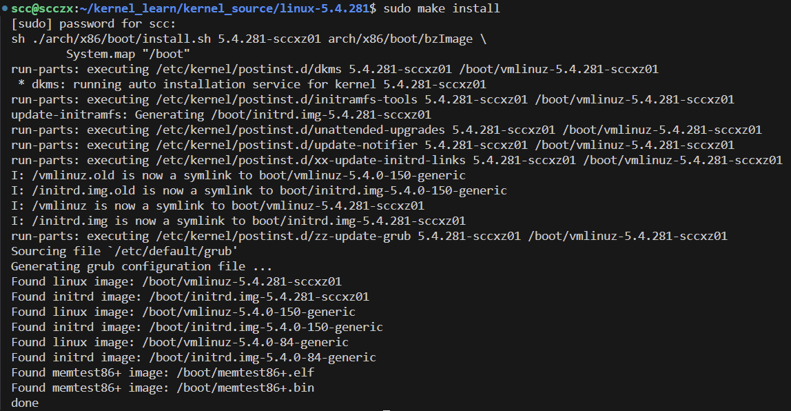

### 生成initramfs镜像-幕后操作

回顾上面操作，当执行 `sudo make install` 命令时，我们首先会看到以下内容：

```bash
sudo make install
sh ./arch/x86/boot/install.sh 5.4.281-sccxz01 arch/x86/boot/bzImage \
        System.map "/boot"
```

显然，这是一个脚本（install.sh）正在执行。这个脚本在执行过程中，会将以下文件复制到 `/boot` 文件夹中，文件名的格式通常为 `<filename>-$(uname -r)`：

- `System.map-5.4.281-sccxz01`
- `initrd.img-5.4.281-sccxz01`
- `vmlinuz-5.4.281-sccxz01`
- `config-5.4.281-sccxz01`

同时，`initramfs` 镜像也会被构建。这项任务由一个名为 `update-initramfs` 的 shell 脚本执行（这个脚本本身是另一个名为 `mkinitramfs` 的脚本的便利包装器，后者执行实际的工作）。一旦构建完成，`initramfs` 镜像也会被复制到 `/boot` 目录中，在上面的输出片段中显示为 `initrd.img-5.4.0-llkd01`。

如果将文件复制到 `/boot` 时发现该文件已经存在，它会被备份为 `<filename>-$(uname -r).old`。文件 `vmlinuz-<kernel-ver>` 是 `arch/x86/boot/bzImage` 文件的副本。换句话说，它是压缩后的内核镜像，引导加载程序将被配置为加载该镜像文件到 RAM 中，解压缩并跳转到它的入口点，从而将控制权交给内核！

此外，位于 `/boot/grub/grub.cfg` 的 GRUB 引导加载程序配置文件也会被更新，以反映当前有一个新内核可供引导。

再次强调，这一切都非常依赖于架构。上面的讨论是基于在 Ubuntu Linux x86[-64] 系统上构建内核的情况。虽然在概念上类似，但内核镜像文件名、它们的位置，尤其是引导加载程序的细节，在不同架构上会有所不同。

### 了解initramfs框架

这个initramfs或initrd镜像到底是干什么用的？为什么会在那里？

首先，使用这个功能是一个选择，该配置指令被称为 `CONFIG_BLK_DEV_INITRD`。它默认是开启的，设置为 `y`。简而言之，对于那些无法提前知道某些信息的系统，比如引导磁盘的主机适配器或控制器类型（如 SCSI、RAID 等），或根文件系统的确切文件系统类型（例如 ext2、ext3、ext4、btrfs、reiserfs、f2fs 或其他），或者对于那些这些功能总是作为内核模块构建的系统，我们需要使用 `initramfs` 功能。

### 为什么选择initramfs框架？

initramfs 框架本质上是一种在内核启动早期阶段与用户模式之间的“中介”。它**允许我们在实际根文件系统挂载之前运行用户空间的应用程序（或脚本）**。这在许多情况下都非常有用，以下列表中详细说明了其中的一些情况。关键点是，initramfs 允许我们在启动时运行内核通常无法运行的用户模式应用程序。

从实际应用的角度来看，这个框架让我们能够做以下事情：

- 设置控制台字体。
- 自定义键盘布局设置。
- 在控制台设备上打印自定义欢迎消息。
- 接受密码（用于加密磁盘）。
- 根据需要加载内核模块。
- 如果出现故障，启动一个“救援”shell。
- ...

设想一下，如果我们正在从事构建和维护一个新的 Linux 发行版的工作。在安装时，发行版的最终用户可能会决定使用 reiserfs 文件系统格式化他们的 SCSI 磁盘（顺便提一下，这是内核中最早的通用日志文件系统）。问题是，我们无法提前知道用户会选择什么样的文件系统——可能有许多种选择。因此，我们决定预构建并提供多种内核模块，以满足几乎所有可能的需求。很好，当安装完成并且用户的系统启动时，在这种情况下，内核将需要 `reiserfs.ko` 内核模块来成功挂载根文件系统，从而继续系统启动。

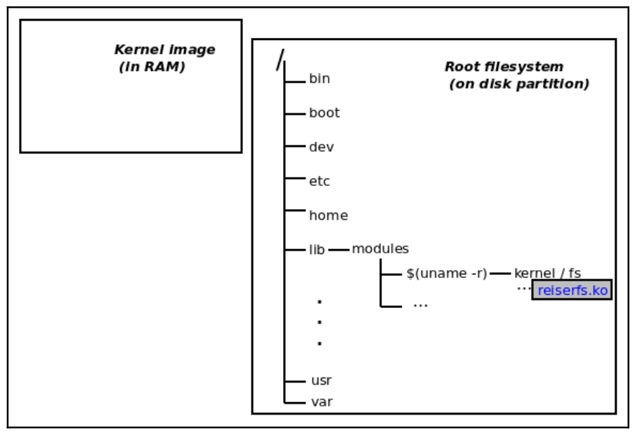

<center>根文件系统在磁盘上，但尚未挂载，内核映像在RAM中</center>

但是，等等，考虑一下，我们现在遇到了一个典型的 “先有鸡还是先有蛋” 的问题：为了让内核挂载根文件系统，它需要将 `reiserfs.ko` 内核模块文件加载到 RAM 中（因为它包含与文件系统协作所需的代码）。但该文件本身嵌入在 reiserfs 根文件系统中；更准确地说，它位于 `/lib/modules/<kernel-ver>/kernel/fs/reiserfs/` 目录下（见上图）。**initramfs 框架的主要目的之一就是解决这个“先有鸡还是先有蛋”的问题**。

initramfs 映像文件是一个压缩的 `cpio` 存档（cpio 是 tar 使用的一种扁平文件格式）。正如我们在前一节中所看到的，**`update-initramfs` 脚本内部调用了 `mkinitramfs` 脚本（至少在 Ubuntu 中是这样的）。这些脚本生成一个包含内核模块以及支持基础设施（如 `/etc` 和 `/lib` 文件夹）的最小根文件系统，以简单的 cpio 文件格式表示，随后通常会进行 gzip 压缩。这样就形成了所谓的 initramfs（或 initrd）映像文件**，正如我们之前看到的那样，它将被放置在 `/boot/initrd.img-<kernel-ver>` 目录下。那么，这有什么帮助呢？

在启动时，如果我们使用 initramfs 功能，引导加载程序将作为其工作的一部分，将 initramfs 映像文件加载到 RAM 中。接下来，当内核本身在系统上运行时，它会检测到 initramfs 映像的存在，解压缩它，并通过其内容（通过脚本）将所需的内核模块加载到 RAM 中（见下图）。

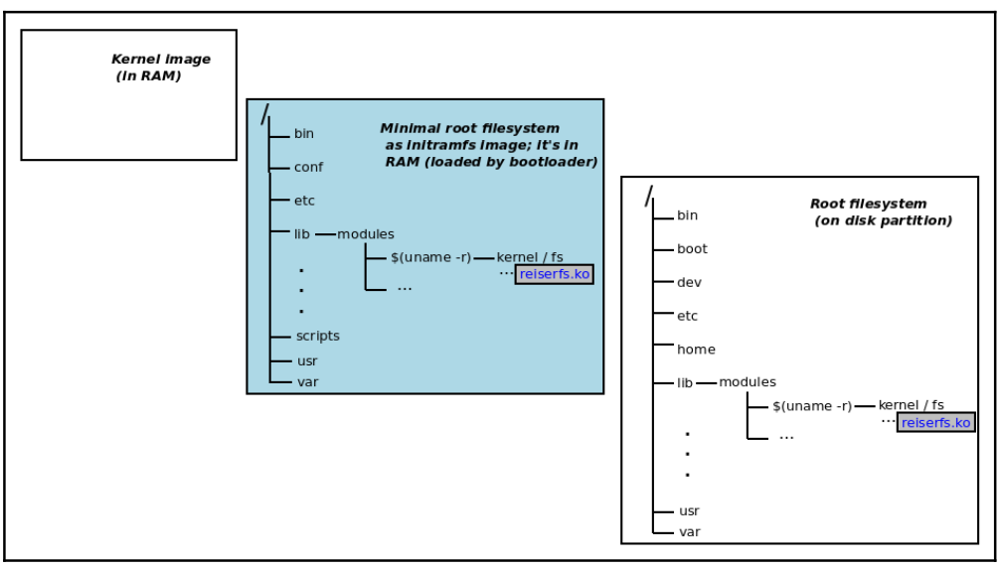

<center>initramfs映像充当早期内核和实际根文件系统可用性之间的中间人</center>

initramfs 的主要目的是解决**内核在启动时需要加载特定模块以挂载根文件系统，但这些模块本身却存储在未挂载的根文件系统中的矛盾**。

**通过在启动时预先加载包含必要模块的临时根文件系统（initramfs），内核能够顺利加载模块并挂载根文件系统，从而完成启动过程**。

### 理解 x86 启动过程的基础知识

以下是关于典型的 x86（或 x86_64）桌面电脑、工作站或服务器的启动过程的简要概述：

1. **早期启动、POST、自检和 BIOS 初始化**：BIOS（Basic Input Output System 的缩写，本质上是 x86 体系结构上的固件）将第一个可引导磁盘的第一个扇区加载到 RAM 中，并跳转到其入口点。这就是通常所说的第一阶段引导程序，它的主要任务是将第二阶段（更大）的引导程序代码加载到内存中并跳转到它。

2. **第二阶段引导程序**：第二阶段引导程序代码接管控制。它的主要任务是将实际的（第三阶段）GRUB 引导程序加载到内存中并跳转到其入口点（GRUB 通常是 x86[-64] 系统上使用的引导程序）。

3. **GRUB 引导程序**：GRUB 引导程序会传递压缩的内核映像文件（`/boot/vmlinuz-<kernel-ver>`）以及压缩的 `initramfs` 映像文件（`/boot/initrd.img-<kernel-ver>`）作为参数。引导程序将（简单地）执行以下操作：
   - 执行低级别的硬件初始化。
   - 将这些映像加载到 RAM 中，并在一定程度上解压缩内核映像。
   - 跳转到内核的入口点。

4. **Linux 内核接管控制**：Linux 内核现在接管了机器的控制权，并将初始化硬件和软件环境。它不会依赖引导程序之前所做的工作。

5. **硬件和软件初始化**：在完成大部分硬件和软件初始化后，内核会注意到 `initramfs` 功能已启用（`CONFIG_BLK_DEV_INITRD=y`）。因此，它会在 RAM 中定位（并在需要时解压缩）`initramfs`（`initrd`）映像（参见上图）。

6. **挂载临时根文件系统**：然后内核会在 RAM 中将其作为临时根文件系统挂载在一个 RAMdisk 中。

7. **初始化基本的最小根文件系统**：现在，我们已经在内存中设置了一个基本的、最小的根文件系统。因此，`initrd` 启动脚本现在开始运行，执行包括将所需的内核模块加载到 RAM 中的任务（实际上是加载根文件系统驱动程序，包括在我们的场景中 `reiserfs.ko` 内核模块；再次参见上图）。

8. **执行 pivot-root**：接下来，内核执行 pivot-root 操作，卸载临时的 `initrd` 根文件系统，释放其内存，并挂载实际的根文件系统；这是可能的，因为提供该文件系统支持的内核模块确实已可用。

9. **挂载实际根文件系统后**：一旦成功挂载了实际的根文件系统，系统初始化就可以继续进行。内核会继续运行，最终调用第一个用户空间进程，通常是 `/sbin/init`（PID 1）。

10. **SysV init 框架初始化系统**：SysV init 框架现在开始初始化系统，启动已配置的系统服务。

现在我们就理解了 `initrd/initramfs` 的动机，接下来我们将在以下部分深入探讨 `initramfs`。

### 关于initramfs框架的更多信息

另一个 initramfs 框架有用的地方是在启动加密磁盘的计算机时。引导过程的早期，内核需要向用户请求密码，如果正确，则继续挂载磁盘等操作。但是，考虑一下：在没有 C 运行时环境的情况下（比如包含库、加载器程序、所需的内核模块（可能用于加密支持）等的根文件系统），我们如何运行一个请求密码的 C 程序可执行文件呢？

记住，此时内核本身尚未完成初始化；那么用户空间的应用程序如何运行？initramfs 框架通过在内存中设置一个临时的用户空间运行时环境来解决这个问题，该环境包含所需的根文件系统、库、加载器、内核模块等。

我们可以验证这一点，让我们查看 initramfs 镜像文件的内容。Ubuntu 系统中的 `lsinitramfs` 脚本正是为此而设计的：

```bash
lsinitramfs /boot/initrd.img-5.4.281-sccxz01 | wc -l

lsinitramfs /boot/initrd.img-5.4.281-sccxz01
```

```bash
$ lsinitramfs /boot/initrd.img-5.4.281-sccxz01 | wc -l
# 352

$ lsinitramfs /boot/initrd.img-5.4.281-sccxz01
.
kernel
kernel/x86
kernel/x86/microcode
kernel/x86/microcode/AuthenticAMD.bin
.
bin
bin/halt
bin/nfsmount
bin/loadkeys
bin/zcat
bin/run-init
[...]
lib/modules
lib/modules/5.4.281-sccxz01
lib/modules/5.4.281-sccxz01/modules.builtin.bin
lib/modules/5.4.281-sccxz01/modules.dep
lib/modules/5.4.281-sccxz01/modules.symbols
lib/modules/5.4.281-sccxz01/modules.alias.bin
lib/modules/5.4.281-sccxz01/kernel
lib/modules/5.4.281-sccxz01/kernel/drivers
[...]
init
conf
conf/initramfs.conf
conf/arch.conf
conf/conf.d
```

内容非常丰富：我们截取了部分输出来展示一些选择性的片段。显然，我们可以看到一个支持所需运行时库、内核模块、/etc、/bin 和 /sbin 目录及其相关工具的最小根文件系统。

此外，现代系统有时使用一种称为 `混合 initramfs` 的方法：即一个包含早期 ramfs 映像并且在常规或主 ramfs 映像之前加载的 initramfs 映像。实际上，我们需要特殊的工具来解包/打包（解压/压缩）这些映像。Ubuntu 提供了 `unmkinitramfs` 和 `mkinitramfs` 脚本，分别用于执行这些操作。

让我们将刚生成的 initramfs 映像解包到一个临时目录中，使用 `tree` 命令截断输出以便更易于阅读：

```bash
TMPDIR=$(mktemp -d)

unmkinitramfs /boot/initrd.img-5.4.281-sccxz01 ${TMPDIR}

tree ${TMPDIR} | less
```

```bash
TMPDIR=$(mktemp -d)
unmkinitramfs /boot/initrd.img-5.4.0-llkd01 ${TMPDIR}
tree ${TMPDIR} | less
# /tmp/tmp.KQKqr79xBo
# ├── early
# │   └── kernel
# │
# └── x86
# │
# └── microcode
# │
# └── AuthenticAMD.bin
# └── main
# ├── bin
# │   ├── [
# │   ├── [[
# │   ├── acpid
# │   ├── ash
# │   ├── awk
# [...]
# ├── etc
# │   ├── console-setup
# │   │   ├── cached_UTF-8_del.kmap.gz
# [...]
# ├── init
# ├── lib
# [...]
# │   ├── modules
# │   │   └── 5.4.0-llkd01
# │   │       ├── kernel
# │   │       │   └── drivers
# [...]
# ├── scripts
# │   ├── functions
# │   ├── init-bottom
# [...]
# └── var
#     └── lib
#         └── dhcp
```

我们对 initramfs 框架及 x86 启动过程的基本原理的讨论到此结束。凭借这些知识，我们可以通过调整 initramfs 映像来进一步定制我们自己的产品，这是一个重要的技能。

例如，在现代系统中安全性是一个关键因素，能够在块级别加密磁盘是一项强大的安全功能，实现这一点非常需要调整 initramfs 映像。

现在让我们通过一些简单的定制（x86）GRUB 引导加载器的启动脚本来完成内核构建。

## 第7步-自定义GRUB引导加载程序

接下来，我们可以重启系统。不过，默认情况下，现代的GRUB（GRand Unified Bootloader）引导加载器在重启时不会显示任何菜单；它会默认启动新构建的内核（请记住，这里描述的过程仅适用于运行 Ubuntu 的 x86[_64] 系统）。

如果我们希望在每次启动系统时查看并自定义GRUB菜单，从而允许我们选择启动另一个内核或操作系统，该怎么办？在开发过程中，这通常非常有用，因此让我们来看看如何实现这一点（在 X86_64 上，在启动过程中按住 Shift 即可在启动的时候进入 GRUB 菜单）。

### 自定义GRUB -基础知识

首先，保留一份GRUB引导加载程序配置文件的备份副本：

```bash
sudo cp /etc/default/grub /etc/default/grub.orig
```

编辑：

```bash
sudo vim /etc/default/grub
```

修改或者添加以下内容：

```bash
GRUB_HIDDEN_TIMEOUT_QUIET=false
GRUB_TIMEOUT_STYLE=hidden --> GRUB_TIMEOUT_STYLE=menu
GRUB_TIMEOUT=0 --> GRUB_TIMEOUT=3
```

更新：

```bash
sudo update-grub
```

### 选择默认启动的内核

GRUB 默认的启动内核是通过 `GRUB_DEFAULT=0` 指令预设为编号为零的内核。这将确保默认情况下（超时后）启动“第一个内核”——即最近添加的内核。然而，这可能不是我们想要的；举个实际的例子，在我们的 Ubuntu 18.04.6 LTS 虚拟机中，我们将其设置为默认启动 Ubuntu 发行版的内核，方法是（当然是以 root 用户身份）编辑 `/etc/default/grub` 文件，如下所示：

```bash
# 后续一般都是在我们自己编译的内核下完成，所以可以把默认选项设置为我们自己的内核，或者设置默认项为 0，即会启动我们编译的新内核
GRUB_DEFAULT="Advanced options for Ubuntu>Ubuntu, with Linux 5.4.0-150-generic"
```

编辑后的 GRUB 配置文件如下所示：

```bash
cat /etc/default/grub

[...]
GRUB_HIDDEN_TIMEOUT_QUIET=false
GRUB_DEFAULT="Advanced options for Ubuntu>Ubuntu, with Linux 5.4.0-150-generic"
GRUB_TIMEOUT_STYLE=menu
GRUB_TIMEOUT=5
GRUB_DISTRIBUTOR=`lsb_release -i -s 2> /dev/null || echo Debian`
GRUB_CMDLINE_LINUX_DEFAULT="quiet splash"
GRUB_CMDLINE_LINUX=""
[...]
```

如果在这里进行了任何更改，请运行 `sudo update-grub` 命令以使更改生效。

现在让我们重启虚拟机系统，进入 GRUB 菜单，并启动我们新的内核。完成所有操作后，我们可以重启系统：

```bash
sudo reboot
```

当系统完成关机程序并重新启动后，我们很快就能看到 GRUB 引导加载器菜单。请确保通过按下任意键来中断菜单。

### 通过 GNU GRUB 引导加载器启动我们的虚拟机

现在我们的虚拟机即将启动；在其（模拟的）BIOS 程序完成后，首先会显示 GNU GRUB 引导加载器界面。这是因为我们有意将 `GRUB_HIDDEN_TIMEOUT_QUIET` 配置指令的值改为了 `false`。以下截图展示了 GRUB 界面的样式，这是 Ubuntu 发行版自定义的外观：

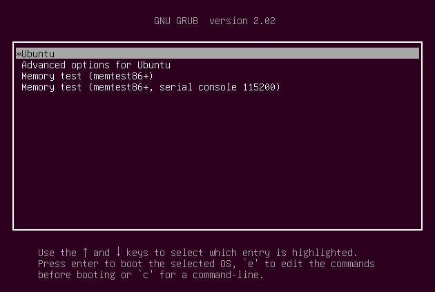

现在让我们直接启动虚拟机：

1. 按下任意键盘按键（除了 Enter），以确保在超时结束后（记住，我们将其设置为 5 秒）默认内核不会自动启动。

2. 如果还未选择，滚动到 “Advanced options for Ubuntu” 菜单，选中它并按下 Enter。

3. 现在我们会看到一个类似于以下截图的菜单，虽然可能不完全相同。对于每个 GRUB 检测到并可以启动的内核，会显示两行：一行是内核本身，另一行是同一内核的特殊恢复模式启动选项：

   - 注意，默认将启动的内核——在我们的例子中是 `5.4.0-150-generic` 内核——默认情况下带有一个星号（*）标记。

   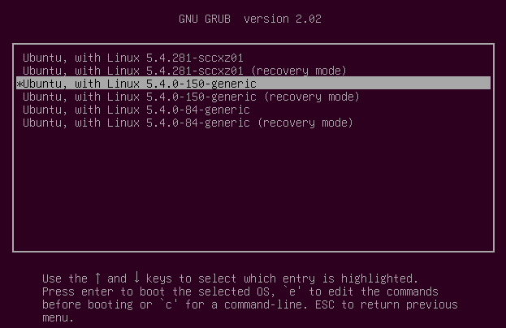

4. 无论情况如何，只需滚动到相应的条目，即 `5.4.281-sccxz01` 内核条目。在这里，它是 GRUB 菜单的第一行（因为它是最近添加到可启动操作系统的 GRUB 菜单中的）：`Ubuntu, with Linux 5.4.281-sccxz01`。

5. 一旦我们选中了上述菜单项，按下 Enter，瞧！引导加载器将开始工作，将内核镜像和 initrd 镜像解压并加载到 RAM 中，然后跳转到 Linux 内核的入口点，从而将控制权移交给 Linux！

如果一切顺利，我们将成功启动到我们新构建的 5.4.281 Linux 内核。

### 在 GRUB 提示符下进行实验

我们进一步实验一下，确保选中`Ubuntu, with Linux 5.4.281-sccxz01`，然后按下 e 键（用于编辑）。我们将进入 GRUB 的编辑屏幕，在这里可以随意更改任何值。以下是按下 e 键后的截图：

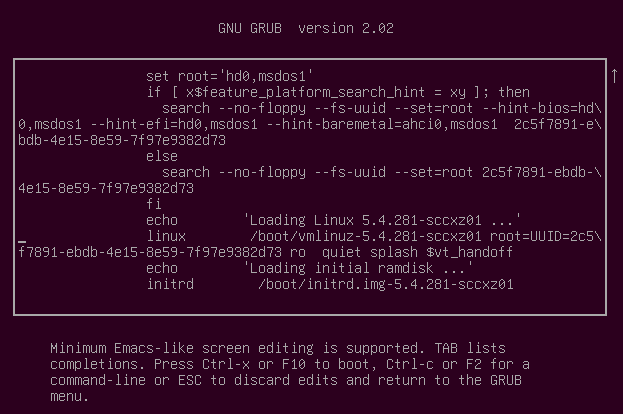

截图是在向下滚动几行后拍摄的；我们可以在编辑框底部第三行的开头发现光标（类似下划线的符号“_”）。这行非常关键，它以适当缩进的关键词 `linux` 开头，指定了通过 GRUB 引导加载器传递给 Linux 内核的内核参数列表。

可以在这里尝试进行一些实验。例如，删除该行中的 `quiet` 和 `splash` 单词，然后按下 Ctrl + X 或 F10 进行启动。这次，美观的 Ubuntu 启动画面不会出现；我们会直接进入控制台，看到所有的内核消息快速闪过。

一个常见的问题是：如果我们忘记密码，无法登录该怎么办？嗯，有几种方法可以解决这个问题。其一是通过引导加载器：像我们之前一样进入 GRUB 菜单，找到相关的菜单项，按 e 键进行编辑，向下滚动到以 `linux` 开头的行，并在这一行的末尾添加 `single`（或直接添加数字 1），使其看起来像这样：

```bash
linux /boot/wmlinuz-5.4.281-sccxz01 \
root=UUID=<...> ro quiet splash single
# <...> = 2c5f7891-ebdb-4e15-8e59-7f97e9882d73，这个值不用改，每个人不一样
```

现在，当我们启动时，内核将进入单用户模式，并为我们提供一个具有 root 权限的 shell。只需运行 `passwd <用户名>` 命令即可更改我们的密码（这里我自己在做这一步操作时，没有成功，且导致后续自己修改配置编译的内核在编译成功之后无法在 GRUB 中启动）。

当系统允许在没有密码的情况下访问引导加载器菜单（甚至 BIOS）时，系统就被认为是不安全的。在高度安全的环境中，即使是对控制台设备的物理访问也必须受到限制。

### 检查新内核的配置

```c
uname -r
```

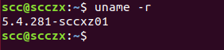

可以看到我们成功地以新内核启动了 Ubuntu。

## 总结

本章和上一章详细介绍了如何从源码构建 Linux 内核。我们从实际的内核（以及内核模块）的构建过程开始。构建完成后，我们展示了如何将内核模块安装到系统中。然后，我们探讨了生成 `initramfs`（或 `initrd`）镜像的实际操作，并解释了其背后的动机。在内核构建的最后一步，我们进行了（简单的）引导加载器的定制（这里我们主要关注 x86 的 GRUB）。接着，我们展示了如何通过新构建的内核引导系统，并验证其配置是否符合预期。

在实际项目（或产品）中，不必像我们在这里详细展示的那样执行每一个内核构建步骤。为什么？其中一个原因可能是有一个专门的 BSP（板级支持包）团队负责这一部分；另一个原因是（特别是在嵌入式 Linux 项目中）越来越可能使用像 Yocto（或 Buildroot）这样的 Linux 构建框架。通常，Yocto 会处理构建的机械部分。然而，能够根据项目需求配置内核仍然非常重要，这仍然需要我们在这里获得的知识和理解。