# Chapter5 Writing Your First Kernel Module - LKMs Part 2

本章是我们关于可加载内核模块（LKM）框架及如何使用它编写内核模块的第二部分内容。

在本章中，我们将从上一章结束的地方继续。在这里，我们将讨论如何使用更好的 Makefile 来编写 LKM、、什么是模块堆叠以及如何进行模块堆叠，以及如何设置和使用模块参数。在此过程中，我们还将学习关于内核 API/ABI 稳定性、编写用户空间代码与内核代码之间的主要区别、系统启动时自动加载内核模块、安全问题及其解决方法。此外，我们还将介绍内核文档（包括编码风格）以及如何为主线内核做贡献。

简而言之，本章将涵盖以下主题：

- 一个“更好”的内核模块 Makefile 模板
- ~~交叉编译内核模块~~（整个学习过程只考虑 X86 平台，不考虑嵌入式开发）
- 收集最小化系统信息
- 内核模块的许可问题
- 模拟内核模块的“类库”功能
- 向内核模块传递参数
- 内核中不允许使用浮点运算
- 系统启动时自动加载模块
- 内核模块与安全——概述
- 内核开发人员的编码风格指南
- 向主线内核贡献代码

## “更好的”Makefile模板用于内核模块构建

前一章介绍了用于从源码生成内核模块、安装并清理它的Makefile。不过，正如我们之前简要提到的那样，现在我将介绍一个更优的、“更好的” Makefile，并解释它为何更好。

最终，我们都必须编写更好、更安全的代码：无论是在用户空间还是在内核空间。好消息是，有几种工具可以帮助提高代码的稳健性和安全性，包括静态和动态分析器。

我我们设计一个简单但有用的内核模块Makefile “模板”，其中包含了几个目标，有助于我们运行这些工具。这些目标使我们能够非常轻松地执行有价值的检查和分析，这些目标包括：

- “常规”目标：build（构建）、install（安装）和clean（清理）。
- 内核编码风格生成和检查（分别通过 `indent()` 和内核的 `checkpatch.pl` 脚本）。
- 内核静态分析目标（如 `sparse`、`gcc` 和 `flawfinder`），并提到 `Coccinelle`。
- 一些“虚拟”的内核动态分析目标（如 `KASAN` 和 `LOCKDEP / CONFIG_PROVE_LOCKING`），配置、构建和使用“调试”内核来进行所有测试用例。
- 一个简单的 `tarxz-pkg` 目标，它将源文件打包并压缩为 tar-xz 文件，方便我们将压缩的 tar-xz 文件传输到其他 Linux 系统上，并在那边解压和构建 LKM。
- 一个“虚拟”的动态分析目标，配置和构建“调试”内核并使用它来捕获错误。

我们可以在 `ch5/lkm_template` 目录中找到代码（以及 README 文件）。以下图示简单显示了运行 `help` 目标时代码生成的输出截图：

```bash
make help
```

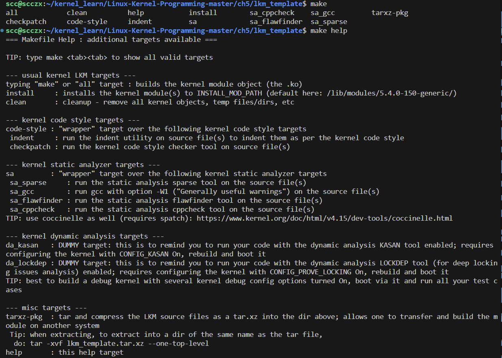

在上图中，我们首先执行 `make`，然后按下两次 `Tab` 键，显示所有可用的目标。例如，运行 `make sa` 会使其对我们的代码运行所有静态分析（sa）目标。

同样重要的是，使用这个 Makefile 需要我们在系统上安装一些包/应用程序；这些包括（对于基础的 Ubuntu 系统）`indent()`、`linux-headers-$(uname -r)`（使用自己配置安装的内核的话就需要自己在内核源码树根目录去生成）、`sparse()`、`flawfinder()`、`cppcheck()` 和 `tar()`。

另外，注意 Makefile 中提到的所谓动态分析（da）目标实际上只是虚拟目标，它们除了打印一条消息外不会做任何其他事情。它们的存在是为了提醒我们通过在适当配置的“调试”内核上运行代码来彻底测试我们的代码。

### **配置“调试”内核**

在调试内核上运行我们的代码可以帮助我们发现那些难以察觉的错误和问题。我们至少将自定义的5.4内核配置为**启用以下内核调试配置选项**（在 `make menuconfig` 界面中，大多数选项可以在 Kernel Hacking 子菜单中找到；以下列表对应于 Linux 5.4.0）：

- `CONFIG_DEBUG_INFO`
- `CONFIG_DEBUG_FS`（debugfs 伪文件系统）
- `CONFIG_MAGIC_SYSRQ`（Magic SysRq 热键功能）
- `CONFIG_DEBUG_KERNEL`
- `CONFIG_DEBUG_MISC`
- Memory debugging：

  - `CONFIG_SLUB_DEBUG`

  - `CONFIG_DEBUG_MEMORY_INIT`

  - `CONFIG_KASAN`（这是内核地址消毒器（Kernel Address Sanitizer）端口）

- `CONFIG_DEBUG_SHIRQ`
- `CONFIG_SCHED_STACK_END_CHECK`
- Lock debugging：

- `CONFIG_PROVE_LOCKING`（非常强大的 lockdep 功能，用于捕获锁定错误！这还会启用其他几个锁调试配置，详见第13章《内核同步 - 第二部分》）
- `CONFIG_LOCK_STAT`
- `CONFIG_DEBUG_ATOMIC_SLEEP`
- `CONFIG_STACKTRACE`
- `CONFIG_DEBUG_BUGVERBOSE`
- `CONFIG_FTRACE`（ftrace：在其子菜单中，至少启用几个“跟踪器”）
- `CONFIG_BUG_ON_DATA_CORRUPTION`
- `CONFIG_KGDB`（内核 GDB；可选）
- `CONFIG_UBSAN`
- `CONFIG_EARLY_PRINTK`
- `CONFIG_DEBUG_BOOT_PARAMS`
- `CONFIG_UNWINDER_FRAME_POINTER`（选择 FRAME_POINTER 和 CONFIG_STACK_VALIDATION）

#### 修改配置的方法：

```bash
make menuconfig
```

进入修改界面之后，选择最后一项 kernel hacking 回车进入：

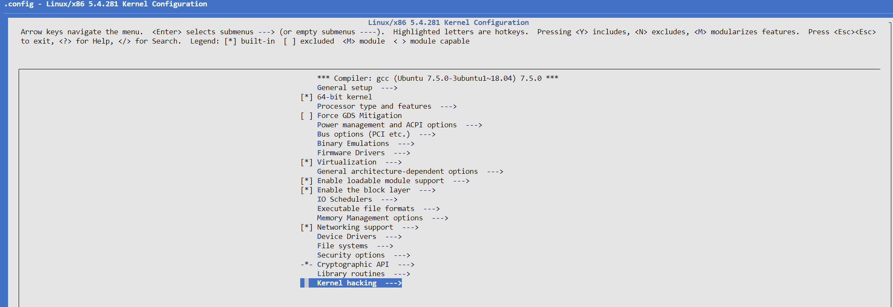

之后最好的方式就是搜索上面列出来的变量，然后找具体位置，再对其进行修改，我们以第一个为例，选中界面的情况下，按下 **“/”** 进入搜索界面：


此处输入我们需要搜索的变量，如 `CONFIG_DEBUG_INFO` ，回车查看具体搜索结果：

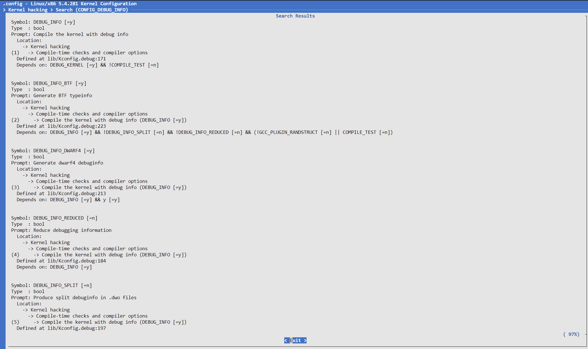

- 第一个方框框选的就是我们搜索的变量（没有带前缀 CONFIG_）；
- 第二个就是我们看到的在菜单中的文本描述；
- 第三个则是该配置所在位置

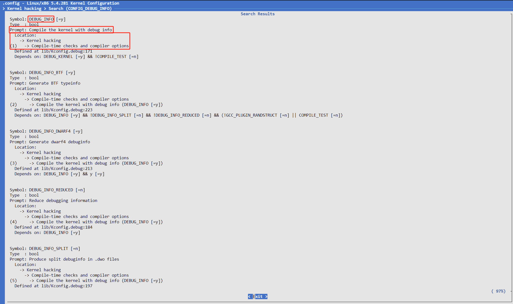

这是实践过程中目前最好用，且不会漏掉配置项的方法。

需要注意的是，启用这些配置选项会导致性能下降，但这是可以接受的。我们运行这种 “调试” 内核的明确目的是捕捉错误和 bug（尤其是那些难以发现的类型）。在我们的项目中，工作流程应包括在以下两个系统上测试和运行代码：

- 调试内核系统：在该系统上，所有必需的内核调试配置选项都已启用（至少如上所示）。
- 生产内核系统：在该系统上，所有或大多数上述内核调试选项将被关闭。

我们将在所有后续的 LKM（Linux Kernel Module）代码中使用上述的 Makefile 风格。

在此之后应该要对我们的内核进行重新的编译，安装，并且去除默认的启动项，以此来启动我们的调试内核（后续部分有的是在 Ubuntu 原本内核下进行的，但是其中的行为操作在我们的调试内核下应该是一致的）。

## **收集最少的系统信息**

为了更好地（虽然仍然相当简单）“检测”一些系统细节（例如 CPU 或操作系统），如示例 `ch5/min_sysinfo/min_sysinfo.c` 内核模块。在下面的代码片段中，我们仅展示了相关的函数：

```c
// ch5/min_sysinfo/min_sysinfo.c
// 这段代码主要是为了可以在多平台进行移植
[ ... ]
void llkd_sysinfo(void)
{
    char msg[128];
    memset(msg, 0, strlen(msg));
    snprintf(msg, 47, "%s(): minimal Platform Info:\nCPU: ", __func__);

    /* 严格来说，所有这些 #if... 代码被认为是不优雅的，应该尽可能被隔离 */
    #ifdef CONFIG_X86
        #if(BITS_PER_LONG == 32)
            strncat(msg, "x86-32, ", 9);
        #else
            strncat(msg, "x86_64, ", 9);
        #endif
    #endif
    #ifdef CONFIG_ARM
        strncat(msg, "ARM-32, ", 9);
    #endif
    #ifdef CONFIG_ARM64
        strncat(msg, "Aarch64, ", 10);
    #endif
    #ifdef CONFIG_MIPS
        strncat(msg, "MIPS, ", 7);
    #endif
    #ifdef CONFIG_PPC
        strncat(msg, "PowerPC, ", 10);
    #endif
    #ifdef CONFIG_S390
        strncat(msg, "IBM S390, ", 11);
    #endif
    #ifdef __BIG_ENDIAN
        strncat(msg, "big-endian; ", 13);
    #else
        strncat(msg, "little-endian; ", 16);
    #endif
    #if(BITS_PER_LONG == 32)
        strncat(msg, "32-bit OS.\n", 12);
    #elif(BITS_PER_LONG == 64)
        strncat(msg, "64-bit OS.\n", 12);
    #endif

    pr_info("%s", msg);
    show_sizeof();
    /* 字长范围：最小 & 最大：定义在 include/linux/limits.h 中 */
    [ ... ]
}
EXPORT_SYMBOL(lkdc_sysinfo);
```

上述内核模块代码具有指导意义，因为它帮助演示了如何编写可移植代码。请记住，内核模块本身是一个二进制的不可移植的对象文件，但它的源代码可以（或许应该，取决于我们的项目）以一种方式编写，使其能够跨各种架构进行移植。然后在目标架构上进行简单的构建，即可将其准备好进行部署。

在的 x86_64 Ubuntu 18.04 LTS 虚拟机上构建并运行它，我们得到了如下输出：

```bash
make

sudo insmod ./min_sysinfo.ko

dmesg
# [  629.984859] min_sysinfo: loading out-of-tree module taints kernel.
# [  629.984890] min_sysinfo: module verification failed: signature and/or required key missing - tainting kernel
# [  629.985432] min_sysinfo: inserted
# [  629.985433] llkd_sysinfo(): minimal Platform Info:
#                CPU: x86_64, little-endian; 64-bit OS.
# [  629.985434] llkd_sysinfo2(): minimal Platform Info:
#                CPU: x86_64, little-endian; 64-bit OS.
# [...]
```

### 更有安全意识

安全性是当今的关键问题。专业开发者应当编写安全的代码。近年来，针对 Linux 内核的许多已知攻击层出不穷。与此同时，许多提升 Linux 内核安全性的努力也在进行中。

在我们之前的内核模块（ch5/min_sysinfo/min_sysinfo.c）中，要小心使用旧式例程（如 `sprintf`、`strlen` 等，它们在内核中仍然存在），静态分析工具可以大大帮助捕获潜在的安全相关问题和其他 bug；第一章《内核工作空间设置》中提到了几个有用的内核静态分析工具。在接下来的代码中，我们使用了一个“更好”的 Makefile 中的 sa 目标之一，运行了一个相对简单的静态分析器：`flawfinder()`：

```bash
ls
# Desktop  Documents  Downloads  examples.desktop  kernel_learn  Music  Pictures  Public  Templates  Videos

cd kernel_learn/Linux-Kernel-Programming-master/ch5/min_sysinfo/

# 按两次 tab
make [tab] [tab]
# all            checkpatch     clean          code-style     help           indent         install        sa             sa_cppcheck    sa_flawfinder  sa_gcc         sa_sparse      tarxz-pkg

make sa_flawfinder
# make clean
# make[1]: Entering directory '/home/scc/kernel_learn/Linux-Kernel-Programming-master/ch5/min_sysinfo'

# --- cleaning ---
# [...]

# --- static analysis with flawfinder ---

# flawfinder *.[ch]
# Flawfinder version 1.31, (C) 2001-2014 David A. Wheeler.
# Number of rules (primarily dangerous function names) in C/C++ ruleset: 169
# Examining min_sysinfo.c

# FINAL RESULTS:

# min_sysinfo.c:54:  [2] (buffer) char:
#   Statically-sized arrays can be improperly restricted, leading to potential
#   overflows or other issues (CWE-119:CWE-120). Perform bounds checking, use
#   functions that limit length, or ensure that the size is larger than the
#   maximum possible length.
# [...]
# min_sysinfo.c:127:  [1] (buffer) strlen:
#   Does not handle strings that are not \0-terminated; if given one it may
#   perform an over-read (it could cause a crash if unprotected) (CWE-126).
# [...]
```

仔细查看 `flawfinder()` 发出的关于 `strlen()` 函数的警告（在它生成的众多警告中之一），我们确实面临这个问题，未初始化的局部变量（例如我们的 `msg` 缓冲区）在声明时包含随机内容。因此，`strlen()` 函数可能会产生我们不期望的结果。

同样地，我们避免使用 `strncat()`，并用 `strlcat()` 函数替代。为了考虑安全性问题，我们将 `llkd_sysinfo()` 函数的代码重写为 `llkd_sysinfo2()`。

我们还添加了一些代码行，显示平台上无符号和有符号变量的范围（最小值、最大值，以十进制和十六进制表示）。

以下是这段文字的翻译：

## 内核模块的许可

众所周知，Linux 内核代码库本身是根据 GNU GPL v2 许可协议（又称 GPL-2.0，GPL 代表通用公共许可证）发布的，并且对大多数人来说，它将继续以这种方式存在。给我们的内核代码指定许可是必须且重要的。本质上，对于我们的目的来说，讨论的要点是：如果我们打算直接使用内核代码和/或将我们的代码贡献到上游的主线内核（下面会有一些相关说明），我们必须在与 Linux 内核相同的许可协议下发布代码：即 GNU GPL-2.0。对于内核模块，这种情况仍然有点 “灵活”，可以这么说。不过，为了能够与内核社区互动并获得他们的帮助（这是一个巨大的优势），我们应该在 GNU GPL-2.0 许可下发布代码（尽管双重许可当然是可能且可接受的）。

许可是通过 `MODULE_LICENSE()` 宏来指定的。以下从 `include/linux/module.h` 内核头文件中复制的注释清楚地显示了哪些许可 “标识” 是可以接受的（注意双重许可的情况）。显然，内核社区强烈建议我们在 GPL-2.0（GPL v2）和/或其他许可协议（如 BSD/MIT/MPL）下发布我们的内核模块。如果我们打算将代码贡献给内核主线，那么显而易见，我们只能在 GPL-2.0 下发布：

```c
// include/linux/module.h
[...]
/*
* 目前接受以下许可标识，表明是自由软件模块
*
* "GPL" [GNU 公共许可证 v2 或更高版本]
* "GPL v2" [GNU 公共许可证 v2]
* "GPL and additional rights" [GNU 公共许可证 v2 权利和更多]
* "Dual BSD/GPL" [GNU 公共许可证 v2 或 BSD 许可证任选]
* "Dual MIT/GPL" [GNU 公共许可证 v2 或 MIT 许可证任选]
* "Dual MPL/GPL" [GNU 公共许可证 v2 或 Mozilla 许可证任选]
*
* 以下其他标识也可用
*
* "Proprietary" [非自由产品]
*
* 有双重许可的组件，但在运行 Linux 时，相关的是 GPL，因此这不是问题。同样地，LGPL 与 GPL 链接时是一个 GPL 组合作品。
*
* 这存在几个原因
* 1. 使 modinfo 能为希望验证其设置为自由软件的用户显示许可信息
* 2. 使社区能够忽略包括专有模块的 bug 报告
* 3. 使供应商可以根据其自己的政策做同样的事
*/
#define MODULE_LICENSE(_license) MODULE_INFO(license, _license)
[...]
```

供参考，内核源码树中有一个 `LICENSES/` 目录，其中包含关于许可的详细信息；在该文件夹中快速执行 `ls` 命令会显示其中的子文件夹：

```bash
cd ~/kernel_learn/kernel_source/linux-5.4.281/

ls LICENSES/
# deprecated  dual  exceptions  preferred
```

保持一致性，最近的内核引入了一条规则：每个源文件的第一行必须是一个 SPDX 许可标识符（详见 https://spdx.org/）。当然，对于脚本来说，第一行需要指定解释器。此外，一些关于 GPL 许可的常见问题的解答可以在 https://www.gnu.org/licenses/gpl-faq.html 找到。

## 在内核模块中模拟“类似库”的功能

用户模式编程和内核模式编程之间的一个主要区别是，后者完全没有我们熟悉的“库”概念。库本质上是 API 的集合或归档，方便开发者实现重要目标，通常包括：不重复造轮子、软件复用、模块化等。但在 Linux 内核中，库是不存在的。

不过，好消息是，广义上讲，有两种方法可以在内核空间为我们的内核模块实现“类似库”的功能：

1. 第一种方法：将多个源文件（包括“库”代码）显式地“链接”到我们的内核模块对象中。
2. 第二种方法称为模块堆叠（module stacking）。

以下是这段文字的翻译：

### 通过多个源文件进行库仿真

到目前为止，我们处理的都是非常简单的内核模块，这些模块只有一个 C 源文件。那么，如果一个内核模块包含多个 C 源文件（这在现实中是非常典型的情况）怎么办？所有的源文件都需要被编译，然后链接在一起，生成一个单一的 `.ko` 二进制对象。

例如，假设我们在构建一个名为 `projx` 的内核模块项目。它包含三个 C 源文件：`prj1.c`、`prj2.c` 和 `prj3.c`。我们希望最终生成的内核模块名为 `projx.ko`。在 `Makefile` 中，我们可以通过以下方式指定这些关系：

```makefile
obj-m := projx.o
projx-objs := prj1.o prj2.o prj3.o
```

在上面的代码中，请注意 `projx` 标签在 `obj-m` 指令后使用，并且作为下一行 `-objs` 指令的前缀。当然，我们可以使用任何标签。在我们的示例中，内核构建系统将编译这三个独立的 C 源文件为独立的对象（`.o`）文件，然后将它们全部链接在一起，形成最终的二进制内核模块对象文件 `projx.ko`。

我们可以利用这种机制，在本书的源代码树中构建一个包含例程的小型“库”（这个“内核库”的源文件在源代码树的根目录下，这里是 `klib_llkd.h` 和 `klib_llkd.c`）。这个想法是，其他内核模块可以通过链接这些函数来使用它们！例如，在接下来的 Chapter 8 中，我们的 `ch8/lowlevel_mem/lowlevel_mem.c` 内核模块代码将调用我们的库代码 `../../klib_llkd.c` 中的一个函数。“链接到”这个所谓的“库”代码是通过将以下内容添加到 `lowlevel_mem` 内核模块的 `Makefile` 中实现的：

```makefile
# ~/kernel_learn/Linux-Kernel-Programming-master/ch8/lowlevel_mem/Makefile
obj-m += lowlevel_mem_lib.o
lowlevel_mem_lib-objs := lowlevel_mem.o ../../klib_llkd.o
```

第二行指定了要编译的源文件（生成对象文件）；它们包括 `lowlevel_mem.c` 内核模块的代码和 `../../klib_llkd` 库代码。然后，它将这两个文件链接成一个二进制内核模块 `lowlevel_mem_lib.ko`，从而实现我们的目标。

### 理解内核模块中的函数和变量作用域

在进一步深入探讨之前，快速回顾一些基础知识是个好主意。编写 C 语言程序时，我们应该了解以下内容：

- 在函数内部声明的变量显然是局部变量，其作用域仅限于该函数内部。
- 使用 `static` 修饰符前缀的变量和函数，其作用域仅限于当前“单元”；实际上是指它们被声明的文件内。这有助于减少命名空间污染。`static` 变量（以及全局变量）在函数内保持其值。

在 2.6 之前的 Linux（即 <= 2.4.x）中，内核模块的静态和全局变量以及所有函数默认在整个内核中都是可见的。从 2.5 开始（因此在 2.6 及以后的现代 Linux 中），所有内核模块的变量（静态和全局数据）和函数默认作用域仅限于它们所属的内核模块，因此在模块外部是不可见的。因此，如果两个内核模块 lkmA 和 lkmB 都有一个名为 `maya` 的全局变量，那么它在每个模块中都是唯一的，不会发生冲突。

要改变这种作用域，**LKM 框架提供了 `EXPORT_SYMBOL()` 宏。使用该宏，我们可以将某个数据项或函数声明为全局作用域**：对所有其他内核模块以及内核核心都是可见的。

让我们来看一个简单的例子。假设我们有一个名为 `prj_core` 的内核模块，其中包含一个全局变量和一个函数：

```c
static int my_glob = 5;
static long my_foo(int key)
{ [...]
}
```

虽然这两个变量和函数在该内核模块内是可用的，但在模块外部是不可见的。这是有意为之的。要使它们在该内核模块外部可见，我们可以将它们导出：

```c
int my_glob = 5;
EXPORT_SYMBOL(my_glob);
long my_foo(int key)
{ [...]
}
EXPORT_SYMBOL(my_foo);
```

现在，这两个元素在该内核模块外部也有作用域了（注意，在前面的代码块中，`static` 关键字已被故意移除）。其他内核模块（以及内核核心）现在可以“看到”并使用它们。实际上，这一想法主要在以下两个方面得到了应用：

1. **内核导出其核心功能的一部分全局变量和函数**：这些全局变量和函数现在对于内核模块是可见且可用的。

2. **内核模块作者（通常是设备驱动程序）使用这一机制导出某些数据和/或功能**：这样其他内核模块，可能是更高抽象级别的模块，能够利用这个设计并使用这些数据和/或功能——这种概念被称为模块堆叠（module stacking）。

以第一个用例为例，设备驱动程序作者可能希望处理来自外围设备的硬件中断。一种常见的方式是通过 `request_irq()` API 来实现，这实际上只是这个 API 的一个简单（内联）包装器：

```c
// kernel/irq/manage.c
int request_threaded_irq(unsigned int irq, irq_handler_t handler,
irq_handler_t thread_fn, unsigned long irqflags,
const char *devname, void *dev_id)
{
struct irqaction *action;
[...]
return retval;
}
EXPORT_SYMBOL(request_threaded_irq);
```

正因为 `request_threaded_irq()` 函数被导出了，它才能在设备驱动程序中被调用，而设备驱动程序通常是作为内核模块编写的。同样，开发人员经常需要一些“便利”例程：例如，字符串处理函数。Linux 内核在 `lib/string.c` 中提供了几种常见的字符串处理函数的实现（这些函数通常是预期存在的）：如 `str[n]casecmp`、`str[n|l|s]cpy`、`str[n|l]cat`、`str[n]cmp`、`strchr[nul]`、`str[n|r]chr`、`str[n]len` 等。当然，这些都通过 `EXPORT_SYMBOL()` 宏进行了导出，以便让模块作者可以看到并使用它们。

另一方面，让我们看一下内核核心深处的 CFS（完全公平调度器）调度代码的一小部分。这里，`pick_next_task_fair()` 函数是调度代码在需要寻找另一个任务以进行上下文切换时调用的函数：

```c
// kernel/sched/fair.c
static struct task_struct *
pick_next_task_fair(struct rq *rq, struct task_struct *prev, struct rq_flags *rf)
{
struct cfs_rq *cfs_rq = &rq->cfs;
[...]
if (new_tasks > 0)
goto again;
return NULL;
}
```

由于上述函数没有使用 `EXPORT_SYMBOL()` 宏标记，因此它无法被内核模块调用。它的作用域仅限于内核核心。

我们也可以使用相同的宏将数据结构标记为导出。此外，显然只有全局作用域的数据（而不是局部变量）可以标记为导出。

回顾一下我们简要讨论的内核模块许可问题。Linux 内核有一个有趣的提议：还有一个名为 `EXPORT_SYMBOL_GPL()` 的宏。它与 `EXPORT_SYMBOL()` 宏类似，但不同之处在于，导出的数据项或函数仅对那些在其 `MODULE_LICENSE()` 宏中包含 `GPL` 字样的内核模块可见！这个宏确实在内核代码库中的多个地方被使用。

现在，让我们来看另一种实现类库式内核功能的关键方法：模块堆叠。

### 理解模块堆叠

第二个重要的概念：模块堆叠。

模块堆叠是一种为内核模块作者提供“类库”功能的概念。在这种架构下，我们通常会将项目或产品设计为包含一个或多个“核心”内核模块，这些模块的职责是充当某种库。它们将包括数据结构和功能（函数/API），并将这些内容导出给其他内核模块使用（前面一节讨论了符号的导出）。

为了更好地理解这一点，让我们来看几个实际的例子。首先，在 Ubuntu 18.04.6 LTS 原生 Linux 系统，执行一个 `lsmod` 命令并过滤字符串 `vm` 后，可以看到以下输出：

```bash
lsmod | grep vbox
```

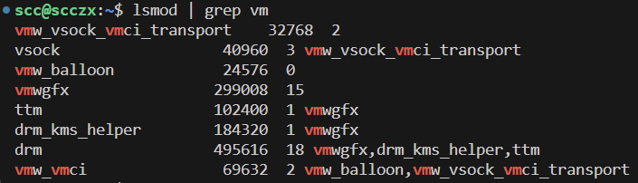

第三列是使用计数。

如果有任何内核模块显示在第三列之后，那么它们代表依赖关系；可以这样理解：**右侧显示的内核模块依赖于左侧的内核模块**。

因此，在前面的示例中，`vmw_balloon`，`vmw_vsock_vmci_transport` 内核模块依赖于 `vmw_vmci` 内核模块。它们在什么方面依赖呢？显然，它们使用了 `vmw_vmci` 核心内核模块中的数据结构和/或函数（API）。一般来说，**显示在第三列右侧的内核模块意味着它们使用了左侧内核模块中的一个或多个数据结构和/或函数**（这会导致使用计数的增加；这种使用计数是引用计数的一个很好的例子，这里实际上是一个 32 位的原子变量）。实际上，`vmw_vmci` 内核模块类似于一个“库”（在有限的意义上，它并不具备用户态库的通常含义，除了它提供模块化功能）。

还要注意，`vmwgfx` 内核模块的使用计数为 `15`，但在其右侧没有显示任何内核模块；这仍然意味着当前有某些东西在使用它，通常是某个进程或线程。

正如承诺的那样，另一个模块堆叠的例子：运行强大的 LTTng（Linux Tracing Toolkit 下一代）框架可以让我们执行详细的系统分析。LTTng 项目会安装并使用相当数量的内核模块（通常超过 40 个）。其中有几个内核模块是“堆叠”的，这使得该项目能够准确地利用我们在这里讨论的“类库”功能。

我们可以看到有关其内核模块的输出截图：

```bash
lsmod | grep --color=auto "^lttng"
```

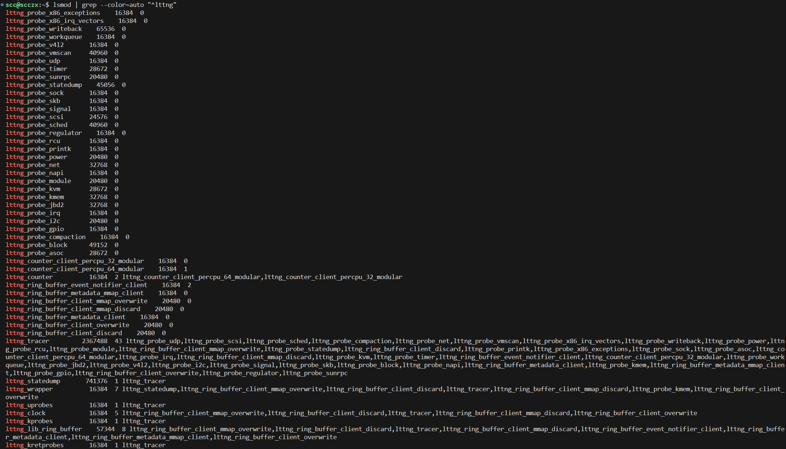

正如所见，`lttng_tracer` 内核模块在其右侧有 43 个内核模块，这表明它们“堆叠”在它之上，使用它提供的功能（类似地，`lttng_lib_ring_buffer` 内核模块有 8 个内核模块“依赖”于它）。

LTTng安装参照官方文档：https://lttng.org/docs/v2.13/#doc-ubuntu-ppa，我这里在安装 lttng-tools 时会提示：

```bash
lttng-tools : PreDepends: init-system-helpers (>= 1.54~) but 1.51 is to be installed
```

根据提示安装版本更高的包即可：

```bash
sudo apt-cache policy init-system-helpers

sudo apt-get install init-system-helpers=1.56+nmu1~ubuntu18.04.1 
```

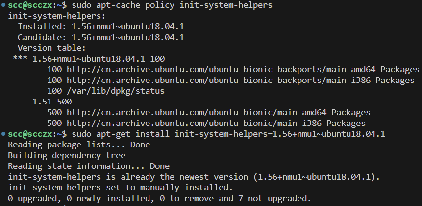

继续安装即可 LTTng即可。

这里有一个简单的小脚本，可以查看所有使用计数非零的内核模块（它们通常有一些依赖的内核模块显示在它们的右侧）：

```bash
lsmod | awk '$3 > 0 {print $0}'
```

模块堆叠的一个影响是：我们只能在内核模块的使用计数为 0 时成功卸载它（通过 `rmmod` 命令）；也就是说，它没有在使用。因此，对于前面提到的第一个示例，我们只能在移除依赖于 `vmw_vmci` 的两个内核模块后，才能移除 `vmw_vmci` 内核模块（从而使使用计数降为 0）。

#### 尝试模块堆叠

让我们设计一个非常简单的概念验证代码来演示模块堆叠。我们将构建两个内核模块：

1. **第一个模块**称为 `core_lkm`，它的工作是充当一种“库”，为内核和其他模块提供一些函数（API）。
2. **第二个内核模块**称为 `user_lkm`，它是“库”的使用者（或消费者）；它将简单地调用位于第一个模块中的函数，并使用一些数据。

为了实现这一点，这对内核模块需要执行以下操作：

- **核心内核模块**必须使用 `EXPORT_SYMBOL()` 宏来标记一些数据和函数以导出它们。
- **用户内核模块**必须使用 C 语言中的 `extern` 关键字声明它希望使用的外部数据和/或函数（请记住，导出数据或功能只是设置了适当的链接；编译器仍然需要知道正在调用的数据和/或函数）。

在最近的工具链中，允许将导出的函数和数据项标记为 `static`，不过会产生警告；因此我们不对导出的符号使用 `static` 关键字。

编辑自定义 Makefile 以构建这两个内核模块。

代码如下；首先是核心或库内核模块。我们把一个先前模块的函数（`ch5/min_sysinfo/min_sysinfo.c : llkd_sysinfo2()`）的代码复制到这个内核模块中，并导出它，从而使我们的第二个“用户”LKM 可以调用该函数：

```c
// ch5/modstacking/core_lkm.c
#define pr_fmt(fmt) "%s:%s(): " fmt, KBUILD_MODNAME, __func__
#include <linux/init.h>
#include <linux/module.h>
#define MODNAME "core_lkm"
#define THE_ONE 0xfedface

MODULE_LICENSE("Dual MIT/GPL");
int exp_int = 200;
EXPORT_SYMBOL_GPL(exp_int);

/* Functions to be called from other LKMs */
void llkd_sysinfo2(void)
{
    [...]
}
EXPORT_SYMBOL(llkd_sysinfo2);

#if(BITS_PER_LONG == 32)
u32 get_skey(int p)
#else // 64-bit
u64 get_skey(int p)
#endif
{
    #if(BITS_PER_LONG == 32)
    u32 secret = 0x567def;
    #else // 64-bit
    u64 secret = 0x123abc567def;
    #endif
    if (p == THE_ONE)
        return secret;
    return 0;
}
EXPORT_SYMBOL(get_skey);
[...]
```

接下来是 `user_lkm` 内核模块，它“堆叠”在 `core_lkm` 内核模块之上：

```c
// ch5/modstacking/user_lkm.c
#define pr_fmt(fmt) "%s:%s(): " fmt, KBUILD_MODNAME, __func__
#define MODNAME "user_lkm"
#if 1
MODULE_LICENSE("Dual MIT/GPL");
#else
MODULE_LICENSE("MIT");
#endif

extern void llkd_sysinfo2(void);
extern long get_skey(int);
extern int exp_int;

/* 调用“核心”模块中的一些函数 */
static int __init user_lkm_init(void)
{
    #define THE_ONE 0xfedface
    pr_info("%s: inserted\n", MODNAME);
    u64 sk = get_skey(THE_ONE);
    pr_debug("%s: Called get_skey(), ret = 0x%llx = %llu\n", MODNAME, sk, sk);
    pr_debug("%s: exp_int = %d\n", MODNAME, exp_int);
    llkd_sysinfo2();
    return 0;
}

static void __exit user_lkm_exit(void)
{
    pr_info("%s: bids you adieu\n", MODNAME);
}

module_init(user_lkm_init);
module_exit(user_lkm_exit);
```

Makefile 与我们之前的内核模块基本相同，唯一的不同是这次需要构建两个内核模块对象：

```makefile
obj-m := core_lkm.o
obj-m += user_lkm.o
```

1. ##### 构建内核模块：

首先，构建内核模块：

```bash
cd ~/kernel_learn/Linux-Kernel-Programming-master/ch5/modstacking/

make
```

2. ##### 测试模块堆叠：

首先，我们将错误地进行测试：在插入 `core_lkm` 模块之前，尝试插入 `user_lkm` 内核模块。由于 `user_lkm` 模块依赖的导出功能（和数据）尚未在内核中可用，因此此操作将失败：

```bash
# 清除内核环形缓冲区中的消息日志
sudo dmesg -C

sudo insmod user_lkm.ko
# insmod: ERROR: could not insert module ./user_lkm.ko: Unknown symbol in module

dmesg
# [20256.011423] user_lkm: Unknown symbol exp_int (err -2)
# [20256.011431] user_lkm: Unknown symbol get_skey (err -2)
```

3. ##### 正确操作：

现在，我们按正确顺序插入模块：

```bash
# 若 core_lkm.ko 无法插入，很有可能是 min_sysinfo 模块 没有卸载，占用了 llkd_sysinfo2 符号
sudo insmod core_lkm.ko
sudo insmod user_lkm.ko
dmesg
```

4. ##### 检查模块列表：

使用 `lsmod` 检查模块是否正确加载，并查看依赖关系：

```bash
lsmod | egrep "core_lkm|user_lkm"
```

5. ##### 删除内核模块：

在删除内核模块时也有顺序要求。如果首先尝试删除 `core_lkm`，会失败，因为 `user_lkm` 仍然依赖它：

```bash
sudo rmmod core_lkm
# rmmod: ERROR: Module core_lkm is in use by: user_lkm
```

正确的删除顺序为：

```bash
sudo rmmod user_lkm core_lkm
dmesg
```

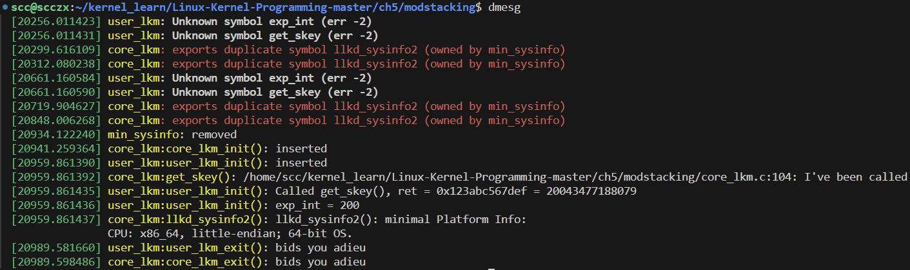

通过这种模块堆叠设计，我们可以在内核模块空间内模拟类库功能，并开发更复杂的内核项目。

## 向内核模块传递参数

常见的调试技巧之一是为代码添加调试信息，也就是在适当的位置插入打印语句，以便我们可以跟踪代码的执行路径。在内核模块中，我们通常会使用功能强大的 `printk` 函数来实现这一目的。假设我们编写了如下伪代码：

```c
#define pr_fmt(fmt) "%s:%s():%d: " fmt, KBUILD_MODNAME, __func__, __LINE__

[ ... ]

func_x() {
    pr_debug("At 1\n");
    [...]
    while (<cond>) {
        pr_debug("At 2: j=0x%x\n", j);
        [...]
    }
    [...]
}
```

很好，但是我们并不希望这些调试信息出现在生产（或发布）版本中。这正是我们使用 `pr_debug()` 的原因：它仅在定义了 `DEBUG` 符号时才会输出 `printk` 信息！确实如此，但如果我们的客户是工程客户，并且希望能够动态地打开或关闭这些调试信息呢？

对此，有几种方法可以实现；其中一种方法如下（伪代码）：

```c
static int debug_level;
/* 默认为零 */
func_x() {
    if (debug_level >= 1)
        pr_debug("At 1\n");
    [...]
    while (<cond>) {
        if (debug_level >= 2)
            pr_debug("At 2: j=0x%x\n", j);
        [...]
    }
    [...]
}
```

这样做不错。实际上，我们想要实现的效果是：如果我们可以将 `debug_level` 这个模块变量作为我们的内核模块的一个参数，那么就能让用户根据需要控制哪些调试消息会显示或不显示。这是一件非常有用的事情，因为它让内核模块的用户能够灵活控制调试信息的输出。

### 声明和使用模块参数

内核模块参数作为 `name=value` 对的形式在模块插入（`insmod`）时传递。例如，假设我们有一个名为 `mp_debug_level` 的模块参数，那么我们可以在执行 `insmod` 命令时传递它的值，如下所示：

```bash
sudo insmod modparams1.ko mp_debug_level=2
```

这样非常有用，用户可以自行决定调试信息的详细程度。我们甚至可以很容易地设置默认值为 0。

我们也会考虑这样的问题：内核模块没有 `main()` 函数，因此也没有传统的 `(argc, argv)` 参数列表，那究竟如何传递参数呢？实际上，这涉及到一些链接器的技巧；只需这样做：**将我们想要作为模块参数的变量声明为全局（`static`）变量，然后使用 `module_param()` 宏指定它为模块参数**。

通过我们的第一个模块参数的演示内核模块，这一点很容易理解：

```c
// ch5/modparams/modparams1/modparams1.c
[ ... ]
/* Module parameters */
static int mp_debug_level;
module_param(mp_debug_level, int, 0660);
MODULE_PARM_DESC(mp_debug_level,
"Debug level [0-2]; 0 => no debug messages, 2 => high verbosity");
static char *mp_strparam = "My string param";
module_param(mp_strparam, charp, 0660);
MODULE_PARM_DESC(mp_strparam, "A demo string parameter");
```

在上面的代码块中，我们通过 `module_param()` 宏将两个变量声明为模块参数。`module_param()` 宏接受三个参数：

1. 第一个参数：变量名（我们希望将其作为模块参数处理）。应使用 `static` 限定符声明该变量。
2. 第二个参数：数据类型。
3. 第三个参数：权限（实际上是通过 `sysfs` 的可见性；以下将对此进行解释）。

`MODULE_PARM_DESC()` 宏允许我们“描述”参数的含义。这样可以告知内核模块（或驱动程序）的最终用户有哪些参数是可用的。可以通过 `modinfo` 实用程序进行查找。此外，可以使用 `-p` 选项开关专门打印模块的参数信息，如下所示：

```bash
cd ~/kernel_learn/Linux-Kernel-Programming-master/ch5/modparams/modparams1/

make

modinfo -p ./modparams1.ko
# mp_debug_level:Debug level [0-2]; 0 => no debug messages, 2 => high verbosity (int)
# mp_strparam:A demo string parameter (charp)
```

`modinfo` 输出显示了可用的模块参数（如果有的话）。在这里，我们可以看到 `modparams1.ko` 内核模块有两个参数，分别显示了它们的名称、描述和数据类型（括号内显示的 `charp` 是字符指针，即字符串）。现在，让我们运行一下这个演示内核模块：

```bash
sudo dmesg -C

sudo insmod modparams1.ko

dmesg
```

输出结果：

```bash
[22164.124815] modparams1: inserted
[22164.124816] module parameters passed: mp_debug_level=0 mp_strparam=My string param
```

从 `dmesg` 输出可以看出，由于我们没有显式传递任何内核模块参数，模块变量显然保留了它们的默认值（原始值）。现在重新执行一遍，这次显式传递模块参数的值：

```bash
sudo rmmod modparams1

sudo insmod modparams1.ko mp_debug_level=2 mp_strparam=\"Hello modparams1\"

dmesg
```

输出结果：

```bash
[...]
[22206.028276] modparams1: removed
[22211.723831] modparams1: inserted
[22211.723832] module parameters passed: mp_debug_level=2 mp_strparam=Hello modparams1
```

### 获取/设置插入后的模块参数

让我们仔细看看在之前的 `modparams1.c` 源文件中使用 `module_param()` 宏的用法：

```c
module_param(mp_debug_level, int, 0660);
```

请注意第三个参数，即权限（或模式）：它是 0660（当然，这是一个八进制数，表示所有者和组对该参数有读写权限，而其他用户没有访问权限）。

如果权限参数被指定为非零值，那么在 `sysfs` 文件系统下会创建伪文件，表示内核模块参数，路径为 `/sys/module/<module-name>/parameters/`。（sysfs 通常安装在 /sys 下。此外，默认情况下，所有伪文件的所有者和组都是 root。）

1. **查看模块参数文件**：

   - 对于 `modparams1` 内核模块（假设它已加载到内核内存中），我们可以查看这些参数文件：

     ```bash
     ls /sys/module/modparams1/
     # coresize  holders  initsize  initstate  notes  parameters  refcnt  sections  srcversion  taint  uevent  version
     
     ls -l /sys/module/modparams1/parameters/
     # total 0
     # -rw-rw---- 1 root root 4096 8月  23 16:36 mp_debug_level
     # -rw-rw---- 1 root root 4096 8月  23 16:36 mp_strparam
     ```

   - 这些参数文件确实存在，且这些“参数”现在可以随时读写（在具有 root 权限的情况下）。

2. **读取参数值**：

   - 试试以下命令：

     ```bash
     cat /sys/module/modparams1/parameters/mp_debug_level
     # cat: /sys/module/modparams1/parameters/mp_debug_level: Permission denied
     
     sudo cat /sys/module/modparams1/parameters/mp_debug_level
     # [sudo] password for scc: 
     # 2
     ```

   - 我们的 `mp_debug_level` 内核模块参数的当前值确实是 2。

3. **动态修改参数值**：

   - 让我们将其动态更改为 0，这意味着 `modparams1` 内核模块将不再输出“调试”信息：

     ```bash
     sudo bash -c "echo 0 > /sys/module/modparams1/parameters/mp_debug_level"
     
     sudo cat /sys/module/modparams1/parameters/mp_debug_level
     #0
     ```

   - 我们也可以以类似的方式获取和/或设置 `mp_strparam` 参数。我们可以编写简单的脚本，通过内核模块参数控制设备（或其他东西）的行为，获取（或停止）调试信息，等等。

实际上，以八进制数字（如 0660）作为 `module_param()` 的第三个参数在某些圈子里并不被认为是最佳编程实践。我们可以通过适当的宏（定义在 `include/uapi/linux/stat.h` 中）来指定 `sysfs` 伪文件的权限，例如：

```c
module_param(mp_debug_level, int, S_IRUSR|S_IWUSR|S_IRGRP|S_IWGRP);
```

不过，需要注意的是，我们的 Makefile 的 `checkpatch` 目标（它调用了内核的 `scripts/checkpatch.pl` “编码风格”Perl 脚本检查器）会提醒我们，直接使用八进制权限会更好：

```bash
$ make checkpatch
[ ... ]
checkpatch.pl: /lib/modules/<ver>/build//scripts/checkpatch.pl --no-tree -f *.[ch]
[ ... ]
WARNING: Symbolic permissions 'S_IRUSR|S_IWUSR|S_IRGRP|S_IWGRP' are not preferred. Consider using octal permissions '0660'.
#29: FILE: modparams1.c:29:
+module_param(mp_debug_level, int, S_IRUSR|S_IWUSR|S_IRGRP|S_IWGRP);
```

所以，我们将继续使用常用的 0660 八进制表示法。

### 模块参数的数据类型和验证

在我们之前的简单内核模块中，我们设置了两个参数，一个是整数类型，另一个是字符串类型（`charp`）。那么，除了这些，还有哪些数据类型可以使用呢？实际上，有好几种类型可以选择。在 `moduleparam.h` 头文件中包含了所有可用的数据类型：

```c
// include/linux/moduleparam.h
[...]
* 标准类型有：
* byte, short, ushort, int, uint, long, ulong
* charp: 字符指针
* bool: 布尔值，取值为 0/1, y/n, Y/N。
* invbool: 与上面的布尔值相同，只是意义相反（N = true）。
```

如果有需要，我们可以定义自己的数据类型。

#### 验证内核模块参数

所有的内核模块参数默认情况下都是可选的；用户可以选择是否显式传递它们。但如果我们的项目需要用户必须为某个特定的内核模块参数显式传递一个值呢？我们将在这里讨论这个问题：让我们增强之前的内核模块，创建另一个模块（`ch5/modparams/modparams2`），关键区别在于我们设置了一个名为 `control_freak` 的额外参数。现在，我们要求用户在模块插入时必须传递该参数：

1. **在代码中设置新模块参数**：

   ```c
   static int control_freak;
   module_param(control_freak, int, 0660);
   MODULE_PARM_DESC(control_freak, "Set to the project's control level [1-5]. MANDATORY");
   ```

2. **如何实现这种“必须传递”的要求？** 

   - 其实，这是一个小技巧：在插入时检查该值是否为默认值（在此例中为 0）。如果是，则通过适当的消息中止操作（我们还进行了简单的有效性检查，确保传递的整数在指定范围内）。以下是 `ch5/modparams/modparams2/modparams2.c` 中的初始化代码：

   ```c
   static int __init modparams2_init(void)
   {
       pr_info("%s: inserted\n", OUR_MODNAME);
       if (mp_debug_level > 0)
           pr_info("module parameters passed: "
                   "mp_debug_level=%d mp_strparam=%s\ncontrol_freak=%d\n",
                   mp_debug_level, mp_strparam, control_freak);
       
       // 参数 'control_freak'：如果它没有被传递（隐含猜测），或者是相同的旧值，或者不在正确范围内，那就是不可接受的！:-)
   
       if ((control_freak < 1) || (control_freak > 5)) {
           pr_warn("%s: Must pass along module parameter"
                   " 'control_freak', value in the range [1-5]; aborting...\n",
                   OUR_MODNAME);
           return -EINVAL;
       }
       return 0; /* 成功 */
   }
   ```

3. **打印调试信息的示例**：

   - 注意我们如何发出 `printk`，仅在 `mp_debug_level` 为正值时显示模块参数的值。

4. **内核框架提供的更严格的方法**：

   - 内核框架提供了一种更严格的方法，通过 `module_parm_cb()` 宏（cb 代表回调）“获取/设置”内核（模块）参数并对其进行有效性检查。

#### 覆盖模块参数的名称

为了说明这个功能，我们来看一个内核源码树的例子：直接映射缓冲 I/O 库驱动程序 `drivers/md/dm-bufio.c` 中，需要将 `dm_bufio_current_allocated` 变量作为一个模块参数。然而，这个名字实际上是一个内部变量的名称，对使用该驱动程序的用户来说并不是特别直观。该驱动程序的作者更倾向于使用另一个名称：`current_allocated_bytes` 作为别名或名称覆盖。这正是可以通过 `module_param_named()` 宏实现的功能，覆盖并完全等同于内部变量名称，如下所示：

```c
// drivers/md/dm-bufio.c line=2032
[...]
module_param_named(current_allocated_bytes, dm_bufio_current_allocated, ulong, S_IRUGO);
MODULE_PARM_DESC(current_allocated_bytes, "Memory currently used by the cache");
```

因此，当用户在该驱动程序上执行 `insmod`  时，他们可以进行如下操作：

```bash
sudo insmod <path/to/>dm-bufio.ko current_allocated_bytes=4096 ...
```

在内部，实际的变量 `dm_bufio_current_allocated` 将被赋值为 4096。

#### 与硬件相关的内核参数

出于安全原因，**指定硬件特定值的模块或内核参数使用了一个单独的宏 `module_param_hw[_named|array]()`**。

David Howells 于 2016 年 12 月 1 日提交了一系列补丁，为这些新的硬件参数添加了内核支持。补丁邮件中提到：

> "为指定硬件参数（如 IO 端口、IO 内存地址、中断请求线 (IRQ)、DMA 通道、固定 DMA 缓冲区及其他类型）提供了注解。这将使这些参数能够在核心参数解析器中进行锁定，以支持安全启动。[...]"

## 内核中不允许使用浮点运算

我们来看一个例子，我们试图将以毫摄氏度为单位的温度值转换为常规的摄氏度值，于是做了如下操作：

```c
double temp;
[... 处理 ...]
temp = temp / 1000.0;
printk(KERN_INFO "temperature is %.3f degrees C\n", temp);
```

《Linux Device Drivers》一书中指出了这种写法的错误:**内核空间中不允许使用浮点运算（FP）**，这是一个有意的设计决策：在内核中保存处理器的浮点状态、打开浮点单元、进行浮点运算，然后关闭和恢复浮点状态，这一切都被认为是不值得做的。因此，内核（或驱动程序）开发人员被强烈建议不要在内核空间尝试进行浮点运算。

那么，如何进行温度转换呢？很简单：将以毫摄氏度为单位的整数值传递给用户空间，然后在用户空间执行浮点运算！

话虽如此，显然有一种方法可以强制内核执行浮点运算：将我们的浮点代码放在 `kernel_fpu_begin()` 和 `kernel_fpu_end()` 宏之间。在内核代码库中确实有一些地方使用了这种技术（通常是涉及加密/AES、CRC 等的代码路径）。尽管如此，建议一般的模块（或驱动程序）开发人员在内核中仅进行整数运算。

然而，为了测试整个情况，我们可以编写一个简单的内核模块，尝试进行一些浮点运算。代码的关键部分如下所示：

```c
// ch5/fp_in_lkm/fp_in_lkm.c
static double num = 22.0, den = 7.0, mypi;
static int __init fp_in_lkm_init(void)
{
    [...]
    kernel_fpu_begin();
    mypi = num / den;
    kernel_fpu_end();
#if 1
    pr_info("%s: PI = %.4f = %.4f\n", OURMODNAME, mypi, num / den);
#endif
    return 0;
    /* 成功 */
}
```

实际上，直到我们尝试通过 `printk()` 显示浮点值时，这段代码才真正出了问题，见下图所示的截图：

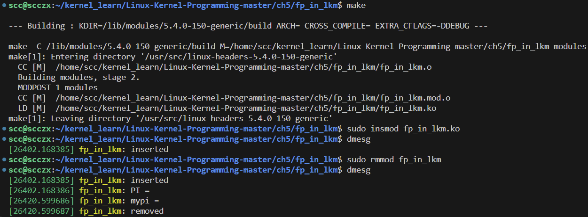

在 `Linux-5.4.0-150-generic` 下并没有出现作者内核版本出现的这一行：“Please remove unsupported %f in format string”。`printk` 函数并不支持直接格式化输出浮点数，尽管我们在代码中使用了 `kernel_fpu_begin()` 和 `kernel_fpu_end()` 宏来启用浮点运算，但在内核的 `printk` 中仍然不能直接输出浮点数。

系统实际上并没有崩溃或恐慌，因为这只是通过 `WARN_ONCE()` 宏输出到内核日志中的一个警告。然而，要意识到，在生产系统中，`/proc/sys/kernel/panic_on_warn` 伪文件可能被设置为 1，导致内核（非常合理地）发生恐慌。

这个道理很清楚：避免在内核空间中使用浮点运算。

## 系统启动时自动加载模块

到目前为止，我们编写的都是简单的“外部”内核模块，它们位于各自的私有目录中，并且通常需要通过 `insmod()` 或 `modprobe()` 手动加载。在大多数实际项目和产品中，我们需要我们的外部内核模块在启动时自动加载。

假设我们有一个名为 `foo.ko` 的内核模块，并且我们有源代码和 Makefile。要在系统启动时自动加载它，首先需要将内核模块安装到系统中的已知位置。为此，我们期望 Makefile 包含一个 `install` 目标，通常如下：

```makefile
install:
    make -C $(KDIR) M=$(PWD) modules_install
```

为了演示“自动加载”过程，我们展示了如何实际安装并在启动时自动加载我们的 `ch5/min_sysinfo` 内核模块的步骤：

1. 首先，切换到模块的源目录：

   ```bash
   cd kernel_learn/Linux-Kernel-Programming-master/ch5/min_sysinfo/
   ```

2. 接下来，首先需要构建内核模块（使用 `make`），如果成功，则安装它（我们的 Makefile 使过程更简单，确保先进行构建，然后是安装和 `depmod`）：

   ```bash
   make && sudo make install
   ```

3. 假设构建成功，`sudo make install` 命令会将内核模块安装到 `/lib/modules/<kernel-ver>/extra/` 目录下，如预期的那样：

   - ```c
     ls -l /lib/modules/5.4.281-sccxz01/extra/
     ```

     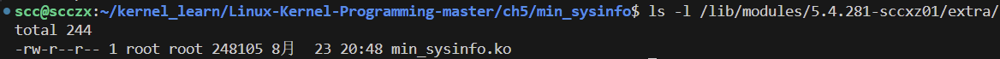

4. 另一个模块实用工具 `depmod()` 通常会在 `sudo make install` 中默认调用（可以从前面的输出中看到）。如果（由于某种原因）没有发生，我们可以手动调用 `depmod`：它的任务是解析模块依赖关系（详见其手册页）：`sudo depmod`。安装内核模块后，我们可以使用 `--dry-run` 选项查看 `depmod()` 的效果：

   ```bash
   sudo depmod --dry-run | grep min_sysinfo
   ```

5. 在启动时自动加载内核模块：一种方法是创建 `/etc/modules-load.d/<foo>.conf` 配置文件（当然，需要 root 权限创建此文件）；简单的情况是：只需将内核模块的名称 `foo` 写在文件中即可，这样系统启动时就会自动加载这个模块。对于我们的 `min_sysinfo` 示例，配置文件内容如下：

   ```bash
   sudo vim /etc/modules-load.d/min_sysinfo.conf
   # 写入 min_sysinfo
   
   cat /etc/modules-load.d/min_sysinfo.conf
   # Auto load kernel module for LLKD book: ch5/min_sysinfo
   min_sysinfo
   ```

6. 使用 `sync; sudo reboot` 重启系统。系统启动后，使用 `lsmod()` 查看模块是否加载，并通过 `dmesg()` 查看内核日志。我们会看到与加载内核模块相关的信息（在我们的示例中是 `min_sysinfo`）：

   ```bash
   lsmod | grep min_sysinfo
   dmesg | grep -C2 min_sysinfo
   ```

就这样，我们的 `min_sysinfo` 内核模块确实在启动时被自动加载到了内核空间中！

我们刚刚学到的内容是：我们必须先构建内核模块，然后执行安装。为了帮助自动化这一过程，我们的“更好的”Makefile 在模块安装的 `install` 目标中包含以下内容：

```makefile
install:
    @echo "--- installing ---"
    @echo " [First, invoke the 'make' ]"
    make
    @echo " [Now for the 'sudo make install' ]"
    sudo make -C $(KDIR) M=$(PWD) modules_install
    sudo depmod
```

它确保首先完成构建，然后是安装和显式的 `depmod()` 调用。

如果我们的自动加载内核模块需要在加载时传递一些（模块）参数，有两种方法可以确保这一点：通过所谓的 `modprobe` 配置文件（位于 `/etc/modprobe.d/` 下）或者，如果模块是内置到内核中的，通过内核命令行。

在此我们展示第一种方式：只需设置我们的 `modprobe` 配置文件（例如这里我们使用 `mykmod` 作为 LKM 的名称，我们需要 root 权限来创建此文件）：`/etc/modprobe.d/mykmod.conf`；在其中可以这样传递参数：

```text
options <module-name> <parameter-name>=<value>
```

例如，在我的 x86_64 Ubuntu 20.04 LTS 系统上，`/etc/modprobe.d/alsa-base.conf` `modprobe` 配置文件包含如下行（在其他行中）：

```text
# Ubuntu #62691, enable MPU for snd-cmipci
options snd-cmipci mpu_port=0x330 fm_port=0x388
```

### 模块自动加载-其他详细信息

一旦内核模块已经安装到系统上（通过执行 `sudo make install`，如前所述），我们也可以通过使用 `modprobe` 这个比 `insmod` 更智能的工具，交互式地（或者通过脚本）将其插入内核中。举例来说，我们可以先使用 `rmmod` 卸载模块，然后执行以下命令：

```bash
sudo modprobe min_sysinfo
```

这里有个有趣的细节：当需要加载多个内核模块对象时（例如在模块堆叠设计中），`modprobe` 是如何知道加载内核模块的顺序的呢？在本地构建时，构建过程会生成一个名为 `modules.order` 的文件。它告诉诸如 `modprobe` 之类的工具应该按怎样的顺序加载内核模块，以便解决所有依赖关系。当内核模块被安装到内核中时（即安装到 `/lib/modules/$(uname -r)/extra/` 或类似位置），`depmod` 工具会生成一个 `/lib/modules/$(uname -r)/modules.dep` 文件。该文件包含依赖关系信息，指定了某个内核模块是否依赖于另一个内核模块。利用这些信息，`modprobe` 可以按所需顺序加载它们，从而避免任何问题。

为了更好地理解这一点，让我们安装我们的模块堆叠示例：

```bash
cd ~/kernel_learn/Linux-Kernel-Programming-master/ch5/modstacking/

make && sudo make install
# [...]

ls -l /lib/modules/5.4.281-sccxz01/extra/
# total 704
# -rw-r--r-- 1 root root 236345 8月  24 09:56 core_lkm.ko
# -rw-r--r-- 1 root root 248105 8月  23 20:48 min_sysinfo.ko
# -rw-r--r-- 1 root root 233001 8月  24 09:56 user_lkm.ko
```

显然，我们的模块堆叠示例中的两个内核模块（`core_lkm.ko` 和 `user_lkm.ko`）现在已经安装在预期的位置 `/lib/modules/$(uname -r)/extra/` 下了。现在，检查以下内容：

```bash
# 搜索指定目录 /lib/modules/5.4.281-sccxz01/ 中包含字符串 user_lkm 的文件，并将搜索结果输出到终端
grep user_lkm /lib/modules/5.4.281-sccxz01/* 2>/dev/null
# /lib/modules/5.4.281-sccxz01/modules.dep:extra/user_lkm.ko: extra/core_lkm.ko
# Binary file /lib/modules/5.4.281-sccxz01/modules.dep.bin matches
```

`grep` 命令的第一行输出是相关的：`depmod` 已经安排 `modules.dep` 文件显示 `extra/user_lkm.ko` 内核模块依赖于 `extra/core_lkm.ko` 内核模块（通过 `<k1.ko>: <k2.ko>...` 的表示方式，暗示 `k1.ko` 模块依赖于 `k2.ko` 模块）。因此，`modprobe` 看到这些信息后，会按所需顺序加载它们，避免任何问题。

内核源代码树根文件生成的 `Module.symvers` 文件包含所有导出符号的信息。

此外，对于 Linux 上的新 `init` 框架 systemd。在现代 Linux 系统上，systemd 通过解析 `/etc/modules-load.d/*` 文件的内容来负责系统启动时自动加载内核模块（负责此功能的 systemd 服务是 `systemd-modules-load.service`）。

反过来，有时我们可能会发现某个自动加载的内核模块表现异常，导致系统挂起或延迟，或者它根本无法工作，因此我们想禁用加载它。这可以通过黑名单模块来实现。我们可以在内核命令行中指定（在所有其他方法都失败时很方便），也可以在前面提到的 `/etc/modules-load.d/<foo>.conf` 配置文件中指定。在内核命令行中，通过 `module_blacklist=mod1,mod2,...` 参数，内核文档向我们展示了语法/解释：

```bash
module_blacklist= [KNL] # 不要加载逗号分隔的模块列表。用于调试有问题的模块。
```

在讨论内核命令行时，还有几个有用的选项可以帮助我们调试与内核初始化有关的问题。例如，在其他选项中，内核提供了以下参数（来源：https://www.kernel.org/doc/html/latest/admin-guide/kernel-parameters.html）：

```bash
debug				[KNL] 	# 启用内核调试（事件日志级别）。
[...]
initcall_debug		[KNL] 	# 在执行时跟踪 initcalls。用于确定内核在启动期间何处停止。
[...]
ignore_loglevel		[KNL] 	# 忽略日志级别设置——这会将所有内核消息打印到控制台。对于调试非常有用。我们还可以将其添加为 `printk` 模块参数，因此用户可以动态更改它，通常通过 `/sys/module/printk/parameters/ignore_loglevel`。
```

第三方内核模块自动重建的另一种框架是 `Dynamic Kernel Module Support` (DKMS)。

## 内核模块和安全性-概述

近年来在提高用户空间安全性方面投入了巨大的努力，并取得了相当大的回报。二十年前，恶意用户执行有效的缓冲区溢出（Buffer Overflow，BoF）攻击还是完全有可能的，但今天却变得非常困难了。为什么呢？因为现在有许多增强的安全机制层层保护，防止了许多这类攻击。

但过去几年内核空间攻击却变得越来越普遍！已经证明，即使只暴露一个有效的内核（虚拟）地址及其对应的符号，聪明的攻击者也可以利用它推测出某些关键内核结构的位置，从而实施各种特权提升（privesc）攻击。因此，即使只是暴露一个看似无害的内核信息（如一个内核地址及其关联的符号），也可能导致信息泄漏（info-leak），在生产系统上必须加以防范。接下来，我们将列举并简要描述一些Linux内核提供的安全功能。然而，我们作为内核开发者在其中扮演着重要角色：首先要编写安全的代码，使用我们优化过的Makefile是一个很好的开始，因为其中的几个目标与安全性有关（例如，所有的静态分析目标）。

这段文字介绍了与系统日志相关的两个可调节的Proc文件系统参数，并探讨了它们对系统安全的影响。以下是翻译内容：

### 影响系统日志的Proc文件系统可调参数

我们推荐参考proc()的手册页面，以获取关于这两个与安全相关的可调参数的信息：

- `dmesg_restrict`
- `kptr_restrict`

首先是`dmesg_restrict`：

- `dmesg_restrict` 
  `/proc/sys/kernel/dmesg_restrict`（自 Linux 2.6.37 开始） 
  这个文件中的值决定了谁可以查看内核的syslog内容。 
  **如果 `dmesg_restrict` 文件中的值为 0，则不施加任何限制。如果值为 1，则只有特权用户可以读取内核的 syslog。（详见syslog()）。自 Linux 3.4 开始，只有具备 CAP_SYS_ADMIN 能力的用户可以更改这个文件中的值。** 
  默认情况下（在我们的 Ubuntu 和 Fedora 平台上），这个值为 0：

  ```bash
  cat /proc/sys/kernel/dmesg_restrict
  # 0
  ```

Linux内核使用强大的细粒度 POSIX 能力模型。`CAP_SYS_ADMIN`能力基本上涵盖了传统上的root（超级用户/系统管理员）访问权限。`CAP_SYSLOG`能力赋予进程（或线程）执行特权syslog()操作的能力。

如前所述，泄露内核地址及其关联的符号可能会导致基于信息泄漏的攻击。为帮助防止这些攻击，建议内核和模块作者在打印内核地址时使用新的 printf 样式格式：而不是使用常见的`%p`或`%px`来打印内核地址，应该使用较新的`%pK`格式说明符来打印地址。（使用`%px`格式说明符会确保打印出实际地址；在生产环境中应避免这样做）。

`kptr_restrict`（自 2.6.38 开始）影响`printk()`在打印内核地址时的输出；做`printk("&var = %pK\n", &var);`而不是使用传统的`printk("&var = %p\n", &var);`被认为是一种安全最佳实践。理解`kptr_restrict`可调参数的工作原理是关键：

- `kptr_restrict` 
  `/proc/sys/kernel/kptr_restrict`（自 Linux 2.6.38 开始） 
  `kptr_restrict`文件中的值决定了内核地址是否通过/proc文件及其他接口暴露。 
  **如果`kptr_restrict`文件中的值为 0，则不施加任何限制。如果值为 1，使用`%pK`格式说明符打印的内核指针将被替换为零，除非用户具有 `CAP_SYSLOG` 能力。如果值为 2，使用`%pK`格式说明符打印的内核指针将被替换为零，无论用户具有什么能力。** 
  这个文件的初始默认值为 1，但在Linux 2.6.39 中默认值更改为 0 。自 Linux 3.4 开始，只有具备 `CAP_SYS_ADMIN` 能力的用户可以更改这个文件的值。 
  默认情况下（在 Ubuntu 和 Fedora 平台上），这个值为 1：

  ```bash
  cat /proc/sys/kernel/kptr_restrict
  # 1
  ```

在生产系统上，我们可以（实际上是必须）将这些可调参数设置为安全值（1或2）以确保安全性。当然，安全措施只有在开发人员使用时才能发挥作用；截至5.4.0 Linux 内核，在整个Linux内核代码库中，使用 `%pK` 格式说明符的情况（仅有）14 处（在大约 5200 个使用 `printk` 的 `%p` 格式说明符的地方，以及约230 个明确使用 `%px` 格式说明符的地方中）。

随着 2018 年初硬件级别缺陷的出现（众所周知的 Meltdown、Spectre 以及其他处理器推测执行安全问题），检测信息泄漏的紧迫感再次增强，从而使开发人员和管理员能够阻止这些泄漏。

### 内核模块的加密签名

一旦恶意攻击者在系统中取得立足点，他们通常会尝试某种形式的特权提升（privesc）手段以获得 root 访问权限。一旦实现这一目标，下一步通常是安装rootkit：本质上，它是一组脚本和内核模块，通过“劫持”系统调用、设置后门和键盘记录器等方式，几乎可以完全接管系统。

当然，这并不容易，现代生产质量的Linux系统的安全姿态，加上Linux安全模块（LSMs）等，使得这并不是一件简单的事情，但对于一个技术娴熟且动机明确的攻击者来说，任何事情都是可能的。假设他们安装了一个足够复杂的rootkit，那么该系统现在就被认为已经被攻破了。

一个有趣的想法是：即使攻击者获得了root权限，也不要允许通过`insmod()`（或`modprobe()`，甚至是底层的`[f]init_module()`系统调用）将内核模块插入到内核地址空间，除非这些模块使用了在内核密钥环中存在的安全密钥进行加密签名。这项强大的安全功能是在 3.7 版本的内核中引入的（相关提交在此：https://git.kernel.org/pub/scm/linux/kernel/git/torvalds/linux.git/commit/?id=106a4ee258d14818467829bf0e12aeae14c16cd7）。

与此功能相关的一些内核配置选项包括`CONFIG_MODULE_SIG`、`CONFIG_MODULE_SIG_FORCE`、`CONFIG_MODULE_SIG_ALL`等。为了帮助理解这意味着什么，可以查看第一个选项的Kconfig帮助部分（摘自`init/Kconfig`）：

```plaintext
config MODULE_SIG
bool "Module signature verification" #"模块签名验证"
depends on MODULES
select SYSTEM_DATA_VERIFICATION
help
检查加载时模块的有效签名：签名只是简单地附加在模块上。有关更多信息，请参阅<file:Documentation/admin-guide/module-signing.rst>。请注意，此选项会将 OpenSSL 开发包作为内核构建的依赖项添加，以便签名工具可以使用其加密库。
!!!警告!!! 如果我们启用此选项，我们必须确保模块在签名后不会被剥离。这包括某些打包工具（例如rpmbuild）执行的调试信息剥离以及包含在想要减少模块大小的initramfs中。
```

`MODULE_SIG_FORCE`内核配置是一个布尔值（默认是n）。它仅在`MODULE_SIG`开启时生效。**如果`MODULE_SIG_FORCE`设置为y，那么内核模块必须具有有效的签名才能加载；否则，加载将会失败。如果它的值保持为n，则意味着即使未签名的内核模块也会被加载到内核中，但内核将被标记为已污染。**这通常是现代Linux发行版的默认设置。在下面的代码块中，我们查找这些内核配置：

```bash
grep MODULE_SIG /boot/config-5.4.281-sccxz01
# CONFIG_MODULE_SIG_FORMAT=y
# CONFIG_MODULE_SIG=y
# # CONFIG_MODULE_SIG_FORCE is not set
# CONFIG_MODULE_SIG_ALL=y
# # CONFIG_MODULE_SIG_SHA1 is not set
# # CONFIG_MODULE_SIG_SHA224 is not set
# # CONFIG_MODULE_SIG_SHA256 is not set
# # CONFIG_MODULE_SIG_SHA384 is not set
# CONFIG_MODULE_SIG_SHA512=y
# CONFIG_MODULE_SIG_HASH="sha512"
# CONFIG_MODULE_SIG_KEY="certs/signing_key.pem"
```

在生产系统中，建议对内核模块进行加密签名（近年来，随着（I）IoT边缘设备的普及，安全性成为一个关键问题）。

### 完全禁用内核模块

**谨慎的人可能希望完全禁用内核模块的加载（和卸载）。** 这种做法虽然相当激进，但确实可以彻底锁定系统的内核空间，同时几乎让任何 rootkit 变得无害。这可以通过两种主要方式实现：

1. 首先，可以在构建内核之前，通过将 `CONFIG_MODULES` 内核配置关闭来实现。默认情况下，它是开启的。这样做非常激进，因为它会使这个决定变得永久化。

2. 其次，假设 `CONFIG_MODULES` 是开启的，模块加载可以在运行时通过 `modules_disabled` 的 sysctl 可调参数来动态关闭。看看这个：

```bash
cat /proc/sys/kernel/modules_disabled
# 0
```

默认情况下，它是关闭的（值为0）。正如proc()手册页所描述的：

```plaintext
/proc/sys/kernel/modules_disabled (自Linux 2.6.31开始)
这是一个指示模块是否可以在模块化内核中加载的切换值。该切换默认关闭（0），但可以设置为true（1）。一旦设置为true，模块既不能加载也不能卸载，并且该切换无法再设置回false。只有在内核启用了CONFIG_MODULES选项时，才会存在此文件。
```

最后，内核安全加固和恶意攻击是一场猫捉老鼠的游戏。几乎不言而喻，无论是用户空间还是内核空间的开发人员，都必须编写具备安全意识的代码，并且持续使用工具和进行测试。

## 内核开发人员的编码风格指南

许多大型项目都有自己的编码规范，Linux 内核社区也不例外。遵循 Linux 内核编码风格指南是一个非常好的做法。

我们可以在以下链接中找到官方文档：[Linux Kernel Coding Style](https://www.kernel.org/doc/html/latest/process/coding-style.html)。

此外，对于像我们这样的开发人员来说，如果想将代码合并到上游（即 Linux 内核主线），我们需要按照一个相当详细的代码提交检查清单来操作。我们需要通过一个 Perl 脚本来检查代码是否符合 Linux 内核的编码风格：`scripts/checkpatch.pl`。

默认情况下，这个脚本只在格式良好的 git 补丁上运行。不过，我们也可以针对独立的 C 代码运行它（例如，我们的独立内核模块代码），如下所示（我们的“更好的”Makefile 确实包含了这一点）：

```bash
<kernel-src>/scripts/checkpatch.pl --no-tree -f <filename>.c
```

习惯性地在我们的内核代码上运行这个脚本会很有帮助，可以让我们抓住那些令人恼火的小问题，以及更严重的问题，否则这些问题可能会延迟我们提交的补丁。同样地，我们的“更好的”Makefile 中的 `indent` 和 `checkpatch` 目标就是为此设计的。

除了编码风格指南，我们需要查阅详尽且实用的内核文档。温馨提示：我们在第 1 章《内核工作区设置》的“查找和使用 Linux 内核文档”部分中，已经介绍了如何查找和使用内核文档。

## 为主线内核做贡献

如果我们在内核树中编写代码，明确的目标是将代码上传到内核主线，那该怎么办？这确实是一个值得称赞的目标，开源的整个基础源于社区愿意投入工作并将其贡献给项目的上游。

### 开始为内核做贡献

最常被问到的问题当然是：“我该如何开始？”为了解答这个问题，一个非常详细的答案可以在内核文档中找到：**《如何进行 Linux 内核开发》**（HOWTO do Linux kernel development）。我们可以通过访问 https://www.kernel.org/doc/html/latest/process/howto.html#howto-do-linux-kernel-development 查阅。

事实上，我们可以通过在内核源码树的根目录中运行 `make pdfdocs` 命令来生成完整的 Linux 内核文档；成功生成后，我们会在 `<kernel-source-root>/Documentation/output/latex/development-process.pdf` 目录下找到该 PDF 文档。

这是一份非常详细的指南，涵盖了 Linux 内核开发过程，包括代码提交的指南。这里展示了这份文档的一个截图：

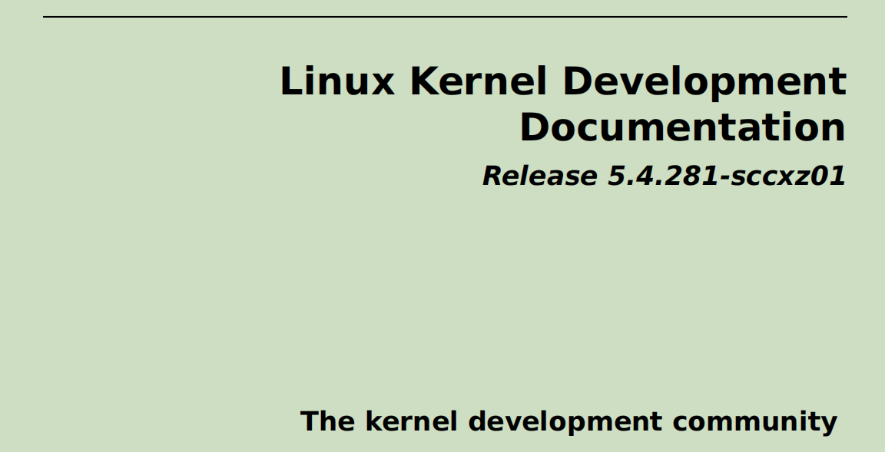

作为内核开发过程的一部分，为了保持质量标准，有一个严格的、必须遵循的检查清单：可以说是一份详细的“配方”，这也是内核补丁提交过程的一部分。官方的检查清单位于 [Linux Kernel patch submission checklist](https://www.kernel.org/doc/html/latest/process/submit-checklist.html#linux-kernel-patch-submission-checklist) 。

尽管对于内核新手来说，这似乎是一个繁重的任务，但仔细遵循这个检查清单能为我们的工作增添严谨性和可信度，最终产生更高质量的代码。我们应该通读内核补丁提交检查清单，并尝试按照其中提到的程序进行操作。

## 总结

在本章中，我们涵盖了与内核模块这一重要主题相关的几个（剩余的）领域：其中包括为内核模块使用“更好的” Makefile、配置调试内核的提示（这非常重要！）、~~交叉编译内核模块~~、从内核模块中收集一些最少量的平台信息，甚至还涉及了内核模块的许可问题。我们还探讨了使用两种不同的方法模拟类似库的功能（第一种：（首选方法）链接方法，第二种是模块堆叠方法）、使用模块参数、避免使用浮点数、自动加载内核模块等内容。安全问题及其解决方法也同样重要。最后，我们通过讲解内核编码风格指南、内核文档以及如何开始为主线内核贡献代码来结束本章。