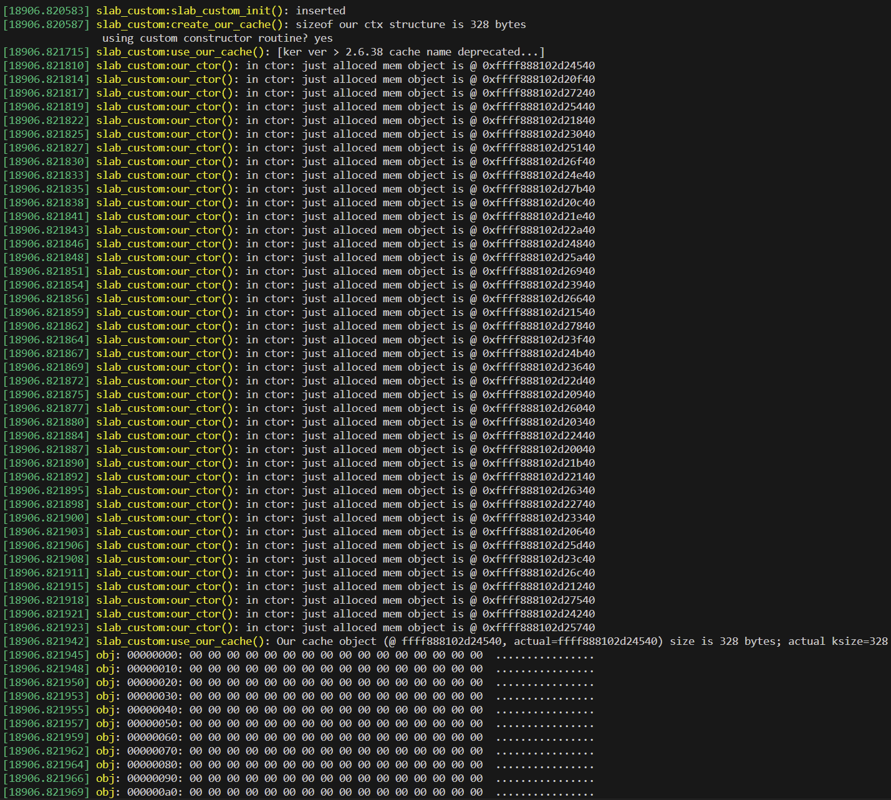
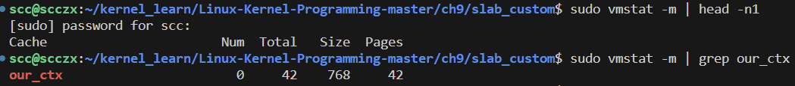
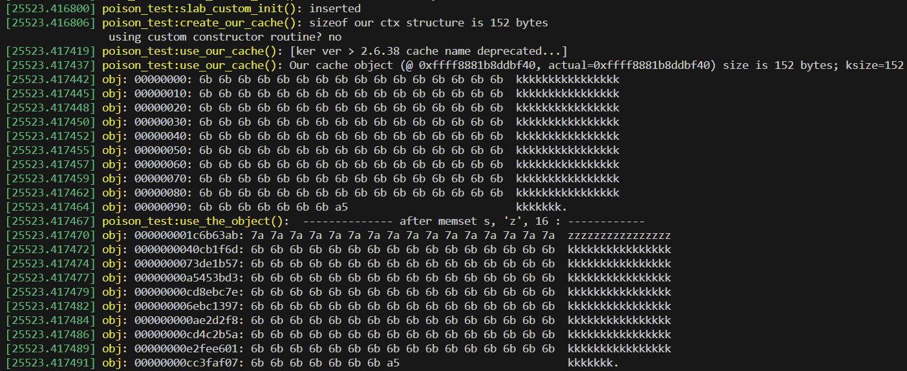
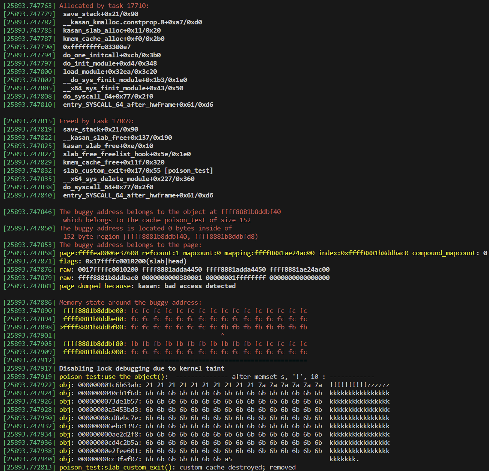
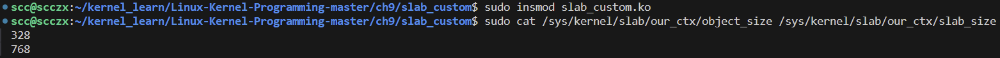
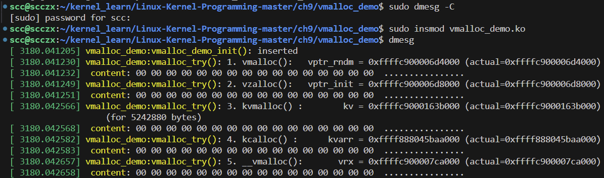
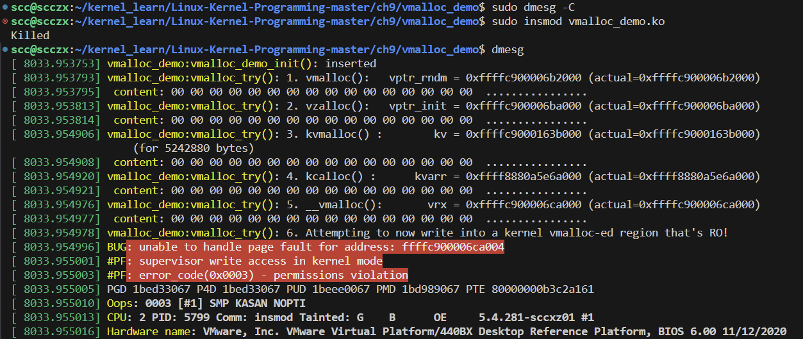
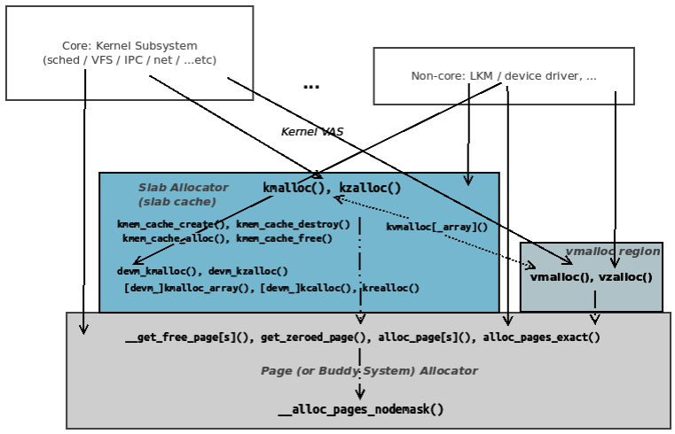
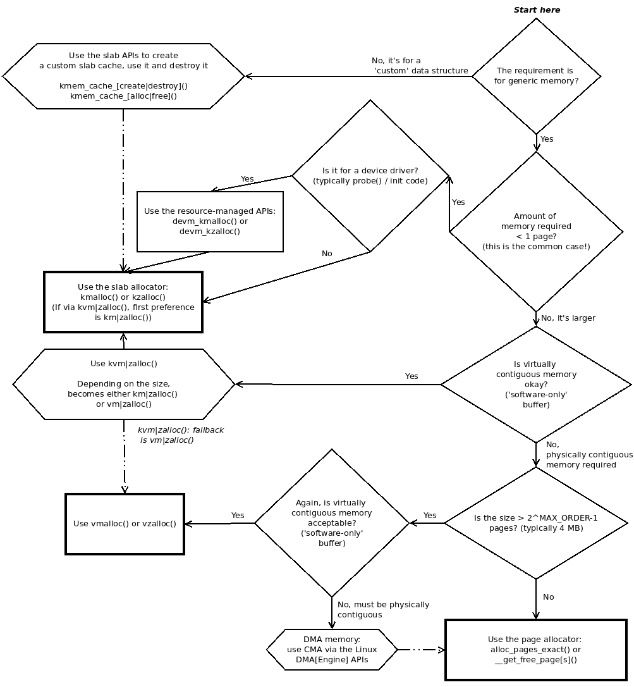
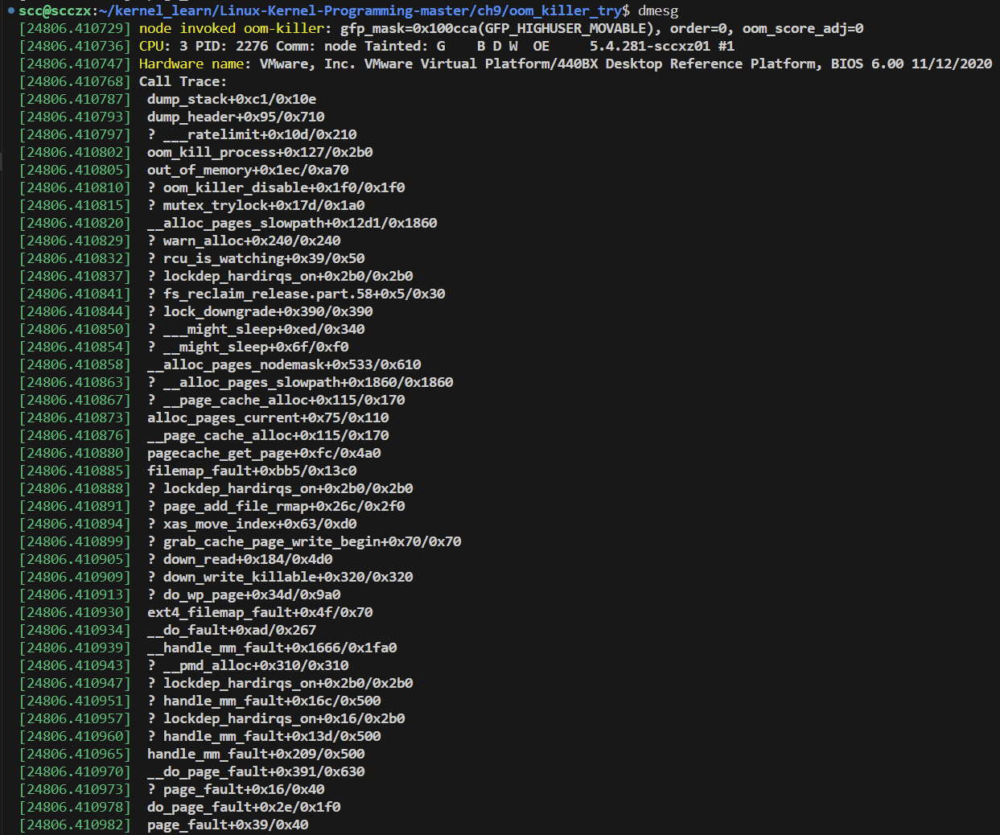

# Chapter 9 Kernel Memory Allocation for Module Authors - Part 2

上一章深入介绍了如何使用内核中的页面分配器（BSA）和 slab 分配器提供的 API 进行内存分配的基本知识及其更多内容。在本章中，我们将进一步探讨这个广泛而有趣的主题。具体包括以下内容：创建自定义的 slab 缓存、slab 层的调试、理解和使用内核的 `vmalloc()` API、内核中的内存分配——在不同情况下使用哪些 API、继续生存——理解 OOM 杀手。这些主题是理解内核模块（特别是设备驱动程序）工作原理的关键方面之一。例如，当一个 Linux 系统项目突然崩溃，控制台上只显示一条 "Killed" 消息时，这通常需要一些解释，背后的原因就是 OOM 杀手的作用。

简而言之，本章将涵盖以下主要内容：

- **创建自定义的 slab 缓存**：如何根据需要创建和管理自定义的 slab 缓存。
- **在 slab 层进行调试**：如何在 slab 层面调试内存管理问题。
- **理解和使用内核的 `vmalloc()` API**：如何使用 `vmalloc()` API 进行内存分配和管理。
- **内存分配的最佳实践**：根据不同的情况，选择使用何种 API。
- **了解 OOM 杀手**：深入了解内核如何处理内存不足的情况以及 OOM 杀手的工作原理。

## 创建自定义 Slab 缓存

正如上一章中详细解释的那样，slab 缓存背后的一个关键设计理念是对象缓存的强大思想。通过缓存经常使用的对象（实际上是数据结构），可以提高性能。那么，想一想：如果我们正在编写一个驱动程序，而在这个驱动程序中，一个特定的数据结构（对象）非常频繁地分配和释放，应该怎么做呢？通常情况下，我们会使用常见的 `kzalloc()`（或 `kmalloc()`），然后使用 `kfree()` API 来分配和释放这个对象。不过，有个好消息是：Linux 内核为我们这些模块开发者充分暴露了 slab 层的 API，允许我们创建自己的自定义 slab 缓存。

### 在内核模块中创建和使用自定义 Slab 缓存

在本节中，我们将创建、使用并最终销毁一个自定义的 slab 缓存。总体来说，我们将执行以下步骤：

1. **创建一个给定大小的自定义 slab 缓存**
   使用 `kmem_cache_create()` API 创建一个自定义的 slab 缓存。这通常在内核模块的初始化代码路径（或在驱动程序中的 `probe` 方法）中完成。

2. **使用 slab 缓存** 
   在这里，我们将执行以下操作：  
   - 使用 `kmem_cache_alloc()` API 在你的 slab 缓存中分配一个或多个自定义对象的实例。  
   - 使用该对象。  
   - 使用 `kmem_cache_free()` API 将对象释放回缓存中。

3. **在完成后销毁自定义 slab 缓存** 
   使用 `kmem_cache_destroy()` 销毁自定义 slab 缓存。这通常在内核模块的清理代码路径（或在驱动程序的 `remove`/`detach`/`disconnect` 方法中）完成。

接下来，让我们详细探讨每个 API 的用法。我们将从创建一个自定义（slab）缓存开始。

#### 创建自定义 Slab 缓存

首先，我们来学习如何创建一个自定义的 slab 缓存。`kmem_cache_create()` 内核 API 的签名如下：

```c
#include <linux/slab.h>
struct kmem_cache *kmem_cache_create(const char *name, unsigned int size,
                                     unsigned int align, slab_flags_t flags,
                                     void (*ctor)(void *));
```

以下是各个参数的说明：

1. **第一个参数 `name`** 是缓存的名称：在 `/proc` 文件系统中显示（因此也会在其他基于 `/proc` 的实用工具，如 `vmstat()`、`slabtop()` 等中显示）。这个名称通常与被缓存的数据结构或对象的名称相匹配（但不一定需要如此）。

2. **第二个参数 `size`** 是关键参数：它表示新缓存中每个对象的大小（以字节为单位）。内核的 slab 层基于此对象大小（使用最优匹配算法）构建对象缓存。由于以下三个原因，缓存中每个对象的实际大小会（稍微）大于请求的大小：
   - 我们总是可以提供比请求更多的内存，但不能提供更少的。
   - 一些元数据（管理信息）需要占用空间。
   - 内核无法提供与请求的确切大小完全匹配的缓存。它使用尽可能接近的内存大小（回想第 8 章《内核模块开发者的内存分配——第 1 部分》中“使用 slab 分配器时的注意事项”部分的内容，我们清楚地看到有时实际上会使用更多的内存）。

3. **第三个参数 `align`** 是缓存中对象的对齐要求。如果不重要，可以将其设置为 0。不过，通常会有一些特定的对齐要求，例如，确保对象按机器字大小（32 或 64 位）对齐。为此，请将值传递为 `sizeof(long)`（该参数的单位是字节，而不是位）。

4. **第四个参数 `flags`** 可以为 0（表示没有特殊行为），或者是以下标志值的按位或（bitwise-OR）运算。为了清晰起见，我们直接引用了源文件 `mm/slab_common.c` 中注释的相关标志信息：

```c
// mm/slab_common.c
[...]
 * 标志说明：
 *
 * %SLAB_POISON - 使用已知的测试模式（a5a5a5a5）填充 slab，便于检测对未初始化内存的引用。
 *
 * %SLAB_RED_ZONE - 在分配的内存周围插入“红区”，用于检查缓冲区溢出。
 *
 * %SLAB_HWCACHE_ALIGN - 将缓存中的对象对齐到硬件的缓存行大小。如果你像 davem 一样精确地计算周期数，这将非常有益。
[...]
```

- **标志说明：**

  - **`SLAB_POISON`**：提供 slab 毒化，即将缓存内存初始化为已知的值（0xa5a5a5a5）。这在调试时非常有用。

  - **`SLAB_RED_ZONE`**：在分配的缓冲区周围插入红区（类似于保护页），用于检查缓冲区溢出错误。通常在调试上下文中使用（尤其是在开发期间）。

  - **`SLAB_HWCACHE_ALIGN`**：**非常常用，推荐用于性能优化**。它保证所有缓存对象都对齐到硬件（CPU）缓存行的大小。这正是通过常用的 `k[m|z]alloc()` API 分配的内存对齐到硬件（CPU）缓存行的方式。

5. **第五个参数 `ctor`** 是一个非常有趣的函数指针 `void (*ctor)(void *);`，被建模为构造函数（类似于面向对象编程语言中的构造函数）。它允许你在自定义 slab 缓存中分配对象的同时，立即对其进行初始化。例如，在内核中使用此特性的一个例子可以在 Linux 安全模块（LSM）中的 `integrity` 模块代码中找到：

```c
// security/integrity/iint.c:integrity_iintcache_init()
iint_cache = kmem_cache_create("iint_cache", sizeof(struct integrity_iint_cache),
                               0, SLAB_PANIC, init_once);
```

`init_once()` 函数用于初始化刚刚分配的缓存对象实例。记住，每当该缓存分配新的页面时，都会调用构造函数。

`kmem_cache_create()` API 的返回值是指向新创建的自定义 slab 缓存的指针，成功时返回该指针，失败时返回 `NULL`。通常将此指针设置为全局变量，因为我们需要访问它来实际从中分配对象（这是我们的下一步）。

需要注意的是，`kmem_cache_create()` API 只能在进程上下文中调用。相当多的内核代码（包括许多驱动程序）创建并使用它们自己的自定义 slab 缓存。例如，在 Linux 5.4.0 内核中，有超过 350 次调用此 API 的实例。

好了，现在我们已经有了一个自定义的（slab）缓存，接下来该如何使用它来分配内存对象呢？

#### 使用新的 Slab 缓存的内存

我们已经创建了一个自定义的 slab 缓存。要使用它，我们需要调用 `kmem_cache_alloc()` API。这个函数的作用是：根据指向 slab 缓存的指针（刚才创建的缓存），在该 slab 缓存中分配一个对象实例（实际上，这正是 `k[m|z]alloc()` API 在底层的工作方式）。它的函数签名如下（当然，记得要为所有基于 slab 的 API 包含 `<linux/slab.h>` 头文件）：

```c
void *kmem_cache_alloc(struct kmem_cache *s, gfp_t gfpflags);
```

让我们看看它的参数：

- `kmem_cache_alloc()` 的第一个参数是我们在上一步创建的（自定义）缓存的指针（该指针是 `kmem_cache_create()` API 的返回值）。
- 第二个参数是常见的 GFP 标志（GFP flags）（请记住基本规则：对于正常的进程上下文分配，使用 `GFP_KERNEL`；如果在任何类型的原子或中断上下文中，则使用 `GFP_ATOMIC`）。

与我们熟悉的 `k[m|z]alloc()` API 一样，返回值是指向新分配的内存块的指针：一个内核逻辑地址（当然，它是一个 KVA，内核虚拟地址）。

使用新分配的内存对象后，在完成操作后，请不要忘记使用以下 API 释放它：

```c
void kmem_cache_free(struct kmem_cache *, void *);
```

在使用 `kmem_cache_free()` API 时，请注意以下几点：

- `kmem_cache_free()` 的第一个参数是我们在上一步创建的（自定义）slab 缓存的指针（`kmem_cache_create()` 的返回值）。
- 第二个参数是我们希望释放的内存对象的指针：即我们通过 `kmem_cache_alloc()` 分配的对象实例，从而将其返回到第一个参数指定的缓存中。

与 `k[z]free()` API 类似，该函数没有返回值。

#### 销毁自定义缓存

在完成所有操作后（通常在内核模块的清理或退出代码路径中，或驱动程序的 `remove` 方法中），我们需要使用以下行代码销毁之前创建的自定义 slab 缓存：

```c
void kmem_cache_destroy(struct kmem_cache *);
```

这个参数当然是我们在上一步创建的（自定义）缓存的指针（即 `kmem_cache_create()` API 的返回值）。

现在我们已经了解了这个过程及其相关的 API，接下来让我们实际操作一个内核模块，该模块将创建它自己的自定义 slab 缓存，使用它，然后销毁它。

### 自定义 Slab 示例内核模块

让我们来看一个简单的演示，使用前面的 API 来创建我们自己的自定义 slab 缓存。正如往常一样，这里只展示相关的代码。我们可以在 `ch9/slab_custom/slab_custom.c`找到此文件的代码。

在初始化代码路径中，我们首先调用以下函数来创建自定义 slab 缓存：

```c
// ch9/slab_custom/slab_custom.c
#define OURCACHENAME "our_ctx"
/* 我们的“演示”结构，该结构（假设）经常被分配和释放；
 * 因此，我们创建了一个自定义的 slab 缓存来存储预先分配的“实例”。
 * 它的大小为 328 字节。
 */
struct myctx {
    u32 iarr[10];
    u64 uarr[10];
    char uname[128], passwd[16], config[64];
};

static struct kmem_cache *gctx_cachep;
```

在上面的代码中，我们声明了一个（全局）指针 `gctx_cachep`，用于指向即将创建的自定义 slab 缓存，该缓存将保存对象，也就是我们虚构的经常分配的数据结构 `myctx`。

接下来是创建自定义 slab 缓存的代码：

```c
static int create_our_cache(void)
{
    int ret = 0;
    void *ctor_fn = NULL;

    if (use_ctor == 1)
        ctor_fn = our_ctor;

    pr_info("sizeof our ctx structure is %zu bytes\n"
            " using custom constructor routine? %s\n",
            sizeof(struct myctx), use_ctor == 1 ? "yes" : "no");

    /* 创建一个新的 slab 缓存：
     * kmem_cache_create(const char *name, unsigned int size, unsigned int align,
     *                   slab_flags_t flags, void (*ctor)(void *));
     */
    gctx_cachep = kmem_cache_create(OURCACHENAME,  // 缓存的名称
                                    sizeof(struct myctx),  // 每个对象的（最小）大小
                                    sizeof(long),  // 对齐方式
                                    SLAB_POISON |  // 使用 slab 毒化机制
                                    SLAB_RED_ZONE |  // 插入红区，防止溢出
                                    SLAB_HWCACHE_ALIGN,  // 性能优化
                                    ctor_fn);  // 构造函数，默认启用
    if (!gctx_cachep) {
        [...]
        if (IS_ERR(gctx_cachep))
            ret = PTR_ERR(gctx_cachep);
    }
    return ret;
}
```

这里有个有趣的点：我们的缓存创建 API 提供了一个构造函数来帮助初始化任何新分配的对象，如下所示：

```c
/* 参数是刚从自定义 slab 缓存中分配的内存对象指针；
 * 这里，这是我们的“构造函数”例程；因此，我们初始化刚刚分配的内存对象。
 */
static void our_ctor(void *new)
{
    struct myctx *ctx = new;
    struct task_struct *p = current;
    /* 小贴士：插入此调用可查看我们是如何到达这里的：
     * dump_stack();
     * （从下往上读，忽略以 '?' 开头的调用帧）
     */
    pr_info("in ctor: 刚分配的内存对象位于 0x%llx\n", ctx);
    memset(ctx, 0, sizeof(struct myctx));
    /* 作为演示，我们将结构的 'config' 字段初始化为某些
     * （任意的）来自 task_struct 的“会计”值
     */
    snprintf(ctx->config, 6 * sizeof(u64) + 5, "%d.%d,%ld.%ld,%ld,%ld",
             p->tgid, p->pid, p->nvcsw, p->nivcsw, p->min_flt, p->maj_flt);
}
```

上面的代码注释很清楚，请查看它们。如果设置了构造函数例程（取决于模块参数 `use_ctor` 的值；默认为 1），内核将在分配新内存对象到缓存时自动调用它。

在初始化代码路径中，我们调用了 `use_our_cache()` 函数。它通过 `kmem_cache_alloc()` API 分配一个 `myctx` 对象的实例，如果启用了自定义构造函数例程，它将运行并初始化该对象。然后我们转储其内存，显示它确实按代码进行了初始化，并在完成后释放它（为简洁起见，这里省略了错误代码路径）：

```c
obj = kmem_cache_alloc(gctx_cachep, GFP_KERNEL);
pr_info("我们的缓存对象大小为 %u 字节；ksize=%lu\n", kmem_cache_size(gctx_cachep), ksize(obj));
print_hex_dump_bytes("obj: ", DUMP_PREFIX_OFFSET, obj, sizeof(struct myctx));
kmem_cache_free(gctx_cachep, obj);
```

最后，在退出代码路径中，我们销毁自定义 slab 缓存：

```c
kmem_cache_destroy(gctx_cachep);
```

下面是一个示例运行的输出，帮助我们理解它是如何工作的。这只是一个在运行 Linux 5.4 内核的 x86_64 Ubuntu 18.04 LTS 客户端上输出的部分截图：

```bash
cd ~/kernel_learn/Linux-Kernel-Programming-master/ch9/slab_custom/

../../lkm slab_custom
```



**要注意的两个关键点：**

1. 由于默认启用了我们的构造函数例程（模块参数 `use_ctor` 的值为 1），每当内核 slab 层为我们的新缓存分配一个新对象实例时，构造函数就会运行。在这里，我们只执行了一个 `kmem_cache_alloc()`，但我们的构造函数例程运行了 42 次，这意味着内核的 slab 代码（预）分配了 42 个对象到我们全新的缓存中。当然，这个数量会有所不同。 

2. 还有一个非常重要的注意事项，如前面的截图所示，每个对象的大小看似是 328 字节（由以下三个 API 显示：`sizeof()`、`kmem_cache_size()` 和 `ksize()`）。然而，这实际上并不是真的，由内核分配的对象的实际大小更大；我们可以通过 `vmstat()` 看到这一点：

```bash
sudo vmstat -m | head -n1

sudo vmstat -m | grep our_ctx
```



正如前面代码中所强调的，每个分配对象的实际大小不是 328 字节，而是 768 字节（确切的数字会有所不同；在某些情况下，我看到的是 448 字节）。正如我们之前看到的，这一点非常重要，需要你意识到并进行检查。在后续的 “在 slab 层进行调试” 部分，我们展示了另一种检查这种情况的简单方法。

### 理解 Slab 缩减器

缓存有助于提高性能。例如，读取磁盘上大文件的内容与从内存（RAM）中读取其内容相比，毫无疑问，基于 RAM 的 I/O 要快得多。Linux 内核利用了这些概念，因此维护了多个缓存：页面缓存（page cache）、目录项缓存（dentry cache）、inode 缓存、slab 缓存等等。这些缓存确实大大提高了性能，但仔细想想，实际上它们并不是必需的。当内存压力达到高水平（意味着内存使用过多而空闲内存过少）时，Linux 内核有机制可以智能地释放缓存（即**内存回收**，这是一种持续进行的过程；内核线程（通常命名为 `kswapd*`）作为其内务处理任务的一部分来回收内存；在 “内存回收——内核内务处理任务和 OOM” 部分会进一步讨论）。

对于 slab 缓存来说，一些内核子系统和驱动程序会创建自己的自定义 slab 缓存，正如我们在本章前面讨论的那样。为了与内核良好集成和协作，最佳实践要求我们的自定义 slab 缓存代码应注册一个缩减器接口（shrinker interface）。这样，当内存压力足够高时，内核可能会调用多个 slab 缩减器回调函数，这些回调函数的目的是通过释放（缩减）slab 对象来缓解内存压力。

注册缩减器函数的 API 是 `register_shrinker()`。截至 Linux 5.4，该 API 的唯一参数是指向一个 `shrinker` 结构体的指针。这个结构体包含两个回调例程（以及其他管理成员）：

1. **第一个回调例程 `count_objects()`** 
   这个例程的作用是计算并返回将要被释放的对象数量（当实际调用时）。如果它返回 0，这意味着目前无法确定可释放的内存对象数量，或者目前不应尝试释放任何对象。

2. **第二个回调例程 `scan_objects()`** 
   只有在第一个回调例程返回非零值时才会调用它。当 slab 缓存层调用它时，它实际上会释放或缩减相关的 slab 缓存。它返回在此次回收周期中实际释放的对象数量；如果无法进行回收（由于可能的死锁），则返回 `SHRINK_STOP`。

### Slab 分配器的优缺点

#### 使用 slab 分配器（或 slab 缓存）API 分配和释放内核内存的优点：

- **非常快速**：因为它使用了预缓存的内存对象。
- **保证物理连续的内存块**。
- **保证硬件（CPU）缓存行对齐的内存**：在创建缓存时使用 `SLAB_HWCACHE_ALIGN` 标志时，这是 `kmalloc()`、`kzalloc()` 等 API 的默认行为。
- **可以为特定（经常分配/释放）的对象创建自定义 slab 缓存**。

#### 使用 slab 分配器（或 slab 缓存）API 的缺点：

- **一次可分配的内存量有限**：通常，通过 slab 接口直接分配的内存仅限于 8 KB，在大多数当前平台上通过页面分配器间接分配的内存最多为 4 MB（当然，具体的上限取决于体系结构）。
- **不正确地使用 `k[m|z]alloc()` API**：请求过多内存或请求超过某个阈值的内存大小（在第 8 章《内核模块开发者的内存分配——第 1 部分》的“`kmalloc` API 的大小限制”部分中详细讨论）可能会导致内部碎片（浪费）。Slab 分配器仅设计为对常见情况（即分配小于一个页面的内存）进行优化。

## 在 Slab 层进行调试

内存损坏（Memory Corruption）是不幸的常见问题，也是许多 bug 的根本原因之一。能够有效调试这些问题是一个关键技能。我们现在来看一些调试的方法。在深入细节之前，请记住，以下讨论主要针对 Slab 层的 **SLUB**（无队列分配器）实现。这是大多数 Linux 安装中的默认实现。

同时，我们在这里的目的是简要讨论内存调试的相关技术，而不是深入讲解内核调试工具，这是一个非常庞大的话题。尽管如此，我们仍然应该熟悉一些提到的强大框架/工具，特别是以下几种：

- **KASAN**（Kernel Address Sanitizer，内核地址清理器；适用于 x86_64 和 AArch64，从 4.x 内核开始提供）
- **SLUB 调试技术**（在此处讨论）
- **kmemleak**（尽管 KASAN 更强大）
- **kmemcheck**（注意：`kmemcheck` 在 Linux 4.15 版本中被移除）

### 通过 Slab 中毒进行调试

一个非常有用的功能是所谓的 **slab 中毒**。在此上下文中，“中毒” 指的是用特定的签名字节或易于识别的模式填充内存。不过，使用该功能的前提是内核配置选项 `CONFIG_SLUB_DEBUG` 已开启。如何检查？非常简单：

```bash
grep -w CONFIG_SLUB_DEBUG /boot/config-5.4.281-sccxz01
# CONFIG_SLUB_DEBUG=y
```

上面的代码输出 `=y` 表示该选项已开启。现在（假设该选项已开启），如果我们在创建 slab 缓存时使用了 `SLAB_POISON` 标志（我们在“创建自定义 slab 缓存”部分介绍了如何创建 slab 缓存），那么当内存被分配时，它总是会初始化为特殊值或内存模式 `0x5a5a5a5a`：这就是所谓的“中毒”状态（这很有意图：十六进制值 `0x5a` 对应 ASCII 字符 Z，代表“零”）。因此，如果我们在内核诊断消息或转储中（通常称为 Oops）看到这个值，很有可能是一个（不幸的是非常常见的）未初始化内存的错误（UMR，即未初始化内存读取）。

如果未设置 `SLAB_POISON` 标志，未初始化的 slab 内存会被设置为 `0x6b6b6b6b` 内存模式（十六进制 `0x6b` 是 ASCII 字符 k）。同样地，当 slab 缓存内存被释放时，如果 `CONFIG_SLUB_DEBUG` 已开启，内核会将相同的内存模式 (`0x6b6b6b6b` 或 'k') 写入其中。这也非常有用，允许我们检测（内核认为的）未初始化或已释放的内存。

这些中毒值在 `include/linux/poison.h` 中定义如下：

```c
/* 用于内存中毒的值 */
#define POISON_INUSE 0x5a /* 未初始化使用中毒 */
#define POISON_FREE 0x6b /* 释放后使用中毒 */
#define POISON_END 0xa5 /* 中毒的结束字节 */
```

关于内核的 SLUB 实现，我们可以查看以下伪代码，了解 slab 中毒发生的条件以及它的类型：

```plaintext
如果启用了 CONFIG_SLUB_DEBUG
 且设置了 SLAB_POISON 标志
 且没有自定义构造函数
 且类型安全（通过 RCU 实现）
那么 slab 中毒发生如下：
- slab 内存在初始化时被设置为 POISON_INUSE（0x5a = ASCII 'Z'）；代码位置在 mm/slub.c:setup_page_debug()。
- slab 对象在初始化时被设置为 POISON_FREE（0x6b = ASCII 'k'）；代码位置在 mm/slub.c:init_object()。
- slab 对象的最后一个字节在初始化时被设置为 POISON_END（0xa5）；代码位置在 mm/slub.c:init_object()。
```

（因此，由于 slab 层执行这些 slab 内存初始化的方式，我们最终得到的刚分配 slab 内存的初始值为 `0x6b`（ASCII k）。请注意，要使该功能正常工作，不应安装自定义构造函数。另外，我们可以忽略“类型安全（通过 RCU 实现）”的指令；通常情况是 "类型安全（通过 RCU 实现）" 为真。RCU（Read-Copy-Update）是一种高级同步技术）。

从 SLUB 调试模式下 slab 的初始化方式可以看出，内存内容实际上被初始化为 `POISON_FREE`（`0x6b = ASCII 'k'`）的值。因此，如果在释放内存后该值发生了变化，内核可以检测到这一点并触发报告（通过 `printk`）。这当然是一种众所周知的“释放后使用”（UAF）内存错误！同样，如果在红区之前或之后写入数据（这些区域实际上是保护区，通常初始化为 `0xbb`），将触发写缓冲区下溢/溢出错误，内核将报告该错误。

#### 实战操作——触发 UAF Bug

为了更好地理解这个概念，我们将在本节中通过截图展示一个示例。请按照以下步骤操作：

1. **首先，确保启用 `CONFIG_SLUB_DEBUG` 内核配置**（应设置为 `y`；在大多数发行版的内核中通常是如此）。

2. **接下来，启动系统并在内核命令行中包含 `slub_debug=` 指令**（这会启用完整的 SLUB 调试；或者，我们也可以传递一个更细粒度的选项，例如 `slub_debug=FZPU`，具体选项的解释见[内核文档](https://www.kernel.org/doc/Documentation/vm/slub.txt)）。作为演示，我们传递如下内核命令行，关键点是 `slub_debug=FZPU`：

   ```bash
   cat /proc/cmdline
   # 在 /etc/default/grub 将 GRUB_CMDLINE_LINUX="...其他参数... slub_debug=FZPU"，sudo update-grub，重启
   # BOOT_IMAGE=/boot/vmlinuz-5.4.281-sccxz01 root=UUID=2c5f7891-ebdb-4e15-8e59-7f97e9382d73 ro slub_debug=FZPU quiet splash
   ```

   （关于 `slub_debug` 参数的更多细节将在下一节“启动和运行时的 SLUB 调试选项”中介绍）。

3. **编写一个内核模块，创建一个新的自定义 slab 缓存（存在内存 bug）**。确保未指定构造函数（示例代码在 `ch9/poison_test` 中）。

4. **尝试演示：通过 `kmem_cache_alloc()`（或等效方法）分配一些 slab 内存**。下面是一个截图显示了分配的内存，以及在执行 `memset()` 将前 16 字节设置为 `z`（0x7a）后的同一区域的内容：



5. **接下来，制造 bug。** 在清理方法中，我们释放了分配的 slab，然后尝试再次使用它，执行另一次 `memset()` 操作，从而触发了 UAF（使用后释放）bug。再次，我们通过另一个截图展示了内核日志：



我们用 `0x21`（ASCII 字符 `!`，这是有意的）覆盖了 `0x6b` 的毒化值。在释放来自 slab 缓存的缓冲区后，如果内核在有效负载中检测到任何不是毒化值（`POISON_FREE = 0x6b = ASCII 'k'`）的值，就会触发这个 bug。

### 启动和运行时的 SLUB 调试选项

在使用 SLUB 实现（默认情况下）调试内核级 slab 问题时非常强大，因为内核拥有完整的调试信息。这些信息默认是关闭的。我们可以通过多种方式（视角）开启并查看 slab 调试级别的信息，有大量的细节可以获取！以下是一些启用调试的方式：

1. **通过内核命令行传递 `slub_debug=` 字符串**（通过引导加载程序）。这将开启完整的 SLUB 内核级调试。可以通过传递给 `slub_debug=` 字符串的选项来微调需要查看的具体调试信息（如果在 `=` 之后没有传递任何内容，则意味着启用所有 SLUB 调试选项）；例如，传递 `slub_debug=FZ` 将启用以下选项：

   - **F**: 开启一致性检查（启用 `SLAB_DEBUG_CONSISTENCY_CHECKS`）；注意，启用此选项可能会减慢系统速度。
   - **Z**: 红区检测（Red zoning）。

2. **即使 SLUB 调试功能未通过内核命令行开启，我们仍然可以通过向 `/sys/kernel/slab/<slab-name>` 下的相应伪文件写入 1（需要 root 权限）来启用/禁用它**：

   - 回顾我们之前的演示内核模块（`ch9/slab_custom`）；加载到内核后，可以像这样查看每个已分配对象的理论和实际大小：

     ```bash
     sudo insmod slab_custom.ko
     
     sudo cat /sys/kernel/slab/our_ctx/object_size /sys/kernel/slab/our_ctx/slab_size
     ```

     

   - 此外，还有许多其他的伪文件；执行 `ls()` 在 `/sys/kernel/slab/<name-of-slab>/` 下会显示它们。例如，通过 `cat` 命令查看 `ch9/slab_custom` slab 缓存的构造函数伪文件：

     ```bash
     sudo cat /sys/kernel/slab/our_ctx/ctor
     # our_ctor+0x0/0x101 [slab_custom]
     ```

我们可以在这里找到大量相关的细节（非常有用的文档）：[SLUB 简短用户指南](https://www.kernel.org/doc/Documentation/vm/slub.txt)。

此外，快速查看内核源码树的 `tools/vm` 文件夹会发现一些有趣的程序（如 `slabinfo.c`）和用于生成图表的脚本（通过 `gnuplot()`）。上述文档也提供了有关如何生成图表的使用详情。

至此（终于），我们完成了对 slab 分配器的全面讲解（从上一章到本章的延续）。我们已经了解到它位于页面分配器之上，解决了两个关键问题：一，**它允许内核创建和维护对象缓存，以便高效地分配和释放某些重要的内核数据结构**；二，它**包含通用内存缓存，允许你以极小的开销分配少量 RAM（小于一页的内存片段），而不像二叉伙伴系统分配器那样开销大**。

事实很简单：slab API 是驱动程序中非常常用的接口；不仅如此，现代驱动程序作者还利用了资源管理的 `devm_k{m,z}alloc()` API；我们鼓励也应该这样做。不过需要小心：我们详细讨论了实际分配的内存可能比想象的多（使用 `ksize()` 来准确了解分配了多少）。我们还学会了如何创建自定义 slab 缓存，以及如何在 slab 层进行调试。

## 理解和使用内核的 `vmalloc()` API

正如我们在前一章中所学到的，内核中最终只有一个内存分配引擎：页面（或伙伴系统）分配器。Slab 分配器（或 slab 缓存）机制构建在其之上。此外，在内核的地址空间中还有一个完全虚拟的地址空间，可以随意分配虚拟页面，这个地址空间被称为内核的 **vmalloc** 区域。

当然，最终一旦虚拟页面被实际使用（无论是在内核中还是通过进程或线程在用户空间中），它所映射到的物理页面帧实际上是通过页面分配器来分配的（这对于所有用户空间的内存帧也同样成立，尽管是以一种间接的方式；稍后在 “需求分页和 OOM” 部分会详细说明）。

在内核段或虚拟地址空间（VAS）内（我们在 Chapter 7 中的 “检查内核段” 部分对此进行了详细讨论）存在 `vmalloc` 地址空间，它从 `VMALLOC_START` 延伸到 `VMALLOC_END-1`。一开始，这是一个完全虚拟的区域，即它的虚拟页面最初并未映射到任何物理页面帧。

### 学习使用 `vmalloc` 系列 API

你可以使用 `vmalloc()` API 从内核的 `vmalloc` 区域中分配虚拟内存（当然是在内核空间）。其函数定义如下：

```c
#include <linux/vmalloc.h>
void *vmalloc(unsigned long size);
```

#### 使用 `vmalloc` 时的一些关键点：

- **连续虚拟内存分配**：`vmalloc()` API 为调用者分配连续的虚拟内存。
- **物理内存不一定连续**：分配的区域没有保证是物理上连续的；可能是也可能不是（实际上，分配的内存越大，它物理上连续的可能性越小）。
- **初始内存内容**：理论上，分配的虚拟页面的内容是随机的；实际上，这似乎依赖于架构（至少在 x86_64 上，内存区域似乎会被清零）；当然，（冒着轻微性能损失的风险）建议使用 `vzalloc()` 包装 API 来确保内存被清零。
- **仅在进程上下文中调用**：`vmalloc()`（以及相关 API）只能在进程上下文中调用（因为它可能会导致调用者休眠）。
- **返回值**：`vmalloc()` 的返回值是成功时内核虚拟地址空间（KVA）中的地址，失败时返回 `NULL`。
- **页边界对齐**：刚分配的 `vmalloc` 内存起始地址保证在一个页边界上（换句话说，总是页对齐的）。
- **实际分配的内存可能更大**：实际分配的内存（来自页面分配器）可能比请求的更大（因为它需要内部分配足够的页面来覆盖所请求的大小）。

我们会发现这个 API 与熟悉的用户空间 `malloc()` 非常相似。确实，乍一看它们很像，只不过 `vmalloc()` 是用于内核空间的分配（再次强调，它们之间没有直接的关联）。

#### 为什么 `vmalloc()` 对模块或驱动程序作者有用？

当我们需要一个比 slab API（即 `k{m|z}alloc()` 和类似 API）所能提供的更大的连续虚拟缓冲区时（单次分配通常在 ARM 和 x86[_64] 上是 4 MB），那么我们就应该使用 `vmalloc()`。

为了提供更好的编码实践，内核提供了一个 `vzalloc()` 包装 API（类似于 `kzalloc()`）来分配并将内存区域清零：这是一种良好的编码习惯，但可能会轻微影响时间关键路径的代码：

```c
void *vzalloc(unsigned long size);
```

分配完虚拟缓冲区后，一旦不再使用，必须释放它：

```c
void vfree(const void *addr);
```

正如预期的那样，`vfree()` 的参数是 `v[m|z]alloc()`（甚至是它们调用的底层 `__vmalloc()` API）的返回地址。如果传递 `NULL`，它将安全地返回而不执行任何操作。

#### 示例代码

以下是我们 `ch9/vmalloc_demo` 内核模块的一些示例代码（只展示模块初始化代码调用的 `vmalloc_try()` 函数的主要部分）。

首先，如果 `vmalloc()` API 出现任何错误，我们通过内核的 `pr_warn()` 辅助函数生成警告。请注意，以下的 `pr_warn()` 辅助函数并不是必须的；只是为了严谨起见，我们保留了它：

```c
// ch9/vmalloc_demo/vmalloc_demo.c
#define pr_fmt(fmt) "%s:%s(): " fmt, KBUILD_MODNAME, __func__
[...]
#define KVN_MIN_BYTES 16
#define DISP_BYTES 16
static void *vptr_rndm, *vptr_init, *kv, *kvarr, *vrx;
static int vmalloc_try(void)
{
	if (!(vptr_rndm = vmalloc(10000))) 
    {
    	pr_warn("vmalloc failed\n");
    	goto err_out1;
	}
    pr_info("1. vmalloc(): vptr_rndm = 0x%pK (actual=0x%px)\n",vptr_rndm, vptr_rndm);
    print_hex_dump_bytes(" content: ", DUMP_PREFIX_NONE, vptr_rndm,DISP_BYTES);
```

上面的代码块中的 `vmalloc()` API 分配了一个连续的内核虚拟内存区域（至少 10,000 字节）；实际上，内存是页对齐的！我们使用内核的 `print_hex_dump_bytes()` 辅助函数来转储该区域的前 16 个字节。

接着，看看以下代码如何使用 `vzalloc()` API 再次分配另一个连续的内核虚拟内存区域（至少 10,000 字节，也是页对齐的内存）；这次，内存内容被设为零：

```c
 	/* 2. vzalloc(); memory contents are set to zeroes */
 	if (!(vptr_init = vzalloc(10000))) 
    {
 		pr_warn("%s: vzalloc failed\n", OURMODNAME);
		goto err_out2;
 	}
 	pr_info("2. vzalloc(): vptr_init = 0x%pK (actual=0x%px)\n",vptr_init, (TYPECST)vptr_init);
 	print_hex_dump_bytes(" content: ", DUMP_PREFIX_NONE, vptr_init,DISP_BYTES);
```

关于以下代码的几点说明：一，注意错误处理中的 `goto` 语句（在多个 `goto` 实例的目标标签处，我们使用 `vfree()` 来释放之前分配的内存缓冲区，这在内核代码中很常见）。二，先忽略 `kvmalloc()`、`kcalloc()` 和 `__vmalloc()` 的相关例程；我们将在 `vmalloc` 系列 API 友元函数部分进行讨论。

```c
 /* 3. kvmalloc(): allocate 'kvn' bytes with the kvmalloc(); if kvn is
 * large (enough), this will become a vmalloc() under the hood, else
 * it falls back to a kmalloc() */
 	if (!(kv = kvmalloc(kvn, GFP_KERNEL))) 
    {
 		pr_warn("kvmalloc failed\n");
 		goto err_out3;
 	}
 	[...]
 /* 4. kcalloc(): allocate an array of 1000 64-bit quantities and
zero
 * out the memory */
 	if (!(kvarr = kcalloc(1000, sizeof(u64), GFP_KERNEL))) 
    {
 		pr_warn("kvmalloc_array failed\n");
 		goto err_out4;
 	}
 	[...]
 /* 5. __vmalloc(): <seen later> */
 	[...]
 	return 0;
err_out5:
    vfree(kvarr);
err_out4:
    vfree(kv);
err_out3:
 	vfree(vptr_init);
err_out2:
 	vfree(vptr_rndm);
err_out1:
 	return -ENOMEM;
}
```

在我们的内核模块的清理代码路径中，我们当然会释放分配的内存区域：

```c
static void __exit vmalloc_demo_exit(void)
{
 	vfree(vrx);
 	kvfree(kvarr);
 	kvfree(kv);
 	vfree(vptr_init);
 	vfree(vptr_rndm);
 	pr_info("removed\n");
}
```

运行结果如下：


### 关于内存分配和需求分页的简要说明

在不深入探讨 `vmalloc()`（或用户空间 `malloc()`）内部工作原理的情况下，我们仍将覆盖一些作为一个合格的内核/驱动程序开发者必须理解的关键点。

首先，`vmalloc` 分配的虚拟内存在某个时候（当使用时）必须变为物理内存。这种物理内存通过唯一可行的方式在内核中分配：即通过页面（或伙伴系统）分配器。其实现过程有些间接：

在使用 `vmalloc()` 时，需要理解一个关键点：**`vmalloc()` 只会分配虚拟内存页面（这些页面仅被操作系统标记为保留）。此时实际上没有分配任何物理内存。与虚拟页面对应的实际物理页面帧只有在这些虚拟页面以任何方式被访问时（例如读取、写入或执行）才会被分配，并且是按页逐步分配的。这种不实际分配物理内存，直到程序或进程尝试使用它的原则被称为“按需分页”、“惰性分配”或“按需分配”等。**事实上，文档也指出了这一点：

> “`vmalloc` 空间通过页面错误处理程序懒惰地同步到进程的不同 PML4/PML5 页中...”

清楚地了解 `vmalloc()` 及其类似 API 的内存分配工作方式（实际上也适用于用户空间的 `glibc malloc()` 函数族）是很有启发性的，它们都是通过按需分页实现的。这意味着，这些 API 成功返回在物理内存分配方面并不表示任何事情。当 `vmalloc()` 或用户空间的 `malloc()` 返回成功时，实际上到目前为止只是保留了一个虚拟内存区域；实际上还没有分配物理内存。物理页面帧的实际分配只有在虚拟页面被访问时（无论是读取、写入或执行）才会逐页进行。

那么，这一切是如何在内部发生的呢？简单来说：**每当内核或进程访问虚拟地址时，虚拟地址由内存管理单元（MMU）解释，MMU 是 CPU 内核硅片的一部分。MMU 的翻译后备缓冲（TLB）将被检查是否命中。如果命中，则内存转换（虚拟到物理地址）已经可用；如果没有命中（TLB 未命中），MMU 将遍历进程的页表，最终完成虚拟地址到物理地址的转换，并将其放置在地址总线上，CPU 继续执行。**

但是，想想看，**如果 MMU 找不到匹配的物理地址会怎样呢？这可能发生在多种情况下，其中之一正是我们这里的情况：我们（还）没有物理页面帧，只有虚拟页面。在这种情况下，MMU 基本上放弃，因为它无法处理这种情况。相反，它调用操作系统的页面错误处理程序代码：一个在进程上下文（即当前上下文）中运行的异常或错误处理程序。这个页面错误处理程序实际上解决了这个问题；在我们的情况下，对于 `vmalloc()`（或用户空间的 `malloc()`），它请求页面分配器分配一个物理页面帧（`order 0`），并将其映射到虚拟页面。**

还要明白的是，**这种按需分页（或惰性分配）不适用于通过页面（伙伴系统）和 slab 分配器进行的内核内存分配。在这些情况下，当内存被分配时，实际的物理页面帧会立即分配。**（实际上在 Linux 上，这一切都非常快速，因为回想一下，伙伴系统的自由列表已经将所有系统物理 RAM 映射到内核低内存区域，因此可以随意使用它。）

回想我们在之前的程序 `ch8/lowlevel_mem` 中所做的事情；在那里，我们使用 `show_phy_pages()` 库例程显示了给定内存范围的虚拟地址、物理地址和页面帧编号（PFN），从而验证了低级页面分配器例程确实分配了物理连续的内存块。现在，我们想知道，为什么不在这个 `vmalloc_demo` 内核模块中调用这个相同的函数？如果分配的（虚拟）页面的 PFN 不连续，我们再次证明，它确实只是虚拟连续的。听起来很有尝试的冲动，但实际上行不通。为什么？正如之前所说（在Chapter 8 中）：不要试图将直接映射（标识映射/低内存区域）之外的任何地址从虚拟地址转换为物理地址：即页面或 slab 分配器提供的地址。这在 `vmalloc` 上是行不通的。

### `vmalloc()` 的辅助函数

在很多情况下，调用方使用的具体 API（或内存层）来执行内存分配并不重要。因此，内核代码路径中出现了一种常见的用法模式，大致如下伪代码所示：

```c
kptr = kmalloc(n);
if (!kptr) {
    kptr = vmalloc(n);
    if (unlikely(!kptr))
        <... 分配失败，清理 ...>
}
<继续使用 kptr>
```

这种代码的更简洁替代方案是 `kvmalloc()` API。内部实现时，它首先尝试通过更高效的 `kmalloc()` 分配所需的 n 字节内存；如果成功，我们迅速获得了物理连续的内存，任务完成；如果失败，它将回退到通过更慢但更可靠的 `vmalloc()` 分配内存（从而获得虚拟连续的内存）。其函数签名如下：

```c
#include <linux/mm.h>
void *kvmalloc(size_t size, gfp_t flags);
```

（记得包含头文件）注意，内部 `vmalloc()` 的调用（如果涉及到的话）必须只传入 `GFP_KERNEL` 标志。通常，返回值是指向分配内存的指针（一个内核虚拟地址），或失败时为 `NULL`。释放通过 `kvmalloc` 获得的内存时使用 `kvfree`：

```c
void kvfree(const void *addr);
```

这里的参数当然是 `kvmalloc` 的返回地址。

类似地，与 `{k|v}zalloc()` API 类似，还有 `kvzalloc()` API，它会将内存内容清零。我们建议优先使用 `kvzalloc()`（通常更安全，但速度稍慢一些）。

此外，可以使用 `kvmalloc_array()` API 为一组项目分配虚拟连续内存。它分配 `n` 个元素，每个元素占用 `size` 字节。其实现如下：

```c
// include/linux/mm.h
static inline void *kvmalloc_array(size_t n, size_t size, gfp_t flags)
{
    size_t bytes;
    if (unlikely(check_mul_overflow(n, size, &bytes)))
        return NULL;
    return kvmalloc(bytes, flags);
}
```

这里的一个关键点：请注意，它对危险的整数溢出（IoF）错误进行了有效性检查，这非常重要且有趣；请在需要的地方通过类似的有效性检查编写健壮的代码。

接下来，`kvcalloc()` API 在功能上相当于用户空间的 `calloc()` API，它只是 `kvmalloc_array()` API 的一个简单包装器：

```c
void *kvcalloc(size_t n, size_t size, gfp_t flags);
```

此外，对于需要 NUMA 感知的代码（我们在 Chapter 7 中讨论了 NUMA 及相关主题，在“物理 RAM 组织”部分），还可以使用以下 API 来指定要从哪个特定 NUMA 节点分配内存作为参数（这也是 NUMA 系统的意义所在）：

```c
void *kvmalloc_node(size_t size, gfp_t flags, int node);
```

同样，我们还有 `kzalloc_node()` API，它将内存内容置零。

当然，你我们必须释放我们占用的内存；对于前述的 `kv*()` API（以及 `kcalloc()` API），使用 `kvfree()` 释放所获得的内存。

关于我们在本节中看到的 `vmalloc_demo` 内核模块，再快速看一下代码（`ch9/vmalloc_demo/vmalloc_demo.c`）。我们使用了 `kvmalloc()` 以及 `kcalloc()`。我们再次运行它并查看输出：

输出中看到 API 返回的实际（内核虚拟)地址。请注意，它们都位于内核的 `vmalloc` 区域内。

使用 `kvmalloc()` API 请求大量内存（5 MB）导致了内部调用 `vmalloc()` API（`kmalloc()` API 失败且不会发出警告，也不会重试），因此，我们可以看到它在 `/proc/vmallocinfo` 中的记录。

要解释前面 `/proc/vmallocinfo` 字段的内容，请参考内核文档：[https://www.kernel.org/doc/Documentation/filesystems/proc.txt](https://www.kernel.org/doc/Documentation/filesystems/proc.txt)。

内核提供了一个内部辅助 API：`vmalloc_exec()`。它是 `vmalloc()` API 的一个包装器，用于分配一个虚拟连续的内存区域，并为该区域设置执行权限。一个有趣的用例是内核模块的分配代码路径（`kernel/module.c:module_alloc()`）；内核模块（可执行部分）的内存空间是通过这个例程分配的。不过，这个例程并没有被导出。

另一个提到的辅助例程是 `vmalloc_user()`；它是 `vmalloc()` API 的包装器，用于分配一个清零的虚拟连续内存区域，适合映射到用户 VAS 中。此例程已被导出；例如，它被多个设备驱动程序和内核的性能事件环形缓冲区所使用。

### 指定内存保护

如果我们打算为分配的内存页指定某些特定的内存保护（如读、写、执行的组合），可以使用底层的 `__vmalloc()` API（它是导出的）。请参考内核源代码中的以下注释（`mm/vmalloc.c`）：

>如果需要对页级分配器和保护标志进行严格控制，应该使用 `__vmalloc()`。

`__vmalloc()` API 的签名显示了如何实现这一点：

```c
void *__vmalloc(unsigned long size, gfp_t gfp_mask, pgprot_t prot);
```

前两个参数是常见的内容：所需内存的大小（以字节为单位）和分配的 GFP 标志。第三个参数是我们感兴趣的：`prot` 表示可以为内存页指定的内存保护位掩码。例如，要分配 42 页内存，并将其设置为只读（`r--`），可以这样做：

```c
vrx = __vmalloc(42 * PAGE_SIZE, GFP_KERNEL, PAGE_KERNEL_RO);
```

当然，最后可以调用 `vfree()` 将内存释放回系统。

#### 一个快速的概念验证

我们将在 `vmalloc_demo` 内核模块中进行一个快速的概念验证。我们通过使用 `__vmalloc()` 内核 API 分配一个指定为只读（RO）的内存区域，然后测试从该只读内存区域读取和写入操作。以下是代码片段。

请注意，为了避免我们的 `vmalloc_demo` 内核模块在我们的系统上引发崩溃，默认情况下，我们没有定义 `WR2ROMEM_BUG` 宏（这是有意的）。如果想尝试这个概念验证，请取消注释 `define` 语句（如下所示），以便让这段存在缺陷的代码得以执行：

```c
static int vmalloc_try(void)
{
    [...]
    /* 5. __vmalloc(): 分配42页并将保护设置为RO */
    /* #undef WR2ROMEM_BUG */
    #define WR2ROMEM_BUG /* '正常'使用: 保持此处注释掉，否则我们会崩溃！请参阅第9章，了解详细信息:-) */
    if (!(vrx = __vmalloc(42 * PAGE_SIZE, GFP_KERNEL, PAGE_KERNEL_RO)))
    {
        pr_warn("%s: __vmalloc failed\n", OURMODNAME);
        goto err_out5;
    }
    pr_info("5. __vmalloc(): vrx = 0x%pK (actual=0x%px)\n", vrx, vrx);

    /* 尝试读取内存，应该没问题 */
    print_hex_dump_bytes(" vrx: ", DUMP_PREFIX_NONE, vrx, DISP_BYTES);

    #ifdef WR2ROMEM_BUG
    /* 尝试写入RO内存！我们发现内核崩溃了（发出了Oops！） */
    *(u64 *)(vrx + 4) = 0xba;
    #endif
    return 0;
    [...]
}
```

运行时，当我们尝试向只读内存写入数据时，系统崩溃了！参见以下部分截图：

```bash
# /ch9/vmalloc_demo/vmalloc_demo.c
# 将 93 行的 #define WR2ROMEM_BUG 注释打开
make
sudo dmesg -C
sudo insmod vmalloc_demo.ko
dmesg
```



这证明了我们使用 `__vmalloc()` API 成功地将内存区域设置为只读。同样，前述（部分可见的）内核诊断或 Oops 信息的解释超出了本书的范围。然而，很容易看到该问题的根本原因：以下几行明确指出了这个错误的原因：

```bash
# BUG: unable to handle page fault for address: ffffc900006ca004
# #PF: supervisor write access in kernel mode
# #PF: error_code(0x0003) - permissions violation
```

注：在用户空间应用程序中，可以通过 `menver()` 系统调用对任意内存区域执行类似的内存保护设置。

#### 为什么要将内存设为只读？

在分配内存时指定内存保护，例如将内存设为只读，乍看起来似乎毫无意义：毕竟，如果内存是只读的，我们如何将有意义的内容初始化到其中呢？然而，在某些场景下，这种做法却非常有用。比如，保护页就是一个完美的应用场景（类似于 SLUB 分配器在调试模式下维护的红区页）；将内存设为只读可以帮助检测越界访问或其他内存错误，因此非常有价值。

那么，如果我们需要只读页用于保护页以外的其他目的呢？在这种情况下，与其使用 `__vmalloc()`，不如考虑一些替代方法。例如，我们可以通过 `mmap()` 方法将一些内核内存映射到用户空间，然后使用用户空间应用程序的 `mprotect()` 系统调用来设置所需的保护。或者，我们也可以使用一些成熟的 Linux 安全模块（LSM）框架，如 SELinux、AppArmor 或 Integrity，来建立适当的保护机制。

### `kmalloc()` 和 `vmalloc()` API 的快速对比

以下表格对 `kmalloc()`（或 `kzalloc()`）和 `vmalloc()`（或 `vzalloc()`）API 进行了快速对比：

| 特性       | `kmalloc()` 或 `kzalloc()`                                   | `vmalloc()` 或 `vzalloc()`                                   |
| ---------- | ------------------------------------------------------------ | ------------------------------------------------------------ |
| 分配的内存 | 物理上连续                                                   | 虚拟（逻辑）上连续                                           |
| 内存对齐   | 对齐到硬件（CPU）缓存行                                      | 对齐到页面                                                   |
| 最小粒度   | 与架构相关；在 x86[_64] 上最低可达 8 字节                    | 1 页                                                         |
| 性能       | 更快（直接分配物理内存），适用于小内存分配（典型情况）；理想用于小于 1 页的分配 | 较慢，采用按需分页（仅分配虚拟内存，RAM 的分配是懒加载方式，通过页面错误处理程序进行）；适用于大规模（虚拟）分配 |
| 大小限制   | 有限（通常为 4 MB）                                          | 非常大（在 64 位系统上，内核的 `vmalloc` 区域甚至可以达到数 TB，但在 32 位系统上要小得多） |
| 适用性     | 适用于几乎所有对性能要求较高、所需内存较小的场景，包括 DMA（最好还是使用 DMA API）；可在原子/中断上下文中使用 | 适用于大型软件（虚拟上）连续的缓冲区；较慢，不能在原子/中断上下文中分配 |

这并不意味着其中一个 API 优于另一个。它们的使用取决于具体情况。

## 内核中的内存分配 —— 何时使用哪些 API

快速总结一下我们目前学到的内容：内核底层的内存分配（和释放）引擎是所谓的页面（或伙伴系统）分配器。最终，每一次内存分配（以及随后的释放）都经过这一层。然而，它也有一些问题，主要是内部碎片或浪费（由于其最小粒度是一个页面）。因此，我们有了位于其上的 slab 分配器（或 slab 缓存），它提供了对象缓存和页面片段缓存的能力（帮助缓解页面分配器的浪费问题）。另外，不要忘记我们还可以创建自己的自定义 slab 缓存，并且，正如我们刚刚看到的那样，内核有一个 vmalloc 区域和相应的 API 来从其中分配虚拟页面。

### 可视化内核内存分配 API 集合

下面的概念图展示了 Linux 内核的内存分配层次结构以及其中的一些重要 API，注意以下几点：

- 这里仅展示了内核向模块/驱动开发者暴露的（通常使用的）API（例外的是最底层的 `__alloc_pages_nodemask()` API，这个 API 最终执行了分配操作）。
- 为简洁起见，我们没有展示相应的内存释放 API。

下面是一个显示内核内存分配 API 的图示（对模块/驱动开发者暴露的）：



### 为内核内存分配选择合适的 API

面对众多的内存分配 API，该如何选择？总体而言，可以从以下两个方面来考虑选择 API：

- 所需的内存量
- 所需的内存类型

在本节中，我们将通过这两种情况进行说明。

首先，为了根据要分配的内存类型、数量和连续性来决定使用哪个 API，请参考以下流程图（从右上方的 “Start here” 标签开始）：



当然，这并不简单；我们还应该回顾本章前面讨论过的细节内容，包括应使用的 GFP 标志（以及在原子上下文中不要休眠的规则）；实际上，以下情况适用：

- 在任何原子上下文中，包括中断上下文，确保只使用 `GFP_ATOMIC` 标志。
- 否则（在进程上下文中），我们可以决定使用 `GFP_ATOMIC` 或 `GFP_KERNEL` 标志；当安全休眠时，请使用 `GFP_KERNEL`。
- 接着，如在 “使用 slab 分配器的注意事项” 部分所述：在使用 `k[m|z]alloc()` API 及其相关 API 时，请确保使用 `ksize()` 检查实际分配的内存。

接下来，为了根据所需的内存类型来决定使用哪个 API，请参考下表：

| 所需内存类型                                                 | 分配方法                                         | API                                                          |
| ------------------------------------------------------------ | ------------------------------------------------ | ------------------------------------------------------------ |
| 内核模块，典型情况：常规使用少量（少于一页）物理连续内存     | Slab 分配器                                      | `k[m|z]alloc()`、`kcalloc()` 和 `krealloc()`                 |
| 设备驱动程序：常规使用少量（少于一页）物理连续内存；适用于驱动程序的 `probe()` 或 `init` 方法；推荐用于驱动程序 | 资源管理 API                                     | `devm_kzalloc()` 和 `devm_kmalloc()`                         |
| 物理连续，一般用途                                           | 页面分配器                                       | `__get_free_page[s]()`、`get_zeroed_page()` 和 `alloc_page[s][_exact]()` |
| 物理连续，用于直接内存访问（DMA）                            | 专用 DMA API 层，具有 CMA（或 slab/page 分配器） | （未在此涵盖：`dma_alloc_coherent()`、`dma_map_[single|sg]()`、Linux DMA 引擎 API 等） |
| 虚拟连续（用于大型软件缓冲区）                               | 间接通过页面分配器                               | `v[m|z]alloc()`                                              |
| 虚拟或物理连续，当运行时大小不确定时                         | Slab 或 vmalloc 区域                             | `kvmalloc[_array]()`                                         |
| 自定义数据结构（对象）                                       | 创建并使用自定义 slab 缓存                       | `kmem_cache_[create|destroy]()` 和 `kmem_cache_[alloc|free]()` |

（这个表格与图中的流程图有一些重叠）。

- 作为一般规则，首选 slab 分配器 API，即通过 `kzalloc()` 或 `kmalloc()`；它们在典型的小于一页大小的分配中最为高效。
- 当不确定所需的运行时大小时，可以使用 `kvmalloc()` API。
- 如果所需大小恰好是 2 的幂（如 2^0、2^1、...、2^(MAX_ORDER-1) 页），那么使用页面分配器 API 将是最佳选择。

### DMA 和 CMA 简述

关于 DMA（直接内存访问），尽管它的学习和使用超出了本书的范围，我们还是简要提及一下，Linux 提供了一组专门为 DMA 设计的 API，称为 DMA 引擎（DMA Engine）。对于进行 DMA 操作的驱动程序编写者，非常建议使用这些 API，而不是直接使用 slab 或页面分配器 API（直接使用会引发一些微妙的硬件问题）。

此外，几年前，三星的工程师成功将一个名为连续内存分配器（CMA，Contiguous Memory Allocator）的补丁合并到主线内核中。它的基本功能是允许分配大块物理上连续的内存（大小超过通常的 4 MB 限制！）。这对于一些内存需求较大的设备进行 DMA 操作是必要的，令人兴奋的是，CMA 的代码被透明地集成到了 DMA 引擎和 DMA API 中。因此，通常情况下，执行 DMA 操作的驱动程序编写者只需坚持使用 Linux 的 DMA 引擎层即可。

此外，需要明白我们讨论的大多数内容主要涉及典型的内核模块或设备驱动程序编写者。在操作系统本身内部，对单个页面的需求往往非常高（因为操作系统通过页面故障处理程序服务于需求分页，这被称为次要故障）。因此，在底层，内存管理子系统往往会频繁调用 `__get_free_page[s]()` API。同样，为了满足页面缓存（以及其他内部缓存）的内存需求，页面分配器也发挥着重要作用。

## 保持存活——OOM Killer

首先，让我们了解一些内核内存管理的背景知识，特别是关于回收空闲内存的机制。这将帮助我们理解内核中的 OOM（内存不足）Killer 组件是什么，它的工作原理，以及如何与之交互，甚至如何故意触发它。

### 回收内存：内核的日常维护任务与 OOM

为了优化性能，内核会尝试将内存页的工作集尽量保持在内存层次结构的高层。处理器会利用其硬件缓存（如 L1、L2 等）来保存工作集的页。但是，CPU 缓存的容量非常有限，很快就会耗尽，导致内存溢出到下一个层次：RAM。在现代系统中，即使是很多嵌入式设备也有相当多的 RAM；但当操作系统的 RAM 也不足时，内存页将溢出到一个原始磁盘分区：交换区（swap）。因此，尽管使用交换区通常会带来显著的性能损失，系统仍能继续正常运行。

为了确保在 RAM 中始终保留一定数量的空闲内存页，Linux 内核会不断执行后台页面回收工作。我们可以将这种工作视为常规的系统维护。那么，具体是谁来执行这些任务呢？是 `kswapd` 内核线程。它们不断监视系统的内存使用情况，并在检测到内存不足时触发页面回收机制。

页面回收工作是基于每个节点（node）和区域（zone）进行的。内核使用所谓的水位线（`min`（最小）、`low`（低）、`high`（高））来决定何时在每个节点和区域上智能地回收内存页。我们可以随时查看 `/proc/zoneinfo` 来了解当前的水位线（单位是页面数）。正如我们之前提到的，当内存压力增加时，缓存通常是首先被缩减的对象。

但让我们换个角度来想：如果所有这些内存回收工作都无济于事，内存压力持续增加，最终整个内存层次结构都耗尽了，甚至内核无法分配到哪怕几页内存（或者陷入无限重试的状态，这种情况同样糟糕，甚至更糟）怎么办？如果所有 CPU 缓存、RAM 和交换区几乎都已满，该怎么办？在这种情况下，大多数系统都会崩溃（实际上，它们并没有真正“死掉”，只是变得极度缓慢，表现得好像是永久挂起了）。但 Linux 内核不甘心这种情况发生，它会激进地调用一个名为 OOM Killer（内存不足杀手）的组件。**OOM Killer 的任务就是识别出占用内存最多的进程并将其杀掉**（通过发送致命的 `SIGKILL` 信号；它甚至可能杀死一大堆进程）。

OOM Killer 曾引发不少争议，早期版本的 OOM Killer 因表现不佳而受到批评，而最近的版本采用了更优的启发式算法，效果相对较好。

### 故意触发 OOM Killer

要测试内核的 OOM Killer，我们需要对系统施加巨大的内存压力。这样，内核将释放其“武器”：OOM Killer，一旦触发，它会识别并杀死一些进程。因此，我们应该在一个安全的隔离系统上尝试这样的操作，最好是在没有重要数据的测试 Linux 虚拟机上进行。

#### 通过 Magic SysRq 触发 OOM Killer

内核提供了一个有趣的功能，称为 Magic SysRq：基本上，通过某些键盘组合键（或快捷键），可以回调某些内核代码。例如，假设该功能已启用，在 x86[_64] 系统上按下 `Alt-SysRq-b` 组合键将导致系统冷重启！请务必小心，不要随意尝试，建议先阅读相关文档：[Magic SysRq 文档](https://www.kernel.org/doc/Documentation/admin-guide/sysrq.rst)。

让我们尝试一些有趣的事情；在虚拟机上运行以下命令：

```bash
cat /proc/sys/kernel/sysrq
# 当前系统允许使用 Magic SysRq 功能来触发 OOM Killer、显示内存信息和任务信息
# 176
```

这显示 Magic SysRq 功能被部分启用（开头提到的内核文档提供了详细信息）。要完全启用它，请运行以下命令：

```bash
sudo sh -c "echo 1 > /proc/sys/kernel/sysrq"
```

好的，重点来了：你可以使用 Magic SysRq 来触发 OOM Killer！如何操作呢？以 root 身份键入以下命令：

```bash
# echo f > /proc/sysrq-trigger
```

查看内核日志，看看是否发生了什么有趣的事情：

```bash
sudo sh -c "echo 1 > /proc/sys/kernel/sysrq"
sudo dmesg -C
sudo su
echo f > /proc/sysrq-trigger
dmseg
```

```bash
# [16969.673610] sysrq: Manual OOM execution
# [16969.674115] kworker/3:1 invoked oom-killer: gfp_mask=0xcc0(GFP_KERNEL), order=-1, oom_score_adj=0
# [16969.674121] CPU: 3 PID: 4505 Comm: kworker/3:1 Tainted: G    B D W  OE     5.4.281-sccxz01 #1
# [16969.674123] Hardware name: VMware, Inc. VMware Virtual Platform/440BX Desktop Reference Platform, BIOS 6.00 11/12/2020
# [16969.674128] Workqueue: events moom_callback
# [16969.674131] Call Trace:
# [16969.674135]  dump_stack+0xc1/0x10e
# [16969.674139]  dump_header+0x95/0x710
# [...]
# [16969.674310] 0 pages HighMem/MovableOnly
# [16969.674312] 477933 pages reserved
# [16969.674313] 0 pages cma reserved
# [16969.674315] 0 pages hwpoisoned
# [16969.674316] Tasks state (memory values in pages):
# [16969.674318] [  pid  ]   uid  tgid total_vm      rss pgtables_bytes swapents oom_score_adj name
# [16969.674339] [    411]     0   411    29912     3597   258048       80             0 systemd-journal
# [16969.674342] [    425]     0   425    11295      686   126976      631         -1000 systemd-udevd
# [16969.674348] [    515] 62583   515    36491      175   192512      116             0 systemd-timesyn
# [16969.674351] [    518]   101   518    17623      559   180224       95             0 systemd-resolve
# [16969.674355] [    545]   102   545    65761      527   167936      382             0 rsyslogd
# [16969.674358] [    563]     0   563    27629      590   110592       57             0 irqbalance
# [16969.674361] [    566]     0   566   125896     1149   352256      318             0 udisksd
# [...]
# [16969.674828] [   6528]     0  6528     5806      960    94208        0             0 bash
# [16969.674832] [   6539]  1000  6539  1065581     7822   143360        0             0 cpptools-srv
# [16969.674834] [   6554]  1000  6554     1158      215    57344        0             0 sh
# [16969.674837] [   6555]  1000  6555     3659      868    73728        0             0 cpuUsage.sh
# [16969.674840] [   6561]  1000  6561     2305      193    65536        0             0 sleep
# [16969.674842] oom-kill:constraint=CONSTRAINT_NONE,nodemask=(null),cpuset=/,mems_allowed=0,global_oom,task_memcg=/,task=cpptools,pid=6311,uid=1000
# [16969.674949] Out of memory: Killed process 6311 (cpptools) total-vm:1993888kB, anon-rss:1926092kB, file-rss:16852kB, shmem-# rss:0kB, UID:1000 pgtables:3992kB oom_score_adj:0
```

#### 使用疯狂的分配器程序触发 OOM 杀手

在本节中，我们将通过一种更加实际和有趣的方式来演示如何（很可能）触发 OOM 杀手。编写一个简单的用户空间 C 程序，使其表现为一个疯狂的分配器，通常会执行成千上万次内存分配操作，每次分配后向每一页写入一些数据，并且永远不释放这些内存，从而对系统的内存资源施加巨大压力。

和往常一样，下面的代码片段仅展示了最相关的部分。请注意，这个程序是一个用户模式应用程序，而不是一个内核模块：

```c
// ch9/oom_killer_try/oom_killer_try.c
#define BLK (getpagesize()*2)
static int force_page_fault = 0;

int main(int argc, char **argv)
{
    char *p;
    int i = 0, j = 1, stepval = 5000, verbose = 0;
    [...]
    do {
        p = (char *)malloc(BLK);
        if (!p) {
            fprintf(stderr, "%s: loop #%d: malloc failure.\n", argv[0], i);
            break;
        }
        if (force_page_fault) {
            p[1103] &= 0x0b; // 向第一个页面的一个字节写入数据
            p[5227] |= 0xaa; // 向第二个页面的一个字节写入数据
        }
        if (!(i % stepval)) { // 每 'stepval' 次循环
            if (!verbose) {
                if (!(j % 5)) 
                    printf(". ");
                [...]
            }
        }
        i++;
    } while (p && (i < atoi(argv[1])));
}

```

在接下来的代码块中，我们展示了在虚拟机上运行这个疯狂的分配器程序时得到的一些输出：

```bash
cat /proc/sys/vm/overcommit_memory /proc/sys/vm/overcommit_ratio
# 0
# 50

./oom-killer-try
# Usage: ./oom-killer-try alloc-loop-count force-page-fault[0|1]
# [verbose_flag[0|1]]
./oom-killer-try 2000000 0
# ./oom_killer_try: PID 7193 (verbose mode: off)
# ..... ..... ..... ..... ..... ..... ..... ..... ..... ..... ..... ..... ..... ..... ..... ..... ..... ..... ..... ..... 
# ..... ..... ..... ..... ..... ..... ..... ..... ..... ..... ..... ..... ..... ..... ..... ..... ..... .Killed

```

“`Killed`” 消息揭示了真相，用户模式进程被内核杀死了。查看内核日志就能发现原因：正是 OOM 杀手干的（我们会在“按需分页和 OOM”部分展示内核日志）。

### 理解 OOM 杀手背后的原理

快速浏览一下我们之前运行 `oom_killer_try` 程序的输出：（在这个特定运行中）在出现可怕的“`Killed`”消息之前，有37 * 5 + 1个句点（`.`）显示在输出中。在我们的代码中，每当进行5,000次内存分配（每次分配2页或8 KB）时，我们都会通过 `printf` 输出一个句点（`.`）。因此，这里有37次，每次输出5个句点，意味着总共进行了37 * 5 + 1= 186 次分配 => 186 * 5000 * 8K ~=  7265 MB。因此，我们可以推断出，在我们的进程（虚拟地）分配了大约 7265 MB（约 7.09 GB）的内存后，OOM 杀手终止了我们的进程。现在，我们需要理解为什么 OOM 杀手会在这个特定的数值下触发。

```bash
cat /proc/sys/vm/overcommit_memory
# 0
```

这确实是默认值（0）。可以设置的值（仅 root 用户可设置）如下：

0：使用启发式算法允许内存超量分配（详细信息见下节）；这是默认值。

1：始终允许超量分配；换句话说，从不拒绝任何 `malloc()`；这对某些使用稀疏内存的科学应用程序非常有用。

2：以下内容是直接引用自内核文档（[https://www.kernel.org/doc/html/v4.18/vm/overcommit-accounting.html#overcommit-accounting](https://www.kernel.org/doc/html/v4.18/vm/overcommit-accounting.html#overcommit-accounting)）：

> “不要进行过量分配。系统的总地址空间承诺量不得超过交换空间加上可配置量（默认为物理 RAM 的 50%）。根据使用量的不同，在大多数情况下，这意味着进程在访问页面时不会被杀死，但会在适当的情况下在内存分配时收到错误消息。这对于那些希望在未来能够保证其内存分配可用而无需初始化每个页面的应用程序非常有用。”

超量分配的范围由 `overcommit_ratio` 确定：

```bash
cat /proc/sys/vm/overcommit_ratio
# 50
```

我们将在接下来的部分中研究两个案例。

#### 案例 1   `vm.overcommit` 设置为 2，关闭过量分配

首先，记住这不是默认设置。当 `overcommit_memory` 参数设置为 2 时，计算总（可能超量分配的）可用内存的公式如下：

$$
\text{总可用内存} = (\text{RAM} + \text{交换空间}) \times \left(\frac{\text{overcommit\_ratio}}{100}\right)
$$
此公式仅在 `vm.overcommit == 2` 时适用。

当 `vm.overcommit == 2` 且 RAM 和交换空间均为 2 GB 时，计算如下（以 GB 为单位）：

$$
\text{总可用内存} = (2 + 2) \times \left(\frac{50}{100}\right) = 4 \times 0.5 = 2 \, \text{GB}
$$

#### 案例 2  `vm.overcommit` 设置为 0，开启过量分配（默认）

这是默认设置。当 `vm.overcommit` 设置为 0（而不是 2）时，内核会根据以下公式计算总的（超量）分配内存大小：

$$
\text{总可用内存} = (\text{RAM} + \text{交换空间}) \times (\text{overcommit\_ratio} + 100) \%
$$
此公式仅在 `vm.overcommit == 0` 时适用。

当 `vm.overcommit == 0` 且 RAM 和交换空间均为 2 GB 时，该公式的计算如下（以 GB 为单位）：
$$
\text{总可用内存} = (2 + 2) \times (50 + 100) \% = 4 \times 150\% = 6 \, \text{GB}
$$
因此，系统实际上假设总共有 6 GB 的内存可用。现在我们明白了：当我们的 `oom_killer_try` 进程分配了大量内存并超出了这个 6 GB 的限制时，OOM killer 就被触发了。

### 按需分页和 OOM

回想我们在本章前面 “关于内存分配和按需分页的简短说明” 部分中学到的重要事实：由于操作系统使用的按需分页（或延迟分配）策略，当通过 `malloc()`（及其类似函数）分配内存页面时，只会在进程虚拟地址空间（VAS）的某个区域中实际保留虚拟内存空间，此时并不会分配物理内存。只有当我们对该虚拟页面的任何字节执行某些操作（例如读取、写入或执行）时，内存管理单元（MMU）才会触发页面错误（次要错误），并因此运行操作系统的页面错误处理程序。如果该内存访问被认为是合法的，操作系统会通过页面分配器分配一个物理帧。

在我们的简单 `oom_killer_try` 应用中，我们通过其第三个参数 `force_page_fault` 操作了这一想法：当其值设为 1 时，我们模拟了这种情况，即在每次循环迭代分配的两个页面中的任意一个字节上写入数据（可以再次查看代码以确认这一点）。

因此，现在你已经知道这一点，让我们再次运行我们的应用程序，这次将第三个参数 `force_page_fault` 设置为 1，确实强制触发页面错误，以下是我们的虚拟机上执行时得到的输出：

```bash
cat /proc/sys/vm/overcommit_memory /proc/sys/vm/overcommit_ratio
# 0
# 50

free -h
#               total        used        free      shared  buff/cache   available
# Mem:           6.2G        2.7G        1.8G        9.6M        1.8G        3.1G
# Swap:          2.0G        1.5G        529M

./oom_killer_try
#Usage: ./oom-killer-try alloc-loop-count force-page-fault[0|1] [verbose_flag[0|1]]

./oom-killer-try 900000 1
# ./oom_killer_try: PID 7950 (verbose mode: off)
# ..... ..... ..... ..... ..... ..... ..... ..... ..... ..... 
# ..... ..... ..... ..... ..... ..... ..... ..... ..... ....Killed

free -h
#               total        used        free      shared  buff/cache   available
# Mem:           6.2G        2.1G        3.8G        9.3M        297M        3.8G
# Swap:          2.0G        2.0G        776K
```

这一次，我们几乎能感觉到系统在为争取内存而苦苦挣扎。这一次，它更快地耗尽了内存，因为实际的物理内存被分配了。（从上面的输出中，我们看到在这个特定的情况下，有 19 组点（.）和 4 个点；也就是说，总共 99 次输出点 => 99 * 5000 次循环迭代 * 每次迭代 8K ~= 3867 MB 实际分配的虚拟和物理内存。）

显然，在这一点上可能发生了以下两种情况之一：

1. 系统耗尽了 RAM 和交换空间，因此无法分配页面，触发了 OOM killer。
2. 计算出的（人为的）内核 VM 提交限制被超出。

我们可以查看这个内核 VM 提交值：

```bash
grep CommitLimit /proc/meminfo
# CommitLimit:     5335292 kB
```

这大约相当于 5210 MB，因此，在这里，由于所有的 RAM 和交换空间都在运行 GUI 和现有应用程序时被使用，第一种情况很可能发生了。

另外注意到，在运行我们的程序之前，系统的更大部分内存被缓存（页面缓存和缓冲区缓存）占用。`free` 工具输出中的 `buff/cache` 列显示了这一点。在运行我们的 “疯狂分配器” 应用程序之前，6.2 GB 内存中的 1.8 GB 被页面缓存使用。然而，一旦我们的程序运行，它对操作系统施加了如此大的内存压力，导致大量的交换操作（将 RAM 页面对换到称为“交换”的原始磁盘分区中），并且几乎所有的缓存都被释放。不可避免地（因为我们拒绝释放任何内存），OOM killer 介入并杀死我们的进程，导致大量内存被回收。OOM killer 清理后，剩余的可用内存为 3.8 GB，缓存使用量为 297 MB（缓存使用量现在很低；随着系统运行，这一数值会增加）。

查看内核日志，确实表明 OOM killer 曾经“拜访”过我们！以下部分截图仅显示了虚拟机上的堆栈转储：



阅读图中的内核模式堆栈时，请采用自下而上的顺序（忽略以“?”开头的帧）：显然发生了页面错误；我们可以看到调用帧：`page_fault()` | `do_page_fault()` | [...] | `__handle_mm_fault()` | [...] | `__alloc_pages_nodemask()`。

当 MMU 尝试为没有物理对等页面的虚拟页面提供服务时，引发了该错误。操作系统的故障处理代码运行（在进程上下文中，这意味着 `current` 运行其代码！）；最终导致操作系统调用页面分配器例程的 `__alloc_pages_nodemask()` 函数，如我们之前所学，这是分区伙伴系统（或页面）分配器的核心 - 内存分配的引擎。

不正常的是，这次它（`__alloc_pages_nodemask()` 函数）失败了，这被认为是一个严重问题，并导致操作系统调用了 OOM killer（可以在前面的图中看到 `out_of_memory` 调用帧）。

在其诊断转储的后半部分，内核非常努力地为其杀死某个进程的原因辩解。它显示了所有线程的表格，它们的内存使用情况（以及各种其他统计数据）。实际上，这些显示的统计信息是由于 `sysctl` ：`/proc/sys/vm/oom_dump_tasks` 默认为开启（1）。以下是一个示例：

```bash
# [...]
# [24806.411174] Tasks state (memory values in pages):
# [24806.411176] [  pid  ]   uid  tgid total_vm      rss pgtables_bytes swapents oom_score_adj name
# [24806.411193] [    411]     0   411    29912      121   258048      163             0 systemd-journal
# [24806.411196] [    425]     0   425    11295       45   126976      697         -1000 systemd-udevd
# [24806.411202] [    515] 62583   515    36491       13   192512      120             0 systemd-timesyn
# [24806.411205] [    518]   101   518    17623       53   180224       95             0 systemd-resolve
# [24806.411209] [    545]   102   545    65761      118   167936      365             0 rsyslogd
# [24806.411212] [    563]     0   563    27629       38   110592       59             0 irqbalance
# [...]
# [24806.411665] [   6562]  1000  6562   567857   277807  4542464   273098             0 cpptools
# [24806.411668] [   7430]  1000  7430     6128      446    98304        0             0 bash
# [24806.411671] [   7826]  1000  7826  1064444     1857   114688        0             0 cpptools-srv
# [24806.411674] [   8138]  1000  8138     2305       16    61440        0             0 sleep
# [24806.411677] [   8262]  1000  8262   923748   919087  7450624        0             0 oom_killer_try
# [24806.411679] [   8278]  1000  8278     1125      155    49152        0             0 sh
# [24806.411682] oom-kill:constraint=CONSTRAINT_NONE,nodemask=(null),cpuset=/,mems_allowed=0,global_oom,task_memcg=/,task=oom_killer_try,pid=8262,uid=1000
# [24806.411702] Out of memory: Killed process 8262 (oom_killer_try) total-vm:3694992kB, anon-rss:3676176kB, file-rss:172kB, shmem-rss:0kB, UID:1000 pgtables:7276kB oom_score_adj:0
```

在上面的输出中，`rss`（驻留集大小）列很好地指示了相关进程的物理内存使用情况（单位是 KB）。显然，我们的 `oom_killer_try` 进程使用了大量物理内存。有趣的是，Linux 内核的 OOM 可以被认为是针对 fork 炸弹和类似（分布式）拒绝服务（(D)DoS）攻击的（最后）防御措施。

### 理解 OOM 分数

为了加快在紧要关头（当 OOM killer 被触发时）识别出占用大量内存的进程，内核会基于每个进程分配和维护一个 OOM 分数（我们可以随时在 `/proc/<pid>/oom_score` 伪文件中查看该值）。

OOM 分数的范围是 0 到 1000：

- OOM 分数为 0 意味着该进程没有使用任何可用内存。
- OOM 分数为 1000 意味着该进程使用了 100% 可用的内存。

显然，分数最高的进程“赢得”了被杀掉的“奖励”（这真是黑色幽默）。不过，还没这么简单：内核有一些启发式方法来保护重要任务。例如，内置的启发式方法意味着 OOM killer 不会选择作为受害者的进程包括：root 用户拥有的进程、内核线程或拥有硬件设备打开的任务。

那么，如果我们希望确保某个特定的进程永远不会被 OOM killer 杀死，该怎么办呢？其实这也是完全可以做到的，不过需要 root 权限。内核提供了一个可调项 `/proc/<pid>/oom_score_adj`，即 OOM 调整值（默认值为 0）。最终的 OOM 分数是 oom_score 值和调整值的总和：

```
net_oom_score = oom_score + oom_score_adj;
```

因此，将一个进程的 `oom_score_adj` 值设置为 1000 基本上保证它会被杀死，而设置为 -1000 则会产生完全相反的效果：它绝不会被选为受害者。

快速查询（甚至设置）进程 OOM 分数（以及其 OOM 调整值）的一种方法是通过 `choom()` 工具。例如，要查询 systemd 进程的 OOM 分数和 OOM 调整值，只需执行 `choom -p 1`。我们做了显而易见的事情：写了一个简单的脚本（在内部使用 `choom()`）来查询当前系统上所有正在运行进程的 OOM 分数（可以在 `ch9/query_process_oom.sh` 中找到该脚本）。一个小贴士：我们可以通过以下命令快速查看系统上 OOM 分数最高的（十个）进程（第三列是净 OOM 分数）：

```bash
./query_process_oom.sh | sort -k3n | tail
#       91                       kblockd        0
#       92                blkcg_punt_bio        0
#       95                    tpm_dev_wq        0
#       96                       ata_sff        0
#      978                       upowerd        0
#       97                            md        0
#       98                   edac-poller        0
#       99                    devfreq_wq        0
#        9                   ksoftirqd/0        0
#  PID                      Name         OOM Score
```

## 总结

在本章中，我们从上一章的内容继续深入，详细讲解了如何创建和使用自定义的 slab 缓存（当我们的驱动程序或模块频繁分配和释放某种数据结构时非常有用），以及如何利用一些内核基础设施来帮助调试 slab (SLUB) 内存问题。接着，我们学习了如何使用内核的 `vmalloc` API（及其相关 API），包括如何在内存页上设置特定的内存保护。在拥有丰富的内存 API 和策略可用的情况下，如何选择在特定情况下使用哪一个呢？我们通过有用的决策图表和表格解决了这个重要问题。最后，我们深入了解了内核的 OOM killer 组件是什么，以及如何与之交互。

深入了解 Linux 内存管理的内部原理和导出的 API 集合，对于内核模块和/或设备驱动程序的开发者将大有帮助。众所周知，开发人员会花费大量时间进行代码的故障排查和调试；在这里获得的详细知识和技能将帮助你更好地应对这些挑战。

这也标志着本书对 Linux 内核内存管理的显性内容的覆盖已经完成。虽然我们讨论了许多领域，但也有一些内容被略去或仅作了简要介绍。

事实上，Linux 内存管理是一个巨大而复杂的主题，值得深入理解，不仅是为了学习，更是为了编写更高效的代码以及调试复杂的情况。

学习强大的 `crash()` 工具的（基础）用法（该工具可用于深入查看内核，无论是通过实时会话还是内核转储文件），然后结合这些知识重新审视本章和上一章的内容，这确实是一个强大的学习方法。

## 问题

1. 一个非常有用的功能：当使用 `kmem_cache_create()` API 创建自定义 slab 缓存时，你可以通过（）来安排分配的对象实例进行 （）。

   - a. 自动释放；作为参数传递的析构函数
   - b. 在释放时重新缓存；传递给它的标志参数
   - c. 初始化；作为参数传递的构造函数
   - d. 让其进程上下文进入休眠；传递给它的标志参数

2. 找出以下伪代码中的错误！

   ```c
   /* 在进程上下文中调用 ... */
   void *foo(void)
   {
       void *v;
       struct mys *p = kmalloc(sizeof(struct mys), GFP_KERNEL);
       if (!p)
           return -ENOMEM;
   
       // ... 执行一些工作 ...
       v = vmalloc(LARGE_AMT);
       if (!v)
           return -ENOMEM;
       // 一切正常，继续做更多工作 ...
       // ...
       // 工作完成
       return p;
   }
   ```

   错误：（）

   - a. 内存泄漏：当 `vmalloc()` API 失败时，指针 p 指向的内存未被释放，此外它超出了作用域：无法将自动/局部变量返回给调用者。
   - b. 内存泄漏：当 `vmalloc()` API 失败时，指针 p 指向的内存未被释放。
   - c. 在进程上下文中不能使用 `GFP_KERNEL`，并且存在内存泄漏：当 `vmalloc()` API 失败时，指针 p 指向的内存未被释放。
   - d. 在进程上下文中不能使用 `vmalloc()`，并且存在内存泄漏：当 `vmalloc()` API 失败时，指针 p 指向的内存未被释放。

3. 如果处理器的硅片内存单元被传递了一个它无法翻译的地址，它将调用操作系统注册的（）。

   - a. 派对动物
   - b. slab 缓存
   - c. OOM 杀手
   - d. 页故障处理程序

4. 假设以下用户空间的 `malloc()`（由线程 X 执行）成功，并且 `ptr` 非空：

   ```c
   ptr = malloc(getpagesize()*10); ...
   ```

   然而，从内核的角度来看，没有保证这些内存会立即物理分配——这被称为需求分页。物理内存的分配将仅在线程 X ______ 该页内的任何地址时发生，从而引发一个 （）。

   - a. 访问（用于 r/w/x）；段错误
   - b. 写入；页故障
   - c. 访问（用于读/写/执行）；页故障
   - d. 读取；页故障

答案：c、b、d、c


