# Chapter2：Building the 5.x Linux Kernel from Source - Part 1

- 内核构建的配置文件
- 源码构建内核的基本步骤
- 步骤1 -获取Linux内核源代码树
- 步骤2 -提取内核源代码树
- 步骤3 -配置Linux内核
- 自定义内核菜单-添加我们自己的菜单项

## 内核构建的配置文件

### 内核发布命名法


现代Linux内核版本号命名法如下：

```txt
主版本号#.次版本号#[.修订号][-额外版本号]
```

这种格式也常被描述为 **w.x\[.y][-z]**。其中方括号中的修订号和额外版本号表示它们是可选的。以下是版本号各部分的含义总结：

- **主版本号 (或 w)**：主要或主版本号；当前我们使用的是 5.x 内核系列，因此主版本号为 5。
- **次版本号 (或 x)**：次版本号，位于主版本号之下。
- **[修订号] (或 y)**：次于次版本号的层级，也称为 ABI 或修订版本，偶尔在需要重大错误修复或安全更新时应用于稳定内核。
- **[-额外版本号] (或 -z)**：也称为本地版本，通常由发行版内核用来跟踪其内部更改。


### 内核开发工作流-基础知识

一般来说，以5.x内核系列为例（对于其他最近的主版本内核系列也是如此），内核开发的工作流程如下：

1. **5.x稳定版发布**：因此，5.x+1（主线）内核的合并窗口已经开始。
2. **合并窗口保持开放约2周**，并将新补丁合并到主线内核中。
3. **一旦（通常）2周的时间过去，合并窗口就会关闭**。接下来是rc（也称为主线或预发布）内核的发布：5.x+1-rc1、5.x+1-rc2、……、5.x+1-rcn（n为版本号）。
4. **这个过程通常持续6到8周**。
5. **最终发布的稳定版本到来**：新的5.x+1稳定内核发布。
6. 该发布版本交给“稳定团队”维护：
   - 重要的错误修复或安全修复将导致5.x+1.y的发布，例如5.x+1.1、5.x+1.2……5.x+1.n。
   - 该版本将持续维护，直到下一个稳定版本发布或达到生命周期终止（EOL）日期。

然后整个过程重复进行。


### 内核源代码树的类型

LTS（长期支持）内核的“生命周期”通常至少为2年，有时会延长。我们将在本书中使用的5.4 LTS内核是第20个LTS内核，其生命周期略超过6年——从2019年11月到2025年12月。

在仓库中，有几种类型的发布内核。然而，这里我们提到的是一个不完整的列表，按从最不稳定到最稳定的顺序排列（因此，它们的生命周期从最短到最长）：

- **-next 树**：这是最前沿的部分，收集了新补丁的子系统树，用于测试和审核。这是上游内核贡献者会参与的工作。
- **预补丁，也称为-rc或主线**：这些是发布前生成的候选发布内核。
- **稳定内核**：顾名思义，这是主要的稳定版本。这些内核通常被发行版和其他项目采用（至少在一开始是这样）。它们也被称为“vanilla”（原味）内核。
- **发行版内核和LTS内核**：发行版内核（顾名思义）是由各个发行版提供的内核。它们通常以基础的vanilla/稳定内核为起点。LTS内核是特别长期维护的内核，使其特别适用于工业/生产项目和产品。


## 从源码构建内核

为了方便和快速参考，以下是从源代码构建Linux内核所需的关键步骤。由于每个步骤的解释都非常详细，您可以回头查看这个摘要来把握整体流程。这些步骤如下：

1. 获取Linux内核源码树，可以通过以下两种方式之一：

   - 下载特定内核的源码压缩文件
   - 克隆一个（内核）Git树

2. 将内核源码树解压到您的主目录中的某个位置（如果是通过克隆Git树获取的内核，则跳过此步骤）。

3. **配置**：根据需要选择内核支持的选项：

   - 使用 `make [x|g|menu]config` 进行配置，其中 `make menuconfig` 是首选方式。

4. **构建内核的可加载模块和任何设备树Blob (DTBs)**：

   - 使用 `make [-j'n'] all` 进行构建。这将构建压缩内核镜像（`arch/<arch>/boot/[b|z|u]image`）、未压缩的内核镜像（`vmlinux`）、`System.map`、内核模块对象以及任何配置的DTB文件。

5. 使用 `sudo make modules_install` 安装刚刚构建的内核模块：

   - 这一步会将内核模块默认安装到 `/lib/modules/$(uname -r)/` 目录下。

6. **设置GRUB引导加载程序和initramfs（早期称为initrd）镜像（特定于x86）**：

   - 使用 

     ```bash
     sudo make install
     ```

      执行以下操作：

     - 创建并安装 initramfs（或initrd）镜像到 `/boot` 目录下。
     - 更新引导加载程序配置文件，使其能够引导新的内核（作为首选项）。

7. **自定义GRUB引导菜单**（可选）。

本章围绕 1 ~ 3 步骤来进行讲解。


## 步骤1 -获取Linux内核源代码树

### 从存储库下载特定内核的源代码文件

1.打开链接：[THe Linux Kernel Archiives](https://www.kernel.org)


下载 `longterm：5.4.281`，点击该栏的  tarball，开始自动下载，得到 `linux-5.4.281.tar.xz`。

然后通过 ssh 等方式将其传递到 Ubuntu 中。

2.使用 `wget` 从shell获取，后面地址就是 tarball 的地址，右键点击复制地址即可，直接下载速度比较慢，有代理会好很多。

```bash
wget --https-only -O ./kernel_source/linux-5.4.281.tar.xz https://cdn.kernel.org/pub/linux/kernel/v5.x/linux-5.4.281.tar.xz
```

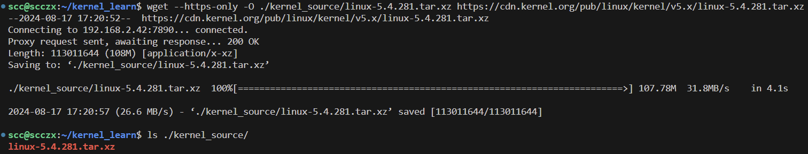

### 克隆一颗 Git 树

```bash
# 完整克隆（Full Clone）：默认的 git clone 会克隆整个仓库，包括所有的提交历史、分支和标签。这意味着我们将获得从仓库初始化到最新提交的所有数据。
git clone https://git.kernel.org/pub/scm/linux/kernel/git/torvalds/linux.git

# --depth : 克隆仓库的深度（历史记录的数量）
# 浅克隆（Shallow Clone）: 使用 --depth=3 选项时，Git 只会克隆最近的3次提交（即最近的3个commit），而不会获取整个仓库的完整历史记录
git clone --depth=3 https://git.kernel.org/pub/scm/linux/kernel/git/torvalds/linux.git
```


## 步骤2 -提取内核源代码树

本书使用的是 Linux 5.4 LTS ，但我们使用 git 拿到的是最新版的 linux，所以我们需要使用下载特定源代码的方式，然后提取其内核源代码树。

```bash
# 解压
tar -xf linux-5.4.xxx.tar.xz

# 设置环境变量指向内核源代码树（此方式仅在当前对话中有效，如果关闭过当前的shell或者关过机，请重新设置，或者网上搜索设置为永久环境变量的方式）
export LLKD_KSRC=${HOME}/kernel_learn/kernel_source/linux-5.4.281
```

### 内核源代码树简介

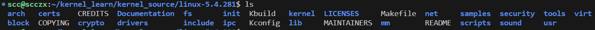

我们把内核源代码树根目录下的 Makefile 文件叫做 顶级 Makefile 文件，该文件前几行给出了该 Linux 的版本号等信息。

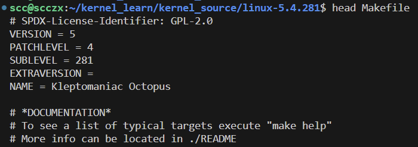

Linux 内核源代码树根目录

|    文件或目录名    | 用途                                                         |
| :----------------: | ------------------------------------------------------------ |
|    **顶层文件**    |                                                              |
|       README       | 项目的 README 文件。它告诉我们内核文档的位置——提示一下，它在名为 Documentation 的目录中——以及如何开始使用它。文档非常重要；它是真实的信息，由内核开发者自己编写。 |
|      COPYING       | 说明了内核源码发布的许可条款。绝大多数是在知名的 GNU GPL v2（写作 GPL-2.0）许可下发布的。 |
|    MAINTAINERS     | FAQ：某个模块出问题了，我该联系谁获得支持？这正是这个文件所提供的内容——内核子系统的完整列表，甚至详细到具体组件（例如特定驱动程序）的级别，其状态、当前维护人员、邮件列表、网站等。非常有帮助！还有一个辅助脚本可以帮助我们找到该联系的人员或团队：scripts/get_maintainer.pl。 |
|      Makefile      | 这是内核的顶级 Makefile；kbuild 内核构建系统以及内核模块使用这个 Makefile（至少在最初的构建中）。 |
| **主要子系统目录** |                                                              |
|      kernel/       | 核心内核子系统：这里的代码处理进程/线程生命周期、CPU调度、锁定、cgroups、定时器、中断、信号、模块、跟踪等。 |
|        mm/         | 大部分内存管理（mm）代码都在这里。我们将在第6章，内核内部 - 进程和线程基本知识中稍微介绍一下，并在第7章，内存管理内部 - 基础，以及第8章，内核模块作者的内存分配 - 第1部分中进一步讨论。 |
|        fs/         | 这里的代码实现了两个关键的文件系统功能：内核虚拟文件系统交换机（VFS），以及各个文件系统驱动程序（例如，ext[2\|4],btrfs, nfs, ntfs, overlayfs, squashfs, jffs2, fat, f2fs,等等） |
|       block/       | 与 VFS/FS 对应的底层块 I/O 代码路径。包括页面缓存的代码、通用块 I/O 层、I/O 调度器等。 |
|        net/        | 完整（符合请求注释 RFCs 标准）的网络协议栈实现。包括高质量的 TCP、UDP、IP 及许多其他网络协议的实现。 |
|        ipc/        | 进程间通信（IPC）子系统代码；涵盖 IPC 机制，例如（SysV 和 POSIX）消息队列、共享内存、信号量等。 |
|       sound/       | 音频子系统代码，也称为高级 Linux 声音架构（ALSA）。          |
|       virt/        | 虚拟化（管理程序）代码；流行且强大的内核虚拟机（KVM）在此实现。 |
| **基础设施/杂项**  |                                                              |
|       arch/        | 体系结构特定的代码位于此处（arch 代表 CPU 架构）。Linux 从一个小的兴趣项目开始，为 i386 架构开发，现在可能是移植最广泛的操作系统。 |
|      crypto/       | 此目录包含内核级密码实现（加密/解密算法，简称转换）以及服务于需要加密服务的消费者的内核 API。 |
|      include/      | 此目录包含与架构无关的内核头文件（也有一些架构特定的头文件位于 arch/<cpu>/include/... 中）。 |
|       init/        | 体系结构无关的内核初始化代码；这里或许是最接近内核主函数的位置（记住，内核不是应用程序）。 init/main.c 中的 start_kernel() 函数被认为是内核初始化过程中早期 C 入口点。 |
|        lib/        | 内核中最接近于库的部分。理解内核不支持用户空间应用程序使用的共享库很重要。这里的代码自动链接到内核镜像文件中，因此在内核运行时可用（在 /lib 中存在各种有用的组件：压缩/解压缩、校验和、位图、数学、字符串例程、树算法等）。 |
|      scripts/      | 各种脚本存放在此处，其中一些在内核构建期间使用，其他大多用于其他目的（例如静态/动态分析等；主要是 Bash 和 Perl）。 |
|     security/      | 包含内核的 Linux 安全模块（LSM），这是一个强制访问控制（MAC）框架，旨在对用户应用程序施加比默认内核更严格的访问控制（默认模型称为自由访问控制（DAC））。目前，Linux 支持几个 LSMs；知名的有 SELinux、AppArmor、Smack、Tomoyo、Integrity 和 Yama（注意，默认情况下 LSMs 是关闭的）。 |
|       tools/       | 各种工具存放在此处，大多是与内核“紧密耦合”的用户空间应用程序（或脚本）（例如现代的分析工具 perf 就是一个很好的例子）。 |

一些重要说明：

### 笔记总结：

1. **GNU GPL-2.0 许可证及其影响**

- **基本原理**：Linux 内核在 GNU GPL-2.0 许可证下发布，因此任何直接使用内核代码的项目（即使只使用了一点点）都必须在相同的许可证条款下发布其内核。这被称为“衍生作品”属性。
- **实际应用**：很多商业产品虽然运行在 Linux 内核上，但其中包含专有的用户空间或内核空间代码。通常这些产品通过将内核代码（尤其是设备驱动程序）重构为可加载内核模块（LKM）的形式来实现。这些模块有时使用双重许可模式（例如 BSD/GPL）。
- **争议**：有些开发者将内核代码以不遵循 GPL-2.0 许可的形式发布在内核模块中，这种做法在技术上可能可行，但通常被视为不合适，甚至可能违法。

2. **使用 get_maintainer.pl 脚本获取维护者信息**

- **脚本用途**：`get_maintainer.pl` 是一个 Perl 脚本，用于在 Git 树中查找特定代码路径的维护者信息。它输出负责维护特定模块或驱动程序的开发人员及其联系方式。
- **示例**：运行 `$ scripts/get_maintainer.pl -f drivers/android/` 可以得到负责 Android 驱动程序的维护者列表，包括他们的电子邮件地址。

3. **架构代 码目录**

- **示例命令**：`$ cd ${LLKD_KSRC} ; ls arch/` 用于列出内核源码树中 `arch/` 目录下的架构代码。
- **输出内容**：包括不同 CPU 架构的子目录，如 `alpha/`, `arm/`, `x86/`, `riscv/`, `sparc/`, `mips/` 等，展示了 Linux 内核对多种处理器架构的支持。


## 步骤3 -配置Linux内核

首先，让我们介绍一些内核构建（kbuild）系统的必要背景知识。

### 了解kbuild构建系统

Linux内核用来配置和构建内核的基础设施称为kbuild系统。kbuild系统通过四个关键组件将复杂的内核配置和构建过程联系在一起：

1. CONFIG_FOO 符号
2. 菜单规范文件，称为 Kconfig
3. Makefile 文件
4. 整体内核配置文件

|        **Kbuild 组件**        | **简要用途**                                                 |
| :---------------------------: | ------------------------------------------------------------ |
| **Config symbol: CONFIG_FOO** | 每个可配置的内核 `FOO` 都由一个 `CONFIG_FOO` 宏表示。根据用户的选择，宏将解析为 y、m 或 n 之一：<br> - **y=yes**：表示将功能内置到内核镜像中 <br> - **m=module**：表示将其构建为单独的对象，即内核模块 <br> - **n=no**：表示不构建该功能 <br> 注意，`CONFIG_FOO` 是一个字母数字字符串（正如我们即将看到的，我们可以使用 `make menuconfig` 选项查找配置选项名称，导航到一个配置选项，然后选择 `<Help>` 按钮）。 |
|       **Kconfig files**       | 这是定义 `CONFIG_FOO` 符号的地方。kbuild 语法指定了它的类型（布尔、三态、[alpha] 数字等）以及依赖关系树。此外，对于基于菜单的配置界面（通过 `make [menu|g|x]config` 调用），它指定了菜单条目本身。 |
|        **Makefile(s)**        | kbuild 系统使用递归 Makefile 方法。内核源码树根文件夹下的 Makefile 被称为顶级 Makefile，每个子文件夹内的 Makefile 用于构建其中的源码。5.4 vanilla 内核源码中共有 2,500 多个 Makefile！ |
|     **The .config file**      | 最终，其核心内容——实际的内核配置——在内核源码树根文件夹中生成并存储在一个名为 `.config` 的 ASCII 文本文件中。请妥善保存此文件，它是产品的重要组成部分。 |

### 达到默认配置

如何决定初始内核配置呢？有几种方法可供选择，以下是几种常见的方法：

1. 不指定任何配置；kbuild 系统会拉取一个默认的内核配置。
2. 使用现有发行版的内核配置。
3. 基于当前加载到内存中的内核模块构建自定义配置。

第一种方法的优点在于简单。内核会处理所有细节，为我们提供一个默认配置。缺点是默认配置实际上非常庞大（这里我们是指针对 x86 架构的桌面或服务器系统的构建）——开启了大量的选项，以防万一，这可能导致构建时间非常长，且内核镜像的大小非常大。当然，我们可以随后手动配置内核以达到所需的设置。

这引出了一个问题：默认的内核配置存储在哪里？kbuild 系统使用一个优先级列表回退机制来检索默认配置。优先级列表及其顺序（从最高优先级开始）在 `init/Kconfig:DEFCONFIG_LIST` 中指定：

```bash
cat init/Kconfig | less
    
# SPDX-License-Identifier: GPL-2.0-only
config DEFCONFIG_LIST
        string
        depends on !UML
        option defconfig_list
        default "/lib/modules/$(shell,uname -r)/.config"
        default "/etc/kernel-config"
        default "/boot/config-$(shell,uname -r)"
        default ARCH_DEFCONFIG
        default "arch/$(ARCH)/defconfig"

config CC_IS_GCC
        def_bool $(success,$(CC) --version | head -n 1 | grep -q gcc)

config GCC_VERSION
        int
        default $(shell,$(srctree)/scripts/gcc-version.sh $(CC)) if CC_IS_GCC
        default 0

config CC_IS_CLANG
		···
```

Kconfig 的内核文档中（可以在 https://www.kernel.org/doc/Documentation/kbuild/kconfig-language.txt 找到）描述了 `defconfig_list` 的作用：

```txt
  - "defconfig_list"
    这个配置声明了一个用于寻找默认配置的默认条目列表（当主要的 .config 文件尚不存在时使用）
```

从这个列表中可以看到，kbuild 系统首先检查 `/lib/modules/$(uname -r)` 文件夹中是否存在 `.config` 文件。如果找到，将使用其中的值作为默认配置。如果找不到，接下来会检查 `/etc/kernel-config` 文件是否存在。如果找到，将使用其中的值作为默认配置；如果仍然找不到，则继续检查优先级列表中的下一个选项，以此类推。

不过请注意，如果**在内核源码树的根目录中存在 `.config` 文件，它会覆盖上述所有的优先级设置！**

### 获得内核配置的良好起点

三种获取内核配置起点的方法：

1. 首先，适用于典型的小型嵌入式 Linux 系统的方式。
2. 接下来，是一种模拟发行版配置的方法。
3. 最后，是基于现有（或其他）系统的内核模块进行内核配置的方法（即 localmodconfig 方法）。

#### 典型嵌入式Linux系统的内核配置

内核代码库本身为各种硬件平台提供了已知的、经过测试的和可工作的内核配置文件。我们只需要选择一个匹配（或最接近匹配）我们的嵌入式目标板。这些内核配置文件位于内核源代码树中的arch/\<arch>/mysql/目录中。配置文件的格式为\<platformname>_defconfig。快速浏览一下;请参阅以下屏幕截图，其中显示了在v5.4 Linux内核代码库上执行的命令ls arch/arm/sms：

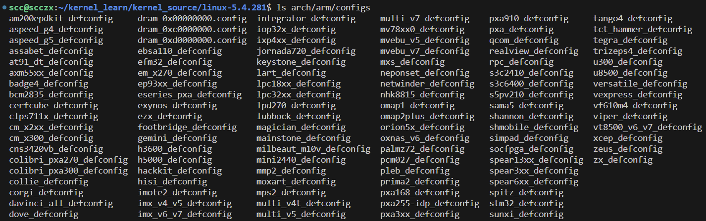

因此，例如，如果我们正在为硬件平台配置Linux内核，比如说，Samsung Exynos片上系统（SoC），不要将x86-64内核配置文件作为默认值（或简单地尝试使用它），内核不会干净地构建/工作。选择适当的内核配置文件：对于我们这里的示例，arch/arm/exynos_defconfig文件将是一个很好的起点。我们可以将该文件复制到内核源代码树根目录下的.config文件中，然后根据项目的具体需要对其进行微调。

#### 使用分发配置作为起点的内核配置

使用此方法的典型目标系统是桌面或服务器Linux系统：

```bash
cp /boot/config-5.4.0-84-generic ${LLKD_KSRC}/.config

# 通用
cp /boot/config-$(uname -r) ${LLKD_KSRC}/.config)
```

#### 通过localmodconfig方法优化内核配置

这种方法的典型目标系统是桌面或服务器的 Linux 系统。我们考虑的第三种方法非常适合在内核配置的起点基于现有系统的情况下使用，因此相较于桌面或服务器 Linux 系统的典型默认配置，这种配置通常较为紧凑。

在这里，我们通过简单地将 `lsmod(8)` 的输出重定向到一个临时文件，然后将该文件提供给构建过程，从而为 kbuild 系统提供了当前系统中正在运行的内核模块的快照。可以通过以下步骤实现：

```bash
lsmod > /tmp/lsmod.now
cd ${LLKD_KSRC}
make LSMOD=/tmp/lsmod.now localmodconfig
```

`lsmod` 工具简单地列出了当前驻留在系统（内核）内存中的所有内核模块。我们将在第4章《编写我们的第一个内核模块 - LKMs 第1部分》中看到更多相关内容。我们将其输出保存在一个临时文件中，并通过 `LSMOD` 环境变量将该文件传递给 Makefile 的 `localmodconfig` 目标。

这个目标的任务是配置内核，使其仅包含基本功能和这些内核模块提供的功能，并省略其他部分，从而有效地为我们提供了当前内核（或 `lsmod` 输出所代表的任何内核）的合理复本。我们将在接下来的“开始使用 `localmodconfig` 方法”部分中使用这种技术来配置我们的 5.4 内核。

到这里为止，我们已经介绍了设置内核配置起点的三种方法。实际上，我们只涉及了皮毛。kbuild 系统本身中还编码了许多生成内核配置的具体方法！如何实现？通过 `make` 的配置目标。在“配置目标”标题下可以看到它们：

```bash
$ cd ${LKDC_KSRC}  # 内核源码树的根目录
$ make help
```

Cleaning targets（清理目标）:

- **clean**：移除大多数生成的文件，但保留配置文件和足够的构建支持，以便构建外部模块。
- **mrproper**：移除所有生成的文件，包括配置文件和各种备份文件。这是一个更彻底的清理目标，用于确保内核源码树处于干净的状态。
- **distclean**：执行 `mrproper` 的所有操作，同时还移除编辑器备份文件和补丁文件。这是最彻底的清理目标，确保源码树没有任何额外的文件残留。

Configuration targets（配置目标）:

- **config**：使用行导向程序更新当前配置
- **nconfig**：使用 ncurses 菜单程序更新当前配置
- **menuconfig**：使用基于菜单的程序更新当前配置
- **xconfig**：使用基于 Qt 的前端更新当前配置
- **gconfig**：使用基于 GTK+ 的前端更新当前配置
- **oldconfig**：使用提供的 `.config` 文件作为基础更新当前配置
- **localmodconfig**：更新当前配置，禁用未加载的模块
- **localyesconfig**：更新当前配置，将本地模块转换为核心模块
- **defconfig**：使用 ARCH 提供的默认配置创建新配置
- **savedefconfig**：将当前配置保存为 `./defconfig`（最小配置）
- **allnoconfig**：创建一个所有选项都回答为 “no” 的新配置
- **allyesconfig**：创建一个所有选项都回答为 “yes” 的新配置
- **allmodconfig**：尽可能选择模块的新配置
- **alldefconfig**：创建一个所有符号设置为默认值的新配置
- **randconfig**：创建一个对所有选项随机回答的新配置
- **listnewconfig**：列出新选项
- **olddefconfig**：与 `oldconfig` 相同，但将新符号设置为默认值而不提示
- **kvmconfig**：启用对 KVM 客户机内核支持的额外选项
- **xenconfig**：启用对 Xen dom0 和客户机内核支持的额外选项
- **tinyconfig**：配置最小可能的内核
- **testconfig**：运行 Kconfig 单元测试（需要 python3 和 pytest）

Other generic targets（其他通用目标）:

- **all**：构建所有标记为 [*] 的目标

提示：为了确保一个干净的起点，首先使用 `mrproper` 目标。我们将在接下来总结所有执行的步骤。


### 开始使用localmodconfig方法

我们使用前面讨论过的第三种方法 : `localmodconfig技术`，快速开始为新内核创建基本内核配置。如上所述，当目标是通过保持相对较小的内核配置来获得基于x86的系统上的内核配置的起点时，这种现有的仅内核模块的方法是一种很好的方法，从而使构建速度更快。

首先获取当前加载的内核模块的快照，然后通过指定 `localmodconfig` 目标让 kbuild 系统基于这些模块进行操作：

```bash
# 设置初始内核配置文件
lsmod > /tmp/lsmod.now
cd ${LLKD_KSRC}
make LSMOD=/tmp/lsmod.now localmodconfig
```

当执行实际的 `make [...] localmodconfig` 命令时，当前正在构建的内核（例如版本 5.4）和当前实际运行构建的内核（例如版本 5.4.0-150-generic，使用 `$(uname -r)` 获取）之间可能会存在配置选项的差异。在这些情况下，kbuild 系统会在控制台（终端）窗口中显示每一个新的配置选项以及可设置的值。然后，它会提示用户为正在构建的内核中遇到的任何新配置选项选择值。我们会看到一系列问题，并需要在命令行中作答。简单来说，这段内容描述了在使用 `localmodconfig` 命令配置内核时，可能会遇到版本差异导致的新配置选项，并解释了用户如何在构建过程中通过命令行选择这些新配置的值。

目前，后续只需要按 Enter 接受默认选项

```bash
scc@scczx:~$ lsmod > /tmp/lsmod.now
scc@scczx:~$ cd ${LLKD_KSRC}
scc@scczx:~/kernel_learn/kernel_source/linux-5.4.281$ make LSMOD=/tmp/lsmod.now localmodconfig
  HOSTCC  scripts/basic/fixdep
  HOSTCC  scripts/kconfig/conf.o
  HOSTCC  scripts/kconfig/confdata.o
  HOSTCC  scripts/kconfig/expr.o
  LEX     scripts/kconfig/lexer.lex.c
  YACC    scripts/kconfig/parser.tab.[ch]
  HOSTCC  scripts/kconfig/lexer.lex.o
  HOSTCC  scripts/kconfig/parser.tab.o
  HOSTCC  scripts/kconfig/preprocess.o
  HOSTCC  scripts/kconfig/symbol.o
  HOSTLD  scripts/kconfig/conf
using config: '/boot/config-5.4.0-150-generic'
System keyring enabled but keys "debian/canonical-certs.pem" not found. Resetting keys to default value.
*
* Restart config...
*
*
* Linux/x86 5.4.281 Kernel Configuration
*
*
* Compiler: gcc (Ubuntu 7.5.0-3ubuntu1~18.04) 7.5.0
*
64-bit kernel (64BIT) [Y/n/?] y
Force GDS Mitigation (GDS_FORCE_MITIGATION) [N/y/?] (NEW) 
*
* PCI support
*
PCI support (PCI) [Y/n/?] y
  PCI Express Port Bus support (PCIEPORTBUS) [Y/n/?] y
    PCI Express Hotplug driver (HOTPLUG_PCI_PCIE) [Y/n/?] y
    PCI Express Advanced Error Reporting support (PCIEAER) [Y/n/?] y
      PCI Express error injection support (PCIEAER_INJECT) [N/m/y/?] n
      PCI Express ECRC settings control (PCIE_ECRC) [N/y/?] n
    PCI Express ASPM control (PCIEASPM) [Y/n/?] y
      Debug PCI Express ASPM (PCIEASPM_DEBUG) [N/y/?] (NEW) 
      Default ASPM policy
      > 1. BIOS default (PCIEASPM_DEFAULT)
        2. Powersave (PCIEASPM_POWERSAVE)
        3. Power Supersave (PCIEASPM_POWER_SUPERSAVE)
        4. Performance (PCIEASPM_PERFORMANCE)
      choice[1-4?]: 1
    PCI Express Downstream Port Containment support (PCIE_DPC) [Y/n/?] y
    PCI Express Precision Time Measurement support (PCIE_PTM) [Y/n/?] y
    PCI Express Bandwidth Change Notification (PCIE_BW) [N/y/?] n
  Message Signaled Interrupts (MSI and MSI-X) (PCI_MSI) [Y/?] y
  Enable PCI quirk workarounds (PCI_QUIRKS) [Y/n/?] y
  PCI Debugging (PCI_DEBUG) [N/y/?] n
  Enable PCI resource re-allocation detection (PCI_REALLOC_ENABLE_AUTO) [Y/n/?] y
  PCI Stub driver (PCI_STUB) [N/m/y/?] n
  PCI PF Stub driver (PCI_PF_STUB) [N/m/y/?] n
  Xen PCI Frontend (XEN_PCIDEV_FRONTEND) [N/m/y/?] n
  PCI IOV support (PCI_IOV) [Y/n/?] y
  PCI PRI support (PCI_PRI) [Y/?] y
  PCI PASID support (PCI_PASID) [Y/?] y
  PCI peer-to-peer transfer support (PCI_P2PDMA) [N/y/?] n
*
* PCI GPIO expanders
*
AMD 8111 GPIO driver (GPIO_AMD8111) [N/m/y/?] n
BT8XX GPIO abuser (GPIO_BT8XX) [N/m/y/?] (NEW) 
OKI SEMICONDUCTOR ML7213 IOH GPIO support (GPIO_ML_IOH) [N/m/y/?] n
ACCES PCI-IDIO-16 GPIO support (GPIO_PCI_IDIO_16) [N/m/y/?] n
ACCES PCIe-IDIO-24 GPIO support (GPIO_PCIE_IDIO_24) [N/m/y/?] n
RDC R-321x GPIO support (GPIO_RDC321X) [N/m/y/?] n
*
* PCI sound devices
*
PCI sound devices (SND_PCI) [Y/n/?] y
  Analog Devices AD1889 (SND_AD1889) [N/m/?] n
  Avance Logic ALS300/ALS300+ (SND_ALS300) [N/m/?] n
  Avance Logic ALS4000 (SND_ALS4000) [N/m/?] n
  ALi M5451 PCI Audio Controller (SND_ALI5451) [N/m/?] n
  AudioScience ASIxxxx (SND_ASIHPI) [N/m/?] n
  ATI IXP AC97 Controller (SND_ATIIXP) [N/m/?] n
  ATI IXP Modem (SND_ATIIXP_MODEM) [N/m/?] n
  Aureal Advantage (SND_AU8810) [N/m/?] n
  Aureal Vortex (SND_AU8820) [N/m/?] n
  Aureal Vortex 2 (SND_AU8830) [N/m/?] n
  Emagic Audiowerk 2 (SND_AW2) [N/m/?] n
  Aztech AZF3328 / PCI168 (SND_AZT3328) [N/m/?] n
  Bt87x Audio Capture (SND_BT87X) [N/m/?] n
  SB Audigy LS / Live 24bit (SND_CA0106) [N/m/?] n
  C-Media 8338, 8738, 8768, 8770 (SND_CMIPCI) [N/m/?] n
  C-Media 8786, 8787, 8788 (Oxygen) (SND_OXYGEN) [N/m/?] n
  Cirrus Logic (Sound Fusion) CS4281 (SND_CS4281) [N/m/?] n
  Cirrus Logic (Sound Fusion) CS4280/CS461x/CS462x/CS463x (SND_CS46XX) [N/m/?] n
  Creative Sound Blaster X-Fi (SND_CTXFI) [N/m/?] n
  (Echoaudio) Darla20 (SND_DARLA20) [N/m/?] n
  (Echoaudio) Gina20 (SND_GINA20) [N/m/?] n
  (Echoaudio) Layla20 (SND_LAYLA20) [N/m/?] n
  (Echoaudio) Darla24 (SND_DARLA24) [N/m/?] n
  (Echoaudio) Gina24 (SND_GINA24) [N/m/?] n
  (Echoaudio) Layla24 (SND_LAYLA24) [N/m/?] n
  (Echoaudio) Mona (SND_MONA) [N/m/?] n
  (Echoaudio) Mia (SND_MIA) [N/m/?] n
  (Echoaudio) 3G cards (SND_ECHO3G) [N/m/?] n
  (Echoaudio) Indigo (SND_INDIGO) [N/m/?] n
  (Echoaudio) Indigo IO (SND_INDIGOIO) [N/m/?] n
  (Echoaudio) Indigo DJ (SND_INDIGODJ) [N/m/?] n
  (Echoaudio) Indigo IOx (SND_INDIGOIOX) [N/m/?] n
  (Echoaudio) Indigo DJx (SND_INDIGODJX) [N/m/?] n
  Emu10k1 (SB Live!, Audigy, E-mu APS) (SND_EMU10K1) [N/m/?] n
  Emu10k1X (Dell OEM Version) (SND_EMU10K1X) [N/m/?] n
  (Creative) Ensoniq AudioPCI 1370 (SND_ENS1370) [N/m/?] n
  (Creative) Ensoniq AudioPCI 1371/1373 (SND_ENS1371) [M/n/?] m
  ESS ES1938/1946/1969 (Solo-1) (SND_ES1938) [N/m/?] n
  ESS ES1968/1978 (Maestro-1/2/2E) (SND_ES1968) [N/m/?] n
  ForteMedia FM801 (SND_FM801) [N/m/?] n
  RME Hammerfall DSP Audio (SND_HDSP) [N/m/?] n
  RME Hammerfall DSP MADI/RayDAT/AIO (SND_HDSPM) [N/m/?] n
  ICEnsemble ICE1712 (Envy24) (SND_ICE1712) [N/m/?] n
  ICE/VT1724/1720 (Envy24HT/PT) (SND_ICE1724) [N/m/?] n
  Intel/SiS/nVidia/AMD/ALi AC97 Controller (SND_INTEL8X0) [N/m/?] n
  Intel/SiS/nVidia/AMD MC97 Modem (SND_INTEL8X0M) [N/m/?] n
  Korg 1212 IO (SND_KORG1212) [N/m/?] n
  Digigram Lola (SND_LOLA) [N/m/?] n
  Digigram LX6464ES (SND_LX6464ES) [N/m/?] n
  ESS Allegro/Maestro3 (SND_MAESTRO3) [N/m/?] n
  Digigram miXart (SND_MIXART) [N/m/?] n
  NeoMagic NM256AV/ZX (SND_NM256) [N/m/?] n
  Digigram PCXHR (SND_PCXHR) [N/m/?] n
  Conexant Riptide (SND_RIPTIDE) [N/m/?] n
  RME Digi32, 32/8, 32 PRO (SND_RME32) [N/m/?] n
  RME Digi96, 96/8, 96/8 PRO (SND_RME96) [N/m/?] n
  RME Digi9652 (Hammerfall) (SND_RME9652) [N/m/?] n
  Studio Evolution SE6X (SND_SE6X) [N/m/?] (NEW) 
  S3 SonicVibes (SND_SONICVIBES) [N/m/?] n
  Trident 4D-Wave DX/NX; SiS 7018 (SND_TRIDENT) [N/m/?] n
  VIA 82C686A/B, 8233/8235 AC97 Controller (SND_VIA82XX) [N/m/?] n
  VIA 82C686A/B, 8233 based Modems (SND_VIA82XX_MODEM) [N/m/?] n
  Asus Virtuoso 66/100/200 (Xonar) (SND_VIRTUOSO) [N/m/?] n
  Digigram VX222 (SND_VX222) [N/m/?] n
  Yamaha YMF724/740/744/754 (SND_YMFPCI) [N/m/?] n
#
# configuration written to .config
#
```

多次按下 Enter 之后， kbuild 系统将生成的配置写入当前工作目录中的 .config 文件中。

```c
scc@scczx:~/kernel_learn/kernel_source/linux-5.4.281$ ls -la .config
-rw-rw-r-- 1 scc scc 150750 8月  18 13:35 .config
```

需要注意的是，当每次想要保持初始干净的状态的时候，就在内核源代码树的根目录执行 `make mrproper` 或者 `make distclean` ，同时这样也会删除内核配置文件。

### 通过 `make menuconfig` UI 来调整我们的内核配置

之前我们通过 `localmodconfig` Makefile 目标为我们生成了一个初始的内核配置文件（`.config`），现在我们使用 `menuconfig` Makefile 目标。这个目标会让 kbuild 系统生成一个非常复杂的（基于 C 语言的）可执行程序（`scripts/kconfig/mconf`），它为最终用户提供了一个简洁的基于菜单的用户界面（UI）

在当前内核源代码树根目录下执行 `make menuconfig`（如果遇到错误，请查看是否是缺少某个包，安装完之后再次尝试）：

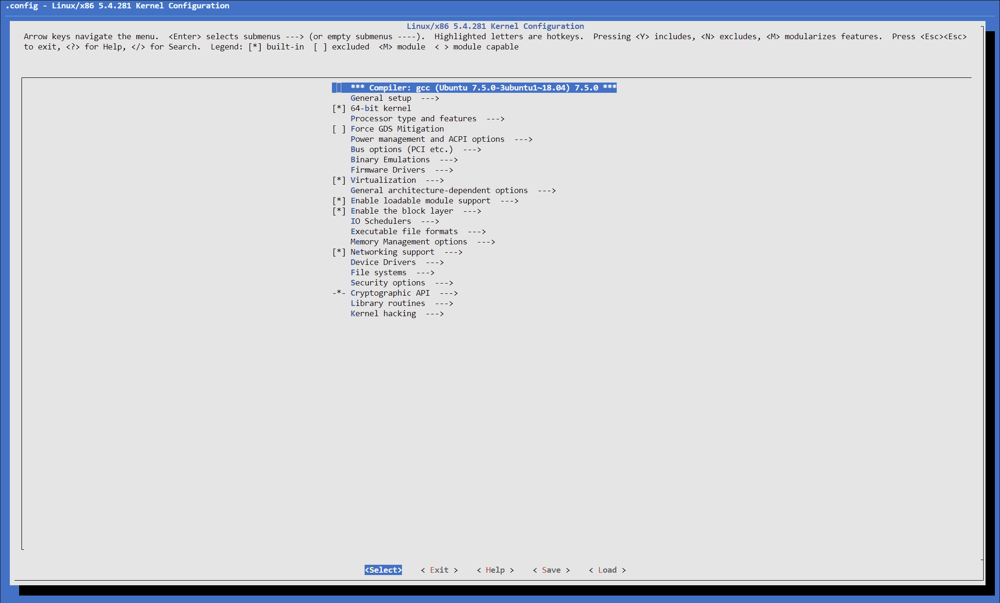

菜单项前缀符号的含义如下：

- `[.]`：内核功能，布尔选项（它要么打开，要么关闭）：
  - `[*]`：打开，功能已编译并内置（compiled in）到内核镜像中（`y`）。
  - `[ ]`：关闭，功能完全未编译（`n`）。

- `<.>`：一个可以处于三种状态之一的功能（三态选项）：
  - `<*>`：打开，功能已编译并内置（compiled in）到内核镜像中（`y`）。
  - `<M>`：模块，功能已编译并作为内核模块（LKM）构建（`m`）。
  - `< >`：关闭，功能完全未编译（`n`）。

- `{.}`：该配置选项有一个依赖项，因此它必须被编译为模块（`m`）或内置（`compiled in`）到内核镜像中（`y`）。
- `-*-`：一个依赖项要求这个项目被内置（`y`）。
- `(...)`：提示：需要字母数字输入（在此选项上按下 [Enter] 键会出现一个提示）。
- `<Menu entry> --->`：一个子菜单跟随其后（在此项目上按 [Enter] 键可导航到子菜单）。

让我们通过实际操作 `make menuconfig` 用户界面来看看它是如何工作的。这将是下一部分的主题。

### make menuconfig UI的示例用法

为了熟悉使用 kbuild 菜单系统中的 `menuconfig` 目标，让我们逐步完成一个流程，导航到一个名为 "Kernel .config support" 的三态菜单项。默认情况下，这个选项是关闭的，所以我们将其打开，也就是将其设置为 `y`，将其内置到内核镜像中。我们可以在主屏幕的 "General Setup" 主菜单项下找到它。

那么，开启这个功能到底能实现什么呢？当这个选项设置为 `y`（或者，如果设置为 `M`，那么一个内核模块将会被生成，并且一旦加载），当前运行的内核的配置设置可以通过以下两种方式随时查阅：

1. 运行 `scripts/extract-ikconfig` 脚本。
2. 直接读取 `/proc/config.gz` 伪文件的内容（当然，这个文件是 gzip(1) 压缩的；我们需要先解压它，然后再读取）。

作为一个学习练习，我们将学习如何为 x86-64 架构配置 5.4 Linux 内核，并将内核配置选项设置为下表所示的值。现在，不必担心每个选项的具体含义；这只是为了熟悉和练习内核配置系统的操作。

表格中每一列的含义及其作用（以表中第一个为例）：

1. **第一列**：指定我们希望修改（编辑/启用/禁用）的内核功能。在这个例子中，它是内核版本字符串的最后一部分（可以通过 `uname -r` 的输出看到）。这部分被称为发布版本的 `-EXTRAVERSION` 组件（有关详细信息，请参阅内核发布命名法部分）。

2. **第二列**：指定了两件事：
   - 我们正在尝试做什么。在这里，我们希望设置内核发布字符串的 `-EXTRAVERSION` 组件。
   - 这个内核配置选项在 `menuconfig` 界面中的位置。在这个例子中，它位于 "General Setup" 子菜单中，并且在该子菜单下有一个名为 "Local version - append to kernel release" 的菜单项。我们将其写为 `General Setup / Local version - append to kernel release`。

3. **第三列**：指定了内核配置选项的名称，表示为 `CONFIG_<FOO>`。如果需要，我们可以在菜单系统中搜索这个选项名称。在这个例子中，它被称为 `CONFIG_LOCALVERSION`。

4. **第四列**：显示了这个内核配置选项的原始值以及我们希望我们将其更改为的值（“新”值）。格式为 `原始值 -> 新值`。在我们的例子中，原始值是 `(none)`，新值是 `-llkd01`，这意味着 `-EXTRAVERSION` 字符串组件的原始值为空，我们希望我们将其更改为 `-llkd01`。

对于其他一些项目，可能不那么显而易见——例如 `n -> m`；这意味着什么？`n -> m` 表示我们应该将原始值从 `n`（未选择）更改为 `m`（选择为内核模块进行构建）。类似地，`y -> n` 表示将配置选项从开启改为关闭。

|                           **功能**                           | **在 make menuconfig UI 中的效果和位置**                     | **选择 \<Help> 按钮查看精确的 CONFIG_\<FOO> 选项** | **值：原始值 --> 新值**     |
| :----------------------------------------------------------: | ------------------------------------------------------------ | -------------------------------------------------- | --------------------------- |
|                      **Local version**                       | 设置内核发布版本的 `-EXTRAVERSION` 组件（可以使用 `uname -r` 查看）；`General Setup / Local version – append to kernel release` | CONFIG_LOCALVERSION                                | (none) -> -llkd01(可自定义) |
|                **Kernel config file support**                | 允许查看当前内核配置详细信息；`General Setup / Kernel .config support` | CONFIG_IKCONFIG                                    | n -> y                      |
|     **The same as the preceding plus access via procfs**     | 允许通过 proc 文件系统（procfs）查看当前内核配置详细信息；`General Setup / Enable access to .config through /proc/config.gz` | CONFIG_IKCONFIG_PROC                               | n -> y                      |
|                     **Kernel profiling**                     | 内核分析支持；`General Setup / Profiling support`            | CONFIG_PROFILING                                   | y -> n                      |
|                        **HAM radio**                         | 支持业余无线电（HAM radio）；`Networking support / Amateur Radio support` | CONFIG_HAMRADIO                                    | y -> n                      |
|                    **VirtualBox support**                    | （准）虚拟化支持 VirtualBox；`Device Drivers / Virtualization drivers / Virtual Box Guest integration support` | CONFIG_VBOXGUEST                                   | n -> m                      |
|                **Userspace IO Drivers (UIO)**                | UIO 支持；`Device Drivers / Userspace I/O Drivers`           | CONFIG_UIO                                         | n -> m                      |
| **The preceding plus the UIO platform driver with generic IRQ handling** | UIO 平台驱动程序带有通用 IRQ 处理；`Device Drivers / Userspace I/O Drivers / Userspace I/O platform driver with generic IRQ handling` | CONFIG_UIO_PDRV_GENIRQ                             | n -> m                      |
|                **MS-DOS filesystem support**                 | MS-DOS 文件系统支持；`File systems / DOS/FAT/NT filesystems / MSDOS fs support` | CONFIG_MSDOS_FS                                    | n -> m                      |
|                      **Security: LSMs**                      | 关闭内核 LSMs；`Security options / Enable different security models` （注意：通常在生产系统中保持开启更安全！） | CONFIG_SECURITY                                    | y -> n                      |
|           **Kernel debug: stack utilization info**           | 内核调试：栈利用信息；`Kernel hacking / Memory Debugging / Stack utilization instrumentation` | CONFIG_DEBUG_STACK_USAGE                           | n -> y                      |

下面我们以第二项 **Kernel config file support**配置为例说明应该如何进行配置修改：

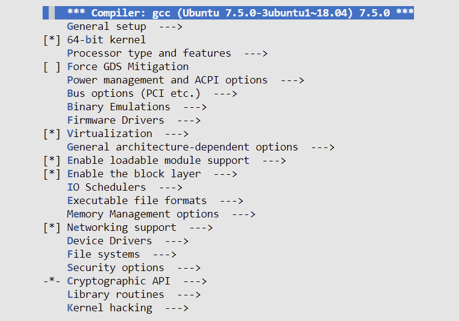

首先，根据表格第二列的内容，我们知道了需要在 `General Setup / Kernel .config support` 下对其进行配置，所以先就进入 General Setup（找到相关项，按 Enter 进入），并找到 Kernel .config support 所在位置：

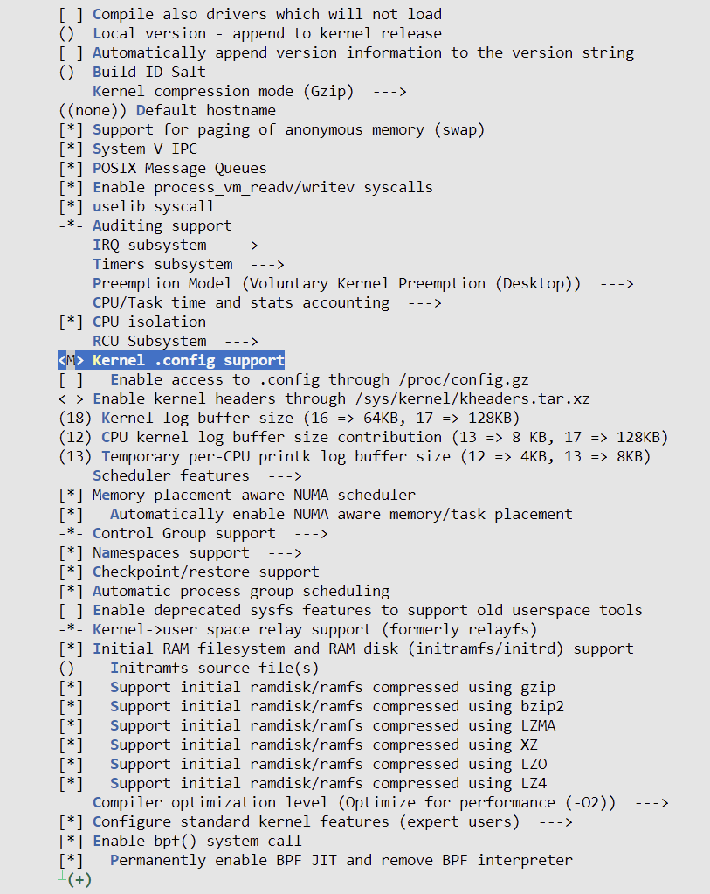

左右方向键切换，可以选中并进入该项的 \<help> 选项：

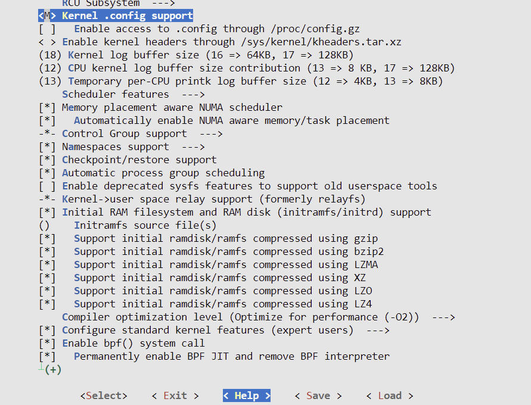


按 Enter 退出之后，按 `空格` 将 **\<M>（被编译为模块）---->  \<*>（被内置到内核中）**

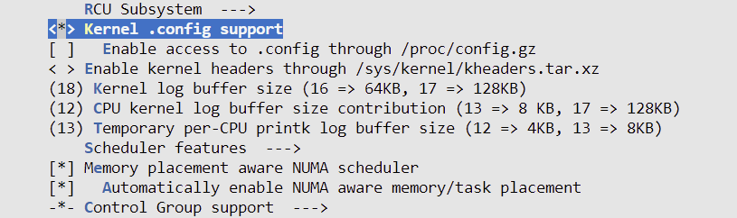

然后，找到下一项，按一下空格，即可完成表中第三个的配置：

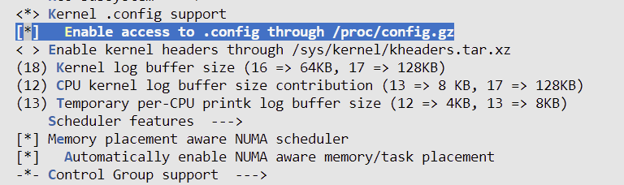

······

当所有都配置完之后，按 \<Exit> 退出（直到根目录才会弹出确认框，如果想继续编辑则 按两次 \<Esc> 即可返回编辑页面），在确认框选择 \<yes> 保存并返回 shell：

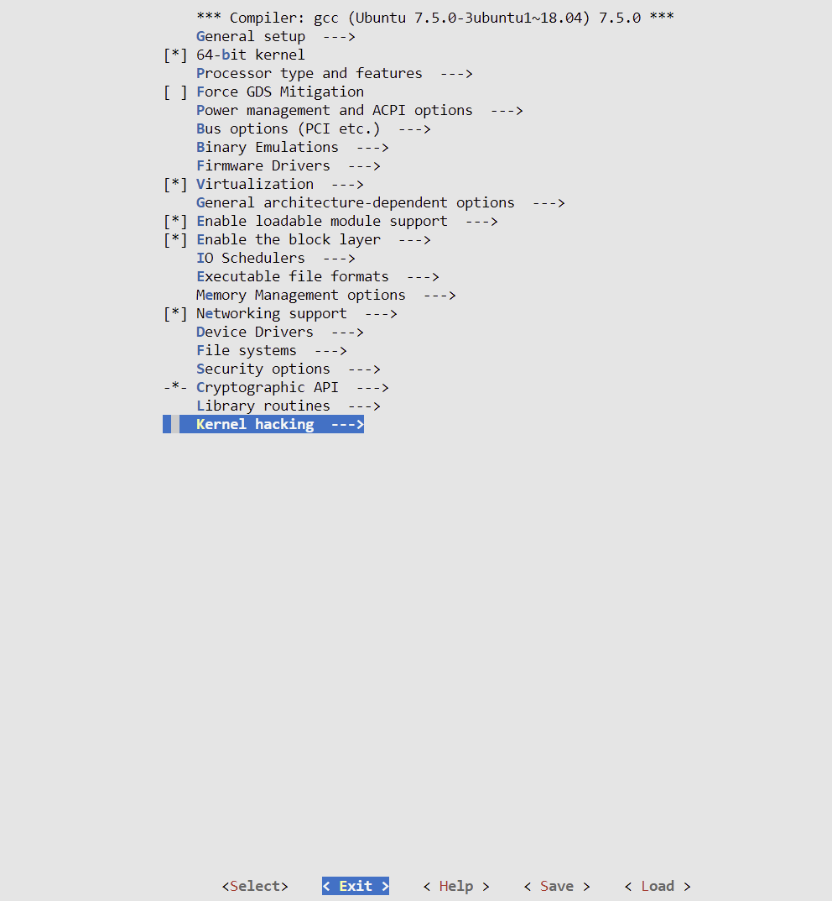

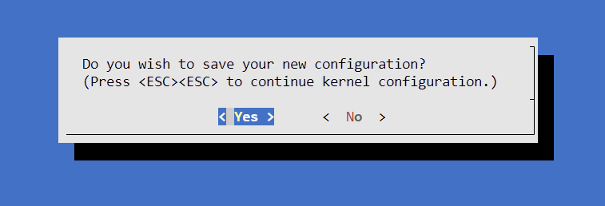

新的内核配置会被保存为一个简单的 ASCII 文本文件，文件名为 `.config`，位于内核源码树的根目录下。具体来说，它被保存为 `${LLKD_KSRC}/.config`。

每一个内核配置选项都与一个形式为 `CONFIG_<FOO>` 的配置变量相关联，其中 `<FOO>` 是适当的名称。在内部，这些配置变量会成为构建系统和内核源码使用的宏。例如，针对 `Kernel .config support` 选项，运行以下命令可以查看相关的配置：

```bash
grep IKCONFIG .config

grep LOCALVERSION .config
# 中间这个值是不是就是我们表中第三列值
```

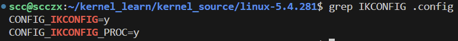

### 关于KBuild的更多信息

在内核源码树根目录中通过 `make menuconfig` 或其他方法创建或编辑 `.config` 文件，并不是 kbuild 系统处理配置的最终步骤。接下来，kbuild 系统会内部调用一个名为 `syncconfig` 的目标（之前曾被错误命名为 `silentoldconfig`）。这个目标会让 kbuild 生成一些头文件，这些头文件在构建内核的设置中进一步使用。这些文件包括 `include/config` 目录下的一些元头文件，以及 `include/generated/autoconf.h` 头文件。后者将内核配置存储为 C 语言的宏，从而使内核的 Makefile 和内核代码能够根据某个内核功能是否可用来做出决策。

接下来，如果我们在寻找某个特定的内核配置选项时遇到了困难，也不用担心，`menuconfig` 用户界面系统提供了一个搜索配置参数的功能。就像著名的 `vi` 编辑器一样，按下 `/`（斜杠键）会弹出一个搜索对话框，然后我们可以输入我们的搜索词（可以带 `CONFIG_` 前缀，也可以不带），并选择 `<Ok>` 按钮来进行搜索。

### 查找配置中的差异

在 `.config` 内核配置文件即将被写入时，kbuild 系统会检查它是否已经存在，如果存在，它会将现有文件备份为 `.config.old`。知道这一点后，我们可以通过比较这两个文件来查看我们所做的更改。然而，使用常规的 `diff(1)` 工具进行比较时，差异信息往往难以解读。内核提供了一种更好的方法：一个专门用于执行此操作的控制台脚本，位于内核源码树中的 `scripts/diffconfig` 脚本非常有用。

```bash
# 查看帮助
./scripts/diffconfig --help
```

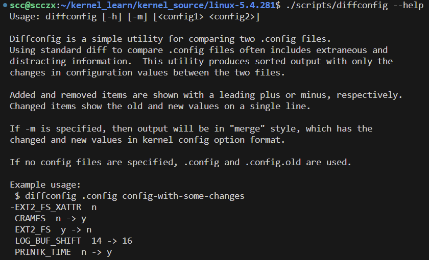

运行试试，可以看到中间有 `n -> y` ，这种就是我们进行修改过的：

```bash
$ ./scripts/diffconfig .config.old .config
-AX25 n
-DEFAULT_SECURITY_APPARMOR y
-DEFAULT_SECURITY_SELINUX n
-DEFAULT_SECURITY_SMACK n
-DEFAULT_SECURITY_TOMOYO n
······
-SIGNATURE y
 DEBUG_STACK_USAGE n -> y
 DEFAULT_SECURITY_DAC n -> y
 HAMRADIO y -> n
 IKCONFIG m -> y
 IKCONFIG_PROC n -> y
 LOCALVERSION "" -> "-sccxz01"
 MSDOS_FS n -> m
 PROFILING y -> n
 SECURITY y -> n
 UIO n -> m
 VBOXGUEST n -> m
 +KPC2000 n
······
```

### 自定义内核菜单-添加我们自己的菜单项


#### Kconfig* 文件

位于内核源代码树根目录的 `Kconfig` 文件用于填充 `menuconfigUI` 的初始屏幕。它的工作原理是**在内核源代码树的不同文件夹中获取各种其他Kconfig文件**。下表总结了更重要的Kconfig* 文件以及它们在kbuild UI中提供的菜单：

|                           **菜单**                           | **Kconfig 文件位置**                       |
| :----------------------------------------------------------: | :----------------------------------------- |
|                     **主菜单，初始屏幕**                     | Kconfig                                    |
|             **常规设置**<br>+ 启用可加载模块支持             | init/Kconfig                               |
| **处理器类型和功能**<br/>+ 总线选项 + 二进制仿真<br/>（特定于架构；上面的菜单标题适用于 x86；通常情况下，<br/>Kconfig 文件位于：`arch/<arch>/Kconfig`） | arch/<arch>/Kconfig                        |
|                         **电源管理**                         | kernel/power/Kconfig                       |
|                         **固件驱动**                         | drivers/firmware/Kconfig                   |
|                          **虚拟化**                          | arch/<arch>/kvm/Kconfig                    |
|                     **通用架构依赖选项**                     | arch/Kconfig                               |
|                **启用块层**<br/>+ IO 调度程序                | block/Kconfig                              |
|                      **可执行文件格式**                      | fs/Kconfig.binfmt                          |
|                       **内存管理选项**                       | mm/Kconfig                                 |
|                         **网络支持**                         | net/Kconfig, <br/>net/*/Kconfig            |
|                       **设备驱动程序**                       | drivers/Kconfig, <br/>drivers/*/Kconfig    |
|                         **文件系统**                         | fs/Kconfig, <br/>fs/*/Kconfig              |
|                         **安全选项**                         | security/Kconfig, <br/>security/*/Kconfig* |
|                         **加密 API**                         | crypto/Kconfig, <br/>crypto/*/Kconfig      |
|                          **库例程**                          | lib/Kconfig, <br/>lib/*/Kconfig            |
|                         **内核调试**                         | lib/Kconfig.debug, <br/>lib/Kconfig.*      |

#### 在Kconfig文件中创建新菜单项

我们在 "常规设置" 菜单中添加一个布尔型的虚拟配置选项。我们希望这个配置选项的名称为 `CONFIG_LLKD_OPTION1`。正如前表所示，相关的 Kconfig 文件是 `init/Kconfig`，因为这是定义 "常规设置" 菜单的元文件。

1. 为了安全起见，始终先备份文件：

   ```bash
   cp init/Kconfig init/Kconfig.orig
   ```

2. 现在编辑 `init/Kconfig` 文件：

   ```bash
   # 使用 vim 是个人习惯，作者使用 vi
   vim init/Kconfig
   ```

向下滚动到文件中的适当位置；在这里，选择在 `config LOCALVERSION_AUTO` 之后插入我们的菜单项（144-155行）：

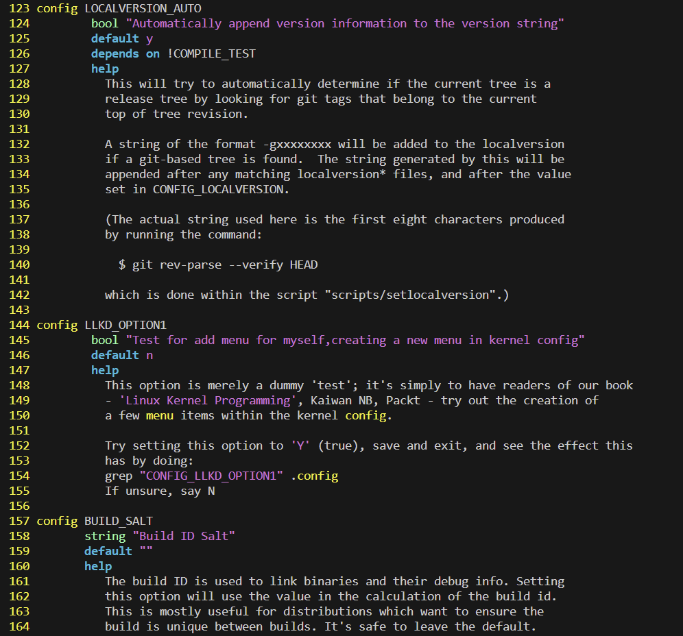

保存退出，重新 `make menuconfig`，可以看到我们自己添加的内核配置菜单，也可以查看其 \<help> ，按空格打开该项：

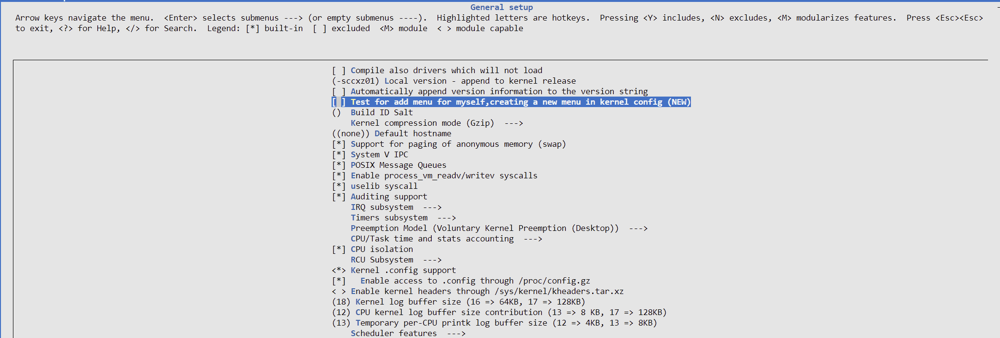

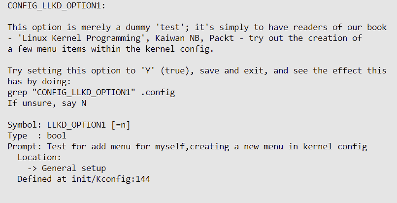

当我们按下空格打开该项，然后保存退出之后，可以看到其确实在 .config 文件中被设置为 on，但目前该配置并没有在内核内部自动生成的头文件中。

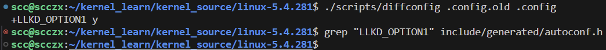

编译一下：

```bash
# 编译时间挺长
make -j4
```

可以看到有了：

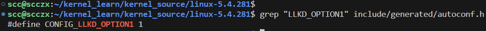

我们可以看到，同样的配置可以在一段内核代码中用作普通的C宏;例如，我们可以这样做：

```c
#ifdef CONFIG_LLKD_OPTION1
	do_our_thing();
#endif
```

然而，非常值得注意的是，Linux内核社区已经设计并严格遵守了某些严格的编码风格指南。在这种情况下，指导方针指出，应尽可能避免条件编译，如果需要使用Kconfig符号作为条件，那么请这样做：

```c
if（IS_ENABLED（CONFIG_LLKD_OPTION1））
{ 
    do_our_thing（）; 
}
```

#### 关于Kconfig语言的一些细节

到目前为止，我们对Kconfig语言的使用只是众所周知的冰山一角。事实上，kbuild系统使用Kconfig语言（或语法）来表达和创建菜单，使用简单的ASCII文本指令。该语言包括菜单项、属性、（反向）依赖项、可见性约束、帮助文本等。

下表简要（且不完整）提及了更常见的Kconfig构造：

|              **构造**              | **含义**                                                     |
| :--------------------------------: | ------------------------------------------------------------ |
|         **config  \<FOO>**         | 指定菜单项名称（格式为 `CONFIG_FOO`）；只需要填入 `FOO` 部分。 |
|            **菜单属性**            |                                                              |
|    **bool ["\<description>"]**     | 将配置选项指定为布尔值；其在 `.config` 文件中的值将是 `Y`（内置到内核镜像中）或不存在（将作为注释条目显示）。 |
|  **tristate ["\<description>"]**   | 将配置选项指定为三态值；其在 `.config` 文件中的值将是 `Y`（内置到内核镜像中），`M`（作为内核模块编译），或不存在（将作为注释条目显示）。 |
|     **int ["\<description>"]**     | 指定配置选项为整数值。                                       |
|           **range x-y**            | 指定整数范围，从 `x` 到 `y`。                                |
|       **default  \<value>**        | 指定默认值；根据需要使用 `y`、`m`、`n` 或其他值。            |
|    **prompt " \<description>"**    | 描述内核配置的句子。                                         |
|       **depends on "expr"**        | 定义菜单项的依赖项；可以有多个 `depends on FOO1 && FOO2 && (FOO3 || FOO4)` 类型的语法。 |
| **select  \<config>  [if "expr"]** | 定义一个反向依赖。                                           |
|        **help "help-text"**        | 当选择 `<Help>` 按钮时显示的文本。                           |

## 总结

在本章中，我们首先学习了如何获取 Linux 内核源代码树。然后，了解了内核版本命名规则，以及各种类型的 Linux 内核（如 -next 树、-rc/主线树、稳定版、LTS、SLTS 和发行版）的区分和基本的内核开发工作流程。在此过程中，还快速浏览了内核源代码树的布局，使其结构更为清晰。接着，学习了如何将压缩的内核源代码树解压到磁盘上，并且重点掌握了如何配置内核——这是整个过程中至关重要的一步。此外，还学会了如何定制内核菜单，添加自己的条目，以及了解了 kbuild 系统及其使用的 Kconfig 文件等内容。