# Chapter4 Writing Your First Kernel Module - LKMs Part 1

在本章中，我们将开始快速浏览Linux内核架构的基础知识，这将帮助我们理解LKM框架。然后，我们将研究为什么内核模块是有用的，并编写我们自己的简单的 “Hello world” LKM，构建并运行它。我们将看到消息是如何写入内核日志的，并理解和使用LKM Makefile。

在本章结束时，我们将学习Linux内核体系结构和LKM框架的基础知识，并将其应用于编写一段简单而完整的内核代码。

在本章中，我们将介绍以下内容：

- 理解内核架构——第一部分
- 探索可加载内核模块（LKMs）
- 编写我们的第一个内核模块
- 内核模块的常见操作
- 理解内核日志记录和 `printk`
- 理解内核模块 `Makefile` 的基础知识

## 技术要求

要在Linux发行版（或自定义系统）上构建和使用内核模块，我们至少需要安装以下两个组件：

- 工具链：包括编译器、汇编器、链接器/加载器、C库和其他各种组件。

  ```bash
  sudo apt-get install gcc
  ```

- 内核头文件：这些头文件将在编译过程中使用。

  ```bash
  sudo apt-get install linux-headers-generic
      
  # 验证 linux-headers-generic 是否安装
  `dpkg -l | grep linux-headers | awk '{print $1, $2}'
  
  # ii linux-headers-5.4.0-150-generic
  # ii linux-headers-5.4.0-84-generic
  # ii linux-headers-generic-hwe-18.04
  
  # 使用我们自己编译的内核的话就需要我们在内核源码树自己生成
  cd kernel_learn/kernel_source/linux-5.4.281/
  # 这会将头文件安装到默认目录 /usr/include
  make headers_install
  `dpkg -l | grep linux-headers | awk '{print $1, $2}'
  ```

## 了解内核架构-第1部分

本节中，我们开始深入理解内核。更具体地说，我们探讨用户空间和内核空间的概念，以及构成Linux内核的主要子系统和各种组件。

### 用户空间和内核空间

现代微处理器至少支持两个特权级别。以现实中的例子来说，Intel/AMD x86[-64]系列支持四个特权级别（称之为环级别），而 ARM（32位）微处理器系列则支持多达七个级别（ARM称它们为执行模式；其中六个是特权模式，一个是非特权模式）。

这里的关键点是，为了平台的安全性和稳定性，所有在这些处理器上运行的现代操作系统都会使用（至少）两个特权级别（或模式）：

- 用户空间：应用程序在非特权用户模式下运行
- 内核空间：内核（及其所有组件）在特权模式——内核模式下运行

下图展示了这种基本的架构：

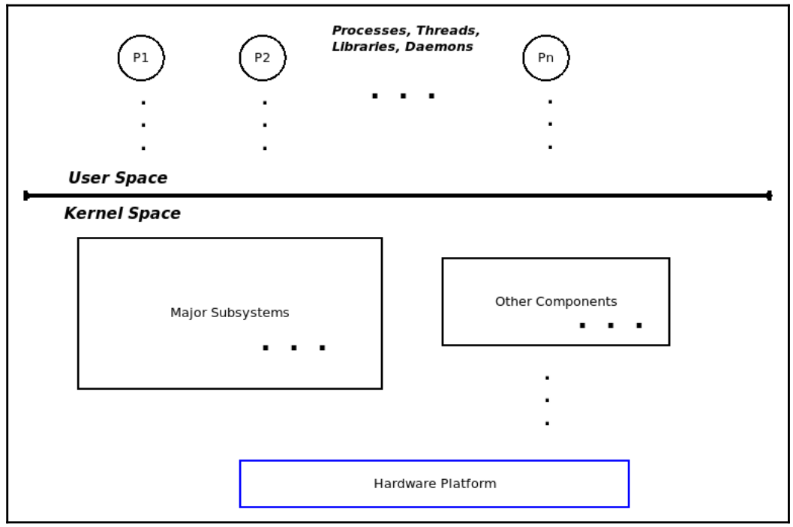

### 库和系统调用API

**用户空间应用程序通常依赖于应用程序编程接口（API）来完成其工作**。库本质上是API的集合或存档，允许我们使用标准化、编写良好且经过充分测试的接口（并利用常见的好处：无需重新发明轮子、可移植性、标准化等）。

Linux系统中有几个库；在企业级系统上，拥有数百个库并不罕见。在这些库中，所有用户模式的Linux应用程序（可执行文件）都会自动链接到一个重要且总是使用的库：glibc（GNU标准C库）。然而，库仅在用户模式下可用；内核没有库（在下一章中会详细讨论这一点）。

库API的例子包括众所周知的`printf()`、`scanf()`、`strcmp()`、`malloc()`和`free()`。

现在，有一个关键点：如果用户和内核是独立的地址空间，并且具有不同的权限级别，用户进程如何访问内核？简短的答案是通过**系统调用**。系统调用是一种特殊的API，是用户空间进程访问内核的唯一合法（同步的）途径。换句话说，**系统调用是进入内核空间的唯一合法入口**。它们具有从非特权用户模式切换到特权内核模式的能力。系统调用的例子包括`fork()`、`execve()`、`open()`、`read()`、`write()`、`socket()`、`accept()`、`chmod()`等。

这里强调的要点是，用户应用程序和内核之间的通信实际上只能通过系统调用实现，这就是接口。

### 内核空间部分

如今的Linux内核是一个相当庞大而复杂的系统。内部，它由几个主要的子系统和多个组件组成。对内核子系统和组件的广泛列举包括以下内容：

- **核心内核**：这部分代码处理任何现代操作系统的典型核心工作，包括**（用户和内核）进程与线程的创建/销毁、CPU调度、同步原语、信号处理、定时器、中断处理、命名空间、控制组（cgroups）、模块支持、加密等**。

- **内存管理（MM）**：处理所有与内存相关的工作，包括内核和进程虚拟地址空间（VAS）的设置和维护。

- **虚拟文件系统（VFS）**：VFS是Linux内核中实际文件系统（例如ext[2|4]、vfat、reiserfs、ntfs、msdos、iso9660、JFFS2和UFS等）的抽象层。

- **块IO**：从VFS到块设备驱动程序及其间所有实现实际文件I/O的代码路径（确实很多！）都涵盖在这里。

- **网络协议栈**：Linux因其精确的、高质量的网络协议实现而闻名，包括TCP/IP在内的所有层次的常见（和不太常见的）网络协议。

- **进程间通信（IPC）支持**：在这里实现IPC机制；Linux支持消息队列、共享内存、信号量（包括旧的SysV和新的POSIX信号量）及其他IPC机制。

- **声音支持**：从固件到驱动程序和编解码器，所有实现音频的代码都在这里。

- **虚拟化支持**：Linux因其高质量、低开销的虚拟化引擎（基于内核的虚拟机，KVM）而在大大小小的云服务提供商中非常受欢迎。

这些构成了主要的内核子系统；此外，我们还有以下内容：

- 特定架构（即特定CPU）的代码
- 内核初始化
- 安全框架
- 各类设备驱动程序

众所周知，Linux内核遵循单体内核架构。本质上，单体设计是一种将所有内核组件（如本节中提到的那些）都置于共享内核地址空间（或内核段）中的设计。这一点可以在以下图示中清晰地看到：

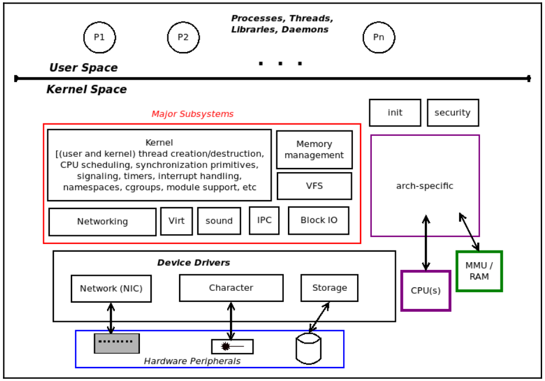

另一个我们应该了解的事实是，这些地址空间当然是虚拟地址空间，而非物理地址空间。内核通过利用硬件（如MMU/TLB/缓存），以页粒度级别，将虚拟页面映射到物理页框。它通过使用主内核分页表将内核虚拟页面映射到物理页框，并为每个活跃的进程，通过各自的分页表将该进程的虚拟页面映射到物理页框。

## 探索LKM

内核模块是一种无需修改内核源代码树即可提供内核级功能的手段。想象一个场景，我们需要为Linux内核添加一个支持功能，可能是一个新的设备驱动程序，以便使用某个硬件外围芯片，或者是一个新的文件系统，或者是一个新的I/O调度器。做这件事的一种显而易见的方法是：在内核源代码树中加入新代码，构建它并进行测试。

虽然这看起来很直接，但实际上这是一个繁琐的过程，我们编写的代码中每一个细微的改动，都需要我们重建内核映像并重启系统以进行测试。必须有一种更简洁、更容易的方法；那就是LKM框架。

### LKM框架

LKM（可加载内核模块）框架是一种在内核源代码树之外编译内核代码的方法，通常称为“树外”代码，使其在一定程度上保持独立于内核。随后可以将其插入或加载到内核内存中，使其运行并执行其任务，然后再从内核内存中移除（或卸载）。

内核模块的源代码通常由一个或多个 C 源文件、头文件和一个 Makefile 组成，通过 make 命令将其构建为内核模块。内核模块本身只是一个二进制对象文件，而不是一个可执行的二进制文件。在 Linux 2.4 及更早的版本中，内核模块的文件名通常以 “.o” 结尾；在现代的 2.6 及更高版本的 Linux 中，则以 “.ko”（内核对象）结尾。一旦构建完成，我们就可以在运行时将这个 “.ko” 文件，即内核模块，插入到正在运行的内核中，有效地将其作为内核的一部分。

那如何将一个对象插入到内核中？简单来说，答案是通过 **`insmod`** 工具。暂时我们不讨论细节（这些会在接下来的 “运行内核模块” 部分中解释）。下图概述了先构建内核模块然后将其插入内核内存的过程：

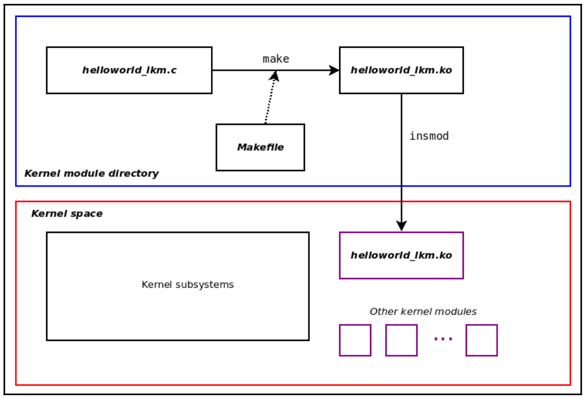

内核模块被加载到内核内存中，并驻留在内核虚拟地址空间（上图中的下半部分）中由内核为其分配的区域中。请注意，它是内核代码，并**以内核权限运行**。这样，我们作为内核（或驱动程序）开发者，就不必每次都重新配置、重建和重启系统。我们只需要编辑内核模块的代码，重建它，移除内存中的旧版本（如果存在），然后插入新版本。

内核模块的一个优势在于它们有助于动态产品配置。例如，内核模块可以设计为在不同的价格点提供不同的功能；为嵌入式产品生成最终镜像的脚本可以根据客户愿意支付的价格安装一组内核模块。另一个例子是在调试或故障排除场景中如何利用这项技术：可以使用内核模块在现有产品上动态生成诊断和调试日志。kprobes 等技术就允许这样做。

实际上，LKM 框架为我们提供了一种动态扩展内核功能的方法，允许我们从内核内存中插入和移除实时代码。这种随时插入和卸载内核功能的能力使我们认识到，Linux 内核不仅仅是纯粹的单体内核，它也是模块化的。

### 内核源代码树中的内核模块

实际上，内核模块对象对我们来说并不完全陌生。在 Chapter 3 中，我们在内核构建过程中构建了内核模块，并将它们安装了起来。

这些内核模块是内核源码的一部分，通过在三态内核的`menuconfig`提示中选择`M`来配置为模块的。它们被安装在`/lib/modules/$(uname -r)/`目录下。因此，为了查看在我们当前运行的 Ubuntu 18.04.6 LTS 客户机内核下安装的内核模块，我们可以这样操作：

```bash
lsb_release -a 2>/dev/null |grep Description
# Description:    Ubuntu 18.04.6 LTS

uname -r
# 5.4.281-sccxz01
find /lib/modules/$(uname -r)/ -name "*.ko" | wc -l
# 81
# 5501
```

Ubuntu Linux 系统安装的内核模块位于`/lib/modules/$(uname -r)/kernel`目录中，如下所示：

```bash
ls /lib/modules/5.4.281-sccxz01/kernel/
# arch  crypto  drivers  fs  net  sound

ls /lib/modules/5.4.0-150-generic/kernel/
# arch  block  crypto  drivers  fs  kernel  lib  mm  net  samples  sound  ubuntu  virtualbox-guest  wireguard  zfs
```

在查看发行版内核（Ubuntu 18.04.6 LTS 运行的 5.4.0-150-generic 内核）的`/lib/modules/$(uname -r)`目录下的`kernel/`目录的顶层时，我们可以看到有很多子文件夹，并且里面装满了几千个内核模块。相比之下，对于我们自己构建的内核模块要少得多。我们特意使用了`localmodconfig`目标来使构建保持小巧和快速。因此，我们定制的内核仅有 81 个内核模块。

一个使用内核模块相当频繁的领域是设备驱动程序。举个例子，让我们看看作为内核模块构建的网络设备驱动程序。我们可以在发行版内核的`kernel/drivers/net/ethernet`文件夹下找到几个熟悉的品牌：

```bash
ls /lib/modules/5.4.281-sccxz01/kernel/drivers/net/ethernet/

ls /lib/modules/5.4.0-150-generic/kernel/drivers/net/ethernet/
```

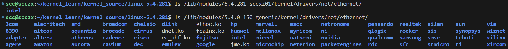

在许多基于 Intel 的笔记本电脑上很流行的Intel 1GbE网络接口卡（NIC）以太网适配器。驱动它的网络设备驱动程序叫做`e1000`驱动程序。我们的x86-64 Ubuntu 18.04.6 客户机（运行在 x86-64 主机笔记本电脑上）显示它确实使用了这个驱动程序：

```bash
lsmod | grep e1000
#e1000                 143360  0
```

通过使用`modinfo()`就可以获取有关该内核模块的更多信息：

```bash
ls -l /lib/modules/5.4.281-sccxz01/kernel/drivers/net/ethernet/intel/e1000/

modinfo /lib/modules/5.4.281-sccxz01/kernel/drivers/net/ethernet/intel/e1000/e1000.ko
```

`modinfo()`程序允许我们查看内核模块的二进制镜像，并提取一些关于它的详细信息。

最重要的是，内核模块已成为构建和分发某些类型内核组件的实用方式，其中设备驱动程序是最常见的使用案例。其他用途还包括但不限于文件系统、网络防火墙、数据包嗅探器和自定义内核代码。

因此，如果我们想学习如何编写Linux设备驱动程序、文件系统或防火墙，我们首先必须学习如何编写内核模块，从而利用内核强大的LKM框架。

## 编写第一个内核模块

### 介绍我们的 ’Hello world‘ LKM C 代码

```c
// 源码位于 ： ch4/helloworld_lkm/hellowworld_lkm.c
#include <linux/init.h>
#include <linux/kernel.h>
#include <linux/module.h>

MODULE_AUTHOR("<insert your name here>");
MODULE_DESCRIPTION("LKP book:ch4/helloworld_lkm: hello, world, our first LKM");
MODULE_LICENSE("Dual MIT/GPL");
MODULE_VERSION("0.1");

static int __init helloworld_lkm_init(void)
{
	printk(KERN_INFO "Hello, world\n");
	return 0;		/* success */
}

static void __exit helloworld_lkm_exit(void)
{
	printk(KERN_INFO "Goodbye, world\n");
}

module_init(helloworld_lkm_init);
module_exit(helloworld_lkm_exit);
```

### 分解

#### 内核头文件

我们使用 `#include` 来包含一些头文件。与用户空间的 C 应用程序开发不同，这些是内核头文件（如技术要求部分所述）。回想一下在 `Chapter3` 中提到的，内核模块安装在特定的可写根目录下。让我们再看一下（这里，我们正在运行的是 5.4.0-150-generic 发行版内核的 x86_64 Ubuntu虚拟机）：

```bash
ls -l /lib/modules/$(uname -r)/
```

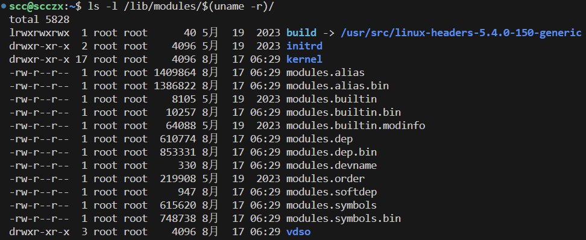

注意这个名为 `build` 的符号链接或软链接。它指向系统上内核头文件的位置。在上述代码中，它位于 `/usr/src/linux-headers-5.4.0-150-generic/` 下，我们会将此信息提供给用于构建我们的内核模块的Makefile。

我们 `Hello, world` 内核模块代码的第一行是 `#include <linux/init.h>`。编译器通过在 `/lib/modules/$(uname -r)/build/include/` 下搜索前面提到的内核头文件来解析这个包含。因此，通过跟随 `build` 软链接，我们可以看到它最终找到了这个头文件：

```bash
ls -l /usr/src/linux-headers-5.4.0-150-generic/include/linux/init.h
# -rw-r--r-- 1 root root 9778 11月 25  2019 /usr/src/linux-headers-5.4.0-150-generic/include/linux/init.h
```

其他内核模块源代码中包含的内核头文件的情况也是如此。

#### 模块宏

我们有几个形式为 `MODULE_FOO()` 的模块宏，其中大多数都非常直观：

- `MODULE_AUTHOR()`: 指定内核模块的作者
- `MODULE_DESCRIPTION()`: 简要描述这个加载内核模块（LKM）的功能
- `MODULE_LICENSE()`: 指定发布该内核模块的许可证
- `MODULE_VERSION()`: 指定内核模块的（本地）版本

如果没有源代码，这些信息将如何传达给最终用户（或客户）呢？`modinfo()` 实用工具正是为此而设计的，这些宏及其信息可能看起来微不足道，但在项目和产品中却非常重要。例如，供应商可以通过在所有已安装内核模块上使用 `grep` 查找 `modinfo` 输出中的信息，来确定代码运行时所使用的（开源）许可证。

#### 入口点和出口点

内核模块毕竟是以内核权限运行的内核代码。它不是一个应用程序，因此没有我们熟悉且喜爱的 `main()` 函数作为入口点。这自然引出了一个问题：内核模块的入口和出口点是什么？注意，在我们简单的内核模块底部，有以下几行代码：

```c
module_init(helloworld_lkm_init);
module_exit(helloworld_lkm_exit);
```

`module_[init|exit]()` 是用于分别指定入口和出口点的宏。每个宏的参数是一个函数指针。在现代C编译器中，我们可以直接指定函数的名称。因此，在我们的代码中，应用了以下内容：

- `helloworld_lkm_init()` 函数是入口点。
- `helloworld_lkm_exit()` 函数是出口点。

我们几乎可以将这些入口和出口点视为内核模块的构造函数/析构函数对。当然，从技术上讲，这并不准确，因为这不是面向对象的C++代码，而是纯C代码。不过，这是一个有用的类比。

#### 返回值

`init` 和 `exit` 函数的签名如下：

```c
static int __init <modulename>_init(void);
static void __exit <modulename>_exit(void);
```

作为良好的编码实践，我们使用了 `<modulename>__[init|exit]()` 这种命名格式，其中 `<modulename>` 被替换为内核模块的名称。这种命名约定其实只是一个约定，从技术角度来说并非必需，但它直观且有助于理解。显然，这两个函数都不接收任何参数。

使用 `static` 修饰符标记这两个函数意味着它们对该内核模块是私有的。这正是我们所希望的。

现在，让我们继续讨论内核模块 `init` 函数的返回值所遵循的重要约定。

##### 0/-E 返回约定

内核模块的初始化函数需要返回一个 `int` 类型的值，这是一个关键点。Linux 内核已经形成了一种关于返回值的风格或约定（即从内核空间返回到用户空间进程的值）。LKM 框架遵循一种被俗称为 0/-E 约定的规则：

- 成功时，返回整数值 `0`。
- 失败时，返回希望用户空间全局未初始化整数 `errno` 被设置为的值的负数。

一个简单的示例可以帮助理解如何从内核模块的初始化函数返回值：假设我们的内核模块的初始化函数试图动态分配一些内核内存（kmalloc() API 等的详细信息将在后续章节中介绍）。那么，我们可以这样编写代码：

```c
[...]
ptr = kmalloc(87, GFP_KERNEL);
if (!ptr) {
    pr_warning("%s:%s:%d: kmalloc failed!\n", __FILE__, __func__, __LINE__);
    return -ENOMEM;
}
[...]
return 0; /* success */
```

如果内存分配失败了（虽然非常不可能，但还是有可能发生的），我们会执行以下操作：

1. 首先，发出一个 `warning` 级别的 `printk`。实际上，在这种特定情况下 ，“内存不足” 是迂腐且不必要的。如果内核空间内存分配失败，内核肯定会发出足够的诊断信息。

2. 返回 `-ENOMEM` 值：
   - 这个值在用户空间中实际返回给的是 `glibc`；它有一些 “胶水” 代码会将这个值乘以 -1 并将全局整数 `errno` 设置为该值。
   - 现在，`[f]init_module()` 系统调用将返回 `-1`，表示失败（这是因为 `insmod()` 实际上调用了这个系统调用）。
   - `errno` 将被设置为 `ENOMEM`，反映出由于内存分配失败，内核模块插入失败。

相反，框架期望在成功时初始化函数返回值为 `0`。事实上，在旧版本的内核中，如果在成功时未返回 `0`，内核模块将会被突然从内核内存中卸载。如今，这种情况下内核模块不会被卸载，但内核会发出一条关于返回了一个可疑的非零值的警告消息。

清理函数（cleanup routine）没有太多可说的。它不接收任何参数，也不返回任何值（`void`）。它的任务是在内核模块从内核内存中卸载之前执行所有必要的清理操作。

##### ERR_PTR 和 PTR_ERR 宏

在讨论返回值时，我们现在了解到了内核模块的初始化例程必须返回一个整数。那么，如果我们希望返回一个指针怎么办？`ERR_PTR()` 内联函数可以帮助我们解决这个问题，它允许我们通过将指针类型转换为 `void *` 来将其伪装成整数返回。更妙的是，我们可以使用 `IS_ERR()` 内联函数来检查是否发生错误（该函数实际上只是判断值是否在 [-1 到 -4095] 范围内），通过 `ERR_PTR()` 内联函数将负错误值编码到指针中，并使用相反的例程 `PTR_ERR()` 从指针中检索该值。

下面是一个简单的示例，看看这里给出的被调用代码。这次，我们让示例函数 `myfunc()` 返回一个指针（指向名为 `mystruct` 的结构体），而不是整数：

```c
struct mystruct * myfunc(void)
{
    struct mystruct *mys = NULL;
    mys = kzalloc(sizeof(struct mystruct), GFP_KERNEL);
    if (!mys)
        return ERR_PTR(-ENOMEM);
    [...]
    return mys;
}
```

调用方代码如下：

```c
[...]
gmys = myfunc();
if (IS_ERR(gmys)) {
    pr_warn("%s: myfunc alloc failed, aborting...\n", OURMODNAME);
    stat = PTR_ERR(gmys); /* 将 'stat' 设置为 -ENOMEM */
    goto out_fail_1;
}
[...]
return stat;
out_fail_1:
    return stat;
}
```

`ERR_PTR()`、`PTR_ERR()` 和 `IS_ERR()` 这些内联函数都位于内核头文件 `include/linux/err.h` 中。此外，我们还可以在内核源码树中的 `crypto/api-samples` 代码下找到这些函数的示例用法：https://www.kernel.org/doc/html/v4.17/crypto/api-samples.html。

- **ERR_PTR()：将错误码转换为指针**

  - `ERR_PTR(int err)` 是一个内联函数，它可以将一个错误码（通常是一个负值的整数）转换为一个指针类型。虽然这看起来有点奇怪，但它实际上是通过类型转换将一个负数存储在一个指针类型的变量中。这使得我们能够在需要返回指针的函数中返回错误码，而不必改变函数的返回类型。

  - ```c
    mys = kzalloc(sizeof(struct mystruct), GFP_KERNEL);
    if (!mys)
        return ERR_PTR(-ENOMEM);
    ```

  - 在这个示例中，`kzalloc` 函数尝试分配内存，如果失败，它返回一个空指针 `NULL`。在这种情况下，`ERR_PTR(-ENOMEM)` 将错误码 `-ENOMEM` 转换为一个指针，并将其返回给调用者。

- **IS_ERR()：检查一个指针是否表示错误**

  - `IS_ERR(void *ptr)` 是一个内联函数，它检查一个指针是否表示错误。具体来说，它会检查指针值是否在一个特殊的范围内（通常是负数范围），这意味着该指针实际上代表一个错误码，而不是一个有效的内存地址。

  - ```c
    if (IS_ERR(gmys)) {
        pr_warn("%s: myfunc alloc failed, aborting...\n", OURMODNAME);
        stat = PTR_ERR(gmys);
        goto out_fail_1;
    }
    ```

  - 在这个示例中，`IS_ERR(gmys)` 检查 `gmys` 是否是一个通过 `ERR_PTR()` 返回的错误指针。如果是，说明 `myfunc` 函数中发生了错误。

- **PTR_ERR()：从错误指针中提取错误码**

  - `PTR_ERR(void *ptr)` 是 `ERR_PTR()` 的反向操作。它将一个错误指针转换回它最初代表的错误码。

  - ```c
    stat = PTR_ERR(gmys); /* 将 'stat' 设置为 -ENOMEM */
    ```

  - 这行代码将错误指针 `gmys` 中包含的错误码提取出来，并将其赋值给 `stat`，这样我们就可以处理或报告这个错误码。

##### __init和__exit关键字

我们在前面的函数签名中看到的 `__init` 和 `__exit` 宏到底是什么？它们只是由链接器插入的内存优化属性。

`__init` 宏为代码定义了一个 `init.text` 段。类似地，任何用 `__initdata` 属性声明的数据都会进入 `init.data` 段。这里的重点是，`init` 函数中的代码和数据在初始化期间只使用一次。一旦调用，它将不会再次被调用；因此，在调用后，相关的内存将被释放（通过 `free_initmem()`）。

`__exit` 宏的作用类似，不过当然，这只在内核模块中有意义。一旦清理函数被调用，所有的内存都会被释放。如果这段代码是静态内核镜像的一部分（或如果模块支持被禁用），那么这个宏将没有任何效果。

## 对内核模块的常见操作

### 构建内核模块

根据路径将当前目录改为该内核模块所在目录：

```bash
# cd <book-code-dir>/ch4/helloworld_lkm
cd ~/kernel_learn/Linux-Kernel-Programming-master/ch4/helloworld_lkm/
```

确认目录，查看其中内容：

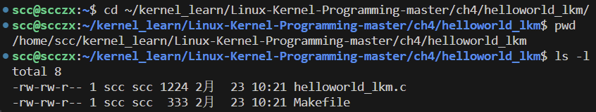

使用 `make` 构建内核模块：

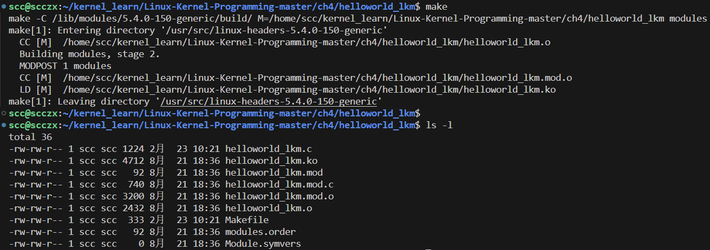

可以看到内核模块已经成功被编译了。

### 运行内核模块

为了让内核模块运行，我们需要先将其加载到内核内存空间中。这被称为将模块插入到内核内存中。

将内核模块加载到Linux内核段可以通过几种方式完成，最终都归结为调用`[f]init_module()`系统调用。我们将在下面使用流行的`insmod()`实用程序（读作“插入模块”）；`insmod`的参数是要插入的内核模块的路径名：

```bash
insmod ./helloworld_lkm.ko
insmod: ERROR: could not insert module ./helloworld_lkm.ko: Operation not permitted
```

失败了！实际上，这个错误的原因应该是显而易见的。想一想：将代码插入内核在某种意义上甚至比在系统上成为 root 用户（超级用户）更具有权力，再提醒一下：这是内核代码，将以内核特权运行。出于安全原因，**只有拥有root权限才能插入或删除内核模块**。

所以，让我们再次尝试将我们的内核模块插入内存，这次通过`sudo()`以root权限执行：

```bash
sudo insmod ./helloworld_lkm.ko
[sudo] password for llkd:
```

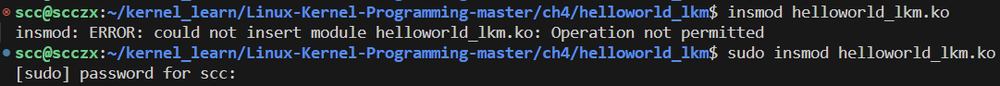

正如前面提到的，`insmod()`通过调用`[f]init_module()`系统调用来工作。`insmod()`（实际上是内部调用的`[f]init_module()`系统调用）可能会在什么时候失败呢？

有以下几种情况：

- 权限：未以 root 身份运行或缺少`CAP_SYS_MODULE`能力（errno <- EPERM）。
- proc 文件系统中的可调内核参数`/proc/sys/kernel/modules_disabled`被设置为1（默认是 0）。
- 一个同名的内核模块已经在内核内存中（errno <- EEXISTS）。

### 快速浏览一下内核printk（）

在用户空间中，C 开发者通常使用可靠的 `printf()` glibc API（或者在编写 C++ 代码时使用 `cout`）来输出消息。然而，重要的是要理解在内核空间中没有库文件。因此，我们无法使用熟悉的 `printf()` API。取而代之的是，它在内核中被重新实现为 `printk()` 内核 API（它就在内核源码树中的 `kernel/printk/printk.c:printk()` 位置）。

通过 `printk()` API 发出消息很简单，且与使用 `printf()` 非常相似。在我们简单的内核模块中，操作发生在这里：

```c
printk(KERN_INFO "Hello, world\n");
```

虽然乍一看与 `printf` 非常相似，但 `printk` 实际上有很大不同。相似之处在于该 API 接收一个格式字符串作为其参数。格式字符串与 `printf` 的几乎相同。

但相似之处仅止于此。`printf` 和 `printk` 之间的关键区别在于：用户空间的 `printf()` 库 API 通过按要求格式化文本字符串并调用 `write()` 系统调用来工作，后者实际上将内容写入标准输出设备，默认情况下是终端窗口（或控制台设备）。而内核的 `printk` API 也按要求格式化其文本字符串，但其输出目的地不同。它至少写入一个地方（以下列表中的第一个）并且可能还写入几个其他地方：

- 内核日志缓冲区（RAM，易失性）
- 内核日志文件（非易失性）
- 控制台设备

当我们通过 `printk` 发出消息时，可以保证输出会进入内核内存（RAM）中的日志缓冲区，这实际上构成了内核日志。需要注意的是，在运行 X 服务器进程的图形模式下工作时，我们永远不会直接看到 `printk` 的输出（这是典型 Linux 发行版的默认环境）。那么，显而易见的问题是：如何查看内核日志缓冲区的内容？有几种方法，我们使用一种快捷简单的方法。

使用 `dmesg()` 。默认情况下，`dmesg` 会将整个内核日志缓冲区内容转储到标准输出。在这里，我们使用它查看内核日志缓冲区的最后两行：

```bash
dmesg | tail -n2
```

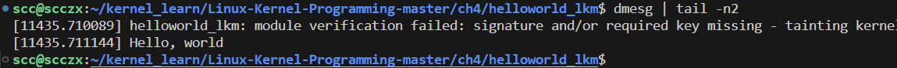

在 `dmesg()` 显示的内核日志中，最左边列的数字是一个简单的时间戳，格式为 `[秒.微秒]`，表示自系统启动以来经过的时间（尽管不建议将其视为绝对精确）。顺便说一下，这个时间戳是一个 Kconfig 变量： 一个内核配置选项，为 `CONFIG_PRINTK_TIME`；它可以通过 `printk.time` 内核参数来覆盖。

### 列出实时内核模块

```bash
lsmod | head
```

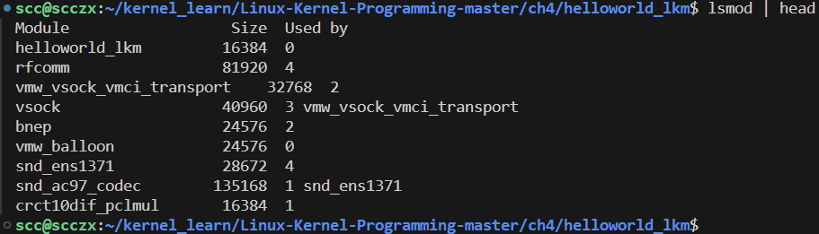

`lsmod` 显示了当前驻留在内核内存中的所有内核模块，按时间逆序排列。它的输出是列格式的，通常包括三列，有时还会有一个可选的第四列。让我们分别看看每一列的内容：

- 第一列：显示内核模块的名称。


- 第二列：显示它在内核中占用的（静态）内存大小，单位是字节。


- 第三列：模块的使用计数。


可选的第四列（以及可能跟随的更多列）将在下一章中解释（在“理解模块堆叠”部分中）。此外，在最近的 x86-64 Linux 内核上，内核模块似乎至少占用了 16 KB 的内存。

### 从内核内存中卸载模块

要卸载内核模块，我们使用方便的实用工具 `rmmod()`（移除模块）：

```bash
rmmod

rmmod helloworld_lkm

sudo rmmod helloworld_lkm

dmesg |tail -n2
```

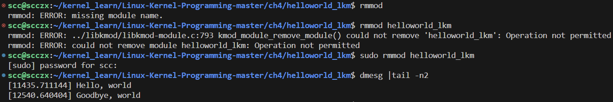

`rmmod()` 的参数是内核模块的名称，而不是路径名。显然，就像使用 `insmod()` 一样，我们需要以 `root` 用户身份运行 `rmmod()` 才能成功。

在这里，我们还可以看到，由于我们的 `rmmod`，内核模块的退出例程（或 “析构函数”）`helloworld_lkm_exit()` 函数被调用。它进一步调用了 `printk`，发出了 `Goodbye, world` 的信息（我们通过 `dmesg` 查看）。

什么时候 `rmmod`（请注意，在内部，它会成为 `delete_module()` 系统调用）可能失败？以下是一些情况：

- 权限：如果不是以 `root` 身份运行，或者缺少 `CAP_SYS_MODULE` 能力（`errno <- EPERM`），`rmmod` 将失败。
- 如果内核模块的代码和/或数据被另一个模块使用（如果存在依赖关系；这将在下一章的模块堆栈部分详细讨论），或者模块当前正在被某个进程（或线程）使用，那么模块的使用计数将为正，`rmmod` 将失败（`errno <- EBUSY`）。
- 如果内核模块没有使用 `module_exit()` 宏指定退出例程（或析构函数），并且 `CONFIG_MODULE_FORCE_UNLOAD` 内核配置选项被禁用。

涉及模块管理的几个方便实用程序其实只是指向单一的 `kmod()` 实用程序的符号（软）链接（类似于流行的 `busybox` 实用程序）。这些封装器包括 `lsmod()`，`rmmod()`，`insmod(8)`，`modinfo()`，`modprobe()` 和 `depmod()`。来看几个示例：

```bash
$ ls -l $(which insmod) ; ls -l $(which lsmod) ; ls -l $(which rmmod)
# lrwxrwxrwx 1 root root 9 8月  16 16:43 /sbin/insmod -> /bin/kmod
# lrwxrwxrwx 1 root root 9 8月  16 16:43 /sbin/lsmod -> /bin/kmod
# lrwxrwxrwx 1 root root 9 8月  16 16:43 /sbin/rmmod -> /bin/kmod
```

这些实用程序的确切位置（`/bin`，`/sbin` 或 `/usr/sbin`）可能因发行版而异。

### 我们的lkm便利脚本

用自定义 bash 脚本来自动化内核模块的构建、加载、`dmesg` 日志查看和卸载的工作流程（该脚本在项目根目录下，名为 lkm）：

```bash
#!/bin/bash
# lkm :  一个用于内核模块开发的简单辅助脚本 - 包括构建、加载和卸载等功能
unset ARCH
unset CROSS_COMPILE
name=$(basename "${0}")

#-------------- r u n c m d -------------------------------------------
# 显示并运行提供的命令
#  参数: 要运行的命令
runcmd()
{
local SEP="------------------------------"
[ $# -eq 0 ] && return
echo "${SEP}
$*
${SEP}"
eval "$@"
[ $? -ne 0 ] && echo " ^--[FAILED]"
}

### 这里是“主程序”

[ $# -ne 1 ] && {
	echo "Usage: ${name} name-of-kernel-module-file (without the .c)"
	exit 1
}
[[ "${1}" = *"."* ]] && {
	echo "Usage: ${name} name-of-kernel-module-file ONLY (do NOT put any extension)."
	exit 1
}

echo "Version info:"
which lsb_release >/dev/null 2>&1 && {
  echo -n "Distro: "
  lsb_release -a 2>/dev/null |grep "Description" |awk -F':' '{print $2}'
}
echo -n "Kernel: " ; uname -r

runcmd "sudo rmmod $1 2> /dev/null"
#runcmd "make clean"
runcmd "sudo dmesg -C"
runcmd "make || exit 1"
 # TODO - the '|| exit 1' does not seem to work

[ ! -f "$1".ko ] && {
  echo "[!] ${name}: $1.ko has not been built, aborting..."
  exit 1
}

runcmd "sudo insmod ./$1.ko && lsmod|grep $1"
runcmd "sudo dmesg"
exit 0
```

给定内核模块的名称作为参：不包含任何扩展名部分（如`.c`），`lkm`脚本会执行一些有效性检查，显示一些版本信息，然后使用一个包装函数`runcmd()`来显示并运行指定的命令，从而轻松完成清理、构建、加载、`lsmod`和`dmesg`的工作流程。

```bash
pwd

../../lkm

../../lkm helloworld_lkm
```

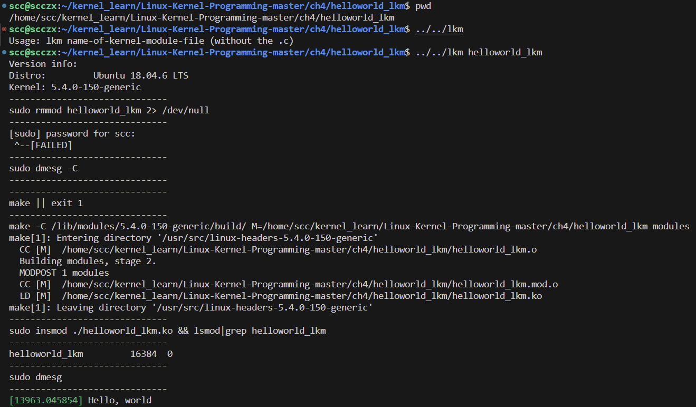

## 了解内核日志记录和printk

我们将更详细地探讨内核日志记录。我们会理解`printk`输出是如何处理的，分析其优缺点。我们将讨论`printk`的日志级别、现代系统如何通过`systemd`日志记录消息，以及如何将输出定向到控制台设备。最后，我们将通过对`printk`的速率限制、用户生成的打印信息、从用户空间生成`printk`以及标准化`printk`输出格式的讨论来结束这一部分。

前面的部分，我们已经了解了使用内核`printk` API的基本功能。现在，我们将更深入地探索`printk()` API的使用。在我们简单的内核模块中，以下这行代码会发出“Hello, world”消息：

```c
printk(KERN_INFO "Hello, world\n");
```

再次强调，`printk`在格式字符串和工作方式上与`printf`类似，但相似之处仅止于此。`printf()`和`printk`之间的一个关键区别在于，`printf()`是一个用户空间的库API，它通过调用`write()`系统调用来工作，该系统调用写入到标准输出设备（默认通常是终端窗口或控制台设备）。而`printk`则是一个内核空间API，其输出至少会传送到以下一个地方，并可能传送到多个地方：

- 内核日志缓冲区（在RAM中，易失性）
- 内核日志文件（非易失性）
- 控制台设备

### 使用内核内存环形缓冲区

内核日志缓冲区实际上是内核地址空间中的一个内存缓冲区，用于保存（记录）`printk`输出。更技术性地讲，它是全局变量 `__log_buf[]`。其在内核源码中的定义如下：

```c
// kernel/printk/printk.c:
#define __LOG_BUF_LEN (1 << CONFIG_LOG_BUF_SHIFT)
static char __log_buf[__LOG_BUF_LEN] __aligned(LOG_ALIGN);
```

它被设计为一个环形缓冲区；具有有限的大小（`__LOG_BUF_LEN` 字节），一旦它装满，就会从字节零开始被覆盖。因此，它被称为“环形”或循环缓冲区。

这里，我们可以看到其大小是基于Kconfig变量 `CONFIG_LOG_BUF_SHIFT` （在C中，`1 << n` 意味着2的n次方）。这个值可以在内核配置菜单中显示并被覆盖，路径为：`General Setup > Kernel log buffer size`。

它是一个范围在 12 到 25 之间的整数值（我们可以在`init/Kconfig`中查找其规范），默认值为 18。所以，日志缓冲区的大小为 `2^18 = 256 KB`。然而，实际的运行时大小也受到其他配置指令的影响，尤其是 `LOG_CPU_MAX_BUF_SHIFT`，它使得大小成为系统上CPU数量的函数。此外，相关的Kconfig文件指出，“当使用`log_buf_len`内核参数时，此选项将被忽略，因为它会强制环形缓冲区的精确（以2为幂）大小。” 我们通常可以通过传递内核参数（通过引导加载程序）来覆盖默认值！

内核参数参阅官方文档：https://www.kernel.org/doc/html/latest/admin-guide/kernel-parameters.html。Linux内核文档中关于 `log_buf_len` 内核参数的片段揭示了详细信息：

```plaintext
log_buf_len=n[KMG] [KNL,EARLY]
                        设置printk环形缓冲区的大小，以字节为单位。
                        n 必须是大于最小值的2的幂。最小值由内核配置参数
                        LOG_BUF_SHIFT 定义。还有一个配置参数 
                        CONFIG_LOG_CPU_MAX_BUF_SHIFT，允许根据CPU的数量
                        增加默认大小。有关更多详细信息，请参阅 init/Kconfig。
```

无论内核日志缓冲区的大小如何，在处理`printk` API时有两个明显的问题：

1. 它的消息记录在易失性内存（RAM）中；如果系统崩溃或以任何方式重新启动，我们将丢失宝贵的内核日志（这通常会使我们失去调试的能力）。
2. 默认情况下日志缓冲区的大小并不大，通常只有256 KB；大量的打印会使环形缓冲区超载，从而导致环绕覆盖，进而丢失信息。

### 内核日志和systemd的journalctl

一个显而易见的解决上述问题的方法是将内核的`printk`日志写入（追加）到文件中。这正是大多数现代Linux发行版的设置方式。日志文件的位置因发行版而异：通常，基于Red Hat的发行版将日志写入`/var/log/messages`文件，而基于Debian的发行版则写入`/var/log/syslog`。传统上，内核的`printk`日志会连接到用户空间的系统日志守护进程（syslogd）以进行文件记录，从而自动获得更高级的功能，例如日志轮换、压缩和归档。

然而，在过去的几年中，系统日志记录已被一个名为`systemd`的有用且强大的新框架完全接管，它用于系统初始化（它取代了旧的SysV init框架，或者常常与之配合工作）。实际上，即使在嵌入式Linux设备上，`systemd`现在也已被常规使用。在`systemd`框架中，日志记录是由一个称为`systemd-journal`的守护进程完成的，而`journalctl（）`是其用户界面。

使用`journal`检索和解释日志的一个关键优势是，所有来自应用程序、库、系统守护进程、内核、驱动程序等的日志都在这里写入（合并）。这样，我们可以看到按时间（倒序）排列的事件时间线，而无需手动拼接不同的日志以形成时间线。`journalctl（）`的手册页详细介绍了其各种选项。这里，我们基于该程序提供了一些方便的别名：

```bash
# 一次性设置，仅在当前 shell 有效，重新或关闭当前shell需要重新设置
#--- 一些journalctl()的别名

# jlog: 仅显示当前（从最近一次启动开始）启动的所有日志
alias jlog='/bin/journalctl -b --all --catalog --no-pager'

# jlogr: 仅显示当前（从最近一次启动开始）启动的所有日志，
# 以*倒序*时间顺序排列
alias jlogr='/bin/journalctl -b --all --catalog --no-pager --reverse'

# jlogall: *所有*日志，所有时间；--merge => 合并*所有*日志
alias jlogall='/bin/journalctl --all --catalog --merge --no-pager'

# jlogf: *监视*日志，类似于'tail -f'模式；
# 非常适合“实时监视”日志
alias jlogf='/bin/journalctl -f'

# jlogk: 仅显示当前（从最近一次启动开始）启动的内核消息
alias jlogk='/bin/journalctl -b -k --no-pager'
```

我们特意使用了 `--no-pager` 选项，因为它允许我们根据需要进一步使用`[e]grep（）`、`awk（）`、`sort（）`等命令过滤输出。下面是一个使用 `journalctl（）` 的简单示例：

```bash
journalctl -k | tail -n2
```

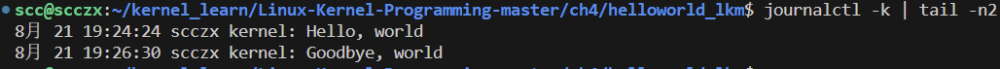

注意 `journal` 的默认日志格式：

```bash
[时间戳] [主机名] [来源]: [...日志消息...]
```

其中，`[来源]` 对于内核消息来说是 `kernel`，或者是写入消息的特定应用程序或服务的名称。

查看 `journalctl（）` 手册页中的一些使用示例很有帮助：

显示上一次启动的所有内核日志：

```bash
journalctl -k -b -1
```

显示 `apache.service` 系统服务的实时日志：

```bash
journalctl -f -u apache
```

将内核消息的非易失性日志记录到文件中当然非常有用。然而，需要注意的是，有些情况下，通常受硬件限制的影响，可能无法实现。例如，一个体积小、资源极其有限的嵌入式Linux设备可能使用一个小型的内部闪存芯片作为存储介质。现在，不仅其空间很小，几乎被应用程序、库、内核和引导加载程序占满，而且闪存芯片在其承受的擦写周期数上有一个有效的上限。因此，写入几百万次可能会导致它损坏。因此，有时系统设计者额外使用更便宜的外部闪存存储器（如（微）SD/MMC卡）来减轻这种影响，因为它们更容易更换。

### 使用printk日志级别

为了理解和使用 `printk` 的日志级别，我们从重现那行代码开始，这是我们 `helloworld_lkm` 内核模块中的第一条 `printk` 语句：

```c
printk(KERN_INFO "Hello, world\n");
```

现在让我们来解决这个问题：`KERN_INFO` 究竟是什么意思？

首先，要注意一点：它并不是我们下意识认为的那样：一个参数。不是的！注意它与格式字符串之间没有逗号字符，只是空格。`KERN_INFO` 只是内核 `printk` 记录日志时使用的八个日志级别之一。需要立即理解的关键点是，这个日志级别并不是某种优先级；它的存在使我们能够根据日志级别过滤消息。内核为 `printk` 定义了八个可能的日志级别，如下所示：

```c
// include/linux/kern_levels.h
#ifndef __KERN_LEVELS_H__
#define __KERN_LEVELS_H__
#define KERN_SOH 			 "\001" 					/* ASCII Start Of Header */
#define KERN_SOH_ASCII 		 '\001'
#define KERN_EMERG 			KERN_SOH 		  "0" 		/* 系统不可用 */
#define KERN_ALERT 			KERN_SOH 		  "1" 		/* 必须立即采取行动 */
#define KERN_CRIT 			KERN_SOH		  "2" 		/* 严重情况 */
#define KERN_ERR 			KERN_SOH 		  "3" 		/* 错误情况 */
#define KERN_WARNING 		KERN_SOH 		  "4" 		/* 警告情况 */
#define KERN_NOTICE 		KERN_SOH 		  "5" 		/* 正常但重要的情况 */
#define KERN_INFO 			KERN_SOH 		  "6" 		/* 信息性消息 */
#define KERN_DEBUG 			KERN_SOH 		  "7" 		/* 调试级别消息 */
#define KERN_DEFAULT 		KERN_SOH 		  "d" 		/* 默认内核日志级别 */
// 举例：KERN_DEFAULT =  KERN_SOH "d" = “\001d”
```

现在我们可以看到，`KERN_<FOO>` 日志级别只是一些字符串（如 "0"、"1"、...、"7"），它们被添加到 `printk` 输出的内核消息前面；仅此而已。这使我们能够根据日志级别过滤消息。每个日志级别旁边的注释清楚地向开发人员展示了何时使用哪个日志级别。

让我们快速查看几个实际的内核源码示例。当内核的 `hangcheck-timer` 设备驱动程序（类似于软件看门狗）确定某个计时器的超时（默认情况下为60秒）延迟超过某个阈值（默认情况下为180秒）时，它会重新启动系统。这里展示了相关的内核代码，`hangcheck-timer` 驱动程序在这个情况下发出的 `printk` 调用：

```c
// drivers/char/hangcheck-timer.c
[...]
if (hangcheck_reboot) {
    printk(KERN_CRIT "Hangcheck: hangcheck is restarting the machine.\n");
    emergency_restart();
} else {
    [...]
}
```

注意到 `printk` API 的调用中日志级别被设置为 `KERN_CRIT`。

另一方面，输出一条信息性消息可能是更合适的选择：这里，我们看到通用并行打印机驱动程序礼貌地通知所有人打印机着火了：

```c
// drivers/char/lp.c
[...]
if (last != LP_PERRORP) {
    last = LP_PERRORP;
    printk(KERN_INFO "lp%d on fire\n", minor);
}
```

 `arch/x86/kernel/cpu/mce/p5.c` 文件中的 `pentium_machine_check()` 函数遵循了这一点：

```c
// arch/x86/kernel/cpu/mce/p5.c
[...]
pr_emerg("CPU#%d: Machine Check Exception: 0x%8X (type 0x%8X).\n", smp_processor_id(), loaddr, lotype);
if (lotype & (1<<5)) {
    pr_emerg("CPU#%d: Possible thermal failure (CPU on fire?).\n", smp_processor_id());
}
[...]
```

（`pr_<foo>()` 便捷宏将在下一节中介绍）。

常见问题：如果在 `printk()` 中没有指定日志级别，打印时使用的默认日志级别是什么？默认为4，也就是 `KERN_WARNING`（“写入控制台”部分揭示了具体原因）。不过，通常情况下，建议在使用 `printk` 时始终指定合适的日志级别。

#### `pr_<foo>` 便捷宏

这里提供的 `pr_<foo>()` 便捷宏简化了编码的繁琐操作。 `printk(KERN_FOO "<format-str>");` 可以被 `pr_foo("<format-str>");` 所替代，其中 `<foo>` 是日志级别：

```c
// include/linux/printk.h:
[...]
/*
 * 这些宏可以用于在不同的日志级别打印信息。
 * 尽管需要注意的是，所有这些都会无条件地打印，但 pr_debug() 和其他调试宏会在未定义 DEBUG 或未设置 CONFIG_DYNAMIC_DEBUG 时被编译掉。
 */
#define pr_emerg(fmt, ...) \
    printk(KERN_EMERG pr_fmt(fmt), ##__VA_ARGS__)
#define pr_alert(fmt, ...) \
    printk(KERN_ALERT pr_fmt(fmt), ##__VA_ARGS__)
#define pr_crit(fmt, ...) \
    printk(KERN_CRIT pr_fmt(fmt), ##__VA_ARGS__)
#define pr_err(fmt, ...) \
    printk(KERN_ERR pr_fmt(fmt), ##__VA_ARGS__)
#define pr_warning(fmt, ...) \
    printk(KERN_WARNING pr_fmt(fmt), ##__VA_ARGS__)
#define pr_warn pr_warning
#define pr_notice(fmt, ...) \
    printk(KERN_NOTICE pr_fmt(fmt), ##__VA_ARGS__)
#define pr_info(fmt, ...) \
    printk(KERN_INFO pr_fmt(fmt), ##__VA_ARGS__)
[...]
/* pr_devel() 宏在未定义 DEBUG 时不会生成任何代码 */
#ifdef DEBUG
#define pr_devel(fmt, ...) \
    printk(KERN_DEBUG pr_fmt(fmt), ##__VA_ARGS__)
#else
#define pr_devel(fmt, ...) \
    no_printk(KERN_DEBUG pr_fmt(fmt), ##__VA_ARGS__)
#endif
```

有时，直接向控制台设备写入内核消息非常有用。

#### 写入控制台

回顾一下，`printk` 的输出可能会发送到三个位置：

1. 内核内存日志缓冲区（始终如此）
2. 非易失性日志文件
3. 控制台设备（我们将在这里讨论的）

传统上，控制台设备是一个纯粹的内核特性，是超级用户在非图形环境下登录的初始终端窗口（/dev/console）。有趣的是，在Linux系统中，我们可以定义多个控制台，如电传打字机终端（tty）窗口（如 /dev/console）、文本模式VGA、帧缓冲区，甚至是通过USB连接的串行端口（这在嵌入式系统开发过程中很常见）。

控制台通常是足够重要的日志消息的目标，包括那些来自内核深处的消息。Linux的`printk`使用基于`proc`的机制有条件地将其数据传送到控制台设备。为了更好地理解这一点，让我们先看看相关的`proc`伪文件：

```bash
cat /proc/sys/kernel/printk
# 4       4       1       7
```

我们将前面的四个数字解释为`printk`日志级别（0是最高的，7是最低的，以“紧急性”为标准）。前面的四个整数序列的含义如下：

1. 当前（控制台）日志级别 (这意味着所有低于此值的消息将出现在控制台设备上，即 0 ~ 4)
2. 缺少显式日志级别的消息的默认级别
3. 允许的最低日志级别
4. 启动时的默认日志级别

从中我们可以看出，日志级别4对应于`KERN_WARNING`。因此，第一位数字为4（这是Linux发行版上的典型默认值），所有低于日志级别4的`printk`实例都将出现在控制台设备上，并且当然也会记录到文件中。实际上，所有消息都在以下日志级别：`KERN_EMERG`、`KERN_ALERT`、`KERN_CRIT`和`KERN_ERR`。

#### 启用pr_debug（）内核消息

`pr_debug()` 确实有点特别：除非为内核模块定义了 `DEBUG` 符号，否则在 `KERN_DEBUG` 日志级别的 `printk` 实例不会显示出来。我们需要编辑内核模块的 Makefile 来启用它。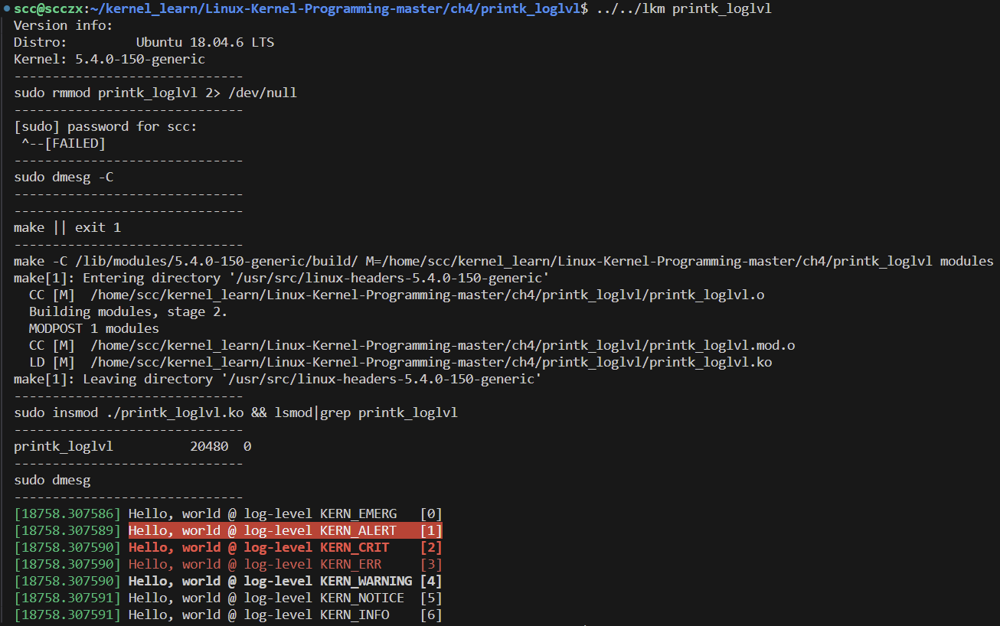

有两种方法可以设置这个功能：

在 Makefile 中插入以下这行代码：

```makefile
CFLAGS_printk_loglvl.o := -DDEBUG
```

通常情况下，它是 `CFLAGS_<filename>.o := -DDEBUG`。

我们也可以直接在 Makefile 中插入这条语句：

```makefile
EXTRA_CFLAGS += -DDEBUG
```

在我们的 Makefile 中，我们一开始故意将 `-DDEBUG` 进行了注释。现在，为了尝试启用它，取消注释以下两行中的任意一行：

```makefile
# 启用 pr_debug() （取消下面其中一行的注释）
#EXTRA_CFLAGS += -DDEBUG
#CFLAGS_printk_loglvl.o := -DDEBUG
```

完成后，我们需要从内存中移除旧的内核模块，重新构建它，并使用我们的 lkm 脚本将其插入。输出显示 `pr_debug()` 现在已经生效：

```bash
../../lkm printk_loglvl
```

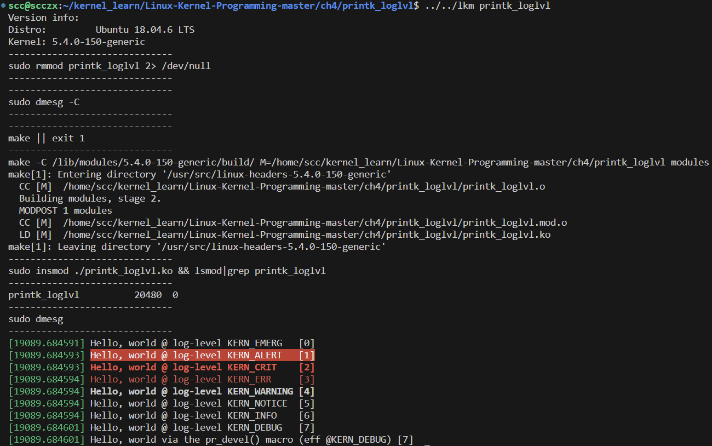

lkm 脚本输出的部分截图清楚地显示了 `dmesg` 的颜色编码，其中 `KERN_ALERT`、`KERN_CRIT` 和 `KERN_ERR` 的背景分别以红色/粗体红色字体/红色前景色突出显示，`KERN_WARNING` 以粗体黑色字体显示，帮助我们快速定位重要的内核消息。

注意，当启用了动态调试功能（`CONFIG_DYNAMIC_DEBUG=y`）时，`pr_debug()` 的行为并不完全相同。

写设备驱动程序的话应该注意，在输出调试 `printk` 实例时，应避免使用 `pr_debug()`。相反，建议设备驱动程序使用 `dev_dbg()` 宏（另外还需传递与相关设备有关的参数）。此外，`pr_devel()` 旨在用于内核内部的调试 `printk` 实例，其输出永远不应在生产系统中可见。

现在，回到控制台输出部分。因此，可能出于内核调试的目的，有没有一种保证所有 `printk` 实例都被定向到控制台的方法？确实有：只需传递名为 `ignore_level` 的内核（启动时）参数。也可以切换是否忽略 `printk` 的日志级别：我们可以通过以下操作开启忽略 `printk` 日志级别的功能，从而允许所有 `printk` 出现在控制台设备上（反之，通过向同一个伪文件中回显 `N` 来关闭它）：

```bash
# 启用内核日志级别的忽略功能，使所有日志级别的消息都能够显示在控制台上
sudo bash -c "echo Y > /sys/module/printk/parameters/ignore_loglevel"
```

`dmesg()` 也可以通过各种选项开关（特别是  `--console-level`  选项）来控制启用/禁用内核消息到控制台设备的输出，以及控制台的日志级别（即消息出现在控制台上的最低级别）。

### 限制 `printk` 实例的速率  

当我们在一个经常执行的代码路径中发出 `printk` 实例时，大量的 `printk` 实例可能会迅速溢出内核日志缓冲区（位于RAM中；请记住它是一个循环缓冲区），从而覆盖可能非常重要的信息。除此之外，日志文件不断增长并重复几乎相同的 `printk` 实例（几乎是无穷无尽的），这也不是一个好主意，因为它浪费磁盘空间，甚至更糟糕的是，浪费闪存空间。例如，考虑在中断处理程序代码路径中的一个较大的 `printk` 实例。如果硬件中断以每秒100次（即100Hz）的频率触发，该怎么办？

为了解决这些问题，内核提供了一种有趣的替代方案：限速 `printk`。`printk_ratelimited()` 宏的语法与普通的 `printk` 相同；关键点在于它在满足某些条件时有效地抑制常规输出。内核通过 `proc` 文件系统提供了两个控制文件 `printk_ratelimit` 和 `printk_ratelimit_burst` 来实现这一目的。这里，我们直接引用 `sysctl` 文档（来自 https://www.kernel.org/doc/Documentation/sysctl/kernel.txt），它解释了这两个（伪）文件的确切含义：

- `printk_ratelimit`： 
  - 一些警告消息是限速的。`printk_ratelimit` 指定这些消息之间的最小时间间隔（以 jiffies 为单位），默认情况下我们允许每5秒发送一条消息。 
  - 值为 0 将禁用速率限制。  
- `printk_ratelimit_burst`：
  - 虽然从长远来看我们强制每隔 `printk_ratelimit` 秒发送一条消息，但我们确实允许消息的突发发送。  
  - `printk_ratelimit_burst` 指定了在启动速率限制之前我们可以发送的消息数量。  

在我们的 Ubuntu 18.04.6 LTS 客户机系统上，我们发现它们的（默认）值如下：

```bash
cat /proc/sys/kernel/printk_ratelimit
# 5
cat /proc/sys/kernel/printk_ratelimit_burst
# 10
```

这意味着默认情况下，在启动速率限制之前，相同消息在5秒内最多可以出现10次。当 `printk` 速率限制器确实抑制内核 `printk` 实例时，它会发出一个有用的消息，提到究竟有多少个先前的 `printk` 回调被抑制了。

举个例子，我们有一个自定义内核模块，它利用 `Kprobes` 框架在每次调用 `schedule()`（内核的核心调度例程）之前发出一个 `printk` 实例。由于调度经常发生，常规的 `printk` 会导致内核日志缓冲区迅速溢出。正是这种情况需要使用限速的 `printk`。这里，我们看到我们示例内核模块的一些输出（我们不在这里展示它的代码），它通过 `kprobe` 设置了一个名为 `handle_pre_schedule()` 的预处理函数，使用了 `printk_ratelimited()` API：

```bash
[ 1000.154763] kprobe schedule pre_handler: intr ctx = 0 :process systemd-journal:237
[ 1005.162183] handler_pre_schedule: 5860 callbacks suppressed
[ 1005.162185] kprobe schedule pre_handler: intr ctx = 0 :process dndX11:1071
```

限速 `printk` 的代码级示例可以在 Linux 内核的实时时钟（RTC）驱动程序的中断处理程序代码中看到：

```c
// drivers/char/rtc.c:
static void rtc_dropped_irq(struct timer_list *unused)
{
    [...]
    spin_unlock_irq(&rtc_lock);
    printk_ratelimited(KERN_WARNING "rtc: lost some interrupts at %ldHz.\n", freq);
    /* Now we have new data */
    wake_up_interruptible(&rtc_wait);
    [...]
}
```

此外，就像我们之前看到的 `pr_<foo>` 宏一样，内核还提供了相应的 `pr_<foo>_ratelimited` 宏，用于在启用限速的情况下生成特定日志级别 `<foo>` 的内核 `printk`。以下是它们的快速列表：

- `pr_emerg_ratelimited(fmt, ...)`
- `pr_alert_ratelimited(fmt, ...)`
- `pr_crit_ratelimited(fmt, ...)`
- `pr_err_ratelimited(fmt, ...)`
- `pr_warn_ratelimited(fmt, ...)`
- `pr_notice_ratelimited(fmt, ...)`
- `pr_info_ratelimited(fmt, ...)`

### 从用户空间生成内核消息

程序员常用的一种调试技巧是在代码的各个点插入打印语句，这通常可以帮助我们缩小问题的来源。这确实是一种有用的调试技术，称为“代码插桩”。内核开发人员通常使用著名的 `printk` API 来实现这一目的。

想象一下，我们编写了一个内核模块，并在调试过程中（通过添加多个 `printk`）调试它。我们的内核代码现在会发出几个 `printk` 实例，这些实例当然可以在运行时通过 `dmesg` 或其他方式看到。这很好，但如果我们希望看到某个自动化用户空间测试脚本在内核模块中触发某个动作的时间点，并打印出一条特定的消息，该怎么办呢？例如，我们希望日志看起来像这样：

```bash
test_script: msg 1 ; kernel_module: msg n, msg n+1, ..., msg n+m ;
test_script: msg 2 ; ...
```

我们可以通过将消息写入特殊的 `/dev/kmsg` 设备文件，将用户空间测试脚本的消息写入内核日志缓冲区，就像内核的 `printk` 一样：

```bash
echo "test_script: msg 1" > /dev/kmsg
```

不过，这样做当然需要以 `root` 权限运行。然而，我们会发现简单地在 `echo` 前面加上 `sudo` 并不起作用：

```bash
$ sudo echo "test_script: msg 1" > /dev/kmsg
bash: /dev/kmsg: Permission denied
$ sudo bash -c "echo \"test_script: msg 1\" > /dev/kmsg"
[sudo] password for llkd:
$ dmesg |tail -n1
[55527.523756] test_script: msg 1
```

第二次尝试使用的语法是有效的，但更简单的方法是获得一个 `root` shell 来执行此类任务。

还有一点：`dmesg` 工具有几个选项可以使输出更易于阅读；我们在这里通过一个示例别名展示了一些选项，并使用它来查看消息：

```bash
sudo echo "test_script: msg 1" > /dev/kmsg

sudo bash -c "echo \"test_script: msg 1\" > /dev/kmsg"

dmesg |tail -n1
```

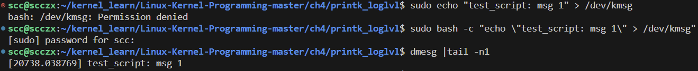

通过特殊的 `/dev/kmsg` 设备文件写入内核日志的消息将以当前默认日志级别（通常为 `4 : KERN_WARNING`）打印。我们可以通过在消息前添加所需的日志级别（作为字符串格式的数字）来覆盖这一默认值。例如，想要以日志级别 `6 : KERN_INFO` 从用户空间写入内核日志，可以这样做：

```bash
sudo bash -c "echo \"<6>test_script: test msg at KERN_INFO\" > /dev/kmsg"

dmesg | tail -n2
# [20738.038769] test_script: msg 1
# [20950.683717] test_script: test msg at KERN_INFO
```

我们可以看到，后面的消息确实按照指定的日志级别 `6`（`KERN_INFO`）发出。实际上，用户生成的内核消息与内核 `printk()` 生成的消息无法区分；它们看起来是一样的。因此，可以通过在消息中插入一些特殊的签名字节或字符串（例如 `@user@`）来帮助我们区分这些用户生成的打印信息与内核打印信息。

### 通过 pr_fmt 宏标准化 printk 输出

关于内核中的 `printk`，最后一个但非常重要的要点是：为了给 `printk()` 输出提供上下文（确切地说，它发生在什么地方？），我们可能会编写如下代码，利用各种 GCC 宏（如 `__FILE__`、`__func__` 和 `__LINE__`）：

```c
pr_warning("%s:%s():%d: kmalloc failed!\n", OURMODNAME, __func__, __LINE__);
```

这很好，但问题在于，如果我们的项目中有很多 `printk`，那么要保证所有 `printk` 输出格式的标准化（例如，首先显示模块名称，然后是函数名称，可能还有行号，如上所示）可能会非常痛苦。

这时就可以使用 `pr_fmt` 宏了；在代码的开头定义此宏（必须在第一个 `#include` 之前），可以保证代码中所有后续的 `printk` 输出都会以此宏指定的格式作为前缀。我们来看一个例子：

```c
// ch5/lkm_template/lkm_template.c
[ ... ]

#define pr_fmt(fmt) "%s:%s(): " fmt, KBUILD_MODNAME, __func__

#include <linux/init.h>
#include <linux/module.h>
#include <linux/kernel.h>
[ ... ]
static int __init lkm_template_init(void)
{
    pr_info("inserted\n");
    // printk(KERN_INFO "%s:%s(): inserted\n", KBUILD_MODNAME, __func__);
[ ... ]
```

`pr_fmt()` 宏使用预定义的  `KBUILD_MODNAME`  宏来替换我们的内核模块名称，并使用 GCC 的  `__func__`  规范来显示我们当前运行的函数名称。（我们甚至可以添加一个由相应的 `__LINE__` 宏匹配的 `%d` 来显示行号）。所以，关键是：我们在这个 LKM 的 `init` 函数中发出的 `pr_info()` 将在内核日志中显示如下：

```text
[381534.391966] lkm_template:lkm_template_init(): inserted
```

注意 LKM 名称和函数名称是如何自动作为前缀的。这非常有用。

### 可移植性和printk格式说明符

关于多功能的 `printk` 内核 API 有一个问题值得思考：如何确保我们的 `printk` 输出看起来正确（格式正确）并且在任何CPU上都能正常工作，无论其位宽如何？这里就出现了可移植性的问题；好消息是，熟悉各种格式说明符将对我们大有帮助，从而使我们能够编写与架构无关的 `printk`。

以下是一些在编写可移植代码时需要牢记的常用 `printk` 格式说明符：

- 对于 `size_t` 和 `ssize_t`（有符号和无符号）整数：分别使用 `%zd` 和 `%zu`
- 内核指针：使用 `%pK`（用于安全性，哈希值），使用 `%px` 表示实际指针（不建议在生产环境中使用！），此外，对于物理地址使用 `%pa`（必须通过引用传递）
- 将原始缓冲区显示为十六进制字符串：使用 `%*ph`（其中 * 替换为字符数；用于64字符以内的缓冲区，超过64字符则使用 `print_hex_dump_bytes()` 函数）；还有一些变体（参见内核文档，链接如下）
- 使用 `%pI4` 表示 IPv4 地址，使用 `%pI6` 表示 IPv6 地址（还有一些变体）

官方内核文档中有一份详细的 `printk` 格式说明符列表，说明了在什么情况下使用（附有示例）：[https://www.kernel.org/doc/Documentation/printk-formats.txt](https://www.kernel.org/doc/Documentation/printk-formats.txt)。

内核还明确指出，在 `printk()` 语句中使用未修饰的 `%p` 可能会导致安全问题（链接：[https://www.kernel.org/doc/html/latest/process/deprecated.html#p-format-specifier](https://www.kernel.org/doc/html/latest/process/deprecated.html#p-format-specifier)）。

## 了解内核模块Makefile的基础知识

我们倾向于遵循 “一内核模块一个目录” 的规则，这确实有助于保持结构的整洁。我们来看看第二个内核模块，即 `ch4/printk_loglvl` 模块。要构建它，我们只需进入它的文件夹，输入 `make`，然后（希望一切顺利）就可以完成。我们得到的是新生成的 `printk_loglevel.ko` 内核模块对象（我们可以使用 `insmod` 或 `rmmod` 来加载/卸载它）。但当我们输入 `make` 时，它到底是如何构建的呢？

我们知道，`make` 命令默认会在当前目录中寻找一个名为 `Makefile` 的文件；如果该文件存在，`make` 会解析它并按照其中指定的命令序列执行。以下是 `printk_loglevel` 内核模块项目的 `Makefile`：

```makefile
// ch4/printk_loglvl/Makefile
PWD := $(shell pwd)
obj-m += printk_loglvl.o
# Enable the pr_debug() as well (rm the comment from the line below)
#EXTRA_CFLAGS += -DDEBUG
#CFLAGS_printk_loglvl.o := -DDEBUG

all:
	make -C /lib/modules/$(shell uname -r)/build/ M=$(PWD) modules

install:
	make -C /lib/modules/$(shell uname -r)/build/ M=$(PWD) modules_install

clean:
	make -C /lib/modules/$(shell uname -r)/build/ M=$(PWD) clean
```

显然，Unix `Makefile` 的语法基本上要求如下：

```makefile
target: [dependent-source-file(s)]
	rule(s)
```

规则前面总是有一个 `[Tab]` 字符，而不是空格。

让我们了解一下这个 `Makefile` 是如何工作的。首先，一个关键点是：内核的 `Kbuild` 系统主要使用两个软件变量字符串来构建，分别是 `obj-y` 和 `obj-m`。

`obj-y` 字符串包含了所有要构建并合并到最终内核映像文件中的对象列表，包括未压缩的 `vmlinux` 和压缩的（可引导的）`[b]zImage` 映像文件。想想看，这很有道理：`obj-y` 中的 `y` 代表“是（Yes）”。所有在内核配置过程中被设置为 `Y` 的内核内置项和 `Kconfig` 选项都通过这个项链接在一起，最终由 `Kbuild` 构建系统编译并织入最终的内核映像文件。

另一方面，`obj-m` 字符串包含了所有单独构建为内核模块的内核对象列表。这正是我们的 `Makefile` 中有这一重要行的原因：

```makefile
obj-m += printk_loglvl.o
```

实际上，它告诉 `Kbuild` 系统包含我们的代码；更确切地说，它告诉它**隐式地将 `printk_loglvl.c` 源代码编译成 `printk_loglvl.o` 二进制对象，然后将该对象添加到 `obj-m` 列表中**。接下来，`make` 的默认规则是 `all` 规则，它会被执行：

```makefile
all:
	make -C /lib/modules/$(shell uname -r)/build/ M=$(PWD) modules
```

处理这一单条语句的过程相当复杂，具体如下：

1. **`-C` 选项**：
   `-C` 选项使 `make` 进程通过 `chdir()` 系统调用更改目录至 `-C` 后跟随的目录名称。因此，它将目录更改到内核构建文件夹（正如我们之前所讲，这里是通过内核头文件包安装的“受限”内核源码树的位置）。

2. **解析顶层 `Makefile`**：
   内核的构建是基于一个复杂的 `Kbuild` 系统，这个系统由内核源代码中的顶层 `Makefile` 驱动。通过使用 `-C` 选项，`make` 可以在进入内核构建目录后，自动使用这个顶层 `Makefile` 来配置和编译模块。这确保了模块构建时使用的编译器、编译选项和链接器配置与构建内核时完全一致，保证了模块的二进制兼容性。

3. **M 变量的初始化**：
   接下来，我们可以看到变量 `M` 的初始化，并且指定的目标是 `modules`；因此，`make` 进程现在将目录更改为由 `M` 变量指定的目录，可以看到它被设置为 `$(PWD)`：即我们开始时所在的文件夹（当前工作目录；`PWD := $(shell pwd)` 在 `Makefile` 中将其初始化为正确的值）。

因此，有趣的是，这是一个递归构建：**构建过程在解析了内核顶层 `Makefile` 后，切换回内核模块的目录并在其中构建模块**。

我们注意到，当一个内核模块被构建时，还生成了大量的中间工作文件吗？其中包括 `modules.order`、`<file>.mod.c`、`<file>.o`、`Module.symvers`、`<file>.mod.o`、`.<file>.o.cmd`、`.<file>.ko.cmd`、一个名为 `.tmp_versions/` 的文件夹，当然还有内核模块二进制对象本身 `<file>.ko`，这是构建练习的全部目的。清除所有这些对象（包括内核模块对象本身）很容易：只需执行 `make clean`。`clean` 规则会清除所有这些文件（我们将在下一章中深入探讨 `install` 目标）。

## 总结

本章，我们介绍了Linux内核架构和LKM（可加载内核模块）框架的基础知识。我们学习了什么是内核模块以及它为何有用。接着，我们编写了一个简单但完整的内核模块：一个非常基础的“Hello, world”程序。接下来，深入探讨了它的工作原理，以及如何加载模块、查看模块列表和卸载模块。我们还详细介绍了使用 `printk` 进行内核日志记录的相关内容，包括 `printk` 的速率限制、从用户空间生成内核消息、标准化输出格式，以及理解内核模块Makefile的基础知识。

## 问题

1. **Linux 内核是遵循单体内核（monolithic kernel）还是微内核（microkernel）架构？**

   -  Linux 内核遵循的是单体内核（monolithic kernel）架构。这意味着操作系统的所有基本功能（如内存管理、文件系统、设备驱动程序等）都在内核空间内运行，而不是分离成多个小型服务。

2. **请列举几个内核中的子系统。**

   - 一些内核子系统包括：
     - 进程管理（Process Management）
     - 内存管理（Memory Management）
     - 文件系统（File System）
     - 设备驱动（Device Drivers）
     - 网络子系统（Networking Subsystem）
     - 安全子系统（Security Subsystem）

3. **您会将设备驱动程序设计为一个独立的内核模块，还是将其内置到内核中？为什么？**

   -  通常，建议将设备驱动程序设计为独立的内核模块。这是因为：
      - 独立模块可以动态加载和卸载，这使得调试和更新驱动程序更加灵活。
      - 可以减少内核映像的大小，因为只有在需要时才加载驱动程序。
      - 不同的设备和配置需求可以通过模块化轻松处理，而不需要重新编译整个内核。

4. **能否使用内核模块在 Linux 上创建一个新的 CPU 调度程序？**

   -  在理论上，可以通过内核模块修改或扩展现有的 CPU 调度器行为，但创建一个全新的调度器通常需要对内核的核心部分进行修改，通常不适合以独立模块的形式完成。因此，完全替换调度器可能需要直接修改内核源码并重新编译。

5. **(a) 请找出以下代码行中的错误：**

   ```c
   printk(KERN_CRIT, "Goodbye, world, am burning up...\n");
   ```

   **(b) 解决方法是什么？**

   - **(a)** 错误在于 `printk` 函数只接受一个格式化字符串作为第一个参数，日志级别（如 `KERN_CRIT`）应该直接拼接到字符串前面。

   - **(b)** 正确的写法应该是：

     ```c
     printk(KERN_CRIT "Goodbye, world, am burning up...\n");
     ```

6. **内核构建系统如何知道内核头文件的位置？**

   - 内核构建系统通过在编译命令中指定的路径来找到内核头文件的位置。通常使用 `-C /lib/modules/$(uname -r)/build/` 选项来指定内核构建目录，该目录包含顶层 Makefile 和所有相关的头文件。

7. **(a) 请找出以下代码行中的错误：**

   ```c
   static int __init wow_an_lkm_init(void *msg)
   {
       pr_inform("Am intializing...[%d]\n");
   }
   ```

   **(b) 解决方法是什么？**

   - **(a)** 这里有几个错误：

     - 函数 `pr_inform` 是不存在的，应该使用 `pr_info` 或其他正确的日志函数。
     - 初始化函数通常不应该接受参数，而是声明为无参数函数。

   - **(b)** 解决方法：

     ```c
     static int __init wow_an_lkm_init(void)
     {
         pr_info("Am initializing...[%d]\n", 1);
         return 0;
     }
     ```

8. **为什么在不使用 root 权限的情况下，`insmod` 或 `rmmod` 命令无法正常工作？**

   - `insmod` 和 `rmmod` 命令需要 root 权限，因为它们直接与内核交互，加载或卸载内核模块。这些操作可能会影响系统的稳定性和安全性，因此只能由具有超级用户权限的用户执行。

9. **有没有不用 root 权限的方法来使用 `insmod` 或 `rmmod` 内核模块？**

   - 通常情况下，加载和卸载内核模块都需要 root 权限。不过，可以使用 `sudo` 命令在不直接切换到 root 用户的情况下执行这些操作。此外，系统管理员可以通过 `setuid` 或 `setcap` 配置来允许非 root 用户执行这些命令，但这可能会带来安全风险，不建议在生产环境中使用。

10. **在 Linux 图形环境中运行时，我们看不到 `printk` 的输出，但可以看到 `printf` 的输出；这是为什么？`printk` 的输出到哪里去了？**

    - `printf` 输出会直接显示在当前终端窗口上，而 `printk` 输出会记录在内核日志缓冲区中，并且不会直接显示在图形界面的终端上。要查看 `printk` 输出，可以使用 `dmesg` 命令或者查看 `/var/log/kern.log` 文件。

11. **我们如何才能确保在控制台设备上看到 `printk` 的输出？**

    -  要确保 `printk` 的输出出现在控制台设备上，可以使用以下方法：
       - 确保 `printk` 的日志级别低于或等于当前控制台日志级别（可以通过查看 `/proc/sys/kernel/printk` 来确定）。
       - 使用高优先级的日志级别（如 `KERN_ALERT` 或 `KERN_EMERG`）来记录消息。
       - 配置系统将内核日志输出到控制台，可以通过设置内核参数 `loglevel` 来调整日志级别。