# Chapter 6 Kernel Internals Essentials – Processes and Threads

内核内部，尤其是与内存管理相关的部分，是一个庞大而复杂的主题。我们希望可以为我们这样的新手内核或设备驱动开发者提供足够的背景知识，以便成功应对理解内核架构中涉及的关键主题，特别是关于**进程、线程及其堆栈的管理**。此外，我们还将能够正确且高效地**管理动态内核内存**（重点在于使用可加载内核模块（LKM）框架编写内核或驱动代码）。作为额外的好处，掌握了这些知识后，我们会发现自己在调试用户空间和内核空间代码时更为熟练。

我们将这些基本内部知识的讨论分成了两章，本章和下一章。本章涵盖了Linux内核内部架构的关键方面，尤其是关于进程和线程在内核中如何管理的内容。下一章将重点讨论内存管理内部，这是理解和操作Linux内核的另一个关键方面。当然，现实情况是，这些内容实际上并不能在一两章内全部涵盖，而是分散在整本书中（例如，关于进程/线程的CPU调度细节将在后面的章节中讲解；内存内部、硬件中断、同步等内容也是如此）。

本章涵盖的主题包括：

- 理解进程和中断上下文
- 理解进程虚拟地址空间（VAS）的基础知识
- 组织进程、线程及其堆栈——用户空间和内核空间
- 理解并访问内核任务结构
- 通过 `current` 处理任务结构
- 遍历内核的任务列表

## 技术要求

熟悉基本的虚拟内存概念、用户模式进程的虚拟地址空间（VAS）布局、段、堆栈等内容。

## 理解进程和中断上下文

大多数现代操作系统都是采用单体设计的。我们理解的单体结构意味着：**当一个进程或线程发出系统调用时，它会切换到（特权的）内核模式并执行内核代码，并可能处理内核数据。这个时候并没有专门的内核或内核线程在代表它执行代码；发起系统调用的进程（或线程）本身在执行内核代码。因此，我们说内核代码是在用户空间进程或线程的上下文（这里的“上下文”指的是当前执行的进程或线程的状态和环境，包括寄存器状态、内存布局等）中执行的：我们称之为进程上下文。**想一想，内核的许多重要部分，包括大量的设备驱动程序代码，正是以这种方式执行的。

那么，我们可能会问，内核代码还有哪些其他执行方式呢？还有另一种方式：**当来自外围设备（如键盘、网络卡、磁盘等）的硬件中断触发时，CPU的控制单元会保存当前上下文，并立即将CPU重新定位到执行中断处理程序（中断服务程序：ISR）的代码。**现在，这段代码也在内核（特权）模式下运行。实际上，这是一种**异步切换到内核模式**的方法。许多设备驱动程序的中断代码路径就是这样执行的；我们说这种方式执行的内核代码是在中断上下文中执行的。

因此，任何一段内核代码都是在以下两种上下文之一中进入并执行的：

1. **进程上下文**：**内核通过系统调用或处理器异常（例如页面错误）进入，并执行内核代码，处理内核数据；这是同步的（从上到下）**。

2. **中断上下文**：**内核通过外围芯片的硬件中断进入，并执行内核代码，处理内核数据；这是异步的（从下到上）**。

> 注：**同步**是指操作的触发和执行是**有明确顺序的**，并且需要等待或依赖于前一个操作的完成；**异步**是指操作的触发和执行**没有明确的顺序**，不依赖于前一个操作的完成。

下图展示了一个概念图：用户模式的进程和线程在非特权的用户上下文中执行；用户模式线程可以通过发出系统调用切换到特权的内核模式。图中还显示了**Linux内核中存在纯粹的内核线程；它们与用户模式线程非常相似，主要区别在于它们只在内核空间中执行，无法看到用户虚拟地址空间（VAS）**。通过系统调用（或处理器异常）同步切换到内核模式后，任务现在在进程上下文中运行内核代码。（内核线程也在进程上下文中运行内核代码）然而，硬件中断则是另一种情况，它们导致代码异步进入内核；它们执行的代码（通常是设备驱动程序的中断处理程序）在所谓的中断上下文中运行。

图中显示了更多的细节：中断上下文的上半部和下半部、内核线程和工作队列：

<a id="figure6-1"></a>

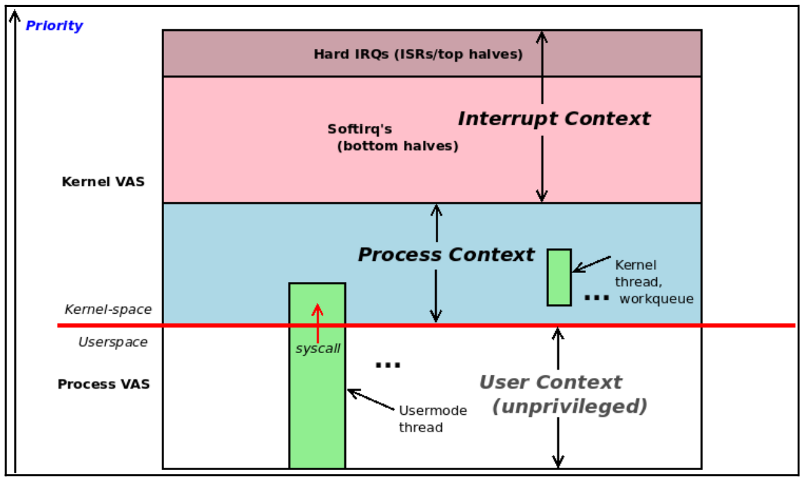

<center>[图6.1] 无特权的用户模式执行和特权的内核模式执行，同时包含进程和中断上下文</center>

## 理解进程虚拟地址空间 (VAS) 的基础知识

虚拟内存的一个基本 “规则” 是：所有潜在可寻址的内存都在一个盒子里；也就是说，它被 “沙盒化” 了。我们可以将这个 “盒子” 看作是进程镜像或进程的虚拟地址空间 (VAS)。不允许在这个盒子外进行操作。

用户虚拟地址空间 (VAS) 被划分为同质的内存区域，称为段或更专业的叫法是映射。每个 Linux 进程至少有以下这些映射（或段）：

<a id="process-vas"></a>

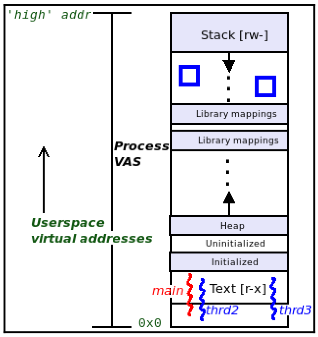

<center>[图6.2] 进程 VAS </center>

让我们快速了解一下这些段或映射的构成：

- **代码段**：存储机器代码的地方；静态的（模式：r-x）。

- **数据段**：存储全局和静态数据变量的地方（模式：rw-）。它内部被分为三个不同的段：
  - **已初始化数据段**：存储已初始化的变量；静态的。
  - **未初始化数据段**：存储未初始化的变量（它们在运行时会自动初始化为 0；这个区域有时被称为 bss）；静态的。
  - **堆段**：用于内存分配和释放的库 API（熟悉的 malloc() 系列函数）从这里获取内存。但这也不完全准确。在现代系统中，只有低于 MMAP_THRESHOLD（默认 128 KB）的 malloc() 实例从堆中获取内存。更大的内存会通过强大的 mmap() 系统调用作为单独的“映射”分配到进程的虚拟地址空间中。它是一个动态段（可以增长/收缩）。堆中最后一个合法可引用的位置被称为程序断点。

- **库（代码段、数据段）**：进程动态链接的所有共享库都会在运行时通过加载器映射到进程的虚拟地址空间中（模式：r-x/rw-）。

- **栈**：一个使用 “后进先出 (LIFO)” 的内存区域；栈用于实现高级语言的函数调用机制。它包括参数传递、局部变量实例化（和销毁）以及返回值的传播。它是一个动态段。在所有现代处理器（包括 x86 和 ARM 系列）中，栈向较低地址“增长”（称为完全下降栈）。每当调用函数时，栈帧就会根据需要分配和初始化；栈帧的精确布局高度依赖于 CPU。SP 寄存器（或等效寄存器）总是指向当前帧，也就是栈的顶部；由于栈向较低（虚拟）地址增长，栈的顶部实际上是最低的（虚拟）地址。这听起来不直观，但却是事实（模式：rw-）。

显然，我们应该理解进程必须至少包含一个执行线程（线程是进程中的执行路径）；通常这个线程是 main() 函数。在上图中，作为一个例子，我们展示了三个执行线程：main、thrd2 和 thrd3。此外，正如预期的那样，每个线程共享虚拟地址空间中的所有内容，除了栈；**每个线程都有自己私有的栈**。图中显示了 **main 线程的栈位于进程（用户）虚拟地址空间的最顶部；thrd2 和 thrd3 线程的栈显示在库映射和 main 栈之间**，并用两个（蓝色）方块表示。

## 组织进程、线程及其栈——用户空间和内核空间

传统的 UNIX 进程模型：“一切都是进程；如果它不是进程，它就是文件” 有其独特的优势。事实上，经过近五十年的时间，操作系统仍然遵循这一模型，这充分证明了它的有效性。当然，如今线程变得非常重要；线程只是进程中的一个执行路径。线程共享进程的所有资源，包括用户虚拟地址空间 (VAS)，除了栈之外。每个线程都有自己私有的栈区域（这完全有道理；否则，线程如何能够真正并行运行，因为栈保存了执行上下文）。

**线程，而非进程，是内核可调度的实体（也称为 KSE）**。这实际上是 Linux 操作系统架构的一个关键特点。在 Linux 操作系统中，每个线程（包括内核线程）都映射到一个名为任务结构 (task structure) 的内核元数据结构上。任务结构（也称为进程描述符）本质上是一个大型的内核数据结构，内核用它来作为属性结构。对于每一个活跃的线程，内核都会维护一个对应的任务结构（见下图）。

下一个关键点是：每个线程在每个 CPU 支持的权限级别上都需要一个栈。在现代操作系统如 Linux 中，我们支持两个权限级别：非特权的用户模式（或用户空间）和特权的内核模式（或内核空间）。因此，在 Linux 中，**每个活跃的用户空间线程都有两个栈**：

- **用户空间栈**：当线程执行用户模式的代码路径时，这个栈会被使用。
- **内核空间栈**：当线程通过系统调用或处理器异常切换到内核模式并执行内核代码路径时，这个栈会被使用（在进程上下文中）。

图中将地址空间划分为两部分：用户空间和内核空间。在图的上半部分用户空间中，我们可以看到几个进程及其用户虚拟地址空间。在下半部分内核空间中，我们可以看到，每个用户模式线程都有一个对应的内核元数据结构（即 struct task_struct，我们稍后会详细介绍）和该线程的内核模式栈。此外，我们在最底部还看到了三个内核线程（标记为 kthrd1、kthrd2 和 kthrdn），它们也有一个代表其内部属性的 task_struct 元数据结构和一个内核模式栈。

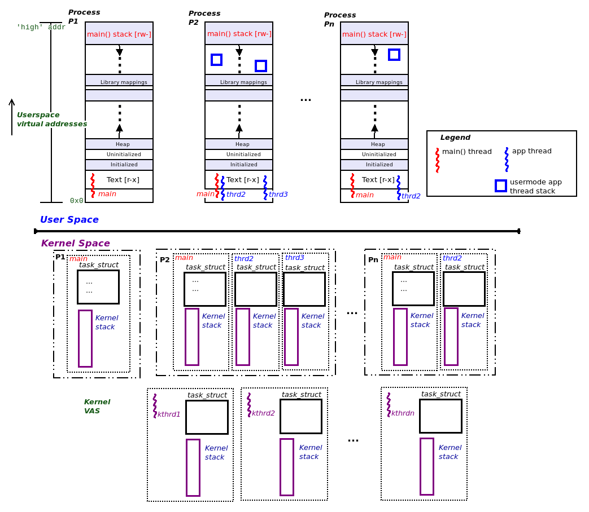

<center>[图6.3]</center>

为了让这个讨论更加实际，我们可以执行一个简单的 Bash 脚本 (ch6/countem.sh)，该脚本会统计当前活跃的进程和线程数量。在 x86_64 Ubuntu 18.04 LTS 系统上执行了此操作，以下是结果输出：

```bash
cd ~/kernel_learn/Linux-Kernel-Programming-master/ch6/

./countem.sh
```

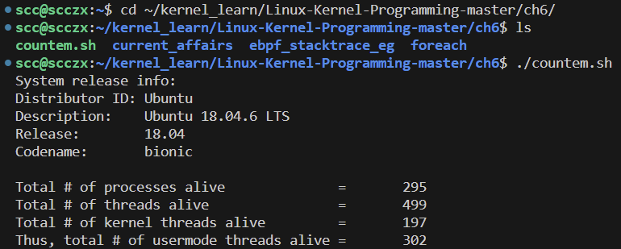

<center>[图6.4]</center>

我们可以在 ch6/countem.sh 文件中找到这个简单脚本的代码。仔细研究上述输出并理解它。当然，这只是某个时刻的快照，随时可能发生变化。

### 用户空间的组织

我们将对 `countem.sh` Bash 脚本进行分解并讨论一些关键点，目前我们将讨论范围限制在虚拟地址空间 (VAS) 的用户空间部分。

```bash
echo "System release info:"
which lsb_release >/dev/null
if [ $? -eq 0 ] ; then
  lsb_release -a 2>/dev/null
else
  [ -f /etc/issue ] && cat /etc/issue
  [ -f /etc/os-release ] && cat /etc/os-release
fi

# 总进程数量
total_prcs=$(ps -A|wc -l)
printf "\nTotal # of processes alive              = %9d\n" ${total_prcs}

# 总线程数量
# ps -LA shows all threads
total_thrds=$(ps -LA|wc -l)
printf "Total # of threads alive                = %9d\n" ${total_thrds}

# 内核线程数量
# ps aux shows all kernel threads names (col 11) in square brackets; count 'em
total_kthrds=$(ps aux|awk '{print $11}'|grep "^\["|wc -l)

printf "Total # of kernel threads alive         = %9d\n" ${total_kthrds}
# 用户空间线程数量
printf "Thus, total # of usermode threads alive = %9d\n" $((${total_thrds}-${total_kthrds}))

exit 0
```

为了更好地理解，我们将用户空间部分的图表放在这里：

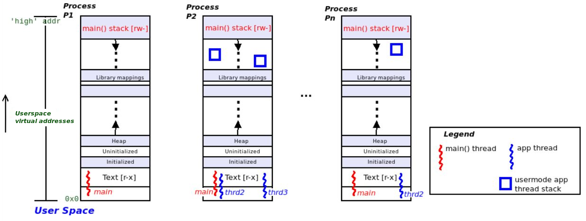

<center>[图6.5]</center>

在图中，我们可以看到三个独立的进程。每个进程至少有一个执行线程（即 `main()` 线程）。在前面的示例中，我们展示了三个进程 P1、P2 和 Pn，它们分别包含一个、三个和两个线程（包括 `main()`）。

每个进程由多个段组成（从技术上讲是映射）。用户模式段（映射）大致包括以下内容：

- **文本段**：代码；权限 `r-x`
- **数据段**：权限 `rw-`；包括三个不同的映射——已初始化的数据段、未初始化的数据段（或 bss），以及一个向上增长的堆
- **库映射**：用于进程动态链接的每个共享库的文本和数据
- **向下增长的栈**

关于这些栈，我们从前面的示例运行中看到，系统上当前有 302 个用户模式线程正在运行。这意味着同样有 302 个用户空间栈，因为每个活跃的用户模式线程都会有一个对应的用户模式栈。关于这些用户空间线程栈，我们可以做以下说明：

- 对于 `main()` 线程，总是存在一个用户空间栈，它位于用户 VAS 的最顶部——即高端；如果该进程是单线程的（只有一个 `main()` 线程），那么它将只有一个用户模式栈；图中的 P1 进程展示了这种情况。

- 如果进程是多线程的，那么每个活跃的线程（包括 `main()`）都会有一个用户模式线程栈；图中的 P2 和 Pn 进程展示了这种情况。栈通常是在调用 `fork()`（用于 `main()`）或 `pthread_create()`（用于进程中的其他线程）时分配的，这会导致该代码路径在内核中以进程上下文执行：

  ```
  sys_fork() --> do_fork() --> _do_fork()
  ```

  顺便说一下，Linux 上的 `pthread_create()` 库 API 调用了非常特定于 Linux 的 `clone()` 系统调用；该系统调用最终会调用 `_do_fork()`；传递的 `clone_flags` 参数告知内核如何准确地创建“自定义进程”，换句话说，也就是一个线程！

这些用户空间栈当然是动态的；它们可以在栈大小资源限制（`RLIMIT_STACK`，通常为 8 MB；我们可以使用 `prlimit()` 工具来查看）范围内增长或缩小。

### 内核空间的组织

我们继续讨论在上一节中运行的 `countem.sh` Bash 脚本，现在我们将其分解并讨论一些关键点，这次我们将讨论局限于虚拟地址空间（VAS）的内核空间部分。为了便于理解，我们将图示中的内核空间部分放在这里：

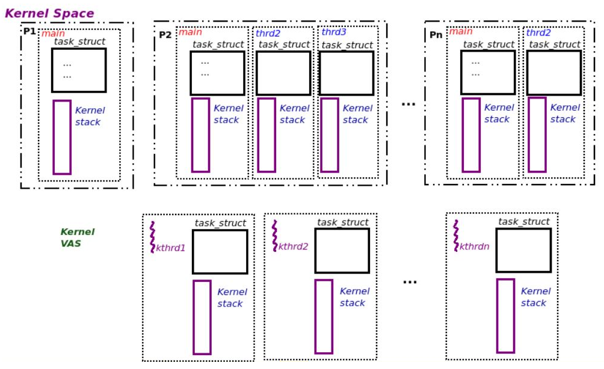

<center>[图6.6]</center>

从我们前面运行的示例中可以看到，系统当前有 302 个用户模式线程和 197 个内核线程在运行。这总共产生了 499 个内核空间堆栈。为什么会这样呢？如前所述，**每个用户模式线程都有两个堆栈：一个用户模式堆栈和一个内核模式堆栈**。因此，我们将拥有 302 个内核模式堆栈（对应于每个用户模式线程），加上 197 个内核模式堆栈（对应于纯内核线程，注意**内核线程只有内核模式堆栈，它们无法“看到”用户空间**）。以下是内核模式堆栈的一些特点：

- **每个应用程序（用户模式）线程都会有一个内核模式堆栈，包括 `main()` 线程。**
- **内核模式堆栈的大小是固定的（静态的），并且相当小。实际上，它们的大小在32位操作系统上是2页，在64位操作系统上是4页（通常一页为4KB）。**
- **它们在线程创建时分配（通常归结为 `_do_fork()` 函数的调用）。**

再次明确一点：每个用户模式线程都有两个堆栈：一个用户模式堆栈和一个内核模式堆栈。唯一的例外是内核线程；它们只有内核模式堆栈（因为它们没有用户映射，因此没有用户空间“段”）。在图的下部，我们展示了三个内核线程——`kthrd1`、`kthrd2` 和 `kthrdn`（在我们之前的示例运行中，`kthrdn` 的 n=197）。此外，每个内核线程在创建时都分配了一个任务结构和一个内核模式堆栈。

内核模式堆栈在大多数方面与其用户模式堆栈类似：每当调用一个函数时，都会设置一个堆栈帧（帧布局特定于架构，是CPU应用二进制接口（ABI）文档的一部分）；CPU有一个寄存器用于跟踪堆栈的当前位置（通常称为堆栈指针（SP）），堆栈“向下”增长，即朝向较低的虚拟地址。但与动态的用户模式堆栈不同，内核模式堆栈的大小是固定且较小的。

#### 总结当前的情况

现在我们总结一下我们在运行 `countem.sh` 脚本示例时的学习和发现：

**任务结构：**

- 每个正在运行的线程（无论是用户线程还是内核线程）在内核中都有一个对应的任务结构（`struct task_struct`）；内核通过这个结构来跟踪线程，并存储它的所有属性。
- 对于我们运行的 `ch6/countem.sh` 脚本示例：
  - 由于系统上共有 499 个线程（包括用户线程和内核线程）正在运行，这意味着在内核内存中共有 499 个任务（元数据）结构（在代码中为 `struct task_struct`），其中：
  - 302 个任务结构代表用户线程。
  - 剩下的 197 个任务结构代表内核线程。

**堆栈：**

- 每个用户空间线程都有两个堆栈：
  - 用户模式堆栈（在线程执行用户模式代码路径时使用）。
  - 内核模式堆栈（在线程执行内核模式代码路径时使用）。
- 一个纯内核线程只有一个堆栈——内核模式堆栈。
- 对于我们运行的 `ch6/countem.sh` 脚本示例：
  - 302 个用户空间堆栈（在用户空间）。
  - 302 个内核空间堆栈（在内核内存中）。
  - 197 个内核空间堆栈（用于181个正在运行的内核线程）。
- 这样，总共有 302 + 302 + 197 =  801 个堆栈。

在讨论用户和内核模式堆栈时，我们还应简要提到以下一点：**许多架构（包括 x86 和 ARM64）支持用于中断处理的单独的每个 CPU 的堆栈。当外部硬件中断发生时，CPU 的控制单元会立即将控制重新引导到最终的中断处理代码（可能在设备驱动程序中）。一个单独的每个 CPU 的中断堆栈用于保存中断代码路径的堆栈帧；这有助于避免对现有的（小型的）被中断的进程/线程的内核模式堆栈施加过大的压力。**

### 查看用户和内核堆栈

堆栈通常是调试会话的关键。堆栈持有当前进程或线程的执行上下文，即它现在的位置，这使我们能够推断出它正在做什么。更重要的是，能够查看和解释线程的调用堆栈（或调用链/回溯）对于理解我们是如何到达这里至关重要。所有这些宝贵的信息都存储在堆栈中。但每个线程都有两个堆栈：用户空间堆栈和内核空间堆栈。我们该如何查看它们呢？

我们将展示两种查看给定进程或线程的内核和用户模式堆栈的主要方法：首先是“传统”方法，然后是更现代的方法（通过 [e]BPF）。

#### 传统方式查看堆栈

##### 查看给定线程或进程的内核空间堆栈

Linux 内核通过常见的机制：强大的 `/proc` 文件系统接口，将堆栈暴露给用户空间。只需查看 `/proc/<pid>/stack` 即可。

那么，我们来看看 Bash 进程的内核模式堆栈。假设在我们的 x86_64 Ubuntu 客户机（运行我们的调试内核）中，Bash 进程的 PID 是 2465：

```bash
ps aux | grep bash
# scc        2465  0.0  0.0  14768  3668 ?        Ss   13:00   0:00 bash

sudo cat /proc/2465/stack
# [<0>] do_wait+0x3d7/0x4c0
# [<0>] kernel_wait4+0xed/0x1d0
# [<0>] __do_sys_wait4+0x107/0x120
# [<0>] __x64_sys_wait4+0x55/0x60
# [<0>] do_syscall_64+0x77/0x2f0
# [<0>] entry_SYSCALL_64_after_hwframe+0x61/0xd6
```

在上面的输出中，每一行代表堆栈中的一个调用帧。为了帮助解读内核堆栈回溯，以下几点是值得了解的：

- 应该自下而上（从底部到顶部）阅读。
- 每一行输出代表一个调用帧，实际上是调用链中的一个函数。
- 如果函数名称显示为 `??`，意味着内核无法可靠地解释堆栈。可以忽略它，这是内核表示这是一个无效的堆栈帧（可能是“遗留”下来的一个小错误）；通常内核的回溯代码是正确的。
- **在 Linux 中，任何 `foo()` 系统调用通常会变成内核中的 `SyS_foo()` 函数。此外，`SyS_foo()` 通常是一个调用“真正”代码 `do_foo()` 的包装器。**一个细节是：在内核代码中，我们可能会看到类似 `SYSCALL_DEFINEn(foo, ...)` 的宏；这个宏会变成 `SyS_foo()` 例程；附加的数字 `n` 范围是 [0, 6]，它是从用户空间传递给内核的系统调用参数的数量。

现在再看看前面的输出，应该非常清楚：我们的 Bash 进程当前正在执行 `do_wait()` 函数；它通过系统调用 `wait4()` 到达这里。这非常正确，Shell 的工作原理是通过 `fork` 创建一个子进程，然后通过 `wait4()` 系统调用等待子进程的结束。

在前面的代码片段中显示的堆栈帧的最左边列 `[<0>]` 是每个函数对应的文本（代码）地址的占位符。出于安全原因（为了防止信息泄漏），在现代内核中这些地址已经被清零（显示为 `0`）。

##### 查看给定线程或进程的用户空间堆栈

讽刺的是，在典型的 Linux 发行版上，查看进程或线程的用户空间堆栈似乎比查看内核模式堆栈更难。不过，有一个实用工具可以做到这一点：`gstack()`。实际上，它只是一个简单的包装器，运行一个脚本，在批处理模式下调用 `gdb()`，并让 `gdb` 执行其 `backtrace` 命令。

在 x86_64 Ubuntu 上，安装`gstack()` 工具，当前版本无法找到 gstack ，我们自己将脚本添加进去：

```bash
# 创建文件，名为 gstack
# 将以下脚本内容写入该文件

sudo chmod 777 gstack

sudo cp gstack /usr/bin/
```

脚本内容如下：

```bash
#!/bin/sh
 
if test $# -ne 1; then
    echo "Usage: `basename $0 .sh` <process-id>" 1>&2
    exit 1
fi
 
if test ! -r /proc/$1; then
    echo "Process $1 not found." 1>&2
    exit 1
fi
 
# GDB doesn't allow "thread apply all bt" when the process isn't
# threaded; need to peek at the process to determine if that or the
# simpler "bt" should be used.
 
backtrace="bt"
if test -d /proc/$1/task ; then
    # Newer kernel; has a task/ directory.
    if test `/bin/ls /proc/$1/task | /usr/bin/wc -l` -gt 1 2>/dev/null ; then
	backtrace="thread apply all bt"
    fi
elif test -f /proc/$1/maps ; then
    # Older kernel; go by it loading libpthread.
    if /bin/grep -e libpthread /proc/$1/maps > /dev/null 2>&1 ; then
	backtrace="thread apply all bt"
    fi
fi
 
GDB=${GDB:-/usr/bin/gdb}
 
if $GDB -nx --quiet --batch --readnever > /dev/null 2>&1; then
    readnever=--readnever
else
    readnever=
fi
 
# Run GDB, strip out unwanted noise.
$GDB --quiet $readnever -nx /proc/$1/exe $1 <<EOF 2>&1 | 
set width 0
set height 0
set pagination no
$backtrace
EOF
/bin/sed -n \
    -e 's/^\((gdb) \)*//' \
    -e '/^#/p' \
    -e '/^Thread/p'
#end
```

以下是一个例子（此处 Bash 进程的 PID 为 2465）：

```bash
sudo gstack 2465
# #0  0x00007efe77784337 in waitpid () from /lib/x86_64-linux-gnu/libc.so.6
# #1  0x0000558fd3fdbc29 in ?? ()
# #2  0x0000000000000003 in ?? ()
# #3  0x00007ffd8bb27914 in ?? ()
# #4  0x00000000d48d86f0 in ?? ()
# #5  0x00000000ffffffff in ?? ()
# #6  0x0000000000000000 in ?? ()
```

同样，每一行代表一个调用帧。从下往上阅读。显然，Bash 执行了一个命令，并最终调用了 `waitpid()` 系统调用（实际上，在现代 Linux 系统中，`waitpid()` 只是实际 `wait4()` 系统调用的 `glibc` 包装器。同样，忽略任何标记为 `??` 的调用帧）。

#### [e]BPF：查看堆栈的现代方法

我们来学习使用一种强大且现代的方法，这种方法称为扩展伯克利数据包过滤器（eBPF，或简称BPF）。旧版的BPF已经存在很久，并被用于网络数据包跟踪；[e]BPF是最近的创新，仅在 4.x 及以上版本的Linux内核中可用。

直接使用底层内核级BPF字节码技术是非常困难的；好消息是，现在有多个易于使用的前端工具和脚本可以利用这项技术。（在http://www.brendangregg.com/BPF/bcc_tracing_tools_early2019.png上可以找到当前BCC性能分析工具的示意图；在http://www.brendangregg.com/ebpf.html#frontends上可以找到[e]BPF前端工具的列表；这些链接都来自Brendan Gregg的博客。）在这些前端工具中，BCC 和 bpftrace 被认为是非常有用的。这里，我们将简单演示一下如何使用一个名为 stackcount 的 BCC 工具（在 Ubuntu 上它叫做 stackcount-bpfcc() ）。另一个优势是：使用这个工具可以同时查看内核和用户模式的堆栈，不需要使用不同的工具。

实际测试过程中，使用 Ubuntu 18 无法直接调用该程序，在手动安装编译完成 bcc 之后，才可以正常使用。安装过程参考：https://blog.csdn.net/weixin_43793731/article/details/128364192。

在以下示例中，我们使用 stackcount BCC 工具（在 x86_64 Ubuntu LTS主机系统上）来查看 0 号进程的堆栈情况。作为示例，我们选择了任何包含名称malloc的函数：

```bash
sudo /usr/share/bcc/tools/stackcount -p 0 -r ".*malloc.*" -v -d
# Tracing 56 functions for ".*malloc.*"... Hit Ctrl-C to end.
# ^C
# Detaching...

# 设置软链接，以后就可以直接使用 stackcount-bpfcc 运行了
sudo ln -s /usr/share/bcc/tools/stackcount /usr/local/bin/stackcount-bpfcc
```

输出如下：

```plaintext
  [...]
  ffffffff9c0ad651 kmalloc_slab
  ffffffff9c2fe9f7 kernfs_fop_read
  ffffffff9c1b4000 __vfs_read
  ffffffff9c1b4108 vfs_read
  ffffffff9c1b476a ksys_read
  ffffffff9c1b4803 __x64_sys_read
  ffffffff9bc07ee7 do_syscall_64
  ffffffff9d0000a9 entry_SYSCALL_64_after_hwframe
    --
  7fcf1487a031     [unknown]
    1038

  ffffffff9c14e531 __kmalloc
  ffffffff9c1b4000 __vfs_read
  ffffffff9c1b4108 vfs_read
  ffffffff9c1b476a ksys_read
  ffffffff9c1b4803 __x64_sys_read
  ffffffff9bc07ee7 do_syscall_64
  ffffffff9d0000a9 entry_SYSCALL_64_after_hwframe
    --
  7fcf1487a031     [unknown]
    1038
  [...]
```

-d 选项会打印分隔符“--”；它表示进程的内核模式和用户模式堆栈之间的边界。（由于大多数生产环境中的用户模式应用程序会去除符号信息，大多数用户模式的堆栈帧会显示为 “[unknown]”。）然而，在这个系统上，至少内核堆栈帧非常清晰；甚至还打印出了相关函数的文本（代码）地址。（为了更好地理解堆栈跟踪：首先，从下往上阅读；其次，如前所述，在 Linux 上，任何 foo() 系统调用通常会在内核中成为 SyS_foo() 函数，而 SyS_foo() 通常是实际执行工作的 do_foo() 函数的包装器。）

作为第二个更简单的示例，我们编写了一个简单的 “Hello, world” 程序（需要注意的是，它处于一个无限循环中，这样我们就可以捕获底层的 write() 系统调用），并在编译时启用了符号信息（即使用gcc -g ...），然后使用一个简单的Bash脚本来执行与之前相同的操作：在程序执行时跟踪内核和用户模式堆栈。（我们可以在ch6/ebpf_stacktrace_eg/中找到代码。）以下截图显示了一个示例运行情况：

```bash
cd ~/kernel_learn/Linux-Kernel-Programming-master/ch6/ebpf_stacktrace_eg/
    
make

./runit.sh 
```


<center>[图6.7]</center>

### 这个过程虚拟地址空间（VAS）的全景图

在结束本节之前，我们有必要退一步，来看一下每个进程的完整虚拟地址空间（VAS），以及系统整体的情况。换句话说，就是拉远视角，观察整个系统地址空间。接下来，我们将通过一个相当大且详细的图表来尝试展示这一点，这是我们之前上一节图的扩展或超集。

除了刚刚学习和看到的内容：进程的用户空间段、（用户和内核）线程以及内核模式栈之外，不要忘记内核中还有许多其他元数据：任务结构、内核线程、内存描述符元数据结构等等。它们都是内核虚拟地址空间（VAS）的一部分，这通常被称为内核段。内核段不仅仅包括任务和栈。它还包含静态内核（核心）代码和数据，实际上是内核的所有主要（和次要）子系统、体系架构特定的代码等等。

下面的图表试图将所有（至少大部分）这些信息总结并展示在一个地方：

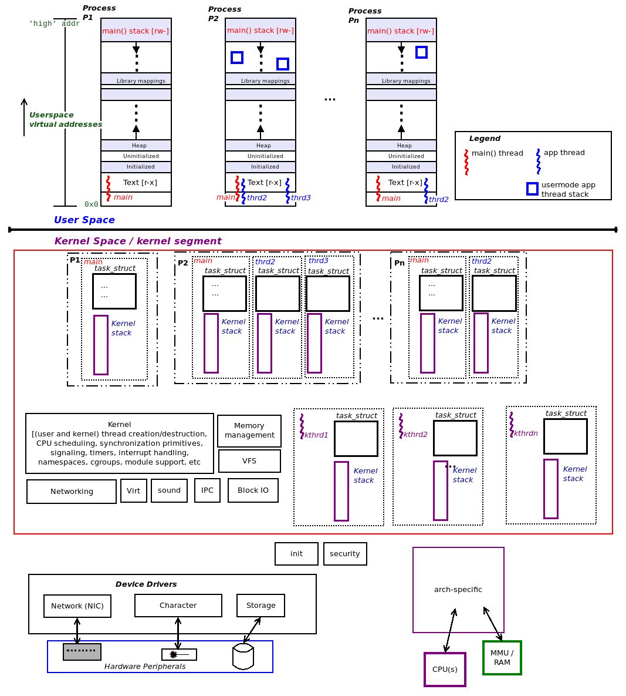

<center>[图6.8]</center>

图中内核段的红框内包含了核心内核代码和数据，主要的内核子系统，并展示了任务结构和内核模式栈。其余部分被认为是非核心内容，包括设备驱动程序。体系架构特定的代码可以说是核心代码。

## 理解和访问内核任务结构

每个用户空间和内核空间的线程在Linux内核中都通过一个包含其所有属性的元数据结构进行内部表示：即任务结构。任务结构在内核代码中表示为 `include/linux/sched.h:struct task_struct`。

但是它常常被错误地称为“进程描述符”，这会导致很多混淆。幸运的是，“任务结构”这个术语要好得多；它**代表了一个可运行的任务，实际上就是一个线程**。

所以我们得出结论：**在Linux设计中，每个进程由一个或多个线程组成，每个线程映射到一个名为任务结构（`struct task_struct`）的内核数据结构。**

任务结构是线程的“根”元数据结构，它封装了操作系统所需的该线程的所有信息。这些信息包括其内存（段、分页表、使用信息等）、CPU调度详情、当前打开的文件、凭证、能力位掩码、定时器、锁、异步I/O（AIO）上下文、硬件上下文、信号、进程间通信（IPC）对象、资源限制、（可选的）审计、安全和分析信息等许多细节。

下图是Linux内核任务结构及其包含的大多数信息（元数据）的概念表示：

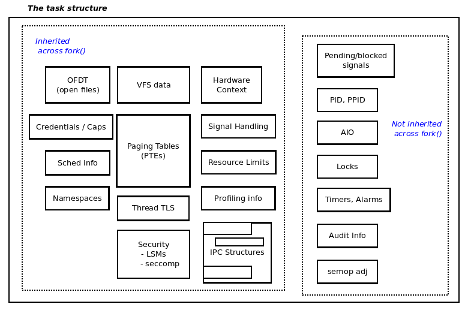

<center>[图6.9]</center>

如图中所示，任务结构包含了系统上每个活跃任务（进程/线程）的海量信息（再次强调：这也包括内核线程）。我们在图中以分隔的概念化形式展示了封装在这个数据结构中的不同类型的属性。此外，如图所示，**某些属性在调用`fork()`（或`pthread_create()`）时会被子进程或线程继承；而某些属性则不会被继承，仅仅会被重置**。

至少目前来说，可以简单地说，内核“理解”任务是一个进程还是一个线程。稍后我们会展示一个内核模块（`ch6/foreach/thrd_showall`），它可以确切地揭示我们如何确定这一点。

### 探索任务结构

任务结构本质上是进程或线程的“根”数据结构，它包含了任务的所有属性。因此，它相当庞大；强大的 `crash()` 工具（用于分析Linux崩溃转储数据或调查活动系统）在x86_64架构上报告其大小为9,088字节，`sizeof` 运算符也是如此。

任务结构定义在 `include/linux/sched.h` 内核头文件中（这是一个相当关键的头文件）。在以下代码中，我们展示了其定义，但请注意，我们只显示了其众多成员中的一部分。（此外，使用 `<<` 角括号标注的注释非常简要地解释了某些成员的作用）：  

```c
// include/linux/sched.h
struct task_struct {
#ifdef CONFIG_THREAD_INFO_IN_TASK
 /*
 * 由于头文件之间的复杂依赖（参见current_thread_info()），
 * 这必须是task_struct的第一个元素。
 */
 struct thread_info thread_info; << 重要的标志和状态位 >>
#endif
 /* -1 不可运行, 0 可运行, >0 停止: */
 volatile long state;
 [...]
 void *stack; << 内核模式栈的位置 >>
 [...]
 /* 当前CPU: */
 unsigned int cpu;
 [...]
<< 下面的成员与CPU调度有关；其中一些将在 Chapter9 和 Chapter10 的 CPU 调度中讨论 >>
 int on_rq;
 int prio;
 int static_prio;
 int normal_prio;
 unsigned int rt_priority;
const struct sched_class *sched_class;
 struct sched_entity se;
 struct sched_rt_entity rt;
 [...]
```

在下面的代码块中，我们继续探讨任务结构，看看与内存管理（`mm`）、PID 和 TGID 值、凭证结构、打开的文件、信号处理等相关的成员。我们并不打算详细深入讨论（所有）这些成员；在本章后续部分以及本书的其他章节中，我们将在适当的地方再次探讨它们：

```c
 [...]
 struct mm_struct *mm; << 内存管理信息 >>
 struct mm_struct *active_mm;
 [...]
 pid_t pid; << 任务PID和TGID值；如下所述 >>
 pid_t tgid;
 [...]
 /* 上下文切换计数: */
 unsigned long nvcsw;
 unsigned long nivcsw;
 [...]
 /* 可覆盖的主观任务凭证 (COW): */
 const struct cred __rcu *cred;
 [...]
 char comm[TASK_COMM_LEN]; << 任务名称 >>
 [...]
 /* 打开文件的信息: */
 struct files_struct *files; << 指向“打开文件”数据结构的指针 >>
 [...]
 /* 信号处理程序: */
 struct signal_struct *signal;
 struct sighand_struct *sighand;
 sigset_t blocked;
 sigset_t real_blocked;
 [...]
#ifdef CONFIG_VMAP_STACK
 struct vm_struct *stack_vm_area;
#endif
 [...]
#ifdef CONFIG_SECURITY
 /* LSM模块用于访问限制: */
 void *security;
#endif
 [...]
 /* 该任务的特定CPU状态: */
struct thread_struct thread; << 任务的硬件上下文细节 >>
 [...]
};
```

### 使用 `current` 访问任务结构

在我们之前运行的  `countem.sh`  脚本（在 “[组织进程、线程及其堆栈——用户空间和内核空间](#组织进程、线程及其栈——用户空间和内核空间)”  部分中），我们发现系统上共有 499 个线程（包括用户线程和内核线程）处于活动状态。这意味着内核内存中将存在总共 499 个任务结构对象。

这些对象需要以一种便于内核在需要时轻松访问的方式进行组织。因此，**内核内存中的所有任务结构对象都链接在一个称为任务列表（`task list`）的循环双向链表上**。这种组织方式是必要的，以便各种内核代码路径可以遍历它们（通常是  `procfs`  代码等）。即便如此，想想看：当一个进程或线程在运行内核代码（处于进程上下文中）时，它如何在内核内存中可能存在的数百或数千个任务结构中找到属于自己的那个 `task_struct`？内核开发人员设计了一种方法来确保我们可以找到表示当前正在运行内核代码的线程的特定任务结构。这是通过一个称为  `current`  的宏来实现的。可以这样理解：

**查找 `current` 会得到一个指向当前正在运行内核代码的线程的 `task_struct` 的指针，就是当前在某个特定处理器核心上运行的进程上下文。**

`current` 类似于（当然不完全相同）面向对象语言中的 `this` 指针。

`current` 宏的实现非常依赖于具体的体系结构。这里我们不深入讨论其中的复杂细节。简单地说，该实现经过精心设计，以保证其速度很快（通常通过一个O(1)算法）。例如，在某些精简指令集计算机（RISC）架构上，它们具有许多通用寄存器（如PowerPC和Aarch64处理器），一个寄存器专门用于保存 `current` 的值。

我们可以使用 `current` 来解引用任务结构，并从中提取信息；例如，可以通过如下方式查找进程（或线程）的PID和名称：

```c
#include <linux/sched.h>
current->pid, current->comm
```

### 确定上下文

内核代码运行在两种上下文之一：

1. 进程（或任务）上下文
2. 中断（或原子）上下文

这两者是互斥的：**内核代码在任何给定时间点要么运行在进程上下文中，要么运行在原子/中断上下文中。**

通常，在编写内核或驱动程序代码时，首先弄清楚我们正在编写的代码运行在哪种上下文中是至关重要的。一种了解这一点的方法是使用以下宏：

```c
#include <linux/preempt.h>
 in_task()
```

它返回一个布尔值：如果我们的代码运行在进程（或任务）上下文中，它会返回 `True`，这意味着通常在这种上下文中是可以安全休眠的；返回 `False` 则表示我们处于某种原子或中断上下文中，在这种情况下，休眠是绝对不安全的。

不过，虽然 `in_task()` 返回 `True` 确实意味着我们的代码处于进程上下文中，但这一事实本身并不能保证目前可以安全地休眠。休眠实际上意味着调用调度程序代码并进行随后的上下文切换（我们将在 Chapter 10 和 Chapter 11 中详细讨论这一点）。例如，我们可能处于进程上下文中，但持有一个自旋锁（这是内核中非常常见的锁）；锁定和解锁之间的代码（所谓的临界区）必须以原子方式运行。这意味着，尽管我们的代码可能在进程（或任务）上下文中，但如果尝试调用任何阻塞（休眠）的API，仍然会导致错误。

另外要注意的是：`current` 只有在运行于进程上下文时才被认为是有效的。

## 通过 `current` 使用任务结构

在这里，我们将编写一个简单的内核模块，以展示任务结构的几个成员，并揭示其 `init` 和 `cleanup` 代码路径所运行的进程上下文。为此，我们编写了一个 `show_ctx()` 函数，它使用 `current` 访问任务结构的几个成员并显示它们的值。该函数在 `init` 和 `cleanup` 方法中都会被调用，如下所示：

```c
/* code: ch6/current_affairs/current_affairs.c */
[ ... ]
#include <linux/sched.h> /* current */
#include <linux/cred.h> /* current_{e}{u,g}id() */
#include <linux/uidgid.h> /* {from,make}_kuid() */
[...]
#define OURMODNAME "current_affairs"
[ ... ]
static void show_ctx(char *nm)
{
    /* 使用提供的辅助方法提取任务的UID和EUID */
    unsigned int uid = from_kuid(&init_user_ns, current_uid());
    unsigned int euid = from_kuid(&init_user_ns, current_euid());
    pr_info("%s:%s():%d ", nm, __func__, __LINE__);
    if (likely(in_task())) {
        pr_info(
            "%s: 处于进程上下文中 ::\n"
            " PID : %6d\n"
            " TGID : %6d\n"
            " UID : %6u\n"
            " EUID : %6u (%s root)\n"
            " name : %s\n"
            " current（指向我们进程上下文的task_struct的指针）:\n"
            " 0x%pK (0x%px)\n"
            " stack start : 0x%pK (0x%px)\n",
            nm,
            /* 最好使用提供的辅助方法 */
            task_pid_nr(current), task_tgid_nr(current),
            /* ... 而不是直接查找：
               current->pid, current->tgid, */
            uid, euid,
            (euid == 0 ? "have" : "don't have"),
            current->comm,
            current, current,
            current->stack, current->stack);
    } else
        pr_alert("%s: 处于中断上下文 [这里不应该发生！]\n", nm);
}
```

对于某些成员，我们可以直接解引用 `current` 指针来访问 `task_struct` 的各种成员并通过内核日志缓冲区显示它们。

上面的代码片段确实展示了如何通过 `current` 直接访问 `task_struct` 的一些成员。不过，并非所有成员都可以或应该直接访问。相反，内核提供了一些辅助方法来访问它们。接下来让我们探讨这个部分。

### 内置内核辅助方法和优化

在前面的代码中，我们使用了一些内核内置的辅助方法来提取任务结构的各种成员。这是推荐的方法；例如，我们使用 `task_pid_nr()` 来查看 PID 成员，而不是直接通过 `current->pid`。类似地，任务结构中的进程凭证（如我们在前面代码中展示的 EUID 成员）被封装在 `struct cred` 中，并通过辅助例程访问它们，就像我们在前面的代码中使用的 `from_kuid()`。类似的，还有许多其他辅助方法；可以在 `include/linux/sched.h` 中 `struct task_struct` 定义下方找到它们。

此外，如前面的代码所示，我们可以通过使用 `in_task()` 宏轻松判断我们的内核模块代码是否运行在进程上下文或中断上下文中，如果在进程（或任务）上下文中，它返回 `True`，否则返回 `False`。

我们还使用了 `likely()` 宏（它变成了编译器的 `__builtin_expect` 属性），为编译器的分支预测设置提供提示，并优化输入 CPU 管道的指令序列，从而使我们的代码保持在“快速路径”上。我们会发现内核代码经常在开发者“知道”代码路径可能性大小的情况下使用 `likely()/unlikely()` 宏。

好了，现在我们已经理解了内核模块 `show_ctx()` 函数的工作原理，让我们来试一试它。

### 尝试使用内核模块打印进程上下文信息

我们编译了 `current_affair.ko` 内核模块，然后将其插入到内核空间中（像往常一样通过 `insmod()`）。现在，我们使用 `dmesg()` 查看内核日志，然后使用 `rmmod()` 卸载模块，再次使用 `dmesg()`。下面的截图显示了这一过程：

```bash
cd Linux-Kernel-Programming-master/ch6/current_affairs/

make

sudo dmesg -C

sudo insmod current_affairs.ko

dmesg

sudo rmmod current_affairs

dmesg
```

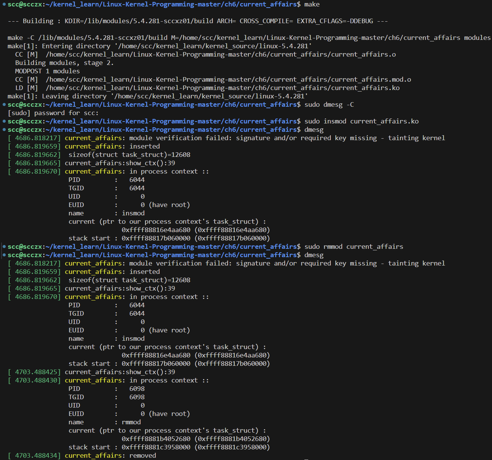

<center>[图6.10]</center>

从上面的截图可以清楚地看到，当前运行 `current_affairs.ko:current_affairs_init()` 内核代码的进程上下文（即运行该内核代码的进程或线程）是 `insmod` 进程（请参见输出中的 `name : insmod`），而 `current_affairs.ko:current_affairs_exit()` 执行清理代码时的进程上下文是 `rmmod` 进程。

这个小型演示内核模块的作用远不止表面看到的这些。它实际上在理解Linux内核架构方面非常有帮助。

#### 了解Linux操作系统是单体式结构

除了使用 `current` 宏的练习之外，这个内核模块（`ch6/current_affairs`）的一个关键点是清楚地展示Linux操作系统的单体式（monolithic）特性。在前面的代码中，我们看到，当我们对内核模块文件（`current_affairs.ko`）执行 `insmod()` 时，该模块被插入内核，并运行了其初始化代码路径；是谁运行的呢？这个问题可以通过查看输出来回答：**`insmod` 进程本身在进程上下文中运行了它，从而证明了Linux内核的单体结构**！（`rmmod()` 进程和清理代码路径的执行也是同理，它是在进程上下文中由 `rmmod` 进程运行的。）

当然，这种内核代码的执行方式就是我们所说的在进程上下文中运行，而不是在中断上下文中运行。尽管如此，Linux内核并不被视为完全的单体式系统；如果是这样，它将是一块单一的硬编码内存。相反，与所有现代操作系统一样，Linux支持模块化（通过LKM框架）。

#### 使用 `printk` 编写安全代码

在我们之前的内核模块演示（`ch6/current_affairs/current_affairs.c`）中， `printk` 使用了特殊的 `%pK` 格式说明符。我们在此重现相关代码片段：

```c
pr_info(
    [...]
    " current (ptr to our process context's task_struct) :\n"
    " 0x%pK (0x%px)\n"
    " stack start : 0x%pK (0x%px)\n",
    [...]
    current, (long unsigned)current,
    current->stack, (long unsigned)current->stack);
    [...]
```

回想我们在 Chapter 5 中的讨论，在 “影响系统日志的Proc文件系统调优” 部分，当打印地址时（首先，在生产环境中确实不应该打印地址），我们不应该使用常见的 `%p`（或 `%px`），而是使用 `%pK` 格式说明符。我们在上面的代码中也是这样做的；这是为了安全性，以防止内核信息泄露。

在一个为安全性精心调优的系统上，`%pK` 将显示一个简单的哈希值，而不是实际地址。为说明这一点，我们还使用 `%px` 格式说明符显示实际内核地址进行对比。

## 遍历内核的任务列表

所有任务结构在内核内存中被组织成一个称为任务列表（task list）的链表（使得它们可以被遍历）。这个列表数据结构已经演变为非常常用的**循环双向链表**。实际上，操作这些链表的核心内核代码已经被提取到一个名为 `list.h` 的头文件中，并且适用于任何基于列表的操作。

我们可以通过 `include/linux/sched/signal.h` 头文件中提供的方便宏轻松遍历与任务相关的各种列表（适用于内核版本>= 4.11）；注意，对于4.10及更早版本的内核，这些宏位于 `include/linux/sched.h` 中。

现在，让我们通过实际操作来讨论这一点。在接下来的部分中，我们将编写内核模块，通过两种方式遍历内核任务列表：

1. 遍历内核任务列表并显示所有存活的进程。
2. 遍历内核任务列表并显示所有存活的线程。

我们将详细展示后一种情况的代码。

### 遍历任务列表 I – 显示所有进程

内核提供了一个方便的例程，即 `for_each_process()` 宏，它可以让我们轻松遍历任务列表中的每个进程：

```c
// include/linux/sched/signal.h:
#define for_each_process(p) \
    for (p = &init_task ; (p = next_task(p)) != &init_task ; )
```

显然，这个宏展开为一个 `for` 循环，使我们能够遍历这个循环链表。`init_task` 是一个方便的“头”或起始指针，它指向第一个用户空间进程的任务结构，传统上是 `init()`，现在是 `systemd()`。

以下是我们的 `ch6/foreach/prcs_showall` 内核模块在 x86_64 Ubuntu 18.04 LTS 客户系统上运行时的部分输出片段：

```bash
../../../lkm prcs_showall
# [...]
# [ 6525.079141] prcs_showall: inserted
# [ 6525.079145]      Name       |  TGID  |   PID  |  RUID |  EUID
# [ 6525.079150] systemd         |       1|       1|      0|      0

# [ 6525.079162] =============================
# [ 6525.079163] WARNING: suspicious RCU usage
# [ 6525.079166] 5.4.281-sccxz01 #1 Tainted: G           OE    
# [ 6525.079168] -----------------------------
# [ 6525.079171] ./include/linux/rcupdate.h:306 Illegal context switch in RCU read-side critical section!
# [ 6525.079173] 
#                other info that might help us debug this:
# 
# [ 6525.079175] 
# [...]
```

### 遍历任务列表 II – 显示所有线程

要遍历系统上所有存活的线程，可以使用 `do_each_thread() { ... } while_each_thread()` 这对宏；我们编写了一个示例内核模块来实现这一功能（代码位于 `ch6/foreach/thrd_showall/`）。在深入研究代码之前，让我们先编译它并将其插入内核，然后通过 `dmesg()` 查看其输出的底部部分。由于完整输出过于庞大，无法在这里全部展示，仅在下面的截图中显示了输出的部分。此外，我们也重现了输出的表头，以便我们去理解每一列代表的内容：

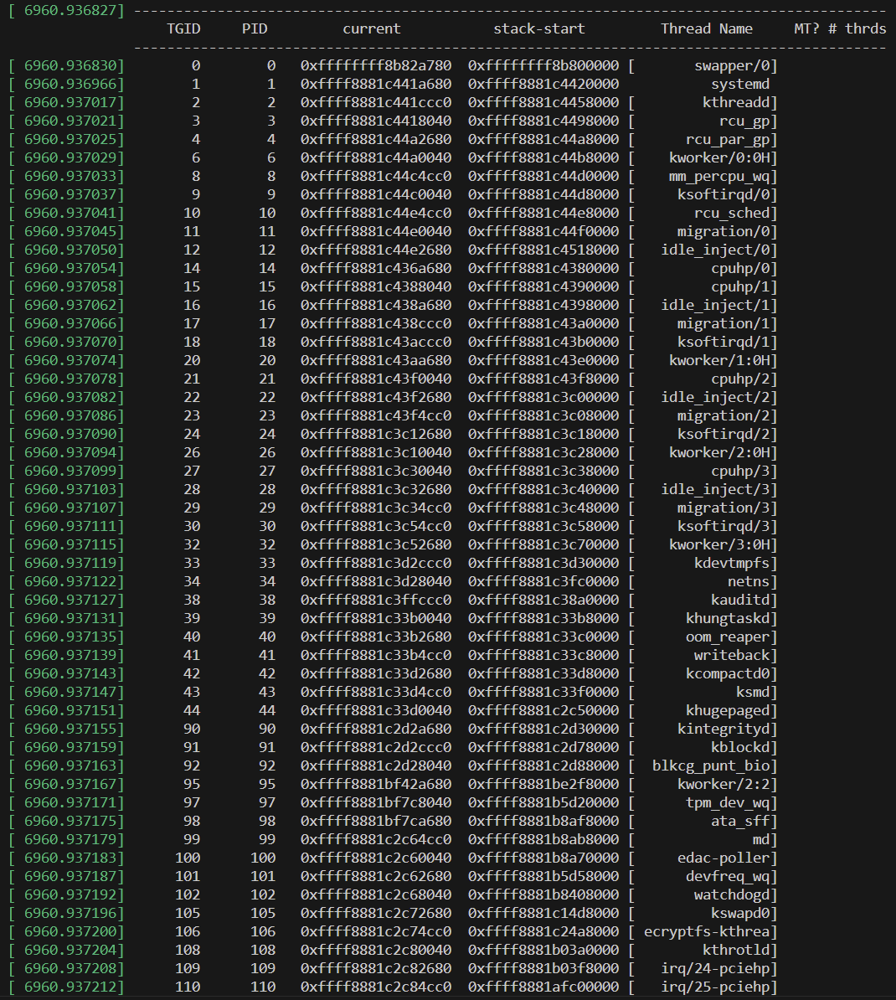

<center>[图6.11]</center>

按照惯例，在我们的内核模块中，如果线程是内核线程，它的名称将显示在方括号内。

#### 区分进程和线程——TGID 和 PID

由于 Linux 内核使用唯一的任务结构（`struct task_struct`）来表示每个线程，并且其中的一个独特成员是 PID，这意味着在 Linux 内核中，每个线程都有一个唯一的 PID。这带来了一个问题：同一进程的多个线程如何共享一个公共的 PID？这违反了 POSIX.1b 标准（pthreads；事实上，Linux 曾一度不符合该标准，从而导致移植问题等）。

为了解决这个恼人的用户空间标准问题，来自 Red Hat 的 Ingo Molnar 在 2.5 内核系列中提出并主导了一项补丁。一个名为线程组标识符（Thread Group Identifier，TGID）的新成员被加入到任务结构中。其工作方式如下：**如果进程是单线程的，`tgid` 和 `pid` 值相等。如果是多线程进程，那么主线程的 `tgid` 值等于其 `pid` 值；而该进程的其他线程将继承主线程的 `tgid` 值，但保留各自唯一的 `pid` 值。**

为了更好地理解这一点，让我们从前面的截图中举一个实际的例子。在上图中，如果右侧最后一列（ MT? # Thread）出现正整数，它表示多线程进程的线程数量（位于左侧紧挨着的进程名）。

我们以 `gnome-shell` 为例，它的 TGID 和 PID 值都是 1611，代表其主线程（名称为 gnome-shell），共有 13 个线程：

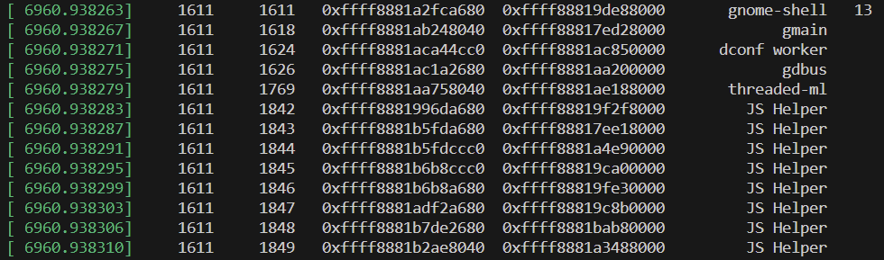

<center>[图6.12]</center>

```plaintext
 				   TGID  	 PID   		current            stack-start       	Thread Name        MT?#
[ 6960.938263]     1611     1611   0xffff8881a2fca680  0xffff88819de88000       gnome-shell   		13
[ 6960.938267]     1611     1618   0xffff8881ab248040  0xffff88817ed28000             gmain 
[ 6960.938271]     1611     1624   0xffff8881aca44cc0  0xffff8881ac850000      dconf worker 
[ 6960.938275]     1611     1626   0xffff8881ac1a2680  0xffff8881aa200000             gdbus 
[ 6960.938279]     1611     1769   0xffff8881aa758040  0xffff8881ae188000       threaded-ml 
[ 6960.938283]     1611     1842   0xffff8881996da680  0xffff88819f2f8000         JS Helper 
[ 6960.938287]     1611     1843   0xffff8881b5fda680  0xffff88817ee18000         JS Helper 
[ 6960.938291]     1611     1844   0xffff8881b5fdccc0  0xffff8881a4e90000         JS Helper 
[ 6960.938295]     1611     1845   0xffff8881b6b8ccc0  0xffff88819ca00000         JS Helper 
[ 6960.938299]     1611     1846   0xffff8881b6b8a680  0xffff88819fe30000         JS Helper 
[ 6960.938303]     1611     1847   0xffff8881adf2a680  0xffff88819c8b0000         JS Helper 
[ 6960.938306]     1611     1848   0xffff8881b7de2680  0xffff8881bab80000         JS Helper 
[ 6960.938310]     1611     1849   0xffff8881b2ae8040  0xffff8881a3488000         JS Helper
```

这 13 个线程是什么？首先，主线程是 gnome-shell，下面的八个线程名称依次为：gmain、dconf worker、gdbus、threaded-ml和 5 个 JS Helper。我们是如何确定这一点的？很简单：仔细观察前面的代码块中的 TGID 和 PID：如果两者相同，则是进程的主线程；如果 TGID 重复，则该进程是多线程的，而 PID 值代表“子”线程的唯一 ID。

实际上，我们可以通过常用的 GNU `ps()` 命令在用户空间看到内核的 TGID/PID 表示，使用其 `-LA` 选项即可（这只是其中一种方法）：

```bash
ps -LA
#   PID    LWP TTY          TIME CMD
#     1      1 ?        00:00:11 systemd
#     2      2 ?        00:00:00 kthreadd
#     3      3 ?        00:00:00 rcu_gp
#     4      4 ?        00:00:00 rcu_par_gp
#     6      6 ?        00:00:00 kworker/0:0H-kb
#     8      8 ?        00:00:00 mm_percpu_wq
#     9      9 ?        00:00:03 ksoftirqd/0
#    10     10 ?        00:00:17 rcu_sched
#    11     11 ?        00:00:00 migration/0
#    12     12 ?        00:00:00 idle_inject/0
#    14     14 ?        00:00:00 cpuhp/0
#    15     15 ?        00:00:00 cpuhp/1
#    16     16 ?        00:00:00 idle_inject/1
#    17     17 ?        00:00:06 migration/1
#    18     18 ?        00:00:02 ksoftirqd/1
# [...]
```

`ps()` 输出的标签如下：

- 第一列是 PID —— 实际上代表内核中任务结构的 `tgid` 成员。
- 第二列是 LWP（轻量级进程或线程）—— 实际上代表内核中任务结构的 `pid` 成员。

### 遍历任务列表 III – 代码解析

现在让我们看看 `thrd_showall` 内核模块的相关代码：

```c
// ch6/foreach/thrd_showall/thrd_showall.c */
[...]
#include <linux/sched.h> /* current */
#include <linux/version.h>
#if LINUX_VERSION_CODE > KERNEL_VERSION(4, 10, 0)
#include <linux/sched/signal.h>
#endif
[...]
static int showthrds(void)
{
    struct task_struct *g, *t; // 'g': 进程指针; 't': 线程指针
    [...]
#if 0
    /* 理论上这里应该使用 tasklist_lock 读写自旋锁来保护任务列表，
     * 但它未被导出，因而无法在我们的内核模块中使用 */
    read_lock(&tasklist_lock);
#endif
    disp_idle_thread();
```

关于以上代码的几点注意事项：

- 我们使用 `LINUX_VERSION_CODE()` 宏来根据需要有条件地包含头文件。
- 暂时忽略关于锁的操作——包括 `tasklist_lock()` 和 `task_[un]lock()` API 的使用或缺失。
- 别忘了 CPU 的空闲线程！每个 CPU 核心都有一个专用的空闲线程（命名为 `swapper/n`，其中 `n` 为核心编号，从 0 开始），当没有其他线程需要运行时，它才运行。我们运行的 `do .. while` 循环并不会从这个线程开始（`ps()` 也不会显示它）。我们包括一个小例程来显示它，因为空闲线程的硬编码任务结构可以通过 `init_task` 访问和导出（注意：`init_task` 总是指向第一个 CPU（核心 0）的空闲线程）。

为了遍历所有存活的线程，我们需要使用一对宏构成循环：`do_each_thread() { ... } while_each_thread()`。以下是相关代码：

```c
do_each_thread(g, t) {
    task_lock(t);
    snprintf(buf, BUFMAX-1, "%6d %6d ", g->tgid, t->pid);
    /* task_struct 地址和内核模式栈地址 */
    snprintf(tmp, TMPMAX-1, " 0x%px", t);
    strncat(buf, tmp, TMPMAX);
    snprintf(tmp, TMPMAX-1, " 0x%px", t->stack);
    strncat(buf, tmp, TMPMAX);
    [...] << 参见下面的注释 >>
    total++;
    memset(buf, 0, sizeof(buf)); << 清理 >>
    memset(tmp, 0, sizeof(tmp));
    task_unlock(t);
} while_each_thread(g, t);
#if 0
/* <同上，关于任务列表的读写自旋锁> */
read_unlock(&tasklist_lock);
#endif
return total;
}
```

在上述代码中，`do_each_thread() { ... } while_each_thread()` 这对宏构成一个循环，使我们能够遍历系统上所有存活的线程：

- 我们使用一个临时变量（`tmp`）来获取数据项，然后将其附加到结果缓冲区 `buf`，每次循环迭代时打印一次。
- 获取 TGID、PID、`task_struct` 和栈起始地址相对简单，这里我们直接使用 `current` 解引用它们（我们也可以使用前面介绍的更高级的内核辅助方法）。注意，我们在这里故意不使用（更安全的）`%pK` `printk` 格式说明符，而是使用通用的 `%px` 说明符来显示任务结构和内核模式栈的实际内核虚拟地址。
- 循环前清理必要内容（增加线程总数计数器，`memset()` 清空临时缓冲区等）。
- 完成后，返回我们遍历的线程总数。

在接下来的代码块中，我们补充了前面代码中有意省略的部分。我们获取线程的名称，并在其是内核线程时将其打印在方括号内。同时，我们查询进程中的线程数。以下是代码及其解释：

```c
if (!g->mm) { // 内核线程
    /* 为什么我们不使用 get_task_comm() 来获取任务名称？
     * 简短的原因：这会导致死锁！我们将在后面的同步章节中详细讨论如何避免。
     * 目前我们先使用简单的方法……
     */
    snprintf(tmp, TMPMAX-1, " [%16s]", t->comm);
} else {
    // 将 t->comm 中的线程名称格式化为字符串，并存入 tmp 缓冲区中
    snprintf(tmp, TMPMAX-1, " %16s ", t->comm);
}
// 将字符串 tmp 追加到字符串 buf 的末尾
strncat(buf, tmp, TMPMAX);
/* 这是多线程进程的“主”线程吗？
 * 我们通过以下方式检查：
 * (a) 它是用户空间线程，
 * (b) 它的 TGID 等于它的 PID，并且
 * (c) 该进程中线程数 > 1。
 * 如果符合，在右侧显示整个进程的线程数。
 */
nr_thrds = get_nr_threads(g);
if (g->mm && (g->tgid == t->pid) && (nr_thrds > 1)) {
    snprintf(tmp, TMPMAX-1, " %3d", nr_thrds);
    strncat(buf, tmp, TMPMAX);
}
```

关于上述代码，我们可以做以下说明：

- **内核线程没有用户空间映射。主线程的 `current->mm` 是一个指向 `mm_struct` 类型结构的指针，表示整个进程的用户空间映射；如果为 `NULL`，则说明它是一个内核线程（因为内核线程没有用户空间映射）**；我们检查并相应打印名称。
- 我们也打印线程的名称（通过查找任务结构的 `comm` 成员）。我们可能会问为什么不使用 `get_task_comm()` 函数获取任务的名称；简短原因是这会导致死锁。我们将在后面的内核同步章节中详细讨论如何避免这种情况。
- 我们通过 `get_nr_threads()` 宏方便地获取给定进程中的线程数量；其他内容在上述代码块中的注释中已清晰说明。

好了，到此为止，我们暂时完成了对 Linux 内核内部和架构的讨论，主要关注于进程、线程及其栈。

## 总结

在本章中，我们讨论了内核内部的关键方面，这些内容将帮助我们作为内核模块或设备驱动程序开发者更好、更深入地理解操作系统的内部工作原理。我们详细地研究了进程及其线程和堆栈（在用户空间和内核空间中的）组织和关系。我们还探讨了内核的 `task_struct` 数据结构，并学习了如何通过内核模块以不同方式遍历任务列表。

虽然这可能并不显而易见，但**理解这些内核内部细节是成为成熟的内核（和/或设备驱动）开发人员过程中必要且必不可少的一步**。本章的内容将帮助我们在许多系统编程场景中进行调试，并为我们更深入探索Linux内核，尤其是内存管理打下基础。

## 问题

1. 考虑以下系统场景：系统中共有125个进程和164个线程，其中79个是内核线程。根据这个快照：

   1. 内核内存中会有多少个任务结构（task structures）？
      - 164
   2. 用户内存中会有多少个用户空间栈？
      - 164 - 79 = 85
   3. 内核内存中会有多少个内核模式栈？
      - 164

2. 查找用户模式虚拟地址空间（VAS）详情：选择一个用户模式的C应用程序（即使只是一个 "Hello, world" 程序也可以；如果是这样一个简单的应用程序，请插入一个 `pause()` 系统调用以保持其存活）；构建它，运行它，并通过以下方式查看其用户虚拟地址空间：

   1. 通过 `/proc/PID/maps` 查看“原始”视图

      - 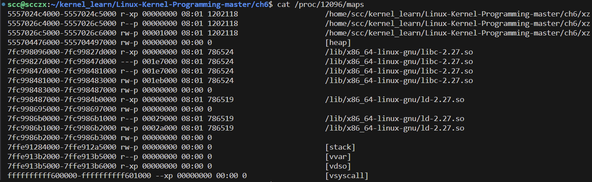

   2. 使用 `pmap()` 工具；尝试各种选项开关，包括 `-X` 和 `-XX`

      - 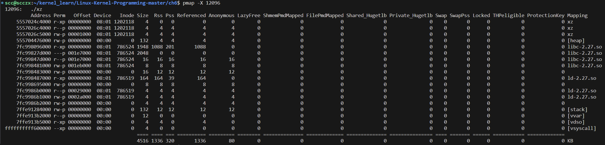
      - 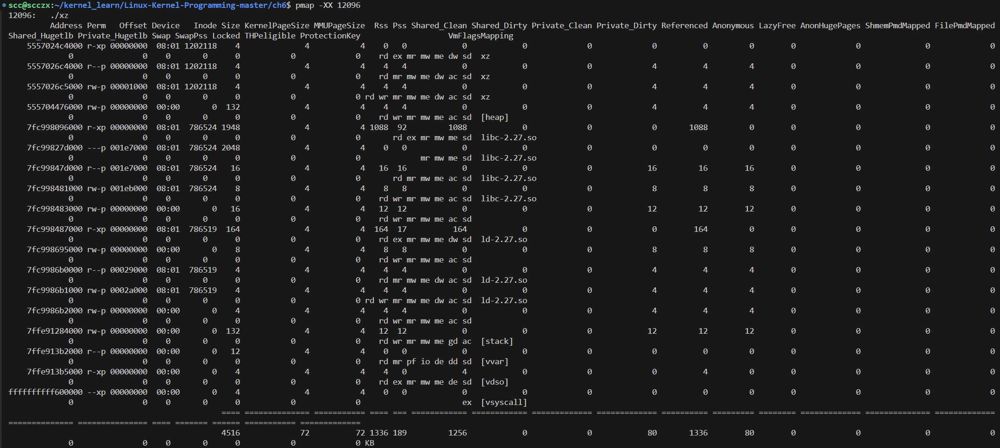

   3. 使用 `procmap` 工具（[https://github.com/kaiwan/procmap](https://github.com/kaiwan/procmap)）（默认情况下，它将显示内核和用户空间进程的虚拟地址空间；我们现在可以忽略内核虚拟地址空间，因为这部分内容是下一章的关键部分！）。

      - procmap 在 github 下载完之后直接进入目录，运行 ./procmap 即可看到用法提示，可以将其加至 ~/.bashrc 保证所有终端在任何文件夹下都可以使用：

        ```bash
        # 对于 bash
        # 注意不要忘了 $PATH: 直接写路径会导致将 $PATH 环境变量完全替换为以下文件夹
        # 错误示例 ： echo 'export PATH="$HOME/kernel_learn/procmap"' >> ~/.bashrc
        echo 'export PATH="$PATH:$HOME/kernel_learn/procmap"' >> ~/.bashrc
        source ~/.bashrc
        ```

      - 运行 `procmap -p pid` 最后出现 smem 语法兼容问题，我的解决方法是将其 py2 语法 全部修改为 py3 解决问题

      - 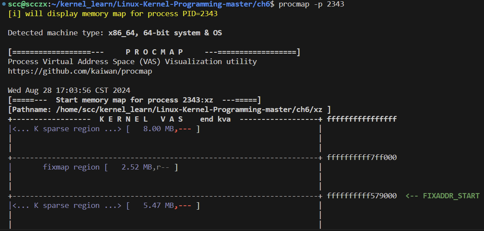

3. taskdtl：
   编写一个名为 `taskdtl` 的内核模块，它接受一个 PID 作为参数（验证它的合法性！），并打印出关于该任务的尽可能多的详细信息。
   提示：查看这个截图 [https://github.com/kaiwan/L2_kernel_trg/blob/master/taskdtl/taskdtl.png](https://github.com/kaiwan/L2_kernel_trg/blob/master/taskdtl/taskdtl.png)，其中展示了一些示例输出；尝试模仿它。

  - ```c
    // taskdtl.c
    #include <linux/init.h>          // 用于模块初始化和清理
    #include <linux/module.h>        // 用于所有模块宏
    #include <linux/sched.h>         // 提供 task_struct 结构和相关函数
    #include <linux/sched/signal.h>  // 提供任务遍历宏
    #include <linux/pid.h>           // 提供 pid_task 和 find_get_pid 函数
    #include <linux/mm.h>            // 提供内存管理相关结构
    #include <linux/sched/task.h>    // 提供获取任务状态的辅助函数
    #include <linux/fs.h>            // 提供文件系统相关结构
    #include <linux/fdtable.h>       // 提供文件描述符表结构
    #include <linux/net.h>           // 提供网络相关信息
    
    MODULE_LICENSE("GPL");
    MODULE_AUTHOR("SCC XZ");
    MODULE_DESCRIPTION("Task Detail Module with Extended Features");
    
    // 设置模块参数，接收一个 PID 值
    static int pid = -1;  // 默认 PID 为 -1，表示无效
    module_param(pid, int, 0644);  // 允许用户设置 PID 参数
    MODULE_PARM_DESC(pid, "Process ID");  // 描述 PID 参数的用途
    
    // 打印任务的 VMA 详情，包括权限和映射文件名
    void print_vma_details(struct mm_struct *mm) {
        struct vm_area_struct *vma = mm->mmap;
        pr_info("VMA Details:\n");
        while (vma) {
            pr_info("Start: 0x%lx, End: 0x%lx, Perm: %c%c%c, File: %pD\n",
                    vma->vm_start,
                    vma->vm_end,
                    (vma->vm_flags & VM_READ) ? 'r' : '-',
                    (vma->vm_flags & VM_WRITE) ? 'w' : '-',
                    (vma->vm_flags & VM_EXEC) ? 'x' : '-',
                    vma->vm_file);
            vma = vma->vm_next;
        }
    }
    
    // 打印任务的文件描述符信息
    void print_fd_info(struct task_struct *task) {
        struct files_struct *files = task->files;
        struct fdtable *fdt;
        int i;
    
        if (!files) {
            pr_info("No open files for this task.\n");
            return;
        }
    
        rcu_read_lock();
        fdt = files_fdtable(files);
        for (i = 0; i < fdt->max_fds; i++) {
            struct file *file = fdt->fd[i];
            if (!file)
                continue;
            pr_info("FD %d: %pD, flags: 0x%x\n", i, file, file->f_flags);
        }
        rcu_read_unlock();
    }
    
    // 打印任务的详细信息，包括内存和调度信息
    static void print_task_details(struct task_struct *task)
    {
        struct mm_struct *mm;  // 用于存储进程的内存描述符
    
        // 打印基本的任务信息，包括任务名称、PID、TGID 和父进程的 PID
        pr_info("Task Name: %s\n", task->comm);
        pr_info("PID: %d, TGID: %d, Parent PID: %d\n",
                task->pid, task->tgid, task->real_parent->pid);
    
        // 打印任务的状态、优先级、调度策略等信息
        pr_info("State: %ld, Priority: %d, Static Priority: %d, Normal Priority: %d\n",
                task->state, task->prio, task->static_prio, task->normal_prio);
        pr_info("Scheduler Policy: %d, CPU: %d, Flags: 0x%lx\n",
                task->policy, task->cpu, task->flags);
    
        // 获取任务的内存描述符 mm_struct
        mm = task->mm;
        if (mm) {
            // 如果是用户空间进程，打印虚拟内存的使用情况
            pr_info("Virtual Memory Usage:\n");
            pr_info("  Total VM: %lu KB\n", mm->total_vm << (PAGE_SHIFT - 10));  // 总虚拟内存
            pr_info("  RSS: %lu KB\n", get_mm_rss(mm) << (PAGE_SHIFT - 10));     // 实际使用内存（驻留集大小）
            pr_info("  Stack VM: %lu KB\n", mm->stack_vm << (PAGE_SHIFT - 10));  // 栈的虚拟内存大小
            // 打印 VMA 详细信息
            print_vma_details(mm);
        } else {
            // 如果是内核线程，则没有用户空间内存映射
            pr_info("No user space memory (likely a kernel thread).\n");
        }
    
        // 打印文件描述符信息
        print_fd_info(task);
    }
    
    // 模块初始化函数
    static int __init taskdtl_init(void)
    {
        struct pid *pid_struct;        // 用于获取 PID 对应的结构
        struct task_struct *task;      // 用于指向目标任务结构
    
        // 验证传入的 PID 是否有效
        if (pid < 0) {
            pr_err("Invalid PID: %d\n", pid);  // 输出错误信息
            return -EINVAL;                    // 返回无效参数错误
        }
    
        // 根据 PID 获取对应的 PID 结构
        pid_struct = find_get_pid(pid);
        if (!pid_struct) {
            pr_err("PID %d not found.\n", pid);  // 输出错误信息
            return -ESRCH;                       // 返回没有找到错误
        }
    
        // 获取 PID 对应的任务结构
        task = pid_task(pid_struct, PIDTYPE_PID);
        if (!task) {
            pr_err("Task for PID %d not found.\n", pid);  // 输出错误信息
            return -ESRCH;                                // 返回没有找到错误
        }
    
        // 打印指定 PID 的任务详细信息
        pr_info("Displaying details for PID: %d\n", pid);
        print_task_details(task);
    
        return 0;  // 初始化成功
    }
    
    // 模块清理函数
    static void __exit taskdtl_exit(void)
    {
        pr_info("Exiting taskdtl module.\n");  // 输出模块退出信息
    }
    
    // 注册模块初始化和清理函数
    module_init(taskdtl_init);
    module_exit(taskdtl_exit);
    ```

    ```makefile
    # Makefile
    ifeq ($(ARCH),arm)
      # *UPDATE* 'KDIR' below to point to the ARM Linux kernel source tree on your box
      KDIR ?= ~/rpi_work/kernel_rpi/linux
    else ifeq ($(ARCH),arm64)
      # *UPDATE* 'KDIR' below to point to the ARM64 (Aarch64) Linux kernel source
      # tree on your box
      KDIR ?= ~/kernel/linux-4.14
    else ifeq ($(ARCH),powerpc)
      # *UPDATE* 'KDIR' below to point to the PPC64 Linux kernel source tree on your box
      KDIR ?= ~/kernel/linux-4.9.1
    else
      # 'KDIR' is the Linux 'kernel headers' package on your host system; this is
      # usually an x86_64, but could be anything, really (f.e. building directly
      # on a Raspberry Pi implies that it's the host)
      KDIR ?= /lib/modules/$(shell uname -r)/build
    endif
    
    # Set FNAME_C to the kernel module name source filename (without .c)
    FNAME_C := taskdtl
    
    PWD            := $(shell pwd)
    obj-m          += ${FNAME_C}.o
    EXTRA_CFLAGS   += -DDEBUG
    
    all:
    	@echo
    	@echo '--- Building : KDIR=${KDIR} ARCH=${ARCH} CROSS_COMPILE=${CROSS_COMPILE} EXTRA_CFLAGS=${EXTRA_CFLAGS} ---'
    	@echo
    	make -C $(KDIR) M=$(PWD) modules
    install:
    	@echo
    	@echo "--- installing ---"
    	@echo " [First, invoke the 'make' ]"
    	make
    	@echo
    	@echo " [Now for the 'sudo make install' ]"
    	sudo make -C $(KDIR) M=$(PWD) modules_install
    	sudo depmod
    clean:
    	@echo
    	@echo "--- cleaning ---"
    	@echo
    	make -C $(KDIR) M=$(PWD) clean
    	rm -f *~   # from 'indent'
    
    #--------------- More (useful) targets! -------------------------------
    INDENT := indent
    
    # code-style : "wrapper" target over the following kernel code style targets
    code-style:
    	make indent
    	make checkpatch
    
    # indent- "beautifies" C code - to conform to the the Linux kernel
    # coding style guidelines.
    # Note! original source file(s) is overwritten, so we back it up.
    indent:
    	@echo
    	@echo "--- applying kernel code style indentation with indent ---"
    	@echo
    	mkdir bkp 2> /dev/null; cp -f *.[chsS] bkp/
    	${INDENT} -linux --line-length95 *.[chsS]
    	  # add source files as required
    
    # Detailed check on the source code styling / etc
    checkpatch:
    	make clean
    	@echo
    	@echo "--- kernel code style check with checkpatch.pl ---"
    	@echo
    	$(KDIR)/scripts/checkpatch.pl --no-tree -f --max-line-length=95 *.[ch]
    	  # add source files as required
    
    #--- Static Analysis
    # sa : "wrapper" target over the following kernel static analyzer targets
    sa:
    	make sa_sparse
    	make sa_gcc
    	make sa_flawfinder
    	make sa_cppcheck
    
    # static analysis with sparse
    sa_sparse:
    	make clean
    	@echo
    	@echo "--- static analysis with sparse ---"
    	@echo
    # if you feel it's too much, use C=1 instead
    	make C=2 CHECK="/usr/bin/sparse" -C $(KDIR) M=$(PWD) modules
    
    # static analysis with gcc
    sa_gcc:
    	make clean
    	@echo
    	@echo "--- static analysis with gcc ---"
    	@echo
    	make W=1 -C $(KDIR) M=$(PWD) modules
    
    # static analysis with flawfinder
    sa_flawfinder:
    	make clean
    	@echo
    	@echo "--- static analysis with flawfinder ---"
    	@echo
    	flawfinder *.[ch]
    
    # static analysis with cppcheck
    sa_cppcheck:
    	make clean
    	@echo
    	@echo "--- static analysis with cppcheck ---"
    	@echo
    	cppcheck -v --force --enable=all -i .tmp_versions/ -i *.mod.c -i bkp/ --suppress=missingIncludeSystem .
    
    # Packaging; just tar.xz as of now
    PKG_NAME := ${FNAME_C}
    tarxz-pkg:
    	rm -f ../${PKG_NAME}.tar.xz 2>/dev/null
    	make clean
    	@echo
    	@echo "--- packaging ---"
    	@echo
    	tar caf ../${PKG_NAME}.tar.xz *
    	ls -l ../${PKG_NAME}.tar.xz
    	@echo '=== package created: ../$(PKG_NAME).tar.xz ==='
    	@echo 'Tip: when extracting, to extract into a dir of the same name as the tar file,'
    	@echo ' do: tar -xvf ${PKG_NAME}.tar.xz --one-top-level'
    
    help:
    	@echo '=== Makefile Help : additional targets available ==='
    	@echo
    	@echo 'TIP: type make <tab><tab> to show all valid targets'
    	@echo
    
    	@echo '--- 'usual' kernel LKM targets ---'
    	@echo 'typing "make" or "all" target : builds the kernel module object (the .ko)'
    	@echo 'install     : installs the kernel module(s) to INSTALL_MOD_PATH (default here: /lib/modules/$(shell uname -r)/)'
    	@echo 'clean       : cleanup - remove all kernel objects, temp files/dirs, etc'
    
    	@echo
    	@echo '--- kernel code style targets ---'
    	@echo 'code-style : "wrapper" target over the following kernel code style targets'
    	@echo ' indent     : run the $(INDENT) utility on source file(s) to indent them as per the kernel code style'
    	@echo ' checkpatch : run the kernel code style checker tool on source file(s)'
    
    	@echo
    	@echo '--- kernel static analyzer targets ---'
    	@echo 'sa         : "wrapper" target over the following kernel static analyzer targets'
    	@echo ' sa_sparse     : run the static analysis sparse tool on the source file(s)'
    	@echo ' sa_gcc        : run gcc with option -W1 ("Generally useful warnings") on the source file(s)'
    	@echo ' sa_flawfinder : run the static analysis flawfinder tool on the source file(s)'
    	@echo ' sa_cppcheck   : run the static analysis cppcheck tool on the source file(s)'
    	@echo 'TIP: use coccinelle as well (requires spatch): https://www.kernel.org/doc/html/v4.15/dev-tools/coccinelle.html'
    
    	@echo
    	@echo '--- kernel dynamic analysis targets ---'
    	@echo 'da_kasan   : DUMMY target: this is to remind you to run your code with the dynamic analysis KASAN tool enabled; requires configuring the kernel with CONFIG_KASAN On, rebuild and boot it'
    	@echo 'da_lockdep : DUMMY target: this is to remind you to run your code with the dynamic analysis LOCKDEP tool (for deep locking issues analysis) enabled; requires configuring the kernel with CONFIG_PROVE_LOCKING On, rebuild and boot it'
    	@echo 'TIP: best to build a debug kernel with several kernel debug config options turned On, boot via it and run all your test cases'
    
    	@echo
    	@echo '--- misc targets ---'
    	@echo 'tarxz-pkg  : tar and compress the LKM source files as a tar.xz into the dir above; allows one to transfer and build the module on another system'
    	@echo ' Tip: when extracting, to extract into a dir of the same name as the tar file,'
    	@echo '  do: tar -xvf ${PKG_NAME}.tar.xz --one-top-level'
    	@echo 'help       : this help target'
    ```


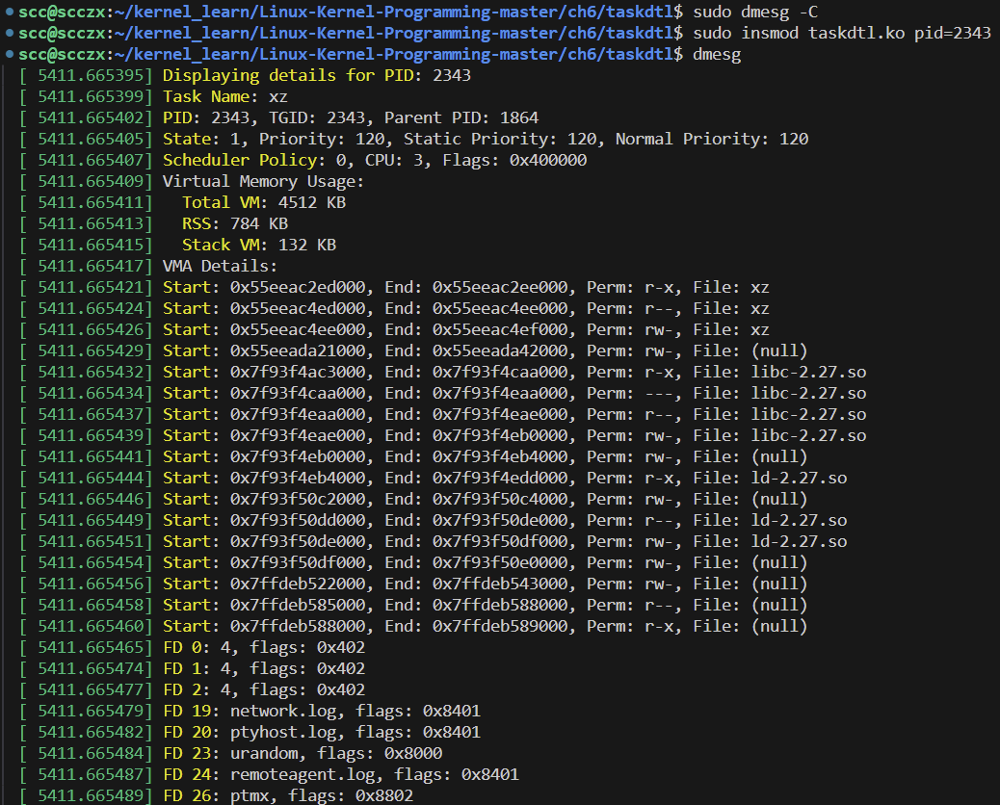